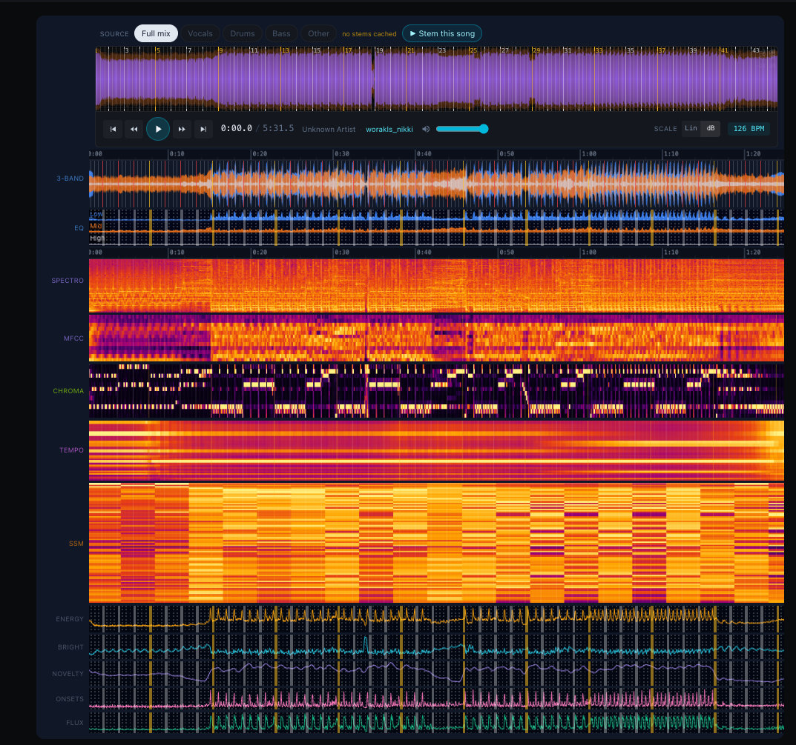
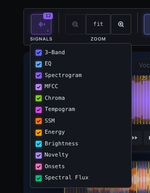
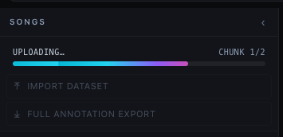
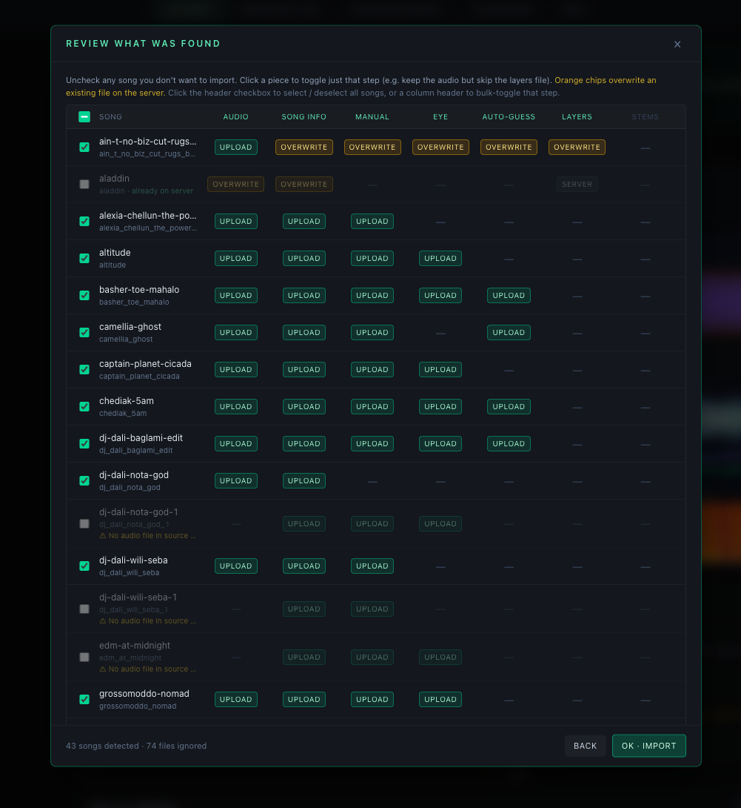
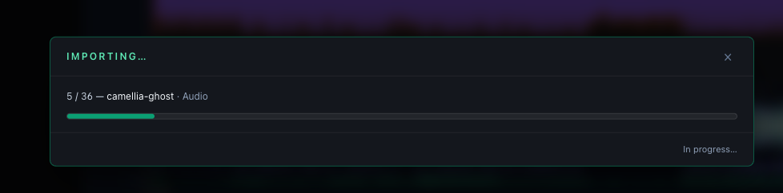
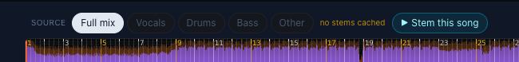

# TimeCues Studio — User Guide & Technical Documentation

> The definitive reference for the TimeCues web app. Every workspace, panel,
> button, dropdown, toggle, slider, keyboard shortcut, default, file format,
> setting, and custom-detector API call is documented here.

## Table of Contents

1. [Quick Start](#quick-start)
2. [Guided Walkthrough](#guided-walkthrough)
3. [Installation](#installation)
4. [Concepts & Vocabulary](#concepts--vocabulary)
5. [The Main Page](#the-main-page)
6. [The Five Workspaces](#the-five-workspaces)
7. [Sign-In & Identity](#sign-in--identity)
8. [The Song Sidebar (everywhere)](#the-song-sidebar-everywhere)
9. [Song Info Bar — Display name, BPM, Time Signature, Grid Offset](#song-info-bar)
10. [Metronome Panel — Metronome ON/OFF, tap tempo](#metronome-panel-dataset-prep)
11. [The Shared Visualization Canvas](#the-shared-visualization-canvas)
12. [The Viz Control Bar (every dropdown, every checkbox)](#the-viz-control-bar)
13. [Annotation Workspace — Boundaries, Eye, Auto-Guess](#annotation-workspace)
14. [Cue, Span, Loop, and Pattern Layers](#cue-span-loop-and-pattern-layers)
15. [Inspect Workspace — single-song Algo-Inspect, Consensus, Evaluation](#inspect-workspace)
16. [Inspect All — leaderboards, drill-down, AutoGuess grid search](#inspect-all)
17. [Dataset Prep — BPM, batch, storage clear](#dataset-prep)
18. [Custom Detectors — full Python contract + UI](#custom-detectors)
19. [Team Dashboard](#team-dashboard)
20. [Settings — every preference, every default](#settings)
21. [Keyboard Shortcuts (canonical list)](#keyboard-shortcuts)
22. [Export & Import](#export--import)
23. [File Format & Directory Layout](#file-format--directory-layout)
24. [REST API Reference](#rest-api-reference)
25. [Auto-Guess Internals](#auto-guess-internals)
26. [Troubleshooting & FAQ](#troubleshooting--faq)
27. [Paper Appendix Migration](#paper-appendix-migration)

---

## Quick Start

### Run with Docker (recommended)

```bash
cp .env.example .env
# Optionally set DATA_DIR to point at a data folder elsewhere on disk.

docker compose up --build
# Open http://localhost:5173
```

### First-time tour (≈ 5 minutes)

> ⚠ **The first time you open a song, set it up in Dataprep before anything else.** Every annotation in TimeCues — section boundaries, cues, spans, loops, patterns — snaps to the song's beat grid. A song without a BPM, or with a misaligned downbeat, makes the rest of the app useless: the Annotator Tool refuses to open without a BPM, and Algorithm Inspect's metrics are meaningless until the grid is locked. Fix the audio, BPM, and grid in **Dataprep** *first*; only then move on to annotating or running detectors.

1. **Open `http://localhost:5173`** — you land on the main page with two entry cards: **Enter Demo**, plus *one* of **Start a new dataset** (when the corpus has no admin yet) or **Enter `<corpus>`** (once an admin has claimed it). A single deploy hosts a single corpus, so these two states are mutually exclusive.
2. **Click *Enter `<corpus>`*** and sign in (Google or *Username or email*). On a fresh deploy click *Start a new dataset* instead — that flow asks for a corpus name and lets you sign in with Google or *Username or email*, then drops you straight into Dataprep.
3. **Land in Dataprep first.** Both sign-in flows put you on the **Dataprep** tab on purpose — that is where you upload audio and lock the grid before anything else works. If the manifest is empty, drop an MP3 into the upload zone (or copy files into `songs/<slug>/<slug>.mp3` on disk), then pick a song in the left sidebar.
4. **Set BPM** — open the **Song setup** sidebar on the right (the **Song details ▸** section), click an `Auto-detected` chip, or type a value. Without BPM the Annotator Tool refuses to open and Inspect's evaluation is gated.
5. **Lock the grid** — press `G` (or click *Set bar start*) at the first audible kick to align bar 1. Switch on the **Metronome** panel and nudge with the ±1 ms / 10 ms / beat / bar buttons until the click sits on the kick.
6. **Switch to the *Annotator Tool* tab** in the workspace header and start marking sections with `M`. Confirm the song row's grid-readiness glyph in the sidebar is **emerald ♩** before you begin — amber ♩ means the grid is not locked yet, red ♩ means BPM is still missing.

A unified **← Back** chip sits at the top-left of every screen (workspaces, Login, Demo, New-dataset, Settings) and returns to the main page; only the main page itself omits it. The **TimeCues / Studio** brand mark sits immediately to the right of the back chip on every screen and is also a link back to the main page. On the five workspaces, the tab strip next to the brand switches between **Dataprep · Annotator Tool · Algorithm Inspect · Playground · Team** in one click.

---

## Guided Walkthrough

Once you've finished the First-time tour, the next step depends on what you came here to do. Each subsection below points you at the right workspace and then at the deep-dive section of this guide. Use the table to orient yourself before diving in.

### High-level map: pages and what they're for

| Page | Tab color | When you use it | Deep dive |
|------|-----------|-----------------|-----------|
| **Main page** (`/`) | — | Landing screen with entry points to Demo, a new dataset, or the existing corpus. | [The Main Page](#the-main-page) |
| **Dataprep** (`/prep`) | emerald | First contact with a song — upload audio, set BPM, lock the grid. Also runs batch algorithm passes and clears caches. | [Dataset Prep](#dataset-prep) |
| **Annotator Tool** (`/annotate`) | cyan | Mark section boundaries (Manual / Eye / Auto-guess) and free-form layers (cues, spans, loops, patterns) on a single song. | [Annotation Workspace](#annotation-workspace), [Cue, Span, Loop, and Pattern Layers](#cue-span-loop-and-pattern-layers) |
| **Algorithm Inspect** (`/inspect`) | violet | Run detectors against the audio and score them against your ground truth — per song or batched across the corpus (F1 / precision / recall / MNBD / CSR). | [Inspect Workspace](#inspect-workspace), [Inspect All](#inspect-all) |
| **Playground** (`/custom`) | amber | Write, upload, and run Python detector scripts; they show up alongside the built-ins everywhere. | [Custom Detectors](#custom-detectors) |
| **Team** (`/team`) | rose | Cross-annotator dashboard — member tier management, compare layers across the team. Admin / researcher only. | [Team Dashboard](#team-dashboard) |
| **Settings** (`/settings`) | — | Every preference and default (BPM detectors shown, experimental flags, corpus identity, shared-corpus mode, …). | [Settings](#settings) |

### How to annotate a song

1. **Lock BPM and grid in Dataprep first.** Boundaries snap to beats — without a locked grid every section lands off-beat. The song row's grid-readiness glyph turns **emerald ♩** when you're ready; red ♩ or amber ♩ means go back to Dataprep.
2. **Switch to the *Annotator Tool* tab** and pick the song from the sidebar. If the song still has no BPM, the workspace opens a confirmation dialog rather than silently letting you annotate off-grid.
3. **Pick the annotation kind in the Annotate sidebar** — click a type chip (the **BOUNDARIES / CUES / SPANS / LOOPS / PATTERNS** tabs in the horizontal row above the *All annotations* list):
   - **Boundaries → Manual** — the canonical, audio-driven section boundaries. Press `M` while the song plays to mark a transition; `[` / `]` to step between boundaries, `Delete` to remove, `S` to split. See [Annotation Workspace](#annotation-workspace).
   - **Boundaries → Eye** — the same workflow but with audio muted, so you can study what's recoverable from the waveform alone.
   - **Boundaries → Auto-guess** — clusters predictions from 30+ detectors and lets you accept / reject each candidate point. Best for bootstrapping ground truth on a new song. See [Auto-Guess Internals](#auto-guess-internals).
   - **Cues / Spans / Loops / Patterns** — free-form layers. Cues = single points, Spans = labeled intervals, Loops = grid-aligned seamless playback regions, Patterns = labeled cycles. See [Cue, Span, Loop, and Pattern Layers](#cue-span-loop-and-pattern-layers).
4. **Mark the workflow stage** (*in progress* → *reviewed*) on each layer when you're done. The sidebar's per-song indicator aggregates the stage across every track.

### How to research and test algorithms

1. **Make sure a reference layer exists.** Auto-guess (reviewed) or Manual on at least a handful of songs is enough to start comparing — without ground truth, every metric is meaningless.
2. **Switch to the *Algorithm Inspect* tab** and pick a song.
3. **Tick algorithms in the right sidebar** and hit **Run** — each detector's predictions stack as colored timelines on the waveform.
4. **Choose a reference** (Manual / Eye / Auto-guess) and an **evaluation engine**: `mir_eval` for the research-standard F1 / precision / recall, or `Custom` for Mean Nearest-Boundary Distance (MNBD), Critical-Section Recall (CSR), candidate-aware matching, and the optional-weight slider. Metrics appear in the panel under the canvas.
5. **Switch to the *All songs* sub-tab** to batch-run the same selection across the whole corpus. The leaderboard sorts by F1 / precision / recall / MNBD / CSR; each row expands to per-song scores. Use the **AutoGuess grid search** to sweep the auto-guess clustering parameters and find the F1-optimal settings. See [Inspect All](#inspect-all).
6. **Pre-compute caches in Dataprep** if you want batched runs to be fast — the *Run all algorithms* button warms the cache for every detector × every song, so the batch view loads instantly later.

### How to write a custom detector

1. **Switch to the *Playground* tab.** Hidden in Demo Mode.
2. **Write a Python file** following the contract in [Custom Detectors](#custom-detectors) — the registered entry point returns boundaries (or cues / spans) for an `(audio, sr, **kwargs)` input.
3. **Upload it** through the Playground UI; the registry hot-reloads and the new detector appears alongside built-ins in Algorithm Inspect and Auto-guess.
4. **Iterate** — edit, re-upload, re-run. Cached results are keyed by the script's file hash, so a tweaked script always produces a fresh run.

### How to manage a corpus / team (admin-only)

1. **Invite annotators** from the **Team page → Members tab**. Assign each one a tier (Admin / Researcher / Team); changes are persisted to `data/dataset-config.json → peopleByEmail`. See [Team Dashboard](#team-dashboard) and [Roles](#roles-admin-team-leader-vs-annotator).
2. **Compare layers across annotators** from the Team page or the Annotator Tool's **Compare** sub-tab.
3. **Tune defaults in Settings** — which BPM detectors are shown, which experimental layers are enabled, the corpus name, shared-corpus mode, sign-in modes, and so on. See [Settings](#settings).

---

## Installation

See [INSTALL.md](../INSTALL.md) for the full install matrix — Docker on
localhost, local development without Docker, GCP one-button deploy, Apple
Silicon, optional GPU / CPU / experimental-models profiles, sign-in setup,
and troubleshooting.

In a hurry:

```bash
git clone https://github.com/<owner>/timecues-studio.git
cd timecues-studio
cp .env.example .env
docker compose up --build       # open http://localhost:5173
```

### Run modes at a glance

Every install path is one of the rows below. The two opt-in dimensions are
**Demucs** (stems + All-In-One) and **Experimental models** (the Phase-1+
MIR detectors). Both are off by default for local docker **and for the lean
`./run.sh`**, and both are on for `./run_all.sh` and the hosted instance —
that keeps first-time `docker compose up` and basic local dev lean, while
`run_all.sh` and prod stay capability-complete.

| Mode | Command | Core | Demucs | Experimental | Disk | Best for |
|---|---|:---:|:---:|:---:|---|---|
| **Demo (hosted)** | — (browser) | ✔ | ✔ | ✔ | 0 | Quick tour, no install |
| **Docker — minimal** | `docker compose up --build` | ✔ | ✘ | ✘ | ~1 GB | First evaluation; smallest footprint |
| **Docker — Demucs CPU** | `docker compose --profile demucs-cpu up --build` | ✔ | ✔ (slow) | ✘ | ~2 GB | Stems on any host, no GPU needed |
| **Docker — Demucs GPU** | `docker compose --profile demucs-gpu up --build` | ✔ | ✔ (fast) | ✘ | ~4 GB | Stemming a corpus on NVIDIA + Linux/WSL2 |
| **Docker — Experimental** | `docker compose --profile experimental-models up --build` | ✔ | ✘ | ✔ | ~7 GB | Try the new MIR detectors without stems |
| **Docker — full** | `docker compose --profile demucs-cpu --profile experimental-models up --build` | ✔ | ✔ | ✔ | ~8 GB | Matches the hosted instance locally |
| **Local dev — lean (`./run.sh`)** | `./run.sh` | ✔ | ✘ | ✘ | tiny | Basic annotation + eval; heavy sidecars start but read "Deps missing" |
| **Local dev — full (`./run_all.sh`)** | `./run_all.sh` | ✔ | ✔ (CPU) | ✔ | ~3 GB pip | Capability-complete local dev; same as `./run.sh --all` |
| **Self-hosted (prod)** | see [INSTALL.md → Self-hosting](../INSTALL.md#self-hosting-beyond-localhost) | ✔ | ✔ | ✔ | ~8 GB | Public-facing deployment; matches the hosted instance |

**Two things worth knowing:**

1. **Profiles are additive** — `--profile demucs-cpu` and
   `--profile experimental-models` stack on the same `up` line. Order
   doesn't matter, and the same profile can be passed multiple times
   without side effects.
2. **Two gates per detector family** — even when a family's results are
   available, its inspector-sidebar surface stays hidden until you flip the
   matching per-family flag in **Settings → Experimental annotation types &
   models**. A family counts as *available* when its sidecar is reachable
   **or** it already has cached results on disk: the toggle is **enabled** in
   either case, and **disabled** (with an install hint) only when there's
   neither. Because the read path is served in-process, previously-computed
   results stay **view-only** after you stop the `experimental-models` stack
   to reclaim disk — the surface keeps showing cached predictions; only
   *re-running* a detector needs its sidecar back up. The surface fully hides
   only when there's no reachable sidecar **and** no cached data. Family flags:
   - `experimentalSpanFamily` → Silero-VAD, JDCNet, PANNs, HPSS percussive
   - `experimentalCueExtras` → BeatNet, basic-pitch, librosa key, autochord, librosa onsets
   - `experimentalLoopFamily` → chroma-autocorrelation
   - `experimentalLyricsFamily` → Whisper-base, CTC forced aligner (the
     latter aligns the reference lyrics you paste in the Lyrics text panel)
   - `experimentalLoopsAndPatterns` → the *annotation* paradigm (LoopEditorPanel, PatternEditorPanel)
   - `experimentalEyeAnnotation` → the Eye second-observer pass

Switching modes later is just `docker compose down` + a new `up` line —
your audio / annotations / caches under `data/` persist across all profile
combinations.

### Local dev — what `./run.sh` and `./run_all.sh` do on first launch

`./run.sh` is the one-shot local launcher, and it's **lean by default**.
`./run_all.sh` is the full-fat profile (exactly `./run.sh --all`). On first
run the launcher:

1. Picks your Python (`$PYTHON`, defaulting to `python` then `python3`)
   and pins it for the rest of the script + the vite probe.
2. **Always installs the core deps** (`mir_eval` / `ruptures` / `librosa` /
   `sklearn` / `soundfile`) — a small, fast install that covers basic
   boundary annotation + evaluation. **Only under `--all` / `./run_all.sh`**
   it additionally installs torch CPU wheels,
   `tools/requirements-allin1.txt`, `tools/requirements-experimental.txt`,
   and best-effort `tools/requirements-autochord.txt` (with an apt attempt
   at the `vamp-plugin-sdk` system lib first) — roughly 3 GB of wheels on a
   clean machine. Subsequent runs detect the imports and skip the install.
   Note: `basic-pitch` is skipped on Python ≥3.12 — its `tensorflow<2.15.1`
   pin has no wheels for that interpreter; `run_all.sh` builds a Python 3.11
   venv for it automatically.
3. (Full profile only) Prewarms `torch`, `demucs`, `allin1` so the UI's
   capabilities probe doesn't pay the cold-import cost.
4. Starts all 15 sidecars on ports 8001–8007 and 8009–8016 (in both
   profiles — under lean the heavy ones just read "Deps missing").
5. Hands off to `npm run dev`.

Result: `./run.sh` gets you a fast, small install for basic annotation +
eval; `./run_all.sh` gets you every feature out of the box — ▶ Stem this
song, All-In-One, and all 8 experimental detectors — without typing a
single `pip install`. Subsequent launches skip the install steps via fast
`python -c "import …"` probes, so day-to-day startup is unchanged.

> **Opt out:** set `SKIP_MODEL_INSTALL=1` (with `./run_all.sh`) if you
> manage your own Python env. Sidecars still start; missing deps surface as
> **Deps missing** in the Initialize-models panel instead of being auto-fixed.

Manual cherry-pick recipes (BeatNet only, basic-pitch only, etc.) live in
[INSTALL.md → Per-feature install recipes](../INSTALL.md#per-feature-install-recipes-manual-install-path).

See [INSTALL.md → Run modes at a glance](../INSTALL.md#run-modes-at-a-glance)
for the deeper per-mode breakdown including host requirements, network
alias details, batch-run commands, and the switching-modes recipe.

> **Hosted demo.** The public hosted instance runs **Demucs CPU +
> experimental-models** on its VM; pre-baked stems for the three CC0 demo
> tracks ship with the image so demo visitors hear stems instantly without
> waiting for a Demucs run.

---

## Concepts & Vocabulary

| Term | Definition |
|------|------------|
| **Slug** | The filename stem (without `.mp3`) of a song; used as the key in every cache directory and the JSON filename for annotations. |
| **Annotator** | The signed-in identity. By default each annotator's work lives in its own per-annotator subdirectory (`<base>/<annotator-id>/<slug>.json`); a corpus opted into **shared mode** at creation skips the subdirectory so the whole team edits a single file per song (`<base>/<slug>.json`). |
| **Boundaries** | Primary, audio-driven boundary annotation — the canonical ground truth. The layer row is labelled **Boundaries 1** (mirroring **Cues 1** / **Spans 1**, though boundaries are a single source per song, not an addable multi-layer); the per-category source picker (Boundaries → Manual / Eye / Auto-guess) still uses **Manual** to distinguish hand-drawn boundaries from the Eye and Auto-guess sources. |
| **Eye** | Visual-only annotation made with audio muted. Used to study what the *eye* can recover from the waveform / spectrogram alone. |
| **Auto-guess** | Algorithm consensus: predictions from 30+ detectors are clustered in time and reviewed point-by-point. |
| **Cue / Span / Loop / Pattern** | Free-form user-created annotation paradigms. Cues = single points, Spans = labeled intervals (may overlap), Loops = grid-aligned seamless playback regions, Patterns = labeled cycles that visually multiply across the song with a sub-beat chip grid (one chip per quarter-of-a-beat, i.e. 16 chips in 4/4, 12 in 3/4). Cues and Spans are always available; Loops and Patterns are gated behind the **Experimental annotation types → Loops and Patterns** flag in Settings. |
| **Boundary** | A section transition: a time + label + importance, optionally with alternative candidate times. |
| **Critical / Optional** | Per-boundary importance flag (★ vs ☆). Critical-section recall (CSR) is reported separately from overall recall. |
| **Candidate starts** | Multiple defensible start times for a single boundary (e.g. *bass cuts at 1:29.4 OR filter opens at 1:30.0*). Evaluation matches the closest candidate within tolerance. |
| **Reference** | The annotation layer used as ground truth when scoring algorithms — Manual, Eye, or Auto-guess. |
| **Tolerance τ** | The time window (seconds) within which two boundaries are considered the same event. Two separate τ's exist: *cluster tolerance* (Auto-Guess) and *evaluation tolerance* (mir_eval / Custom). |
| **mir_eval / Custom** | The two evaluation engines. `mir_eval` is the research standard. `Custom` adds Mean Nearest-Boundary Distance (MNBD), Critical-Section Recall (CSR), candidate-aware matching, and an optional-weight slider. |

---

## The Main Page

`/` is the main page — a quiet landing screen with **two** entry cards: **Enter Demo**, plus exactly one of **Start a new dataset** or **Enter `<corpus>`**. A single deploy hosts a single corpus, so the second slot reflects whether anyone has claimed it yet:

| Slot | Card | Shown when | What it does | Login required? |
|---|---|---|---|---|
| 1 | **Enter Demo** | always | Anonymous full UI on the public sample songs. Uploading and downloading are disabled. Edits are cached in your browser and never reach the server — clearing site data (cache / cookies) wipes them. | No |
| 2 | **Start a new dataset** | no admin claimed yet (bootstrap) | Routes to `/new-dataset`, where you type a corpus name and sign in with **Google** *or* **Username or email**. On success you become the corpus's first admin and land in **Dataprep**. New datasets always start in per-annotator mode; admins can switch to shared-corpus mode later under **Settings → Corpus management**. | Yes — Google or Username/email |
| 2 | **Enter `<corpus>`** | an admin exists | Sign in (Google or *Username or email*) and resume work on the existing corpus. The card title uses the corpus name; the body shows song count, member count, and the admin count (never specific addresses — the access list isn't exposed to anonymous visitors). When you're already signed in with a real identity, the eyebrow flips to **Signed in**, the call to action becomes **Continue →**, and the body names your tier (e.g. "Resume work on this corpus as admin"). Demo Mode does *not* count as signed in here — the synthetic *Demo visitor* identity can't access a real corpus, so the card keeps the **Returning user** eyebrow and the **Sign in →** call to action even while demo is active. | Yes — sign-in on click |

The dataset's **corpus name** comes from the `corpusName` field in `data/dataset-config.json`. It's set when the first admin claims the dataset via the **Start a new dataset** flow, and is shown in three places: the **Enter `<corpus>`** card title on the main page, a cyan chip next to the *TimeCues / Studio* mark in the workspace header (hidden in Demo Mode), and (when set) the browser tab. When unset (e.g. legacy configs from before this flow existed), the labels fall back to "TimeCues Studio". Admins can rename it later from **Settings → Corpus management → Corpus identity**; leaving the field blank reverts every label to the "TimeCues Studio" fallback. Saving the new name reloads the page so the workspace header chip, landing-card title, and browser-tab title update immediately.

> ℹ **The "Start a new dataset" card accepts both sign-in flows.** Google is offered as the default tab when `VITE_GOOGLE_CLIENT_ID` is configured because it ties admin to a verified email, but *Username or email* is available as a fallback so operators without a Google account (or deploys without a configured client ID) can still claim a fresh corpus. Whichever identity you use becomes the corpus's first admin; admin-tier additions after that go through `Team → Invite annotator`.

Clicking the existing-dataset card routes through `/login?returnTo=/prep`; after sign-in you're sent straight to **Dataset Prep** so you can verify BPM / grid and pick a song before opening the Annotator Tool from the tab strip. The **Start a new dataset** card routes directly to `/new-dataset` (no `/login` detour, since it carries its own sign-in widget), and on success also lands in Dataset Prep. The unified **← Back** chip in the top-left of every screen returns to the main page.

### Demo Mode

Demo Mode is a no-strings, no-sign-in path to try the annotator on the public sample songs. It lives at `/demo` and starts via the **Enter Demo** card on the main page; clicking *Start Demo →* drops you into **Dataset Prep** on the demo corpus, from which the tab strip leads to the Annotator Tool and Algorithm Inspect.

Behaviour:
- **Anonymous** — a synthetic `demo-anonymous` annotator is used internally; the server treats demo visitors as the public tier and serves only the shipped default corpus.
- **No server writes** — every annotation save (Manual / Eye / Auto-guess) goes to `localStorage` under the `tc:demo:` namespace instead of the network.
- **No server reads either** — demo `loadAnnotation()` / `loadEyeAnnotation()` / `loadAutoGuessAnnotation()` read from `localStorage` only, so demo visitors never see other users' work.
- **Pre-seeded BPM and grid** — each of the three shipped CC0 tracks lands in `/demo` with the correct BPM and grid already filled in: `edm-at-midnight` (130 BPM), `pantheon` (107 BPM, grid offset 11.302s), `phonk-remix` (123 BPM). Values live in [`data-default/song-info/<slug>.json`](../data-default/song-info/) and seed every fresh visit — demo requests resolve `GET /api/song-info/:slug` exclusively under `data-default/`, never under the team corpus. Demo visitors can still nudge or override these — overrides go to `localStorage` under `tc:demo:songInfo:<slug>` exactly like any other demo edit.
- **Pre-stemmed audio** — Demucs output is baked into the image at [`data-default/stems/<slug>/`](../data-default/stems/) (192 kbps MP3, ~16 MB per song). Clicking **Vocals / Drums / Bass / Other** in the Source picker switches stems instantly without running Demucs (which is admin-gated anyway). Demo `GET /stems/<slug>/<file>` requests resolve exclusively under `data-default/stems/` — the team's `web-app/public/stems/` tree is never consulted, even if an admin has re-run Demucs on a same-named slug locally.
- **BPM and grid offset are editable** — the **Dataprep** tab's *Song info* card is fully editable in demo (BPM input, time signature, grid offset, **Set bar start** button, Alt+drag on the waveform, and the `G` shortcut all work). Demo edits never touch the canonical `data/song-info/*.json` — they go to `localStorage` under `tc:demo:songInfo:<slug>` and override the server copy for that browser only. **Re-running BPM detection** stays admin-only; demo users still see the cached detector chips from the shipped corpus and can click one to apply.
- **Upload / download disabled** — the public tier already hides admin-gated buttons (upload, delete, export); demo inherits that automatically.
- **Playground and Team hidden** — the **Playground** (`/custom`) and **Team** (`/team`) tabs are removed from the workspace tab strip while in demo, and the routes themselves redirect back to `/` when accessed directly. Playground would let an anonymous visitor upload and execute arbitrary Python on the host; both the Vite proxy and `tools/python/custom_server.py` independently refuse `POST /api/custom-scripts/{upload,run/*,reload,*/flags}` and `DELETE /api/custom-scripts/*` when the request carries the `demo-anonymous` identity, so a hand-crafted client that skips the UI still hits a 403. Read-only Playground endpoints (registry list, cached results, source view) stay open so Algorithm Inspect keeps showing the shipped detectors' output in demo.
- **Tab strip + Back** — the workspace tab header shows a violet **DEMO** chip while in demo, the corpus-name chip is hidden, and the back button reads "← Exit demo" instead of "← Back".
  - **Three exit triggers**: "← Exit demo" in the tab header, clicking the *TimeCues / Studio* wordmark in the tab header, and the "Exit demo" item in the identity badge dropdown. All three behave the same.
  - **Exit dialog with three choices.** When you have any saved demo edits (manual/eye/song-info entries on one or more songs), the trigger opens a modal asking what to do:
    - **Keep my work & exit** — leaves the `tc:demo:*` localStorage in place. Re-entering demo on this device picks up where you left off; signing in as a real user ignores it. Clearing site data still wipes it.
    - **Discard my work & exit** — deletes every `tc:demo:*` key. **No undo.**
    - **Cancel — stay in demo** — closes the modal and keeps you in demo. Escape and clicking outside the dialog also cancel.
  - If you have no saved edits, the dialog is skipped and exit runs immediately (nothing to lose).
- **Persistence** — the demo flag itself lives in `sessionStorage`, so refreshes within the same tab keep you in demo; closing the tab ends the demo. Edits, however, live in `localStorage` and survive a tab close until you clear browser site data.

Implementation entry points:
- [`web-app/src/state/demoFlag.ts`](../web-app/src/state/demoFlag.ts) — module-level flag (the source of truth, read from service-layer code).
- [`web-app/src/context/DemoContext.tsx`](../web-app/src/context/DemoContext.tsx) — React provider; `useDemo()` exposes `isDemo`, `enterDemo`, the primitives `exitDemo` (wipe and clear flag) and `exitDemoKeepWork` (just clear the flag), and `requestExitDemo(after?)` which opens the three-choice dialog and runs `after` once the user picks Keep or Discard.
- [`web-app/src/services/demoStorage.ts`](../web-app/src/services/demoStorage.ts) — localStorage helpers for the three annotation kinds plus song info.
- Branches in [`manualAnnotations.ts`](../web-app/src/services/manualAnnotations.ts) and [`songInfo.ts`](../web-app/src/services/songInfo.ts) — every load/save checks `getIsDemo()` first.

## The Five Workspaces

Once you're inside any workspace the top bar shows a **tab strip** — one click to switch between them. The same audio canvas is reused across the first three with mode-specific chrome (emerald = Dataprep, cyan = Annotator Tool, violet = Algorithm Inspect, amber = Playground, rose = Team).

| # | Route | Tab label | Purpose |
|---|-------|-----------|---------|
| 1 | `/prep` | **Dataprep** | BPM, batch algorithm runs, storage management, song upload/delete |
| 2 | `/annotate` | **Annotator Tool** | Manual / Eye / Auto-guess editing on a single song |
| 3 | `/inspect` | **Algorithm Inspect** | Algorithm comparison and per-song / all-songs evaluation |
| 4 | `/custom` | **Playground** | Write, save, run, and inspect custom Python detectors |
| 5 | `/team` | **Team** | Admin / researcher cross-annotator dashboard (hidden for other tiers) |
| ⚗ | `/setlist` | **Setlist** | Experimental — algorithmic DJ-style ordering of the corpus. Hidden until you flip on **Enable Setlist workspace** in Settings → Experimental. |
| — | `/settings` | — | Every preference and default; reachable from the main page header |

Each workspace shows a **one-line info banner** at the top — a quick reminder of what the page is for and where the relevant controls live:

- **Dataset Prep** — set BPM and align the grid in the **Song setup** sidebar on the right edge of the workspace; once every song has a BPM, move on to the **Annotator Tool** tab above.
- **Annotator Tool** — annotate the song with **boundaries** (non-overlapping sections), **cues** (single events at a point in time), **spans** (ranged regions that may overlap), **loops** (repeating segments with a cycle length), and **patterns** (recurring rhythmic motifs) — switch types by clicking a type chip in the Annotate sidebar (the tabs in the horizontal row above the *All annotations* list); the edit list sits *below the visualization*. Press **?** for the full shortcut drawer. Toggle **signal rows** (e.g. spectrogram, chroma) from the **SIGNALS** menu in the audio visualization panel to surface different audio features. BPM and grid must be set in Dataset Prep first, since boundaries snap to the grid.
- **Algorithm Inspect — per song** — the *right sidebar* lists every detector grouped by family, each with a **cached / missing / failed** status. The sidebar splits viewing from computing: a row's **checkbox toggles that result's visibility** on the waveform (cached rows only — a missing row is greyed until you compute it), and each family has **Show all / Hide all** for its cached results. To compute, click **▶ Run…** at the top: a picker opens **pre-selected to the not-yet-cached ("missing") detectors** — adjust the ticks if you want, then confirm (cached results are skipped anyway). When stems have been separated for the song (▶ Stem this song in Dataset Prep), the picker also shows a **Run on** selector — **Full mix** (default) or any cached stem (**Vocals / Drums / Bass / Other**). Choosing a stem runs the ticked CUE / SPAN / LOOP / Pattern / lyrics detectors against that isolated stem instead of the mix (boundary detectors always use the full mix); results cache separately and appear as their own rows labelled **"detector · stem"** (e.g. *librosa onsets · drums*, *Whisper-base · vocals*) directly beneath the full-mix row. Visible predictions stack as colored timelines, each drawn to match its output type: boundary detectors as contiguous section blocks, onset / cue detectors as individual tick marks, and span / loop / note / lyric detectors as translucent colored bands. Metrics vs. your manual annotation appear in the panel below. Detectors that produce a single value for the whole track — the **Key** (librosa key) and the lyrics **Language** (Whisper) — are not timelines; they show as always-visible read-only pills in the toolbar's **Detected** group instead. Use the **All songs** sub-tab for dataset-wide totals.
- **Algorithm Inspect — all songs** — pick algorithms via the **⚙ options** button at the top, then **Batch run** to evaluate every song at once; the aggregate F1 / precision / recall table appears below with expandable per-song rows.

Click the **×** on the right of any banner to dismiss it; the choice is remembered per browser, so dismissed banners stay hidden on future visits.

When the sidebar list is empty, the workspace body shows a context-aware empty state instead of "Select a song above to begin": Dataset Prep prompts you to **Upload songs to begin** (with an inline `+ Upload songs` shortcut for admins); the other workspaces tell you to open **Dataset Prep** to upload first. Once songs exist but none is selected, the prompt shifts per workspace — Dataset Prep nudges you to **set BPM and align the grid**, Annotator Tool says **begin annotating**, Algorithm Inspect says **compare algorithms**.

In **Annotator Tool**, clicking a song that has no BPM yet opens a **"BPM not set"** confirmation dialog instead of jumping straight into the editor — annotations snap to the grid, so a missing BPM means every section lands off-beat. The dialog offers **Set BPM in Dataset Prep** (recommended; switches the workspace and selects the same song), **Annotate anyway** (proceeds without a grid), or **Cancel**. Songs that already have a BPM open straight into the editor as before; re-selecting the currently-loaded song never re-prompts.

---

## Sign-In & Identity

Login is **lazy**: only the main page (`/`), the Demo (`/demo`), the new-dataset claim flow (`/new-dataset`), and the login screen itself render without an identity. Every workspace (`/prep`, `/annotate`, `/inspect`, `/custom`, `/team`) and the settings page (`/settings`) require sign-in — anonymous visitors who hit those URLs directly are bounced to `/login?returnTo=<path>` and resume there after signing in. The destination is whitelisted to in-app paths, so a crafted `returnTo` cannot bounce you off-site.

The sign-in screen offers two passwordless flows: **Google** (one-click OAuth) and **Username or email** (a single field that accepts either form of identity). There is no separate "email" flow — the field treats `jane` and `jane@example.com` as equivalent inputs that each become an annotator id; whether you typed an email-shaped value or a bare handle, it goes through the same logic.

The accepted character set is **letters, digits, underscore, dot, hyphen, and `@`** — no spaces or other punctuation. Minimum length is 2 characters. An email address is just a special case of the same alphabet.

| Sign-in path | Verification | Annotator ID format | Example | Eligible for admin? |
|---|---|---|---|---|
| **Google** | Email verified by Google OAuth | `<email>` (no prefix) | `you@example.com` | Yes |
| **Username or email** | Self-attested, **not verified** | `local-<sanitized>` | `local-jane` or `local-jane@example.com` | Yes (any tier admin assigns) |

The self-attested identity is namespaced under `local-…` so it cannot collide with a Google-verified id — typing a Google user's email in the identity field does **not** impersonate them.

When you type a valid identity, the form checks in real time:

- **If a profile already exists** for the typed value (matching either the new `local-…` id or the legacy `email-…` id from earlier versions of the app), the form collapses to a one-click "Welcome back, *Name*" panel — no need to retype role/affiliation.
- **If the canonical id already has annotations on disk** but no profile, the form offers **Continue as `<identity>`** to pick up that work, plus three suggested alternative names if it isn't you (e.g. `alice-2`, `alice-25`, `alice-x7k2`).
- **If the id is fresh**, a green "✓ Available" line appears and clicking **Continue** signs you in immediately.

There is no password and no domain check — when you type an email-shaped value the form does **not** validate the domain or send a confirmation. The allowlist still gates actual access (see *Roles* below), and Google sign-in remains the only path that verifies the email cryptographically.

Your identity persists in browser storage and is attached as `X-Annotator-Id` to every save. Annotations are written under `data/annotations/<layer>/<annotator>/<slug>.json`, and the **profile** itself (name, email if any, role, affiliation, sign-in method) is stored at `data/annotators/<id>.json` so returning users can be recognized on any device.

The **Annotator badge** (top-right of every page) shows your ID and signs you out. The dropdown also surfaces an **Admin** chip when you're the team leader.

### Roles: Admin (team leader) vs Annotator

Access is **one tier per email**. All assignments live in `data/dataset-config.json` under `peopleByEmail` (the single source of truth), and are edited from the **Team page → Members tab**.

> 🔒 **The whitelist is server-only.** `peopleByEmail`, `adminEmails`, and `teamEmails` are stripped from the public `GET /api/dataset-config` response — only admins and researchers receive those fields (so the Team and Settings pages can render member lists). Anonymous visitors and `team`-tier users see aggregate counts (`adminCount`, `memberCount`) via `/api/admin-status` but never peer addresses. The sign-in denial decision itself runs server-side through `/api/check-access?id=<id>`, so the JavaScript bundle and network panel never contain enough information to enumerate admin/researcher/team email addresses.

Once a dataset has any allowlist entries, **sign-in is gated by that list**. Anyone whose annotator id (Google `<email>` or `local-…`) is not in `peopleByEmail` (or the legacy `adminEmails` / `teamEmails`, or the legacy `email-…` ids written by older versions of the app) sees an **Access denied** panel on the sign-in screen with the message:

> ⛔ `<your-id>` isn't on this dataset's access list. Contact your dataset admin to request access, then try signing in again.

The panel deliberately does not list specific admin addresses — surfacing them would defeat the server-side whitelist hardening described above. Users who need access must reach out to a dataset admin out-of-band. Casual exploration without an account is still possible through **Demo mode** (`/demo`), which does not consult the allowlist.

A dataset with an empty `peopleByEmail` (and no legacy `adminEmails` / `teamEmails`) is in **bootstrap mode** — the first signed-in user is implicitly admin and can invite the rest of the team.

| Capability | Admin | Researcher | Team | Public |
|---|:---:|:---:|:---:|:---:|
| Manage members (assign/remove tiers, invite people) | ✓ | — | — | — |
| Set per-song BPM / time-signature / grid-offset | ✓ | — | — | — |
| Upload songs · delete songs | ✓ | ✓ | — | — |
| Open the `/team` Team Dashboard | ✓ | ✓ | — | — |
| See every annotator's manual/eye/auto-guess work | ✓ | ✓ | — | — |
| Export the full dataset (`scope=all`) | ✓ | ✓ | — | — |
| Annotate the full corpus (own work only) | ✓ | ✓ | ✓ | — |
| Annotate shipped default songs (own work only) | ✓ | ✓ | ✓ | ✓ |

Tiers stack — every capability of a lower tier is included in the tiers above it. Researchers are the "trusted collaborator" rung: full data access for analysis and curation, but no power to change tiers or edit the dataset's BPM grid.

> ⚠ **Legacy compatibility**: `adminEmails` and `teamEmails` arrays are still written next to `peopleByEmail` so older code paths keep working. Researchers are intentionally NOT folded into `adminEmails` — their access flows only through `peopleByEmail`.

In annotation views, each annotator only sees their **own** manual/eye/auto-guess work — there is no automatic fallback to anyone else's data. Researchers and admins can compare across annotators from the `/team` Team Dashboard or via the `Compare` sub-tab.

> ⚠ **Shared-corpus mode** (admin-only, experimental). Toggle under **Settings → Corpus management → Shared corpus**. When the `sharedCorpus` flag in `data/dataset-config.json` is `true`, annotations are stored at the corpus root (`<base>/<slug>.json`) rather than under `<base>/<annotator-id>/`, so every team member reads and writes the same files. This is intended for collaborative ground-truthing where the team converges on a single annotation per song; the Compare sub-tab loses its meaning because there is only one layer per song. New datasets default to per-annotator mode and the toggle is hidden from the `/new-dataset` signup flow — flip it from Settings once a real team is in place. Switching modes on a live dataset does **not** migrate existing files; if you have annotations under `<base>/<annotator-id>/` and turn shared mode on, you'll need to move them to `<base>/` manually.

---

## The Song Sidebar (everywhere)

The Song Sidebar is the narrow panel fixed to the left edge of the window. It stays put as you move between the four main screens (Annotator Tool, Algorithm Inspect, Dataprep, and Playground), giving you one consistent place to see the list of songs and choose the one you're working on.

Two of its settings are remembered in your browser between visits (so the sidebar looks the same next time you open the app):
- Whether you've collapsed it out of the way is saved under the key `tc:song-sidebar-collapsed`.
- How wide you've dragged it is saved under `tc:song-sidebar-width`. You can resize it anywhere from **180 px** (narrow) to **560 px** (wide); it opens at **256 px** the first time.

### Header actions

The buttons across the top of the sidebar:

| Control | Action |
|---------|--------|
| Collapse / Expand chevron (⟨ / ⟩) | Toggle the rail; the seek bar stays full-width |
| Upload song | File picker for `.mp3` / `.wav` (Prep workspace) |
| Go to Prep | Jumps to `/prep` from any other workspace |

### List structure

What appears in the song list depends on whether you're a signed-in team member or a demo visitor — the two never mix:

- **Shipped default songs** (`edm-at-midnight`, `pantheon`, `phonk-remix`) appear **only in Demo Mode**. The two corpora are strictly separated server-side: the manifest a team / researcher / admin receives is built exclusively from `data/songs/`, and the manifest a demo / public visitor receives is built exclusively from `data-default/songs/`. No fallback in either direction — even hand-crafted `/audio/<file>` or `/stems/<…>` URLs for the wrong corpus return 404.
- The list is preceded by a glowing **"your songs"** header at the top.

### Per-song row

Each entry shows:
- **Grid-readiness ♩** — a quarter-note glyph color-coded for tempo/grid status: **emerald ♩** = BPM set and grid locked (ready to annotate), **amber ♩** = BPM set but grid not locked yet (open Dataset Prep to lock it), **red ♩** = no BPM yet (open Dataset Prep to detect or enter one). The musical glyph keeps it visually distinct from the right-side annotation indicator below.
- **Overall annotation indicator** — one dot per song, scanning the workflow status of every **manual** annotation track you've started for that song (Boundaries, By-eye, Cues, Spans, Loops, Patterns, Lyrics). Three states:
  - **Hollow gray ring** — no manual annotations yet
  - **Amber pulse** — at least one manual track in progress / awaiting review
  - **Emerald ✓** — every manual track you've started is marked *reviewed*

  **Auto-guess and custom-detector outputs don't gate the green ✓** — they're produced by algorithms, not authored by you, so requiring them to be "reviewed" would block the indicator on machine output. They are still listed in the popover (below a divider, under a small *auto-guess · detectors* label) for reference, but only manual tracks count toward the dot color. If the By-eye experimental flag is off, By-eye tracks are also excluded from the count (and the popover) even when on-disk markers exist. The same applies to Loops and Patterns: with the **Loops and Patterns** experimental flag off, those tracks are excluded from the count and the popover (matching the editor, which only shows them when the flag is on) even if a layer exists on disk.

  Click the indicator to open a popover that lists each annotation track for this song, its item count, and its current state (*in progress* / *reviewed*). Tracks with zero markers are omitted — the popover only lists what actually exists on disk. Every kind shares the same workflow pill and the same `derivePillDisplay` rule as the editor (`!hasItems` ⇒ *not started* regardless of stored stage), so the popover and the in-editor pill always agree. *Shown in Annotator Tool and Algorithm Inspect.*
- **Disk usage chip** — total bytes occupied. *Shown in Dataset Prep and Algorithm Inspect* (in Algo Inspect it sits next to the status LEDs so you can decide what to re-run vs. evict at a glance). **Color tiers**:

| Total size | Color | Meaning |
|------------|-------|---------|
| `< 1 GB`   | Slate | Normal (KB / MB) |
| `≥ 1 GB`   | Cyan  | Stems extracted |
| `≥ 2 GB`   | Amber | Consider clearing |
| `≥ 5 GB`   | Red   | Almost certainly cruft |

- **Hover tooltip** — per-category breakdown: Stems / Analysis / MSAF raw / BPM / Algo clusters / MIR features / Custom-script results / Annotations / Audio.
- **⌫ Clear scope button** — opens the **"Clear storage" dialog** (described below) for freeing up this song's disk space at one of three levels. *Shown in Dataset Prep only.*
- **✕ Delete song button** — confirm-word `DELETE_SONG`; permanently removes the song from the dataset (audio file is wiped from disk; annotations stored elsewhere are not touched). *Shown in Dataset Prep only* — the Annotator and Algorithm Inspect sidebars no longer expose any per-song delete affordance, so accidental deletion from those workspaces is impossible.

### The "Clear storage" dialog — three levels of cleanup

The ⌫ Clear scope button opens a dialog that frees up disk space for one song. It offers three levels of deletion — from "just throw away the heaviest re-computable files" up to "erase this song completely" — so you can reclaim space without losing work you care about. At the top the dialog shows a full size breakdown (Stems, Analysis, MSAF raw, BPM, Algo clusters, then Annotations and Audio) so you can see exactly how much each level would remove before you commit.

Whichever level you pick, you have to **type the level's name in capital letters** to confirm (the button stays dead until you do), and there is **no undo**. The dialog opens on the safest level (STEM) by default.

The three levels, safest first:

- **STEM** (type `STEM` to confirm) — deletes only the separated instrument tracks (the Demucs "stems": the vocals/drums/bass/other WAV files under `public/stems/<slug>/`). Everything else — other analysis caches, your annotations, and the original audio — is left alone. These files are large and are re-created on demand, so this is the cheapest cleanup.
- **ALGOS** (type `ALGOS` to confirm) — deletes every file the app can re-compute for this song: the stems *plus* the structure-detector outputs (All-In-One, MSAF, ruptures), the cached BPM detection, the algorithm clusters, the MIR feature cache, and any custom-detector results. Your annotations and the original audio are kept. Use this to wipe stale algorithm results and start the analysis fresh. *(Note: the in-app dialog's wording for this level is slightly off — it omits the MIR-feature and custom-detector files it actually removes, and mentions an "LLM-vision" cache it does not touch. The behavior described here matches the real code.)*
- **EVERYTHING** (type `EVERYTHING` to confirm) — erases the entire song: the audio file, the song's BPM/grid settings, every cached file, **and every annotator's** boundary-style annotations for it (Manual, Eye, Auto-guess, and custom-detector reviews). The song then vanishes from the song list. This reaches across *all* annotators, not just you. *(One thing it does not currently remove: the separate cues/spans/loops/patterns "layer" document — those files survive an EVERYTHING clear and would need to be deleted by hand.)*

> ⚠ **EVERYTHING deletes other people's work too, not only yours.** Back up first with the Full Dataset export.

> 🔒 **Demo Mode cannot delete songs.** While in Demo Mode the per-song ✕
> delete button is hidden (it is already restricted to Dataset Prep, but
> Demo also strips it there), the **Delete All Songs** footer button is
> hidden, and the EVERYTHING level of the "Clear storage" dialog is greyed
> out (STEM and ALGOS still work — they only touch the demo session's
> caches). Signed-in admins and researchers see all controls as normal
> and can delete any song from the corpus.

### Dataset-wide actions (sidebar footer)

The whole **Disk · N songs** footer block (per-category byte breakdown +
**Clear all caches** button) is now scoped to Dataset Prep and Algorithm
Inspect only — the Annotator sidebar drops it entirely so the workspace
stays focused on authoring annotations, not storage hygiene.

- **Clear all caches** — confirm with `CLEAR_ALL_CACHES`; equivalent to ALGOS for every song. *Visible in Dataset Prep and Algorithm Inspect* (inside the disk-usage footer).
- **⤓ Full annotation export** — opens the Export Manager so you can grab annotations (Manual / Eye / Auto-guess / Cues / Spans / Loops / Patterns) plus optional buckets: audio, algorithm caches, and stems. **Visible only in Dataset Prep, at the top of the sidebar next to `+ Upload songs`.**
- **✕ Delete all songs** — destructive; admin-only; hidden in Demo Mode. **Visible only in Dataset Prep.**

---

## Song Info Bar

The Song Info Bar is the panel where you tell TimeCues two things about a song: what to call it, and how its beat grid is laid out (its tempo and where bar 1 starts). Getting the grid right here is the prerequisite for everything else — because annotations snap to the beat, a song with no tempo or a misplaced downbeat can't be annotated usefully. It appears in every workspace, but only admins can edit it; everyone else sees the same values read-only.

It's organised top-to-bottom in the order you'd naturally work through a new song:

1. **Display name** — the title (and optional artist) shown across the app. Changing it does *not* rename the file on disk.
2. **Tempo** — answers "what's the song's tempo?": the **Tempo mode** tabs (Static BPM / Dynamic / Manual — pick how the beat grid is laid down; decide this first, the rest adapts), the auto-detected suggestion chips, and the BPM + time-signature fields side by side.
3. **Grid alignment** — answers "where does bar 1 start?": the grid-offset field, the *Set bar start* button, and the nudge row.

In **Dataprep** this panel lives in the **Song setup** sidebar docked to the right edge of the workspace (collapsible to a hover tab, and drag-the-left-edge to resize), inside a **Song details ▸** disclosure that starts open. Each of the three subsections inside (Display name / Tempo / Grid alignment) is itself independently collapsible behind a matching ▸ chevron, so you can fold away whatever you're not using. Whether each is open is remembered in your browser (keys `tc:prep:displayname:open`, `tc:prep:tempo:open`, `tc:prep:align:open`). In the two anchor-based grid modes (Dynamic / Manual) the Grid Alignment subsection is replaced by an inline list of tempo anchors — see [Grid Mode](#grid-mode-static-bpm--dynamic--manual-adjustment).

### Display name (Title + Artist)

The human-readable name shown everywhere a song appears — the sidebar, the song picker, and workspace headers. **It is independent of the file on disk**: the audio file and its folder keep their lowercase-underscore slug (e.g. `midnight_drive`) no matter what you type here.

- **Title** — the visible name. Leave it blank to fall back to the file name.
- **Artist** *(optional)* — only used when a Title is set; the two render together as **Artist — Title** in lists and pickers. In the big workspace header above the waveform they stack instead — the **title** large and bold, the **artist** as a smaller greyed subtitle beneath it (Material-style hierarchy). An Artist with no Title is ignored.
- The whole **Display name** block collapses behind a ▸ chevron (Title and Artist sit on their own stacked rows when expanded); it stays folded by default since most songs keep the file-name default.
- **Edits commit on Save, not as you type.** Type into Title / Artist, then press **Save** (small button aligned to the right of the *Display name* title, or hit Enter in either field) to apply — until you do, an `unsaved` flag shows and the displayed name is unchanged, so a half-typed title never replaces it. **Clear** (next to Save) resets both fields back to the file-name default.
- **Admin-only**, like BPM and grid: annotators and researchers see these fields read-only. After a Save the song list updates within ~1 second.
- *Demo Mode:* title edits are kept in your browser only and do not change the name shown in the song list (the demo corpus is read-only).

### BPM (the song's tempo)

BPM (beats per minute) is the song's tempo, and it drives the whole beat grid. You can set it anywhere from **20 to 300**, in fine increments of **0.01** so you can dial in a tempo precisely. There are two ways to fill it: type a number directly, or click one of the auto-detected suggestion chips in the row below.

- It's a numeric field. When no tempo is set yet the field is simply blank (no placeholder number to mistake for a real value).
- Values outside the 20–300 range are rejected and not saved — this guards against a nonsensical tempo producing an absurd number of grid lines.
- **Warning pills**:
  - `⚠ BPM must be 20–300` (red) — value out of bounds
  - `⚠ BPM required to start annotating` (amber) — empty BPM

### Auto-detected chip row — tempo suggestions you can click

Rather than make you tap out the tempo by hand, TimeCues runs several beat-detection algorithms over the audio and shows each one's guess as a chip. The chips fold behind an **Auto-detected ▸** disclosure inside *Tempo* (the header shows a "· N suggestions" count when collapsed); expand it to see one chip per detector — each chip shows the **BPM value** large, with the detector's name (and confidence strength, when reported) revealed on **hover**. Click a chip to adopt that value as the song's BPM. The **↻ Re-run** button recomputes the suggestions from scratch, ignoring any cached result.

The first chip to appear is usually **`client-wabd`**, a detector that runs right inside your browser (powered by the `web-audio-beat-detector` library) the instant the audio finishes loading — so it shows up before the heavier server-side detectors finish. The rest come from a small Python service (`bpm_server.py`, running on port 8004):

| Detector | Family |
|----------|--------|
| `client-wabd` | in-browser `web-audio-beat-detector` (fastest; one-shot on decode) |
| `librosa-beat-track` | librosa onset → beat tracking |
| `librosa-tempo-static` | librosa global tempo estimate |
| `librosa-tempo-dynamic` | librosa frame-wise tempo (dominant mode) |
| `madmom-rnn-beats` | madmom RNN beat tracker (CPJKU fork) |
| `madmom-tempo` | madmom tempo histogram |

(*`aubio` was removed 2026-05-12.*) Filter which chips are shown in **Settings → BPM Detection**.

### Time Signature

The time signature tells the grid how many beats make up a bar, which sets where the accented downbeats fall. Pick one from the dropdown — `4/4`, `3/4`, `6/8`, `5/4`, `7/8`, `2/4`, or `12/8` — or choose `custom` to type your own. It's stored as a plain text string.

### Grid Offset — where bar 1 starts (in seconds)

The grid offset slides the entire beat grid earlier or later in time so that downbeat 1 lands exactly on the song's first audible kick. It's measured in seconds, can't go below 0, and adjusts in steps of **0.001 s** (one millisecond) for tight alignment. It's the first control in the **Grid alignment** subsection, and there are four ways to set it:
- Type a value into the Grid Offset input
- Click **Set bar start (G)** (top-right of the Grid alignment subsection) to capture the current playhead — the button shows `→ M:SS.sss` previewing what will be captured
- Hold **Alt** and drag the waveform to slide the grid live
- Use the **Nudge** row of eight buttons that applies signed deltas to `gridOffset`:

  `−1 bar` · `−1 beat` · `−10 ms` · `−1 ms` · `+1 ms` · `+10 ms` · `+1 beat` · `+1 bar`

  Beat and bar deltas are computed from the current BPM and time signature. Easiest to use while the song plays with the Metronome panel below switched on, so you can hear the realignment in real time. The whole Grid alignment subsection is hidden in Dynamic / Manual modes — the global `gridOffset` only applies to Static BPM grids; anchor modes are realigned by editing individual anchors instead.

For non-admin viewers (researcher / team / public) all four inputs are read-only — only admins edit the dataset's grid parameters.

### Grid Mode (Static BPM · Dynamic · Manual adjustment)

Inside the **Tempo** subsection, a **Tempo mode** row of three tabs (same style as the annotation-type tabs in the Annotator / Algorithm Inspect sidebars) picks how the grid is laid out across the song:

- **Static BPM** *(default)* — one global tempo + grid offset, the legacy behavior. Every beat is spaced by `60 / bpm` seconds.
- **Dynamic** — picks up windowed tempo estimates from `librosa.feature.rhythm.tempo(..., aggregate=None)` (served from the same BPM server at `/api/bpm/tempo-curve`) and lays down a sparse `TempoAnchor[]` baseline wherever the rolling-median BPM drifts past the **threshold slider** (default 5 BPM, range 1–20). Each anchor is `{ timestamp, bpm }` — between anchors, tempo is constant. A tighter threshold = more anchors and more responsive grid; a looser threshold = fewer anchors and a smoother grid. Click **↻ Re-derive** to replace the current baseline at the slider's value.
- **Manual adjustment** — pins individual beats on top of a base grid you pick when entering the mode. The first time you click *Manual adjustment*, a modal asks **"Pick base grid"**: choose **Static BPM** (anchors are ignored — pinned beats ride a single-tempo grid) or **Dynamic** (anchors are applied — pinned beats ride the piecewise tempo curve). Press **Esc** or click the **✕** to abort — the mode reverts to whichever grid you were on before clicking the Manual tab. You can switch the base at any time via the **Change base…** button that appears under the mode tabs while Manual is active; the modal also reopens itself if you ever flip back to Manual and the song has no remembered base. Pinned beats survive a base switch — only their drift relative to the underlying grid changes. Anchors that are present but inactive (Manual + Static base) stay on disk untouched and become active again as soon as you flip the base back to Dynamic.

The three tabs are **mutually exclusive radio buttons**: only one is active at a time and the active tab is filled with its color-tier solid + a bright underline + a ✓ check (vs. faded, dim-underline idle tabs). An "Active: <mode>" readout next to the **Grid Mode** label always shows which one is currently the verdict.

**The active mode is the final verdict everywhere.** Whichever tab is selected in Dataset Prep is what the Annotation Tool and Algorithm Inspect will render — Static suppresses the anchors and falls back to the global BPM, while Dynamic / Manual render the piecewise grid. Switching modes does **not** delete the other modes' data (the global `bpm` + `gridOffset` and the `tempoAnchors` array all coexist on disk in `data/song-info/<slug>.json`), but only the active mode's grid is drawn downstream. Bar numbering stays continuous in anchor modes — there's never a "bar 1" twice. The snap-to-grid action follows the active mode: the local segment's tempo in Dynamic / Manual, or the global BPM in Static. The metronome panel follows the active mode too **unless** you've tapped a custom metronome tempo, in which case it clicks a steady pulse at that tapped value instead.

**The Song details panel swaps controls to match the mode.** In **Static** mode, the panel shows the BPM input, Grid Offset input, *Set bar start* button, and Auto-detected static chips — the global-tempo controls. In **Dynamic**, in **Manual + Dynamic base**, those static-only controls hide (per-anchor BPM replaces the global value, per-anchor timestamp replaces the global offset, and the static auto-detected chips don't apply); the panel instead shows an editable **Anchors** list with one row per anchor. In **Manual + Static base** the panel shows the same global-tempo controls as Static and the anchor list is replaced with a flat **Pinned beats** list (anchors on disk are inactive in this mode). Time Signature stays visible regardless. Each anchor row carries:

- An editable **Time (s)** field, clamped between the neighboring anchors so you can't reorder by accident.
- An editable **BPM** field (20–300, two decimals).
- A **▶** button that jumps the playhead to that anchor.
- A **✕** button that deletes that anchor (no undo — use the red *Reset Grid* button or re-run Dynamic to start over).

Above the list, **+ Add at playhead** inserts a new anchor at the current playhead time; its BPM defaults to the BPM of the nearest existing anchor (or the global BPM if the list is empty). The same anchor list is what the waveform's anchor flags + manual-drag editor write to, so edits in the list and edits on the canvas stay in sync.

**Pinned-beat rows in the Anchors list.** In **Manual + Dynamic base** every pinned beat appears as an indented amber sub-row beneath the anchor whose segment it falls into — so you can see at a glance which segment carries which pins. The row shows the cumulative beat number, the override timestamp, a ▶ to seek, and a ✕ to unpin. In **Manual + Static base** the anchor table is replaced by a flat **Pinned beats** list with the same per-row controls. Pinned beats can also be dragged on the waveform overlay (see below); the list and the canvas are kept in sync.

**Status badge** — right of the **Snap** big icon in the VizControlBar, a small pill always tells you the active mode and the song's tempo / meter:

| Mode | Badge (two lines) | Color |
|------|-------------------|-------|
| Static BPM | `Static GRID` / `N BPM · 4/4` | slate |
| Dynamic | `Dynamic GRID` / `(N anchors) · 4/4` | cyan |
| Manual adjustment | `Manual GRID` / `(N anchors) · 4/4` | emerald |

The badge appears in every workspace (Dataset Prep, Annotate, and Algorithm Inspect) — outside Dataset Prep it's read-only, so you can still see the active mode + BPM + time signature at a glance without flipping back to switch them.

**Anchor flags** — in Dynamic and Manual modes, small color-tier-matched flags are overlaid directly on the top of the waveform showing exactly where each anchor sits. The flags ride the same zoom + scroll transform as the beat grid, so each flag stays pinned to its timestamp as you zoom into the waveform and scrolls in lockstep with the audio. Each flag carries an always-visible rounded-BPM badge above the triangle (e.g. `129`) so the per-segment tempo reads off at a glance; hover for the full-precision timestamp + BPM. The grid lines drawn between anchors use that segment's BPM for their bar/beat spacing. **Right-click an emerald flag (Manual mode only) to delete that anchor.** No undo — re-run Dynamic mode to regenerate a baseline.

**Beats are always rendered between anchors.** When an anchor mode is active, the beat-grid unit dropdown's bar-level choices (Bar, 2bar, 4bar, …) are automatically augmented to also draw the beats inside each bar — otherwise a 100-BPM segment next to a 130-BPM segment would be visually indistinguishable. The finer-than-bar choices (8th, 16th, 32nd, etc.) already show beats and are left as-is. The augmentation applies across every visualization row (waveform, spectrogram, MFCC, sparklines, section bars), so the per-segment tempo reads off consistently everywhere.

### Manual mode is a two-layer system

Manual mode rides on top of a base grid you pick at first entry (**Static BPM** or **Dynamic** — see the Manual adjustment bullet above). Pinned beats are the *micro* layer; the base grid you chose is the *macro* layer. Use the surface that matches the *scale* of the problem you're fixing — they don't get in each other's way.

| Surface | Used for | Visual | Affects |
|---|---|---|---|
| **Anchor flags** (triangles overlaid on the top of the waveform) | Macro tempo changes — drift over a whole section, a permanent BPM shift, the start of a new segment with a different feel. | Emerald triangle + BPM badge. Rides the waveform's zoom + scroll. | Every beat between this anchor and the next. |
| **Per-beat hit zones** (overlaid directly on the waveform) | Micro fixes — a single late kick, a syncopated hit, a transient detection glitch on one specific beat. | Faint emerald beat lines drawn through the waveform, with ~9 px grabbable hit zones at each beat. Pinned beats turn solid amber with a small dot at the top. Click-to-seek still works *between* beats — only the hit zones intercept the gesture; Alt-drag-to-slide-grid is unaffected. | Only the dragged beat. Neighbours stay put. |

**Anchor flags (macro):**

- The flag carries the per-segment BPM as a badge. Hover for the full-precision timestamp + BPM.
- **Drag** a flag horizontally to retime that anchor. Clamped between adjacent anchors so they can't cross.
- **Right-click** a flag to delete that anchor.
- The grid lines between two anchors use that segment's BPM. Changing a segment's BPM re-spaces *every* beat inside it — that's intentional for drift.

**Per-beat hit zones (micro):**

Every macro beat is drawn as a thin emerald line through the waveform with a ~9 px grabbable hit zone centered on it. Each line uses the bounding segment's tempo for its position. Click *between* beats and you'll still seek normally — the hit zones are the only spots that intercept the drag/right-click gesture.

1. **Drag a beat** horizontally to pin it to a new time. An amber preview line follows the cursor. Release to commit.
2. The dragged beat is now **pinned** — it shows as a solid amber line with a small dot above. The neighbouring beats stay exactly where the macro grid put them.
3. **Right-click a pinned (amber) line** to clear the pin and return that beat to its macro-grid position.
4. Sub-5-millisecond drags are ignored, so a stationary click won't accidentally pin a beat.
5. Sub-beat lines (8ths, 16ths) are *not* pinnable — only integer beats are. If you have a subdivision visible, pinning beat 14 will not pin the 8th-note between beats 13 and 14.

Pins survive macro edits. The pin key is the beat's cumulative integer index from the song origin, not its timestamp, so changing the global BPM or moving an anchor flag doesn't orphan your micro fixes. The only thing that re-indexes existing pins is *inserting a new anchor before them* (rare in practice; if you need to do this, do it before the micro-tuning).

The pinned-beat count appears in amber alongside the anchor count in the Grid Mode header — e.g. `Active: Manual adjustment · 4 anchors · 7 pinned beats`.

> ⚠ **Reset Grid / Clear All Adjustments** — the red button in the Grid Mode panel purges every anchor **and every pinned beat** and reverts to Static BPM. Cannot be undone. The confirm prompt names what it will discard ("Discard all anchors and pinned beats?" when pins are present).

---

## Metronome Panel (Dataset Prep)

The Metronome plays a click on every beat as the song runs, so you can *hear* whether the beat grid lines up with the music instead of judging it by eye. It's the tool you reach for while aligning the grid: if the click drifts away from the kick drum, the grid is off and needs nudging.

It lives below the Song details panel in the **Song setup** sidebar of the Dataprep (`/prep`) workspace, folded away behind a **Metronome ▸** disclosure that starts closed (open it to reveal the controls; whether it's open is remembered in your browser under `tc:prep:metronome:open`). Each control shows a tooltip on hover.

The panel is split into **two separate features**, each with its own labelled section:

- **Detect tempo** — a tap-along BPM finder (**Tap** + **Clear** buttons and a big BPM readout). It sets the *metronome's own* tempo and **never** changes the song's grid BPM, so it's available to everyone, including non-admin viewers.
- **Metronome sound** — the click track itself (ON/OFF toggle, pitch preset, volume slider). It plays a woodblock click on every beat at whatever tempo is shown above.

The buttons that *nudge* the grid into alignment live one section up, in the Song details panel next to the Grid Offset field, so open both at once when you want to hear the click while you nudge.

### How to use it

1. The big **BPM** readout shows the metronome's current tempo. By default it follows the song's BPM from the Song Info Bar (labelled *from the song's BPM*); **Tap** along to set a different one (labelled *from your taps*).
2. Under **Metronome sound**, click **○ Metronome OFF** to flip it to **● Metronome ON**. This is just a flag — it does **not** start the song.
3. Press **Spacebar** (or the player's ▶ button) to play the song. You'll hear a woodblock click on every beat, with a louder accent on beat 1 of each bar.
4. If the click drifts from the kick (and you haven't tapped a custom tempo), open the **Song details** section above and use the **Nudge** row to shift the grid until they line up.

The status label in the **Metronome sound** header tells you why you are or aren't hearing clicks right now: `sound off` · `tap a tempo first` · `press play to hear it` · `playing`.

### Pitch preset

- Four segmented buttons in the header: `Low` · `Mid` · `High` · `Top`. Each maps the woodblock's bandpass to a different frequency pair (regular beat / downbeat):
  - **Low** — 600 Hz / 900 Hz. Best when the song is bright and high-frequency-heavy.
  - **Mid** (default) — 1.4 kHz / 2.2 kHz.
  - **High** — 2.8 kHz / 4.2 kHz. Cuts through most kicks and bass; may clash with vocals.
  - **Top** — 5 kHz / 7 kHz. Sits above almost all musical content — use when the click is being masked by a dense mix.
- Persisted per-user in `localStorage` under `tc:metronome:pitch`.

### Volume slider — how loud the click is

This controls only the click's loudness, separately from the song's own playback volume, so you can make the metronome louder than a loud track. It runs from **0% (silent) to 200%**, starts at **60%**, and your setting is remembered in your browser under `tc:metronome:volume`. Anything above 100% pushes the click past normal full volume so it can cut through a dense mix — the readout turns amber at 100% to warn it "may distort", and on some systems you'll hear clipping above roughly 150%. The slider sits in the panel header next to the ON/OFF toggle.

### Metronome toggle

- **● Metronome ON / ○ Metronome OFF** — passive flag. The click plays at the tempo shown in the **Detect tempo** readout above (your tapped value, or the song's BPM + grid offset when you haven't tapped one), so any edit there is instantly audible while the song plays. Hardcoded woodblock sound, one click per beat, downbeat (beat 1 of each bar) accented.

### Detect tempo (tap)

A Rekordbox-style tap-along BPM finder. Use this when you can hear the beat but the auto-detected BPM is wrong or missing, and you want to set the metronome to it.

> ℹ️ Tapping sets the **metronome's own tempo only** — it does **not** write back to the song's grid BPM. It's a local, non-destructive control, so it works for every viewer (no admin permission needed).

1. Press play (or just listen along in your head).
2. Click the **Tap** button on every beat — or press **T**. The big readout shows the live BPM and the tap count; the line under it shows where the tempo is coming from (*from your taps* vs *from the song's BPM*).
3. From the **second tap onward**, every accepted tap updates the metronome tempo — there is no separate Apply step.
4. **Clear** resets the detected tempo and empties the tap buffer; the metronome falls back to following the song's BPM. It never changes the song's grid.

How the estimate is computed:

- BPM = `round(60 000 / avg(inter-tap interval in ms))` over the last **up to 5 taps**, so newer taps refine the reading and a single mistap is rolled out of the window within a bar or two.
- Taps closer together than **240 ms** (≈ >250 BPM) are ignored as accidental double-clicks — the BPM readout doesn't jump.
- No idle timeout: the buffer is preserved across breaks. Instead, if your next tap is **more than 30% off the running average interval**, the reducer treats it as the first tap of a new tempo and the buffer restarts on that tap (so switching tracks doesn't need an explicit reset).
- BPM values are constrained to the **60–240** DJ range. A tap that would push the rounded value outside that band is recorded into the rolling window but does not overwrite the metronome tempo, so a single mis-counted beat won't throw the click off.

---

## The Shared Visualization Canvas

The visualization canvas is the big stack of synchronized timelines in the centre of the screen — the waveform, the audio-analysis rows beneath it, and any annotation or algorithm rows you've turned on. It's the heart of the app, and the *same* canvas is reused in every workspace (only the surrounding controls change), so what you learn to read here applies everywhere. Each row is a different view of the same moment in time, and they all scroll and zoom together as one.



### Player — transport controls

The player is the transport bar above the canvas: the play button, the skip and jump buttons, the seek bar, the time readouts, the playback-speed slider, and (when stems exist) the picker that swaps between the full mix and individual instruments. It's how you move through and listen to the audio while you work.

| Control | Action |
|---------|--------|
| Play / Pause | Spacebar toggle |
| `\|◀` Jump to start | Seek to 0:00 (also `Home`) |
| `◀◀` Skip back | Seek backward by the **small** step (default `1 s`, configurable in Settings → Display & playback; also `←`). Combine with `Shift` / `Alt` for the medium / large steps. |
| `▶▶` Skip forward | Seek forward by the **small** step (default `1 s`, configurable in Settings → Display & playback; also `→`). Combine with `Shift` / `Alt` for the medium / large steps. |
| `▶\|` Jump to end | Seek to end of song (also `End`) |
| Seek bar | Click or drag |
| Time readout | MM:SS.mmm (live) |
| Duration | MM:SS.mmm |
| Playback rate | Slider 0.5× – 2× (step 0.05); default from Settings.`defaultPlaybackRate` |
| Stem source picker (`StemSourcePicker.tsx`) | When Demucs stems are cached: Mix (default) / Vocals / Drums / Bass / Other |
| Preview button | Same as `L` (when no loop is focused): opens the 6-second preview window |

### Stacked rows (top-down, draggable order)

| Row | Source | Notes |
|-----|--------|-------|
| **Time ruler** (`TimeRuler.tsx`) | — | 16 px ruler rendered inline above the signals |
| **3-Band waveform** (`FrequencyWaveform.tsx`) | Low (<150 Hz) / Mid / High (>2.5 kHz) | Palette selectable in Settings |
| **EQ visualizer** (`EQVisualizer.tsx`) | 3-band gain trace | Off by default |
| **Mel spectrogram** (`SpectrogramAnnotated.tsx`) | librosa STFT + mel filterbank | Roseus colormap |
| **Cepstrogram** (`CepstrogramAnnotated.tsx`) | MFCC heatmap | Off by default |
| **Energy** | RMS | Amber |
| **Brightness** | Spectral centroid | Cyan |
| **Novelty** | Self-similarity novelty | Purple |
| **Onsets** | Half-wave rectified spectral flux | Pink — only attacks |
| **Spectral Flux** | Full L2 flux | Green — attacks + releases |
| **Algorithm rows** | One row per loaded detector | Inspect mode |
| **Annotation rows** | Manual / Eye / Auto-guess / Cue / Span / Loop | Editable in Annotate mode |
| **Overview waveform** (`OverviewWaveform.tsx`) | Mini timeline at bottom | Click to seek |

### Beat grid overlay — the bar/beat lines

The beat grid is the set of evenly spaced vertical lines drawn across every row to show where the bars and beats fall, so you can place annotations in time with the music. The lines are indigo (`#818cf8`), and they fade out automatically when you zoom far enough out that they'd be packed too tightly to read.

### Preview Window — audition a stretch of the song

The Preview Window lets you grab a short stretch of the song and listen to just that part, on its own or on repeat — handy for checking exactly where a transition happens before you mark it.

- Open it by pressing **L** (when no loop is focused), clicking the player preview button, **Shift-dragging** on the waveform, **or dragging on any signal/MIR row** — 3-Band, Spectrogram, EQ, MFCC, Chroma, Tempogram, SSM, and the Energy / Brightness / Novelty / Onsets / Flux sparklines all accept drag-to-region so you can highlight a segment to listen to from whichever row your eye is on. **L is loop-aware** — if you've clicked a loop band on the canvas or selected one in the Loops editor, pressing **L** instead toggles seamless playback of that focused loop (same effect as the **P** hotkey while the Loops tab is active). Once you defocus the loop, **L** reverts to opening the 6-second preview.
- Single tall translucent cyan band that spans **every** viz row — one selection, one visible highlight across the whole stack, so the band stays aligned with whichever signal you're inspecting. Resize from either edge; control bar above the band offers play / loop-toggle / dismiss.
- Plays in one-shot or loop mode. In the **Loops** annotation tab a new drag-selection opens the preview already in loop mode (highlighted region plays infinitely until you toggle loop off or dismiss).
- Dismiss with **Esc** or by clicking empty space on any visualization — a click on any viz row uniformly clears the band and seeks the playhead to the click.

### Annotation overlays — how your marks are drawn

Whenever you have an annotation layer turned on, its marks are drawn onto the canvas as an overlay. Here's what each annotation row shows:
- A color-coded **cap** + section index on the row's lane.
- A floating popover when you click a section bar — quick in-context edit of type, label, start time. The popover (shared by every kind: cues, spans, boundaries, loops, patterns) **opens fully on-screen** — it re-clamps to its real height so a tall card never hangs off the bottom of the page — and is **draggable by its header**: grab the title bar (cursor turns to `move`) to reposition it anywhere, e.g. to uncover the marker underneath.

### Drag-to-retime markers (every layer)

Every annotation marker on the canvas is grabbable with the same shared
implementation (`useTimelineDrag`) — grab the marker, the cursor turns to
`↔`, drag horizontally, drop. Updates stream live so the marker tracks the
cursor and every row that draws the same item moves together.

| Layer | Grab point |
|-------|------------|
| **Manual** | The colored right edge of any section band, **or** the colored cap of the Manual ghost line that appears on any signal row (waveform / spectrogram / chroma / …). Clamped between its neighbours. |
| **Eye** | The teal cap of the Eye ghost line on any signal row. No edge-clamp — points may cross during a drag and re-sort on save. |
| **Auto-guess** | *Not draggable.* Auto-guess points are review-only — each point shows ✓/✗ buttons on the timeline; use them to accept/reject without changing the time. To refine timing, copy the points into a manual annotation (see below) and drag from there. |
| **Cues** | The vertical tick. A clean click opens the edit popover; a real drag suppresses the click. The label is no longer drawn on the timeline — it shows in the tick's hover tooltip and on the cue's card in the editor panel. *Detector-sourced cue layers are review-only:* their ticks render with inline ✓/✗ buttons and cannot be dragged or edited (use the Detector Review card or Copy to manual layer to make them editable). |
| **Loops** | Either edge of a loop band (left = start, right = end) **resizes** that edge. Grabbing the **middle of the band** instead **moves the whole loop** without changing its width (start and end shift by the same delta, clamped so the loop stays inside the song). Edge cursor is `↔`, body cursor is `✋`. Each edge is clamped to the opposite edge with a 50 ms minimum interval width. A small (≤ 3 px) movement is treated as a click and opens the edit popover instead of starting a drag. *Detector-sourced loop layers are review-only with inline ✓/✗.* |
| **Spans** | Either edge resizes; the body moves the whole span. Same clamp rules as loops. *Detector-sourced span layers are review-only with inline ✓/✗.* |
| **Patterns** | Either edge of the **first** tile resizes the cycle (subsequent repeats follow automatically). Grabbing the body of the first tile moves the whole pattern (every repeat slides with it). Repeat tiles are click-only — dragging them would be ambiguous about which cycle's start you mean. *Detector-sourced pattern layers are review-only with inline ✓/✗ on the first tile.* |
| **Tempo anchors** *(Dataset Prep, Manual grid mode)* | The flag itself. Clamped between adjacent anchors. Right-click still deletes the anchor. |

Dragging in any of these places goes through the standard per-type undo
stack — one drag = one undo entry, not one per pixel.

### Row reordering

Don't like the default top-to-bottom order of the rows? Drag any row by its left-edge label to move it up or down the stack. The new order applies for the rest of your session but is **not** saved between page reloads — reopening the app brings the rows back in their default order.

### Click a row label to make that layer active

In the Annotator workspace, the left-edge labels of the **Cues / Spans / Loops / Patterns** layer rows are **clickable**: a single click makes that type active (Cues / Spans / Loops / Patterns), switches the Marker config panel's **Source** picker to that layer's origin, and aims the **+ Add @ `<time>`** button at the chosen layer — so the next add writes into it. The active layer's row gets a **neon glow** (layer-color ring + soft shadow on the row) and a brighter, glowing label, so you can see at a glance which row is the current ADD+ target. Read-only layers (detector outputs) are also clickable and switch the source picker over to that detector. Exactly one row across the whole canvas is highlighted at a time — it matches the active card in the *All annotations* sidebar.

### Resize the label gutter

The left-edge label column is **resizable**: hover the right edge of any row label, grab the cyan handle, and drag to widen (up to 240 px) or narrow (down to 56 px). Useful when you rename a layer to something long that would otherwise wrap or clip. Width is saved across reloads under `tc:viz-label-col-w`.

---

## The Viz Control Bar

The Viz Control Bar is the strip of buttons that sits over the canvas and decides what the canvas shows: which annotation layers and audio signals are drawn, how far you're zoomed in, whether the beat grid is on, and so on. Think of it as the canvas's "view" menu. Every button is a big icon with its name spelled out underneath in capitals, so they all line up as one neat row. From left to right: **Annotations** and **Signals** (each opens a checklist popover), **Zoom** (− / ×N / +), **Grid** (an on/off toggle plus a grid-spacing selector), **Snap**, and **Misc** (a popover for a couple of less-used options). Click anywhere outside an open popover to close it. (In Algorithm Inspect, which detector results are drawn on the canvas is controlled from that workspace's right **Algorithms** sidebar — each row's checkbox toggles its overlay — not from a Viz Control Bar picker.)

### 1. Annotations dropdown

A badge in the header shows the count of active annotation layers. The
popover lists the **human-authored** layers first, organised by **marker
type**, with each group only rendered if it has a user-created layer to
show ("Boundaries" is always shown because Manual / Auto-guess / Eye are
toggleable even when there are zero annotations yet; the others appear
when a user layer of that kind exists). Every script-defined **detector**
overlay is pulled out of its type group and collected at the **bottom**
under a single **Custom Detectors** section (see below).

**Display** group (always at the top — it's a viz toggle, not an
annotation kind):

| Row | What it controls |
|-----|------------------|
| **Overlay all on signals** | When on, every annotation kind currently checked below (Manual, Eye, Auto-guess, custom detectors, every visible Cues / Spans / Loops / Patterns layer) is drawn over **every** signal panel — 3-Band, Spectrogram, MFCC, Chroma, Tempogram, SSM, EQ, and the Energy / Brightness / Novelty / Onsets / Flux sparklines. Point events render as 1 px lines colored by source; intervals (spans, loops, patterns) render as faint translucent bands. Turn it off when you want a clean view of the bar grid or a dense signal. Sits in its own header at the top of the popover so it's clearly a viz toggle, not another annotation. |

**Boundaries** group:

| Row | Color swatch | What it controls |
|-----|--------------|------------------|
| **Boundaries** | `#f59e0b` (amber) | Visibility of the Boundaries row (manual, human-drawn) |
| **Auto-guess** + chips ≥2 / ≥3 / ≥4 | `#a78bfa` (violet) | Visibility + inline min-consensus filter (clicking the same chip twice steps back) |
| **Eye** | `#2dd4bf` (teal) | Visibility of the Eye row (only shown when the `experimentalEyeAnnotation` flag is on) |

**Cues**, **Spans**, **Loops**, **Patterns** groups (each only rendered
when at least one **user-created** layer of that kind exists; Loops +
Patterns also gated by the `experimentalLoopsAndPatterns` flag):

| Row | What it controls |
|-----|------------------|
| **\<layer name\>**   *N* | One row per user-created layer. Color is the layer's own color; *N* is the item count. |

**Custom Detectors** group (at the very bottom of the popover; only
rendered when at least one detector overlay exists for this song):

- A header row with **All** / **None** buttons that show or hide **every**
  detector overlay at once — handy when many detectors are cached and you
  want a clean canvas (None) or a full sweep (All).
- Below it, one **sub-heading per annotation type** the detectors emit —
  **Boundaries**, **Cues**, **Spans**, **Loops**, **Patterns** — each only
  shown when at least one detector of that type is present. Every row
  carries the `{}` detector glyph; layer-typed detectors also show their
  item count.
- Detector overlays are **off by default** — each starts hidden until you
  check it (or hit **All**), so the canvas isn't auto-cluttered. Detector
  outputs are read-only on the canvas and all share the same *Hide
  detector* visibility set.

A per-marker-type **Auto-guess** control (parallel to the Boundaries one)
is on the roadmap for Cues / Spans / Loops / Patterns; it'll land inside
each group once the feature ships.

### 2. Signals dropdown

"Signals" are the different analytical views of the audio that TimeCues can draw under the waveform — things like the spectrogram, the energy curve, or the pitch-class chromagram. Each reveals a different aspect of the sound, and this dropdown is a checklist for turning each one on or off; the button itself shows how many are currently on.



There's one checkbox per signal row. The color swatch in each row is the color that signal is drawn in, and the "Settings key" is the stored preference that controls whether it's on when a song first opens:

| Label | Color | Settings key | Default |
|-------|-------|-------------|---------|
| 3-Band | `#6366f1` | `defaultShowWaveform` | ✓ |
| EQ | `#60a5fa` | `defaultShowEQ` | ☐ |
| Spectrogram | `#8b5cf6` | `defaultShowSpectrogram` | ☐ |
| MFCC | `#c084fc` | `defaultShowCepstrogram` | ☐ |
| Chroma | `#84cc16` | `defaultShowChroma` | ☐ |
| Tempogram | `#d946ef` | `defaultShowTempogram` | ☐ |
| SSM | `#f97316` | `defaultShowSsm` | ☐ |
| Energy | `#f59e0b` | `defaultShowEnergy` | ☐ |
| Brightness | `#22d3ee` | `defaultShowBrightness` | ☐ |
| Novelty | `#a78bfa` | `defaultShowNovelty` | ☐ |
| Onsets | `#f472b6` | `defaultShowOnsets` | ☐ |
| Spectral Flux | `#10b981` | `defaultShowFlux` | ☐ |

> **Onsets vs Spectral Flux.** Onsets is half-wave-rectified flux — peaks only on magnitude *increases* (attacks). Spectral Flux is the full L2 distance — peaks on both increases and decreases, so it also catches note releases and filter closings.

> **Chroma (chromagram).** 12-row heatmap of pitch-class energy (C, C#, D … B from bottom to top). Each frame is max-normalised so the strongest pitch class glows brightest regardless of overall loudness. Use it to spot key changes, chord progressions, and tonal sections that look identical on the spectrogram but are harmonically distinct.

> **Tempogram.** Heatmap of tempo strength over time, log-spaced from 30 to 300 BPM (slowest at the bottom, fastest at the top). Each column shows how strongly each tempo is present at that moment — a steady horizontal band marks a stable BPM, drifting or splitting bands flag tempo changes or polyrhythms. Computed as windowed autocorrelation of the onset envelope.

> **SSM (Self-Similarity Matrix).** Square heatmap where both axes are time, and each cell colors the cosine similarity between aggregated chroma vectors at those two moments. The bright diagonal is each frame matching itself; **off-diagonal bright stripes parallel to the diagonal mark repeated content** (e.g. a chorus heard twice glows where its first occurrence "meets" its repeat). Bright square blocks along the diagonal mark internally-similar sections. Use it to spot song-form structure: verse-chorus-verse repetition jumps out instantly. The playhead draws a crosshair so you can see what "now" is similar to. Note: the row is rendered wider-than-tall, so off-diagonal stripes appear sheared (≠ 45°) but stay readable.

### 3. Big-icon controls (Zoom · Grid · Snap · Misc)

Every always-visible control is a 40-pixel square icon button with an
uppercase label below it (**ZOOM**, **GRID**, **SNAP**, **MISC** — and the
dropdowns above use the same shape: **ANNOTATIONS**, **SIGNALS**, **ALGOS**).
All heights line up so the bar reads as one row of equal columns.


| Control | Behavior |
|---------|----------|
| **Zoom** cluster (`−` · `×N` / `fit` · `+`) | Same player zoom that used to sit on the player header — moved into the toolbar so it sits next to the grid controls it interacts with. The middle button shows the current multiplier (`fit`, `×1.5`, `×2`, …) and resets to fit on click. `−` is disabled at `fit`. **Every zoom step re-centers on the playhead** — the viewport scrolls so the playback cursor lands in the middle of the panel, regardless of where the mouse is pointing. The `+` cap escalates in three tiers: (1) **standard** — sharp-pixel cap, depends on display density and panel width, typically `×32` on a 1×-density monitor and `×15` on a Retina/2×; (2) **extended** — clicking `+` past the standard cap opens an **Allow extended zoom?** prompt that roughly doubles the cap by rendering the spectrogram, chromagram, and cepstrogram canvases at `dpr=1` (heatmap colors unchanged; overlay text — frequency labels, beat lines, playhead — appears slightly softer on HiDPI screens); (3) **ultra** — clicking `+` past the extended cap opens an **Allow ultra zoom?** prompt that lifts the cap all the way to `×128`. Past the extended cap the spectrogram, chromagram, cepstrogram, **3-Band, and signal sparklines** (Energy / Brightness / Onsets / Flux / Novelty) progressively soften with zoom (each CSS pixel covers less than one buffer pixel) — the waveform, time grid, and playhead stay crisp. While a row is being soft-clamped, a small spinning loader appears in its top-left for ~250 ms after each repaint — a friendlier replacement for the browser's broken-image placeholder that used to surface when canvas dimensions exceeded the max-canvas size. Tick **Don't ask me again** + **Keep current limit** in either dialog to silence that prompt permanently and stay at the previous cap. Once approved, each tier persists across sessions. Keyboard shortcuts `+` / `−` / `0` are unchanged. |
| **Grid** (big icon) | Toggle for the beat-grid overlay (`defaultShowBeatGrid`, **on by default**). If the grid is on for a song with no BPM saved, the icon turns amber and a **⚠ Grid can't render — set a BPM for this song** chip appears next to it — the overlay can only render once a BPM is set, so fill in the Song Info Bar's BPM field (or use the Dataset Prep BPM picker) to make the grid lines appear. |
| **Unit selector** (big inline element, right of the Grid icon) | Grid line spacing, **default `Beat`**, listed coarsest to finest: `16 Bars`, `8 Bars (Block)`, `4 Bars (Phrase)`, `2 Bars`, `Bar`, `Compound (×3 beats)`, `Beat`, `1/2 beat`, `1/3 beat · triplet`, `1/4 beat`, `1/6 beat · triplet`, `1/8 beat`. The selector grows or shrinks to fit the current selection (so `Bar` looks compact and `1/3 beat · triplet` is wider) — no ellipsis. Disabled (greyed out) when the grid is off or the song has no BPM. Labels are intentionally **beat-relative** — in 4/4 they line up with the familiar music-notation values (1/2 beat = 8th, 1/4 beat = 16th, 1/8 beat = 32nd, triplets divide the beat into 3 / 6); in compound meters where the BPM counts 8ths (6/8, 9/8, 12/8) the same fractions stay accurate. `Compound (×3 beats)` is the perceived dotted-quarter pulse for compound meters and is hidden in simple meters (4/4, 3/4, 5/4, 7/8) where it would drift against bar lines. |
| **Grid-mode badge** (inline, right of the Snap icon) | A colored two-line pill always tells you the active grid mode plus the song's BPM and time signature. Line 1 names the mode (`Static GRID`, `Dynamic GRID`, or `Manual GRID`); line 2 shows `N BPM · T/S` in Static, or `(N anchors) · T/S` in Dynamic / Manual. Visible in every workspace — outside Dataset Prep it's read-only so you can confirm tempo + meter without leaving the page. |
| **Snap** (big icon, next to Grid — **Annotator Tool only**) | Single source of truth for snap behavior. When on (and a song BPM is set), every annotation entry rounds to the nearest beat: live drag-selection highlight on the 3-Band waveform / Spectrogram, the Manual-boundary drag, the **+ Add cue @ playhead** button in the Cues editor, and the snap-to-playhead buttons in the Spans / Loops / Patterns editors. Pattern mode forces this on regardless of the toggle. Independent of Beat-grid visibility — you can snap without drawing the grid, and the on-canvas snap indicator (see below) tells you which boundaries actually landed on the grid. **Hidden in Dataset Prep and Algorithm Inspect**, where the user isn't placing annotations. |
| **Misc** (dropdown) | Catch-all for less-frequent controls. Two entries: **Block browser swipe-back** and **Grid line thickness**. *Block browser swipe-back* — **On (default):** the browser's swipe-back/forward gesture is suppressed everywhere on the page, and every horizontal trackpad/wheel gesture scrolls the timeline instead — so you never accidentally bounce back through history while scrubbing. **Off:** only gestures *over* the waveform or signal-viz panels are intercepted and routed to scroll the timeline; horizontal swipes elsewhere on the page (e.g. the workspace tab strip) still navigate history. Persisted across sessions in `tc.captureGlobalHScroll`. Vertical scrolling is never touched. *Grid line thickness* — a slider (**0.25×–10×, default 1×**, in 0.25 steps) that scales the width of every beat-grid line uniformly across all rows (waveform, spectrogram, chroma, MFCC, tempogram, SSM, and the section / cue / span / loop / pattern lanes), preserving the bar > beat > sub-beat hierarchy. Use a higher value to make the grid pop on dense signal panels, or a lower value to thin it out. Persisted in `tc.gridLineThickness`. |

> **Snap indicator.** Any boundary that lies on a beat-grid line renders a small violet dot (matching the BeatGrid checkbox color) at its cap on the canvas. Span / Loop / Pattern bands show one dot per end-cap, so you can tell at a glance whether *both* boundaries are snapped or only one. The pending **+Add** selection pill also shows a violet **snapped** chip when both endpoints lie on the grid. The indicator only depends on the boundary's value — it shows up whether the boundary was snapped on entry, dragged onto a grid line later, or typed in by hand. **Cue-row flash:** when **M** (or any add) places a new cue and snap-to-grid pulls the value onto a beat, the cue's tick flashes a brief violet halo so it's obvious the click was snapped — the persistent dot stays for as long as the cue remains on the grid.

Which grid units appear in the dropdown is remembered between visits, saved in your browser under `timecues.inspector.beatGridUnitOptions.v2` (the `v2` reflects a past rewrite of the unit names to be beat-relative). The currently-selected unit itself is *not* persisted — it returns to the default (`Beat`) when you reload the page.

### 4. Algorithm overlays — controlled from the Algorithms sidebar

There is no Algos picker in the Viz Control Bar. In Algorithm Inspect, which detector results are drawn on the canvas is controlled from the workspace's right **Algorithms** sidebar: each detector row, grouped by family (Ruptures, MSAF, All-In-One, the experimental SPAN / LOOP / CUE-extras / LYRICS / PATTERN families, and your `is_algorithm=True` custom detectors), carries a checkbox that toggles **that result's overlay** on the waveform. The checkbox is only enabled once the result is **cached** — a missing row stays greyed until you compute it. Each family header also offers **Show all / Hide all** over its cached results.

Auto-guess is **not** an algorithm overlay — its live consensus row is toggled from the **Annotations** dropdown's **Auto-guess** control (with the ≥2 / ≥3 / ≥4 min-consensus chips).

Loading an overlay reads `data/algorithm-outputs/analysis/<slug>/<algoId>.json`; results are populated when a song is opened, and computing a missing one is done from the sidebar's **▶ Run…** picker (`runTool`, `src/tools/runTool.ts`).

### 5. Palette

Color swatches for each section type. Click a swatch to change the active palette color; reset to defaults available.

---

## Annotation Workspace

The Annotation Workspace (the **Annotator Tool** tab) is where you mark up one song by hand — labelling where its sections begin and end, and dropping the various kinds of markers (cues, spans, loops, patterns) onto the timeline. The song's tools are arranged in three areas you use together: the song list on the left, the audio canvas in the centre with the editor cards directly beneath it, and the annotation controls on the right. This section walks through that right-hand panel, which is where all the marking-up actually happens.

The annotation tools live in a dedicated **right-edge sidebar** (the **Annotate** rail), mirroring the song sidebar on the left. The sidebar holds a slim title bar (**ANNOTATE** label · **⋯** overflow menu · **›** collapse), the **Marker info** panel (the active type's title · **⋯ More** toggle on the first row, then the Status pill below — with the Source picker, Save status and detector Re-run, the Record controls and running-time readout, and Import / Export each tucked behind the **⋯ More** toggle on its own row), and the **All annotations** list below — which carries a horizontal row of annotation-type chips (Boundaries / Cues / Spans / Loops / Patterns) that select the active type. The **Marker actions** panel — every edit button (Undo / Redo, Split, Mark In / Out, the pending pill + `+ Add @ <time>`, `+ Add layer`, Fill defaults / Choose structure, Delete) shown inline — renders *inside* the list, at the top of the content column for whichever type is currently focused, so the edit controls sit with the markers they act on. The editor cards (Manual sections list, Cues / Spans / Loops / Patterns layer cards, Auto-guess clusters, Detector review list) stay in the centre column directly below the waveform — so the canvas above, the cards below, and the controls on the right are all visible at once. Collapse the sidebar with the **›** chevron in its title bar; reopen it via the **‹ Annotate** tab that pops out on the right edge. Width persists per browser under `tc:annotate-sidebar-width` (min **300 px**, max **640 px**, default **380 px**); collapsed state under `tc:annotate-sidebar-collapsed`. Drag the left edge of the sidebar to resize, or double-click the handle to reset. The keyboard shortcuts panel (press **?**) is also right-anchored and overlays the annotation sidebar while open.

The title bar's **⋯** overflow menu (next to the collapse chevron) groups the two whole-song actions that used to live in a dedicated header row: **↓ Export annotations…** opens the full multi-scope Export Manager (Manual / Eye / Auto-guess / every layer type, with optional audio / algo caches / stems buckets), and **✕ Delete all annotations** wipes *every* annotation for the current song — Manual, Eye, Auto-guess, plus all user-created Cues / Spans / Loops / Patterns layers — in one shot after a typed `DELETE_ALL` confirmation; only this song's annotations are affected (other songs and other annotators are untouched). The per-marker **↓ Export** (single-click JSON dump of just the active marker) and the per-marker **✕ Delete** (only the active marker type) live inside the **Marker actions** panel (under the active type's chip); see *Marker info & actions panels*.

> ⚠️ **⋯ menu → Delete all annotations is destructive and has no undo.** It removes every annotation kind for the current song in a single operation. Other songs are unaffected. Export first if you want a backup.

The sidebar swaps between editors based on the **type tab row** plus the Source dropdown inside the Marker config panel. The tabs select the annotation kind — **Boundaries**, **Cues**, **Spans**, **Loops**, **Patterns** (Loops + Patterns sit behind the *Experimental annotation types → Loops and Patterns* flag). Inside the Marker config panel the **Source** dropdown lets you switch what's being authored or reviewed for the active kind:

- **Manual** — the canonical user-authored editor (default).
- **Eye** — *(Boundaries only)* the same audio-blind annotation pass that used to live under the old `Eye` sub-tab. Gated by the separate *Experimental annotation types → Eye annotation* flag.
- **Auto-guess** — for **Boundaries** this opens the full AutoGuess clustering + per-point ✓/✗/@ review (unchanged). For Cues, Spans, Loops, and Patterns it currently shows a *Coming soon* banner — no clustering algorithm has been wired up for those types yet.
- **One entry per matching Custom Detector** — every detector whose `output_kind` matches the active kind appears here (cue detectors under **Cues**, span detectors under **Spans**, loop/pattern detectors under **Loops**/**Patterns** when the experimental flag is on). Detector entries are prefixed with a small amber `{}` glyph so they're distinguishable from built-in sources at a glance. Selecting one renders the detector's items read-only with **✓ Accept** / **✗ Reject** chips next to each item.

> ⚠ **Detector outputs are a separate file per annotator.** Your first ✓/✗ on a detector's output writes a *copy-on-write* file at `data/annotations/detector-outputs/<detector>/<annotator>/<slug>.json`. Subsequent edits patch that file; the detector's algorithm cache is never mutated. A small amber dot next to the detector entry in the Source dropdown signals "edited copy on disk".

> ⚠ **Re-running a detector that has edited output triggers a confirmation.** If you re-run a detector whose editable file already exists, the run is blocked with a 409 and the UI surfaces a warning suggesting you rename the detector (e.g. `<name>_v01`, `<name>_v02`) or delete the edited file first.

**Copy to manual layer.** Two buttons sit in the detector-review header next to *Reset review*: **✓ accepted** (enabled once you've ✓-accepted at least one item) creates a brand-new manual layer of the same kind (Cues / Spans / Loops / Patterns) containing only the accepted items; **all** copies every item except the ones you explicitly ✗-rejected. The new layer behaves identically to a hand-authored layer — fully editable, persists in `data/annotations/layers/<you>/<slug>.json`, and groups under **Manual** in the annotations sidebar — but its name keeps the detector label (e.g. *spectral-flux (✓ accepted)*) and an `importedFrom` field on disk remembers the origin. The original detector-output review file is untouched, so you can keep ✓-ing further items and copy again later.

**Review without leaving the canvas.** Detector-sourced cue / span / loop / pattern layers render on the timeline in *review mode*: a small ✓/✗ button pair sits on each item. Clicking ✓ or ✗ writes the same `data/annotations/detector-outputs/<detector>/<annotator>/<slug>.json` file the side panel writes — the two surfaces are interchangeable. Accepted items turn teal; rejected items dim to 40% opacity. Editing the item (label, time, range) is disabled in review mode; copy to a manual layer first if you want to refine.

**Auto-guess gets the same copy affordance.** The auto-guess editor header now exposes a **Copy to manual** pair (**✓ accepted** / **all**) parallel to the detector buttons. Because auto-guess produces section boundaries (not layer items), the copied points become **manual section boundaries** in your existing manual annotation (or create one if absent) — the boundaries land sorted by time with `label: "Auto-guess"` and `type: "drop"`, ready to retype or rename. Auto-guess points themselves are also no longer draggable on the timeline: review them with ✓/✗ and copy what you want into the manual annotation when you're ready to refine.

Switching out of Boundaries and back restores whichever Source you last used in this session.

Switching tabs while the song is playing **auto-pauses** the player before the tab change takes effect, so you don't lose your place in the audio while re-orienting in a new editor. Resume with **Space** once you're ready.

**All annotations list** (bottom of the Annotate sidebar). Below the per-type controls, the sidebar carries a single scrollable list that groups every annotation on the current song by type — **BOUNDARIES**, **CUES**, **SPANS**, and (when the experimental flag is on) **LOOPS** + **PATTERNS**. The annotation-type chips (BOUNDARIES / CUES / SPANS / LOOPS / PATTERNS) live in a **horizontal tab row** across the top of the list — all types share one row and split the width evenly; each tab shows its type label plus a compact `layers · items` count. Clicking a tab makes that type active (the tab highlights cyan, or fuchsia for the experimental Loops / Patterns) and points the Marker config + ADD+ controls below at that type. Only the **active** type's controls and layer cards render in the content area beneath the tabs — switching tabs swaps the content. The active type's edit controls sit inside an **accent-tinted frame** that matches the active tab's color (cyan, or fuchsia for Loops / Patterns), so the highlighted tab and its controls read as one panel for the selected type; the layer cards render below that frame. Inside the content column, every layer is rendered as a compact card with the same visualization across types (color stripe, layer name, item count). **Clicking a layer card makes it the active target**: the top tab strip flips to that type, the Source picker in the Marker config panel above swaps to that layer's source (Manual / Eye / Auto-guess / a specific detector / a specific user layer), and the ADD+ panel's layer picker aims at the chosen layer — so the next **+ Add @ `<time>`** writes into it. The active card gets a cyan **active** badge + a brighter accent ring; the layer is also auto-expanded on click so you can see the items you're about to add to. **Exactly one card across the whole sidebar is highlighted as active at a time** — the one that matches the currently-active tab. The other sections still *remember* their last clicked layer (so flipping tabs lands ADD+ on the right target), but they don't render an active badge until you switch to their tab. The little **▾ / ▸ caret** on the left of the card header is a dedicated **collapse toggle** — click it to fold the item list away (the header stays visible with its count) without changing the selection. Collapse state is per-card and resets when you reload the page. The card header also carries a small **× delete** button on its far right that removes the **whole layer** in one click (⌘Z to undo) — for boundaries this clears every Manual section; for the multi-layer types it drops the entire layer from the document. There is **no confirmation** — the action is immediately undoable from the editor's undo stack. On user-created **Cues / Spans / Loops / Patterns** layers the **layer name in the card header is editable inline** — click it and type to rename (⌘Z to undo); the whole rename coalesces into a single undo step. Boundary cards keep their fixed source name (Manual / Eye / Auto-guess / detector) and read-only layers stay non-editable. Each item row shows `#N`, the timestamp (or start → end for intervals), the label, a **critical/optional ★ toggle**, a ▶ glyph, and a small **× delete** button on the far right; clicking the row body **seeks the playhead** to that time (and starts a short playback preview for point items, the full interval for spans / loops / patterns), while the **★** toggles between critical (amber) and optional (muted) and the **×** removes that single item (⌘Z to undo — deletes go through the same undo stack as the rich editor below the waveform). On those same editable user layers the **label is an inline text field** — click it in the row and type to edit (⌘Z to undo); on boundaries and read-only sources the label stays static and is edited from the panel in the centre column. Boundary "layers" are synthesised one-per-source (Manual / Eye / Auto-guess / each cached boundary detector) so the section reads the same way as the multi-layer types — only sources that actually have data show up; clicking one of them switches the Boundaries source picker to that origin. The ★, the per-item ×, and the per-layer × all render only on editable layers: **Manual boundaries** and user-created **Cues / Spans / Loops / Patterns** layers. Read-only sources (**Eye**, **Auto-guess**, custom-detector outputs, detector-derived layers) still show the row's label + ▶ but the edit buttons are hidden — edit those from their own panel in the centre column. Switching the active type — by clicking a rail tab or a layer card here — updates the highlighted tab and aims the per-type controls above at that type.

A per-tab **stopwatch** runs whenever that tab is focused; the cumulative duration is saved to `data/annotations/timing/<annotator>/<slug>.json` on tab switch, song change, or page unload. The running time shows under the Marker info panel's **⋯ More** toggle, on the same row as its Start/Stop/Reset controls, and applies to **every** annotation type — the boundary sources (Manual / Eye / Auto-guess) key the timer on the active source, while the layer types (Cues / Spans / Loops / Patterns) key it on the type itself.

### Marker info & actions panels

The per-marker controls are split across **two** panels. The **Marker info** panel sits at the top of the Annotate sidebar; the **Marker actions** panel renders *inside* the All-annotations list, at the top of the content column for the currently-focused type (so the edit buttons live next to the markers they act on, and move as you switch types).

**Marker info panel** (top of the sidebar). The first row shows the active type's **title** (re-labelled when you click a different type chip) and the **⋯ More** toggle; directly below it sits the workflow **Status** pill. A **⋯ More** toggle reveals — each on its own row — the **Source** picker with the inline **Save** indicator and the detector **↻ Re-run** button, then the **▶ Record** / **■ Stop** / **↺ Reset** controls with the running-**time** readout, then the **↑ Import** / **↓ Export** buttons — kept collapsed by default so the panel shows just the title and the status (no clock). The toggle's open/closed state persists per browser under `tc:annotate-info-more-open` (default closed).

**Marker actions panel** (under the active chip). Every edit button is shown **inline** (no ⋯ More) on a **single row** where each button is **icon-only** and flexes to an equal share of the width (hover any button for its full label) — *↶ Undo · ↷ Redo · ✂ Split · ▶| Mark In · |◀ Mark Out · + Add @ `<time>` · ⚡ Fill defaults · ≡ Choose structure · ⊞ Add layer · ✕ Delete*. Only the verbs that apply to the active type render, so the row stays on one line regardless of count. **Import / Export are not in this row** — they live behind the Marker **info** panel's **⋯ More** toggle (when the source is a custom detector, Import is replaced by the **↻ Re-run** button there). The full multi-scope export and the whole-song delete-all still sit in the sidebar title bar's **⋯** overflow menu (one level up).

The row behaviors below are unchanged; only their location moved — every button that used to be "always visible" or "under ⋯ More" in the old single strip now shows inline in the actions panel, except the Source / Save / Re-run / Status / Record fields which live in the info panel.

| Panel row | Behavior |
|-----------|----------|
| **Source** *(always)* | The Source dropdown described above (Manual / Eye / Auto-guess / one entry per matching custom detector). |
| **Status** *(always)* | `● Not started` / `● In progress` / `● Reviewed`. Auto-bumps to *In progress* on the first added marker and falls back to *Not started* when the last marker is deleted — including after a *✕ Delete* on a track you had marked *Reviewed* (deleting every marker resets the workflow so re-adding starts fresh in *In progress*). Each annotation type carries its own status (Manual's lives in the annotation JSON, Eye's in `eye_status`, the layer types in `statusByType` on the layers document). The inline save indicator (`Saving…` / ✓ `Saved` / ⚠ `Save failed`) sits next to the pill. |
| **↻ Re-run** *(always, detector sources only)* | Replaces Import when the active source is a custom detector — clicking re-runs the Python script for the current song (no file upload — detector outputs come from the script, not from disk). If you've already accepted/rejected items on the detector's output (an edited copy-on-write file exists at `data/annotations/detector-outputs/<detector>/<annotator>/<slug>.json`), a confirm dialog warns that re-running will overwrite your edits and suggests renaming the detector (e.g. `<name>_v01`, `<name>_v02`) instead. |
| **Time** *(under ⋯ More, every annotation type)* | Cumulative duration readout tucked under **⋯ More**, on the same row as the **▶ Record** / **■ Stop** / **↺ Reset** controls. Boundary sources (Manual / Eye / Auto-guess) key the timer on the active source; layer types (Cues / Spans / Loops / Patterns) key it on the type itself. |
| **✕ Delete** *(always)* | Far right of the row. Wipes this annotation type for the current song after a confirm dialog. |
| **Import** *(under ⋯ More, Manual / Eye only)* | TimeCues JSON, Audacity `.txt`, Sonic Vis / REAPER `.csv`, JAMS, mir_eval `.lab` for boundaries; JSON-only for layer types. Hidden when the source is a custom detector (replaced by **↻ Re-run**, also under ⋯ More). |
| **↓ Export** *(under ⋯ More)* | Single-click JSON dump of just the active marker. The filename always carries the marker kind so unrelated downloads don't collide: `manual-<slug>-<stamp>.json`, `eye-…`, `auto-guess-…`, or `cues-all_layers-…` / `spans-all_layers-…` / `loops-all_layers-…` / `patterns-all_layers-…` for layer types (one file = every layer of that type for the current song). For multi-scope / multi-format / dataset-wide exports, use the title bar's **⋯ → Export annotations…** instead. |
| **Edit** *(under ⋯ More)* | **↶ Undo** (⌘Z), **↷ Redo** (⇧⌘Z) on supported types, and **✂ Split at `<time>`** when applicable. For **Manual/Eye** Split splits any section containing the playhead. For **Spans/Loops** the *focused* item (click it on the canvas) must contain the playhead, otherwise Split is disabled with an explanatory tooltip — we never silently pick a layer the user can't see being chosen. Hidden on **Cues** (points can't split) and **Patterns** (splitting a cycle would break the `repeatCount` × cycle tiling). |
| **▶\| Mark In @ `<time>`** / **\|◀ Mark Out @ `<time>`** *(always visible on the Spans / Loops / Patterns marker bar — between the timer slot and the Delete button)* | Two-step ADD buttons that build a **brand-new** span / loop / pattern at the cursor — they do **not** edit any existing item. **Mark In** (green) stashes the current playhead as the start of a new region and draws a flag bar on the visualization at that exact position; the pending pill below the toolbar updates to show `@ <time>` with a "Click Mark Out or drag for a region" hint. **Mark Out** (red) commits the new item with `[stashed Mark In, current playhead]` as its range and zoom-to-fits the new item so you can immediately see what you created. Mark Out is disabled with a "Click Mark In first" tooltip until a Mark In has been stashed. Use the per-row **⌐ / ¬** chips inside the editor list to snap an *existing* item's start / end instead. Keyboard shortcuts: **`I`** (Mark In) / **`O`** (Mark Out). The pending flag (single Mark In line, or `t1 → t2` band once Mark Out fires) renders on **every** row in the viz stack — 3-Band, Spectrogram, EQ, MFCC, Chroma, Tempogram, SSM, the Energy / Brightness / Novelty / Onsets / Flux sparklines, **and** the Boundaries / Eye / Auto-G lane rows plus every user-created Cue / Span / Loop / Pattern layer row — independent of the **Overlay on signals** toggle, so the in-progress selection stays visible no matter which row your eye is on. |

Directly below the panel, the **add-panel** shows one of two mutually-exclusive controls (never both, to avoid two competing "Add" buttons side-by-side):

- **Pending viz selection pill** — appears whenever you click or drag the visualization above. Shows the selected timestamp (or `t1 → t2` range) and a **+ Add** button to adopt it. ✕ clears it. While this pill's **+ Add** is actionable, the playhead chip below is hidden. **Boundaries (Manual / Eye)** accept both: a single click anchors a t1-only pill (one boundary on confirm), and a drag opens a `t1 → t2` range pill that drops **two** boundaries on confirm — a `Drop` at t1 and an `unset` placeholder at t2 to cap the new section. Spans / Loops / Patterns are range-only and always require a drag.
- **+ Add @ `<time>`** — inline chip for inserting a new item at the current playhead. Shown when there is no actionable pending selection. (For region-only types like Spans/Loops/Patterns, a single click on the canvas leaves the pill in a "Drag for a region" hint state — the playhead chip stays visible in that case.)

The accent color tracks the active type (violet for Manual, cyan for Eye, etc.).

### Boundaries editor

The Boundaries editor is where you build a song's structural map by hand: a list of sections (intro, build-up, drop, and so on), each with a start time, a label, and an importance flag. This is the canonical, audio-driven ground truth — the thing detectors are scored against. Each section appears as a card below the waveform, and you add, split, retime, and label them here.

**Empty state** — when the Manual annotation has no sections yet, the editor matches the other annotation types: a slim **Structure Sections** header (just the section-vocabulary ⓘ info button) and a single italic line in the body pointing the annotator at the **Annotate** sidebar on the right. Both bootstrap (no annotation file yet) and "annotation exists, zero sections" share this layout. Every setup action — **+ Add @ `<time>`**, **⚡ Fill defaults**, **≡ Choose structure…** — lives in that right sidebar; in the bootstrap state the first press of **+ Add** also creates the annotation file along with the first section.

The Manual-only setup buttons live in the Annotate sidebar directly below the **+ Add** chip and only appear when BPM is set (without one, bar-based layouts can't be projected onto song time):

- **⚡ Fill defaults** — pre-fills immediately using either the cached algorithm suggestion (label shows `⚡ Fill (N)` when N suggestions are available) or the genre preset configured in Settings → Vocabularies & taxonomies → **Manual ‘Fill default’ layout**. The tooltip shows which preset is currently configured.
- **≡ Choose structure…** — opens `FillDefaultsModal` so you can pick a layout for this song (genre preset, equal-bar split, or a free-form `type:bars` list). Applying it affects only the current song and does **not** change your saved default — unless you press **☆ Set as default** (footer, left of Cancel/Apply), which persists the current selection to Settings → Vocabularies & taxonomies → **Manual ‘Fill default’ layout** so it's pre-selected for every song from now on. The dialog opens pre-selected to that saved default; once the selection matches it, the control reads **★ Default structure**. (Equal-bar splits adapt to each song's length and can't be saved as a default — pick a preset or a custom list to enable the control.) When the chosen layout exceeds the song, a **Shrink to fit song length** checkbox appears in the preview — toggle it to keep section ratios while scaling every section's bar count so the whole layout fits inside the song (instead of trimming sections off the end).

**Adding sections** — three insertion paths:
- **+Add** at the end of the list
- The hover-revealed **+** between two existing cards
- Keyboard **M** at the current playhead. The shortcut is context-aware: it adds a section boundary in **Manual** mode, a point in **Eye** mode, or a cue (in the focused / first cue layer) in **Cues** mode.

Plus the **pending viz-selection +Add** (described in the *Annotations toolbar* above):

- **Single click** anchors a t1-only pending pill at the cursor; **+ Add** drops one `Drop` boundary at that time. The new section's end is whatever boundary comes next (or the song end).
- **Drag** opens a `t1 → t2` range pill *and* starts preview-play of the highlighted range. **+ Add** drops **two** boundaries in one gesture: a `Drop` at t1 (the labeled section you just highlighted) and an `unset` placeholder at t2 (a `—` end-cap so the new section actually stops at t2 instead of swallowing whatever follows). Convert the placeholder to a real type from the dropdown when you're ready. If a drag-end coincides (≤50 ms) with an existing boundary, only the novel endpoint is inserted; a zero-width drag collapses to the single-click behavior.

**Per-section card** (`SectionCard.tsx`)

| Control | Behavior |
|---------|----------|
| **Type** | Dropdown driven by `sectionTypeVocabulary` setting. Default: `intro`, `buildup`, `drop`, `breakdown`, `bridge`, `outro`, `silence`. The sentinel type **`unset`** (an invisible placeholder for boundaries whose type you haven't decided yet) is always appended — it can never be removed from the dropdown. Auto-generated labels are kept in sync with the type; manual labels are preserved. |
| **Label** | Free text (e.g. *Drop 1*), edited inline directly on the card — click the field under the type dropdown and type. The floating edit popover edits the same field. |
| **Notes** | Longer free-form description. Stored on the boundary as `description`. Visible only in the floating edit popover, not on the inline card. |
| **Start time / End time** | MM:SS.mmm. Toggleable to beats/bars when BPM is set (Settings → Time unit). Each has a `@` snap-to-playhead button. |
| **Importance** ★ / ☆ | Critical (★) vs. optional (☆). Optional sections render with a dotted overlay; excluded from critical-only evaluation. |
| **Candidate starts** | The **+** below the start time records an alternative timestamp for ambiguous boundaries. Duplicates within 0.05 s are silently rejected. Each candidate is a small pill below the label. |
| **Split (S)** | Divides the section at the current playhead; the two new labels get `~A` / `~B` appended. |
| **▶ Play** | Auditions from the section start to the next section's start. |
| **× Delete** | Removes the card. |

**Bulk actions**

- The Source dropdown, status pill + save indicator, recording timer, and per-marker **✕ Delete** live in the **Marker config** panel above this editor (see *Marker config panel* above) — not inside the editor itself. Import, single-click **↓ Export**, Undo / Redo, and Split sit one click away behind the panel's **⋯ More** toggle. The full multi-scope **↓ Export annotations…** and the whole-song **✕ Delete all annotations** live in the sidebar title bar's **⋯** overflow menu.
- **Info modal** — opens definitions and default colors of the section types.

**Persistence**

Edits debounce 800 ms to `data/annotations/manual/<annotator>/<slug>.json`. Schema in §20.

### Eye editor (`EyeEditorPanel.tsx`)

Structurally similar to Manual but is intended to be used **with audio muted** — it measures what an annotator can recover from the visualization alone.

**Differences from Manual**

- No audio playback.
- No importance toggle.
- No candidate starts.
- **Point vs region**: click a row → drops a point; drag a row → creates a region (start/end).
- The pending viz selection is confirmed via the shared **add-panel** above (the cyan pill), not an in-editor button. When *snap-to-grid* is on, the live drag highlight on the waveform already snaps to the nearest beat-grid line, so the pill reflects what gets confirmed.
- Each card shows section length in bars (e.g. `3.5 b`) when BPM is set.

Saved to `data/annotations/eye/<annotator>/<slug>.json`.

### Auto-guess panel

Auto-guess is a head start on annotating: instead of marking every boundary from scratch, it runs 30+ detectors, groups their predictions into clusters wherever several algorithms agree a transition happens, and presents each cluster as a candidate you accept (✓), reject (✗), or nudge. It's the fastest way to bootstrap ground truth on a fresh song — you're reviewing the machine's guesses rather than starting from a blank timeline. The controls below set how aggressively predictions are clustered; the per-cluster cards are where you do the accept/reject review.

**Marker config** — Auto-guess uses the shared Marker config panel above too: Status (Not started / In progress / Reviewed) writes the `auto_guess_status` field on the auto-guess annotation (`none` / `wip` / `done`), which drives the sidebar status badge and the per-song color tier; the panel's single-click **↓ Export** drops a `auto-guess-<slug>-<stamp>.json`; the section header's **⤓ Export** reuses the full Export Manager modal; Delete clears the saved auto-guess annotation for this song. There is no Undo, Import, Split, or shared "+ Add" affordance — auto-guess is computed from algorithm outputs, not authored, so the per-cluster ✓/✗/@ review below is the canonical edit surface.

**"Evaluate as 'Manual'" header**

The Auto-guess panel — and the Consensus Inspect tab's Auto Consensus panel — share a single labeled header that introduces the clustering controls. Two inline controls always stay visible; a popover holds the rest.

- **Cluster window** (inline slider) — `0.5–10 s`, default `3 s`. Moved out of the popover so τ is always visible.
- **SETTINGS chip** — opens the popover. Summary mirrors popover state, e.g. `3/3 · 3s · MetaMed · ≥2`. Inside:
  - **Algorithms** (multi-select). Toggles per detector.
  - **Centroid method** (radio): `Mean`, `EqGrp`, `MetaMed`, `Plural`, `NearRaw` — see [Auto-Guess Internals](#auto-guess-internals).
  - **Min-consensus / Min-agreement** (1–N): only clusters with ≥N members survive.

**Per-cluster review card**

Each cluster has:

- **Size badge ×N**: green (≥4), blue (3), amber (2), gray (1).
- **Representative-time button** — seekable. Amber pencil indicator = manually adjusted.
- **Per-source chips** — each contributing algorithm + its original prediction time. In "partial" mode each chip carries an independent ✓/✗ toggle ("accept individual sources").
- **Top-level review buttons**: ✓ correct, ✗ incorrect, ⋮ expand, ☒ delete.
- Inside expand: ▶ audition (~4 s from the source's original time), numeric override, **Use player**, **Reset to mean**, **Adopt from `<algo>`**.
- **No drag on the canvas.** Auto-guess and `is_annotation=True` custom-detector boundary points are review-only on the timeline — ✓/✗ and play, but not drag-to-retime. If you want to refine timing, copy the points into a manual annotation via the **Copy to manual** buttons in the side panel and drag from there.

**Macro-zoom collapse**

When the canvas is zoomed below `autoGuessExpandZoomThreshold` (Settings → Auto-Guess defaults, default **2×**), each cluster collapses to a single **chevron**. Click the chevron (or its section block above) to reveal that point's button cluster. Set the threshold to `0` to disable the collapse and always show full buttons.

**Adding missed boundaries**

- **+Add at `<player time>`** creates a size-1 cluster at the playhead. The new point carries `status=correct`, `correctionSource=manual`, empty `sources`.

**Persistence**

Debounced 1 s to `data/annotations/auto-guess/<annotator>/<slug>.json`.

---

## Cue, Span, Loop, and Pattern Layers

Boundaries divide a song into sections, but a lot of what you might want to mark doesn't fit that mould — a single hit, a region where the vocal sits, a four-bar loop to practice, a recurring rhythmic figure. These four annotation *kinds* cover those cases, and they sit alongside boundaries rather than replacing them. Each kind is organised into **layers**: a layer is just a named, colored container of marks, so you can keep (say) your "kick hits" cues separate from your "FX triggers" cues. Briefly:

- a **cue** is a single moment in time (a point);
- a **span** is a labelled stretch with a start and an end (spans may overlap);
- a **loop** is a bar-aligned region meant for seamless repeat playback;
- a **pattern** is one labelled cycle that repeats across the song.

**Cues and Spans are always available.** Loops and Patterns are off until you switch on **Experimental annotation types → Loops and Patterns** in Settings.

### Shared edit popover (`AnnotationPointCard.tsx`)

Every annotation kind — Cues, Spans, **Boundaries**, Loops, Patterns, and the custom-detector preview — uses a single floating edit card. Clicking any tick, band, tile, or section marker on the canvas anchors the card near the click; outside-click or **Esc** closes it.

Common controls on the card:

- **Header** — layer color chip + name (or *Boundary #n* for sections, or the detector label with a *detector* badge for read-only items), the time string, and ×.
- **Start / End rows** — each editable timestamp is a three-column row: **seconds** (3 dp), **bar.beat** (e.g. `11.2.833` — bar 11, beat 2, plus 0.833 of a beat), and a ⊕ **crosshair** button that snaps that field to the current playhead. The two columns are wired to the same source; editing either propagates to the other. The bar.beat input is disabled when no BPM is set on Song Info, and the crosshair is disabled when playback hasn't started. End is hidden for cues and disabled (read-only) for boundaries — boundary ends follow the next boundary.
- **Length row** — third row for spans / loops / patterns: **bars + beats** inputs with a `=N beats` total, all derived from the current BPM. Editing either input recomputes End. Disabled when BPM isn't set (the start/end seconds still work).
- **Label** — short text, with autocomplete when the per-type taxonomy is on (cues / spans).
- **Description** — longer free-form note (now available on **boundaries** too — persisted under `sections[i].description`).
- **Importance ★ / ☆** — critical (default) vs optional. Hidden for read-only detector cards.
- **▶ / ⏹ Play** — auditions the item. Cues and boundaries play a **0.5-second preview** starting at the point; spans and patterns play through the interval; loops loop seamlessly via `useLoopPlayback`.
- **Delete** — removes the item on a single click and closes the card (⌘Z to undo); hidden for read-only detector cards.
- **Done** — closes the card. The card autosaves changes through the same per-panel debounce as the inline editor list.

The detector preview card adds **✓ Accept / ✗ Reject** buttons in the footer next to Done; their state stays in sync with the row chips in the panel below.

Pattern cards keep the **Repeats** spinner and the sub-beat chip grid in a kind-specific extras slot above the description.

### Picking which layer **+ Add** targets

When a multi-layer type (Cues / Spans / Loops / Patterns) has more than one
layer, the **+ Add @ &lt;time&gt;** chip and the drag-region's **+ Add** pill both
grow a `▾` dropdown that lists every layer of the active type. Two ways to
choose which layer receives the next add:

1. **Click a layer card** in the editor below — it lights up with the layer's
   color (brighter border + a soft glow). The chip's label updates to
   `+ Add @ 0:30.0 → <layer name>` so you always see where the next add lands.
   Clicking an item in the list does the same (focusing an item implicitly
   promotes its layer).
2. **Open `▾`** on the chip or pill — pick a layer from the menu and the add
   fires immediately into that layer. The picked layer also becomes the new
   active target, so subsequent adds stay there until you switch again.

When no layer is explicitly selected, ADD falls back to the focused item's
layer (if any), then the first layer of that type, and finally auto-creates a
fresh layer so the first-ever add doesn't need setup.

### Cue layers

A cue marks a single instant in the song — a kick, a vocal entry, an FX trigger — with an optional label. On disk each cue is a small record holding its id, its `time`, an optional `label`, and optionally a list of alternative `candidates` times. Cues are organised into one or more named layers (e.g. *kicks*, *FX triggers*).

- **Horizontal cards** — the editor mirrors the Boundaries layout: each cue is a compact vertical card in a flex-wrap row beneath the waveform, sharing the same shell (`ItemCard.tsx`) as Boundary `SectionCard` and `LoopItemCard`. Only the **currently-selected cue layer** renders below — switch active layer from the right-edge sidebar's *All annotations* list or by clicking a layer card there. A trailing `+ Add @ <time>` card at the end of the row drops a cue at the playhead.
- **Slim per-layer toolbar** — sits above the card row with the layer's color stripe + name (inline editable), item count, **+ Add @ `<time>`** button, visibility toggle, and a one-click layer delete. Layer-level controls live here so the cards themselves only carry per-cue actions.
- **+ Add layer** (sidebar) — the unified button at the bottom of the Annotate sidebar creates a new empty layer of the active type. Same button across Cues / Spans / Loops / Patterns; rendered disabled with a tooltip on the Boundaries tab (boundaries live in a single layer per source for now). Multiple layers can coexist (e.g. *kicks*, *FX triggers*).
- **+Add at playhead** — appears in the shared add-panel above (chip labeled `+ Add @ <time> → <layer>`) and on each per-layer toolbar / trailing add-card. The chip targets the active layer (see *Picking which layer ADD targets* above) and grows a `▾` dropdown when more than one cue layer exists. Adding into a layer also promotes it to active.
- **Inline edit popover** — click any cue on the canvas to edit time + label.
- **Label autocomplete** — when **Cues — label taxonomy** is on in Settings, suggestions are drawn from `cueTaxonomy` (default: `kick`, `snare`, `hat`, `fx`, `vox`). The card's label input wires into the same datalist.
- **Importance ★ / ☆** — same star toggle as Manual boundaries, available on every cue card and in the canvas popover footer. Default is **critical** (★); click to flip to **optional** (☆). The flag is persisted on the cue as `importance: "optional"` (omitted ⇒ critical).
- **Alt-candidates** — each card carries a `+` button (left of the ✕) that records an alternative time at the playhead, identical to Boundary candidates. Chips with the alt times appear under the card and can be removed with their own `✕`. During evaluation any candidate within tolerance counts as a hit, so a detector / annotator can name two equally plausible times for the same event (on-beat vs. anticipated-by-a-16th) without losing credit on either. Persisted as `candidates: number[]` (seconds in the TS shape, ms in JSON / custom-detector output).
- **Marker config** — Status pill, Import (JSON only), single-click **↓ Export** (downloads `cues-all_layers-<song>-<timestamp>.json` — every cue layer for this song bundled), **↶ Undo** / **↷ Redo** (shared layers-doc stack — see below), Delete (wipes every cue layer for this song after confirm). No Split — points can't be split. The section header's **⤓ Export** opens the multi-scope Export Manager.

> ⚠️ **Delete is destructive and has no undo.** The toolbar's Delete on the Cues tab removes every cue layer for the current song. Other layer types (spans/loops/patterns) on the same song are unaffected.

### Span layers

A span marks a labelled stretch of the song with a start and an end — for example the region where the lead vocal is present, or where a pad sustains. On disk each span holds its id, a `startTime`, an `endTime`, and a `label`. Unlike boundaries, spans are allowed to overlap each other (two things can be happening at once).

- **Horizontal cards** — same shell (`ItemCard.tsx`) as the Boundary `SectionCard` and the Cue / Loop / Pattern cards. Only the **currently-selected span layer** renders below the waveform; switch active layers from the right-edge *All annotations* sidebar. Each card carries start + end times (with crosshair snap-to-playhead buttons), a duration chip (`Δs`), the label input, an importance ★, and a delete ✕. A trailing `+ Add @ <time>` card at the end of the row drops a default-length span (1 bar with grid, 2 s without) at the playhead.
- **Slim per-layer toolbar** — color stripe + layer name (inline editable), count, **+ Add @ `<time>`**, visibility, and a one-click layer delete.
- Click a row on the canvas to drop a pending region; drag to extend.
- Multi-row: each span lane stacks; overlapping spans render as ribbons.
- **Label autocomplete** — `spanTaxonomy` (default: `vocals`, `pad`, `bass`, `lead`, `fx`). Wired into the card's label input via the shared datalist.
- **Importance ★ / ☆** — per-span critical/optional toggle (same star icon used for Manual boundaries). Available on every card and in the canvas popover footer; default is critical (★).
- **Marker config** — Status pill, Import (JSON only — `spans-all_layers-<song>-<timestamp>.json` from Export), single-click **↓ Export** (downloads every span layer for this song in one file), **↶ Undo** / **↷ Redo** (shared layers-doc stack), **Split**, Delete. The section header's **⤓ Export** opens the multi-scope Export Manager. The pending-selection pill above is shared with Cues/Loops/Patterns (it requires a drag — a single click can't define a span's duration).
- **Split at playhead** — focus a span (click it on the canvas) whose body contains the playhead and press Split in the toolbar. The span splits in two; the halves inherit color/description and get `<label> A` / `<label> B` suffixes. The Split button is disabled with an explanatory tooltip when no focused span contains the playhead.

> ⚠️ **Delete is destructive and has no undo.** The toolbar's Delete on the Spans tab removes every span layer for the current song; other layer types are unaffected.

### Loop layers

A loop is a region you can play on a seamless repeat — useful for studying or practising a passage. It's defined in musical terms (a start time plus a length in **bars**) rather than raw seconds, so it always lands cleanly on the grid. On disk each loop holds its id, a `startTime`, a length in `bars`, and an optional `label`.

- **Horizontal cards** — same shell (`ItemCard.tsx`) as the Boundary `SectionCard` and the new `CueItemCard`. Only the **currently-selected loop layer** renders below the waveform — pick a different layer from the right-edge *All annotations* sidebar. Each card carries start + end times (with crosshair snap-to-playhead buttons), the bar-length chip (e.g. `4.0b`), the DJ-style **÷2 / ×2** halve/double buttons, the loop-play **↻** button (toggles to **⏹** while playing), an importance ★, and a delete ✕. A trailing `+ N-bar loop` card at the end of the row drops a new loop at the playhead.
- **Slim per-layer toolbar** — sits above the card row with the layer's color stripe + name (inline editable), item count, the two **+ N-bar loop** quick-add buttons (disabled with an inline reason when no BPM is set), visibility toggle, and a one-click layer delete.
- **Quick-add buttons** — Settings → `loopQuickAddBars` (default `[4, 8]`): two buttons in the toolbar labeled `+ 4-bar loop`, `+ 8-bar loop`.
- Bars convert to seconds via the song's BPM + time signature.
- Active loop plays back as a tight repeat (managed by `useLoopPlayback`).
- **Importance ★ / ☆** — per-loop critical/optional toggle on the card and in the canvas popover footer (default critical).
- **Marker config** — Status pill, Import (JSON only — `loops-all_layers-<song>-<timestamp>.json` from Export), single-click **↓ Export** (downloads every loop layer for this song in one file), **↶ Undo** / **↷ Redo** (shared layers-doc stack), **Split**, Delete. The section header's **⤓ Export** opens the multi-scope Export Manager. Same drag-only pending pill as Spans.
- **Split at playhead** — same rule as Spans: focus a loop containing the playhead, then press Split. Halves inherit `snapZeroCross` and the per-bar cached length recomputes from the new endpoints.

> ⚠️ **Delete is destructive and has no undo.** The toolbar's Delete on the Loops tab removes every loop layer for the current song.

### Pattern layers

A pattern captures a short rhythmic figure that recurs — you mark one cycle of it and say how many times it repeats, and TimeCues tiles that cycle across the song. You can also flag which sub-beats inside the cycle are accented. On disk a pattern holds its id, the cycle's `start` and `end`, a `label`, a `repeatCount`, the list of accented steps (`highlightedBeats`), and a `subbeatGrid` flag. `[start, end]` is one cycle; the row draws `repeatCount` copies of it back-to-back from `start`, so the full repeated region runs from `start` to `start + repeatCount × (end − start)`. Tiles from different patterns may overlap — overlapping tiles stack on a new lane (greedy lane assignment, same gridy layout as Spans).

Inside every tile the canvas draws a **sub-beat chip grid** with one chip per quarter-of-a-beat — `beatsPerBar × 4` chips total (16 in 4/4, 12 in 3/4, 20 in 5/4, …). Chips are grouped by beat with a small visual gap between groups. Toggle any subset of chips on per pattern to mark which 16th-note positions the pattern accents. Highlighted step times are computed as `start + i × cycle + b × cycle/(beatsPerBar × 4)` for every repetition *i* and every highlighted step *b* (0-based step index), and are used to drive the canvas highlights and the **Play repeated region** button. **Audio ticks for highlighted steps are off in the annotator** so the song isn't drowned out by a metronome-like click — they only fire in Dataset Prep (and the Play-repeated-region button still highlights the cycle visually in either stage). `highlightedBeats` stores step indices despite the field name (kept for back-compat); pre-2026-05-20 documents with 0..3 beat indices are auto-migrated on load (each value multiplied by 4) and stamped with `subbeatGrid: true`.

- **Horizontal cards** — same shell (`ItemCard.tsx`) as the other annotation types. Only the **currently-selected pattern layer** renders below the waveform; switch active layers from the right-edge *All annotations* sidebar. Each card carries start + end times (snap-to-playhead buttons), the cycle duration chip, the label input, the **× N** repeat spinner, the play-repeated-region **▶** button, an importance ★, and a delete ✕. A trailing `+ Add @ <time>` card drops a default-length cycle (1 bar with grid, 2 s without).
- **Slim per-layer toolbar** — color stripe + layer name + count + **+ Add @ `<time>`** + visibility + layer delete.
- **Sub-beat detail panel** — the chip grid (16 chips in 4/4) doesn't fit inside the 108 px card, so it lives in a panel **below the cards row** that lights up when one pattern is selected. The panel shows the chip grid (down-beats carry the beat number; off-beats show "·" to signal they're toggleable too) and the long-form description textarea. Clicking a card focuses its detail panel.
- **Add a pattern** — switch the Annotations toolbar to **Patterns**, drag a region on the canvas (one cycle), then click **+ Add** on the shared pending-selection pill. The keyboard `+ Add @ <time>` shortcut and the trailing add-card both drop a default-length cycle at the playhead instead.
- **Importance ★ / ☆** — per-pattern critical/optional toggle on the card and in the canvas popover footer (default critical).
- **Play repeated region** — the ▶ button on each card (and in the popover) seeks to `start` and auto-pauses at `start + repeatCount × cycle`. Highlighted steps fire as audio ticks during playback **only in Dataset Prep** (annotator playback is silent on the ticks; the canvas tile still glows as the playhead crosses each repetition).
- **Edit popover** — click any tile on a pattern row to open the floating editor with the same fields.
- **Marker config** — Status pill, Import (JSON only — `patterns-all_layers-<song>-<timestamp>.json` from Export), single-click **↓ Export** (downloads every pattern layer for this song in one file), **↶ Undo** / **↷ Redo** (shared layers-doc stack), Delete. The section header's **⤓ Export** opens the multi-scope Export Manager. **Split is hidden for Patterns** — `start`/`end` describe a single cycle that's tiled `repeatCount` times, and splitting in the middle of the cycle would produce two patterns with non-integer repeat counts that no longer match the chip-set semantics. Edit `start`/`end` directly via the card if you need to adjust the cycle bounds.

> ⚠️ **Delete is destructive and has no undo.** The toolbar's Delete on the Patterns tab removes every pattern layer for the current song.

### Layer audio — hear a layer's marks as clicks

Each annotation layer can play an audible click whenever the playhead crosses one of its marks, so you can *hear* a layer instead of only watching it — and, by panning two layers to opposite ears, hear where they agree or disagree. Every annotation row has a small speaker icon that opens a popover with:
- **Volume**: `0–100 %`
- **Pan**: `−100 %` (full left) to `+100 %` (full right)
- **Test** — plays one pip at current settings
- **Reset** — restores 60 % volume + center pan

When enabled, that layer emits a short click-pip every time playback crosses one of its boundaries. Pan Manual to left and Auto-guess to right and you can *hear* where the two disagree without taking your eyes off the canvas.

The per-layer audio mixer and the section-color palette both live behind a collapsed **⚙ Display options** toggle directly under the player (it expands them in place). It starts collapsed to keep the timeline flush under the transport, and your open/closed choice is remembered per browser.

### Import/Export per layer

The **Import menu** in the Marker config panel (paired with the panel's single-click **↓ Export** for the same type, and with the section header's multi-scope **⤓ Export**) handles a JSON `AnnotationLayersDocument`:

```json
{
  "version": 1,
  "layers": [
    {
      "type": "cue",
      "id": "<uuid>",
      "name": "Kicks",
      "color": "#22d3ee",
      "items": [
        { "id": "<uuid>", "time": 12345, "label": "kick" }
      ]
    }
  ]
}
```

---

## Inspect Workspace

Algorithm Inspect (the violet-themed tab) is where you run structure-detection algorithms against a song and see how good they are. Each algorithm you run gets its own timeline row stacked under the waveform — drawn so you can compare what it predicted against your own hand-made annotation — and a table of scores tells you, in numbers, how closely it matched. Use it to judge which detector works best on a given track or across your whole corpus.

### Reference toggle — what you're scoring against

To score an algorithm you need a "right answer" to compare it to. This toggle, above the metric cards, picks which of your own annotation layers serves as that ground truth: **Manual**, **Eye**, or **Auto-guess**. An option is greyed out if you have no annotation of that kind for the current song.

### Reference annotator (admin / researcher)

A second picker sits to the right of the Consensus Inspect / Evaluation sub-tabs and labels itself **Reference from**. It defaults to **Yourself** — your own Manual / Eye / Auto-guess files drive the canvas overlays and the evaluation table. Researchers and admins can drop it down to any other annotator who has data for the current song; the reference boundaries on the inspect canvas, the auto-guess points, the eye points, and the scoring in the Evaluation tab all switch over together. Selection persists across songs, so you can flip a teammate's reference on once and step through the whole corpus comparing the algorithms against their annotations. Switch back to **Yourself** to restore the default. The picker hides itself for team-tier and public users (only their own data is reachable) and for songs where no other annotator has any data.

### Evaluation engines (side-by-side)

The scores can be computed two ways, shown side by side so you can cross-check them. **`mir_eval`** is the standard the research community uses (so your numbers are comparable to published papers); the **Custom** engine is TimeCues' own, which adds a few extra measures the standard one doesn't report. The two columns are:

| Engine | Source | Metrics |
|--------|--------|---------|
| `mir_eval` | Real upstream Python `mir_eval.segment.detection(trim=True)`, served by `tools/python/mir_eval_server.py` on `:8001` | Precision, Recall, F |
| `Custom` | TimeCues evaluator (in-browser) | P / R / F **+** Mean Nearest-Boundary Distance (MNBD, seconds — lower is better) **+** Critical-Section Recall (CSR — recall over ★ Manual sections only) |

The Custom engine honors every candidate start (a prediction matches if it falls within τ of *any* candidate). The **optional-weight slider** (`CustomEvalControls.tsx`, 0–1) controls how much ☆ sections contribute to F.

> **mir_eval column requires the Python server.** If the `mir_eval` cells show `—` and a red "server unreachable" banner appears, start it with `python tools/python/mir_eval_server.py`. The Custom column keeps working without it.

> **MIREX trim convention.** `mir_eval` is called with `trim=True`, the canonical MIREX boundary-detection setting — the `[0, track_duration]` anchors are treated as silence padding and are **not** scored, even if a manual annotation explicitly marks time 0. This matches the numbers reported by SALAMI / MIREX papers and is the right baseline for cross-paper comparison. The Custom column scores every user-marked boundary regardless.

### Tolerance slider — how close counts as a match

When scoring, a predicted boundary rarely lands exactly on your annotated one. The tolerance is the time window within which a prediction still counts as "correct." You can set it from **0.25 s up to 5 s**, in **0.25 s** steps, and it drives both scoring engines. The Custom column re-scores instantly; the `mir_eval` column dims briefly and refreshes about 400 ms after the slider settles (one request per settled value, in-flight requests are cancelled when the slider moves again).

### Sub-tabs

Inspect has two sub-tabs.

#### Algo-Inspect

A stacked-MiniBlockRow view. Each row is colored by predicted section type. **Click any block** to open a read-only details card — same shape as the cue/span/loop/pattern popovers in the Annotator Tool — showing what the algorithm actually emitted: the row name, the section's `label`, `type`, `start` / `end` (seconds + bar.beat), length in bars/beats when BPM is set, and the swatch + hex if the detector colored the block itself. The card carries a **▶ Play** button that seeks to the block's start and auto-pauses at its end (⏹ while inside), and an *algo* badge to make the read-only origin explicit (no Delete / no importance star). Click outside or hit Esc to close. Rows are drawn in this default order (movable):

```
Band-gradient · LLM-vision · CPD (Ruptures) · MSAF · All-In-One ensemble · folds 0–7 · custom detectors
```

**Run controls** depend on the active scope tab:

- *Per song* tab → the right-edge **Algorithms sidebar** is where you both **view** cached results (per-row visibility checkboxes) and **run** new ones (via the **▶ Run…** picker). The middle column shows no run controls — they would duplicate the sidebar.
- *All songs* tab → **▶ Batch run across N songs** sits at the top of the workspace with **⚙ Batch algorithm options** next to it (checkbox grid for MSAF, All-In-One, Ruptures CPD plus the **Demucs model** dropdown used by All-In-One). Runs sequentially across every song; progress and logs stream below the song title. The algorithm selection is shared with the per-song sidebar — set it once and reuse it.

**Algorithms sidebar** (per-song workspace only). The right edge of the *Per song* workspace carries a collapsible **Algorithms** panel. Families (MSAF · All-In-One · Ruptures CPD · experimental SPAN/LOOP/CUE-extras/LYRICS · custom detectors) are laid out as a row of **toggle chips** — the same chips the annotation list uses. Each chip shows the family name and a compact `cached / total` count; click a chip to expand or collapse that family's rows. Several can be open at once — their frames stack below the chip row — so you can show only the families you're working with instead of scrolling the whole list. Which chips are open persists per browser. Inside each open family, every row has a checkbox that **toggles whether that detector's result is drawn on the waveform** — enabled only once the result is **cached**, so a missing row stays greyed until you compute it — followed by a status pill:

- Green **cached** — the JSON already exists for the current song.
- Slate **missing** — has not been computed yet (or was filtered out, e.g. an All-In-One model with no Demucs profile available).
- Red **failed** — the last run attempted this algorithm but it returned a non-200, a Python exception, or its sidecar isn't reachable. Hover the pill to see the error reason (HTTP status + body, `exit N`, or the connection error including which Docker profile to start). The full traceback streams into the run log panel below the song title. Failed pills clear on the next successful run and disappear if you reload the page.

The header above each open family carries **Show all / Hide all**, which draw or hide every *cached* result in that family on the waveform at once (missing rows, having nothing to show, are untouched).

To compute results, click **▶ Run…** at the top of the sidebar. The picker opens **pre-ticked to exactly the not-yet-cached ("missing") algorithms** for the current song (skipping any family that can't run, e.g. All-In-One with no Demucs profile), so the default action is "fill in the gaps". It lists the same families with checkboxes that select what to **run** — this run selection is shared with Dataset Prep's batch runner, so there's one set of ticks, not two. Inside the picker each family also offers **▶ Run missing (N)** (run only that family's not-yet-cached algorithms) and **Select all / None**, plus the **Demucs model** dropdown used by All-In-One. The footer **▶ Run N algorithms for this song** runs whatever is currently ticked. Algorithms whose JSON is already cached are **skipped** in any run path; only the missing ones are computed — to force a re-run (e.g. with a different Demucs model), delete the cached JSON for that algorithm first. While a job is in flight the sidebar's button flips to **⏳ Running…** and the canvas + status pills auto-refresh as each algorithm completes; a freshly computed result can then be toggled on from its row.

Drag the sidebar's left edge to resize (320–640 px, double-click to reset to 420 px); collapse with the **›** chevron and the panel becomes a hover tab on the right edge. Width + collapsed state persist per browser.

**Status pills** in the run log panel report what *actually* happened per algorithm family (MSAF / All-In-One / Ruptures CPD / experimental sidecars / Custom — custom detectors run in the *same* job as the built-ins, so they share one report, one log, and one set of pills), not just whether the job process exited cleanly:
- **✓ green** — every requested algorithm in that family produced fresh output.
- **⚠ amber** — mixed: some succeeded, some failed or were already cached. Pill labels expand to `(N ok · M failed · K cached)`.
- **✗ red** — every requested algorithm failed (typical cause: the corresponding Python server isn't running on its expected port; full error text is in the log pane below).
- **⊝ slate** — nothing ran because every requested algorithm in the family was already cached on disk.

The summary line on the right follows the same logic: `done in Xs — 4 ran` (clean), `partially done in Xs — 1 ran, 1 cached, 4 failed` (amber), or `failed after Xs — 4 failed` (red).

Switch to *All songs* when you want to process the whole dataset; stay on *Per song* to iterate on just the song you're listening to.

#### Evaluation

One sortable row per loaded algorithm. Click any column header (Precision, Recall, F, Hit/Ref, MNBD, CSR) to sort; default is F descending.

Cell tinting:

| Tier | F / P / R cutoff | MNBD cutoff |
|------|------------------|-------------|
| Green   | ≥ 0.70 | ≤ 0.5 s |
| Yellow  | ≥ 0.50 | ≤ 1.5 s |
| Orange  | ≥ 0.30 | ≤ 3 s   |
| Red     | < 0.30 | > 3 s   |

The best F row is starred and tinted green; the worst is tinted red. Ruptures rows carry an emerald `CPD` badge to keep family origin visible after sorting.

---

## Inspect All

Inspect All is the corpus-wide version of Algorithm Inspect: instead of judging detectors on one song, it scores every algorithm across *all* your reviewed songs at once and ranks them on a leaderboard. This is how you answer "which detector is best overall?" rather than "which is best on this track?" It works from your Manual (or Eye) annotations and the algorithm results already cached for each song.

### Per-algorithm leaderboard

The leaderboard has one row per algorithm. Each row reports:
- songs scored,
- mean P / R / F,
- min / max per-song F (consistency),
- MNBD, CSR.

**Algorithm-subset presets** in the header: `MSAF only`, `AllIn1 + CPD`, `AllIn1 + Ruptures`, `MSAF + AllIn1 + CPD`, `All`. Selecting a preset filters the table and recomputes ranks but does not re-run anything.

**Per-algorithm drill-down**: clicking any row expands to show per-song F so a low-variance mid-pack detector is visually distinguishable from a high-mean detector that fails on two tracks.

Group badges: MSAF (blue), AllIn1 (purple), CPD (emerald), Ruptures (fuchsia), Other (gray).

### Auto-Guess grid search — find the best Auto-guess settings

Auto-guess has several tunable knobs (how tightly to cluster, how many detectors must agree, and so on), and the best combination isn't obvious. This tool brute-forces it: it tries every combination across a grid of settings, scores each one against your whole corpus, and ranks them, so you can adopt the settings that produce the best agreement with your ground truth. The grid sweeps four axes:

- Cluster tolerance τ: 8 steps from 0.5 → 5 s
- Min-agreement: 1 … 5
- Centroid method: `{Mean, EqGrp, MetaMed, Plural, NearRaw}`
- Algorithm subset: 19 family-combination presets

Optionally crossed with a fifth axis — the evaluation tolerance itself (5 steps) — giving up to ≈ 95,000 configurations.

Live progress reporting; on completion the top-N (default 20) configurations are listed sorted by aggregated F across the corpus. The **Apply** button on any row writes that configuration into the live Auto-Guess sliders and switches the canvas back to single-song view so the user can audit how it treats individual tracks.

---

## Dataset Prep

Dataprep (the emerald tab, at `/prep`) is where songs *enter* the corpus and get readied for everyone else's work — you upload audio here, set each song's tempo and beat grid, run batch analysis, and manage disk space. It uses the same audio canvas as the other workspaces but has no section/cue editors, because its job is curation, not annotation. As a rule of thumb: a new song should always be set up here first, before anyone tries to annotate or evaluate it.

### Differences from Annotate

- Annotation tabs hidden.
- The big **Playback / Selection** numeric readout above the player is hidden — grid setup doesn't need a precise playhead clock and the numbers add visual noise. The readout returns in Annotate / Inspect.
- Both `BPM and Grid` and `Metronome` panels are collapsed by default (see [Song Info Bar](#song-info-bar) and [Metronome Panel](#metronome-panel-dataset-prep)) so the canvas dominates on first open.
- The `G` shortcut means **Align grid to playhead (set bar 1)**, not *Toggle Manual layer*. `Shift+G` also aligns the grid.
- Storage stats are shown more prominently in the sidebar.
- **Grid Mode tabs** (Static · Dynamic · Manual) sit in the *BPM and Grid* panel — see [Grid Mode](#grid-mode-static-bpm--dynamic--manual-adjustment) above for the contract. The grid mode is persisted per-song to `data/song-info/<slug>.json` as `gridMode` + `tempoAnchors` + (Manual only) `beatOverrides` — the override map is keyed by the cumulative integer beat index from the song origin and stores the pinned absolute timestamp in seconds.
- The sidebar gains three Dataset-Prep-only controls:
  - **⤒ Import dataset** at the top of the sidebar (admin-only) — opens the Import Dataset dialog (see [Importing a dataset](#importing-a-dataset) below)
  - **⤓ Full annotation export** at the top of the sidebar (next to `+ Upload songs`) — opens the Export Manager with multi-song scope plus audio / algo cache / stems toggles
  - **✕ Delete all songs** in the sidebar footer (admin-only, hidden in Demo)

### Uploading songs

The **+ Upload songs** button at the top of the Songs sidebar (admins only, **Dataset Prep only** — Annotate and Algorithm Inspect deliberately have no upload affordance, so the corpus can only grow from the curation workspace) opens a multi-file picker for `.mp3` / `.wav` / `.flac` / `.ogg` / `.m4a`. A small **folder icon** to its right opens a *folder* picker instead. Either way uploads are chunked client-side (8 MB per chunk) so they sail past the 100 MB Codespaces proxy cap.

You can also **drag and drop** files or folders directly onto the Songs sidebar **while in Dataset Prep** — the whole sidebar is a drop target (it tints green while you're dragging). The drop handlers are inert in Annotate / Algorithm Inspect, so a stray drag onto the sidebar in those workspaces does nothing. Folders are walked **recursively**: if subfolders are present, you'll get a confirmation prompt — *"Found N audio files across subfolders. Upload them all flat (folder structure will not be preserved)?"* — so a misclick on the wrong folder can't dump hundreds of files into your dataset. Non-audio files in the drop are silently skipped.

While an upload is in progress:

- The button area is replaced by a compact rainbow progress bar showing **current file name**, **chunk N/M**, **bytes sent / total**, and **percent**.
- The same indicator (wider variant) appears under the Songs sidebar list when multiple files are queued.



The manifest refreshes once at the end (not per file), and the last successfully uploaded song is auto-selected. Per-file failures are summarised in an alert at the end of the run.

When at least one song uploads successfully, an **Upload complete** dialog appears reminding you of the next-step workflow: (1) set the BPM here in **Dataprep** (because boundaries snap to the grid), then (2) switch to the **Annotator Tool** to start marking sections. The dialog has two buttons — **Stay in Dataprep** (dismiss) and **Open Annotator Tool** (jumps to `/annotate`). The selected song carries over.

### Importing a dataset

The **⤒ Import dataset** button at the top of the Songs sidebar (admin-only, **Dataset Prep only**) opens the **Import Dataset** dialog — a one-shot way to bring an entire dataset folder into the corpus (audio + song-info + annotations + stems) without going song-by-song through `+ Upload songs`.

**How to use it.** Drop a folder onto the dialog's drop zone, or click **Pick folder** / **Pick files**. The scanner accepts three source layouts and auto-detects which one each file uses:

1. **Server-mirror layout** — a folder shaped like the server's `data/` tree:
   ```
   <root>/
     songs/<slug>/<slug>.mp3
     song-info/<slug>.json
     annotations/{manual,eye,auto-guess,layers}/<annotator>/<slug>.json
     stems/<slug>/{drums,bass,other,vocals}.wav
   ```
   (The scanner walks up to find the named buckets, so you can pick the `data/` folder itself or its parent.)
2. **Export-bundle layout** — a ZIP produced by this app's **Export** button (see [Export & Import](#export--import)), unzipped. One folder per song slug:
   ```
   <root>/
     <slug>/boundaries/{manual,eye,auto-guess}/<slug>.json
     <slug>/{cues,spans,loops,patterns}/<layer-name>.json
     <slug>/song-info.json
     <slug>/audio.<ext>
     <slug>/stems/{drums,bass,other,vocals}.<ext>
   ```
   Multi-annotator corpus dumps insert an `<annotator>/` sub-dir inside each type dir; the importer reads through it and lands everything under **your** annotator. Only the **TimeCues JSON** files round-trip — the flat marker exports (Audacity `.txt`, Sonic Visualiser / REAPER `.csv`, JAMS `.jams`, mir_eval `.lab`, MIDI `.mid`) are lossy and skipped, as are the `grid/` and `algos/` caches (no import endpoint). The per-type **cues / spans / loops / patterns** files are reassembled into a single Layers document before upload, so they all land under the one **Layers** chip.
3. **Flat per-song bundle** — audio files with sibling sidecars sharing a basename:
   ```
   <root>/
     track_a.mp3
     track_a.info.json        ← also accepted: track_a.song-info.json
     track_a.manual.json
     track_a.eye.json
     track_a.auto-guess.json  ← also accepted: track_a.autoguess.json
     track_a.layers.json
     track_a.stems/{drums,bass,other,vocals}.wav   ← also _stems/ or -stems/
   ```

After the scan, the dialog shows a **per-song review table** with one row per detected song:



Each row has seven chips — Audio, Song info, Manual, Eye, Auto-guess, Layers, Stems — coloured by what was found and what would happen:

- **Emerald `upload`** — file is local, server has nothing; will be uploaded.
- **Amber `overwrite`** — file is local **and** the server already has one; clicking OK overwrites the server's copy. *No undo for this — overwritten annotations are not recoverable.*
- **Grey `server`** — file is missing from the source but already exists on the server; left untouched.
- **`—`** — neither local nor server.

Click any chip to toggle just that step (e.g. keep the audio but skip the layers file). Uncheck the row's master checkbox to drop the whole song from the plan. Per-song warnings appear inline as a small **⚠** hint — most commonly "no audio file in source" when the folder only contained annotations (the annotations still upload, but they only render in the sidebar once a matching audio file exists). Files the scanner didn't recognise are collapsed under an **N files ignored** disclosure at the bottom of the table.

**Bulk select / deselect.** The header row has a master checkbox (tri-state: ticked = all songs in the plan, indeterminate = mixed, empty = none) — clicking it selects or deselects every row at once. Each column header (Audio, Song info, Manual, Eye, Auto-guess, Layers, Stems) is itself a clickable label that bulk-toggles that step across every row where the source actually has a local file for it; rows where the step is `—` or `server`-only are left alone. The header label turns emerald when every eligible cell in that column is on, so you can see column state at a glance.

**Slug merging.** Audio files, annotations, song-info, and stems all collapse into the same row when their filenames slugify to the same key (e.g. `Camellia-Ghost.mp3` and `camellia_ghost.manual.json` both end up under `camellia_ghost`). Previously the scanner kept dash-named annotations on a separate phantom row from their underscore-named audio; that mismatch is now resolved at scan time.

Clicking **OK · Import** runs the plan: per-song the dialog uploads the audio (chunked, same 8 MB chunk size as `+ Upload songs`), then POSTs the song-info / each annotation type / stems in turn, then writes a fresh `manifest.json` for the stems folder so the player picks them up without re-running Demucs. The progress bar shows the current song and step; errors on any one step don't abort the run — the **Import complete** summary at the end lists every step with `ok` / `error` / `skip` so you can re-import just the failed pieces. **Back** returns to the file picker without losing the scan.



> ⚠ **The import overwrites server-side files for any chip you leave in `overwrite` mode.** Manual / Eye / Auto-guess annotations land under your own annotator subdir, but Song info and Stems are dataset-wide and *will* clobber whatever was there before. Review the amber chips before hitting **OK · Import**.

The same researcher/admin gate that protects `+ Upload songs` applies — non-admins won't see the button.

### Batch algorithm runner

**Moved.** The batch algorithm runner now lives in **Algorithm Inspect** (both *Per song* and *All songs* scopes) — see [Algo Inspect](#algo-inspect) below. Picking what to inspect and running it sit next to each other now. Dataset Prep no longer hosts the Run button or the ⚙ options panel.

### Per-song stem separation

> **Don't see the Stem button?** The stems daemon (Demucs) is opt-in — you need to have started compose with either `--profile demucs-cpu` or `--profile demucs-gpu` for it to be reachable. See [Installation → Run modes at a glance](#run-modes-at-a-glance) for the full picker. With no profile active, the button is hidden and the Vocals / Drums / Bass / Other entries in the Source picker show a "no stems cached" placeholder.



In Dataset Prep, the **Source** picker above the player gains a **▶ Stem this song** button (cyan, next to the "no stems cached" hint). Clicking it runs **Demucs (htdemucs)** stem separation for the currently selected song, writing `vocals.wav`, `drums.wav`, `bass.wav`, and `other.wav` under `public/stems/<slug>/`. While the job is running the button is replaced by a **⏳ Stemming… N% · MM:SS** pill — the percentage is parsed from Demucs's internal progress bar and the elapsed time advances every second, so a stuck job is immediately visible. A dim subtitle under the pill mirrors the latest log line (current step, e.g. *"Separating track foo.wav"*, or the live progress-bar text), giving you a "still working" signal even when the percentage doesn't move for a while.

Two stop controls sit next to the running pill: **⏸ Cancel** (amber) sends `SIGINT` to the Demucs subprocess so it shuts down cleanly between chunks — typically a few seconds — and **🛑 Kill** (red) sends `SIGKILL` to the whole subprocess group so the GPU/CPU work stops immediately. Cancel is the default; Kill stays available as an escalation if Cancel doesn't land. While a stop is in flight the pill flips to **⏳ Cancelling…** or **⏳ Killing…** (amber). Stopping leaves any partial `vocals.wav` / `drums.wav` / etc. on disk, but no `manifest.json` is written, so the Source picker just sees "no stems cached" and the **▶ Stem this song** button reappears.

> ⚠️ **Kill is a hard stop with no cleanup.** Partial WAV files from an interrupted job are orphaned under `public/stems/<slug>/` until the next successful re-stem overwrites them. Reach for Kill only when Cancel has been ignored for more than a few seconds.

If the job fails, the pill flips to a persistent red **✗ Stems failed — view log** that stays until you dismiss it; clicking it opens a modal with the tail of the Demucs log (the full log is also streamed to the browser console under `[stems]`), and a sibling **↻ Retry** button kicks off a fresh run with the same settings. Once stems exist the button label flips to **▶ Re-stem this song**.

> **Re-run prompts before overwriting.** If stems already exist for the song, you'll be asked "Re-running Demucs will overwrite them. Continue?" before the job starts. The stem-separator currently always uses `htdemucs` — the Demucs-model dropdown inside Algorithm Inspect's **⚙ Batch algorithm options** only affects All-In-One algorithm runs, not this button.

Only one Demucs job runs at a time. The button is only shown in Dataset Prep — the Annotate / Inspect player areas keep the Source picker clutter-free. Use this when you want stems for one specific song; for whole-dataset stemming the CLI `python tools/run_demucs_songs.py` is still the right tool.

> **Hidden in Demo Mode.** Demo visitors never see the **▶ Stem this song** / **▶ Re-stem this song** button — the three shipped CC0 tracks already have pre-baked stems under [`data-default/stems/<slug>/`](../data-default/stems/), and `/api/run-demucs` is team-gated server-side (the demo identity gets a 403), so exposing the control would only ever surface a failure. Vocals / Drums / Bass / Other still switch instantly via the Source picker.

> **Hosted deploy.** The `stems` daemon runs CPU Demucs on the prod VM (n2-standard-4, 4 vCPU, 16 GB RAM). A typical 3-4 minute song takes **~3–5 minutes** to stem; you can keep using the rest of the app while it runs. On the first request after a restart, expect ~10–20 s of extra latency while demucs cold-imports.

### Multi-Annotator Review (`AnnotatorComparisonPanel.tsx`)

When more than one annotator has saved Manual annotations for the same song, the Compare sub-tab overlays each annotator's boundaries on a shared row, colors them per annotator, and reports pairwise P/R/F at the configured tolerance. Read-only — edits remain confined to each annotator's own Manual sidebar.

---

## Custom Detectors

A "detector" is a small program that listens to a song and proposes annotations — boundaries, cues, spans, and so on. TimeCues ships with built-in detectors, but the **Playground** (the `/custom` tab) lets you write your own in Python: edit the code in the browser, run it on a song, and the moment it works it shows up everywhere the built-ins do (in Algorithm Inspect and in Auto-guess). This is how researchers prototype new structure-detection ideas without leaving the app.

The rest of this section is the technical contract your Python file must follow. The reference implementation of that contract is the public API in `tools/python/custom_api.py`.

> ⚠️ **Access tiers.** Uploading, editing, deleting, or toggling flags on a detector requires **researcher** or **admin** access — the source file is imported and executed on the server, so authorship is a privileged action. **Team** members can still **run** any existing detector and accept/reject its output. Public visitors see the registry read-only; demo visitors see neither the Playground tab nor the API. The server returns `403 researcher_or_admin_required` (authorship) or `403 team_required` (run) when the gate trips.

> ⚠️ **Honest-mistakes sandbox, not adversarial.** The runner executes `detect()` in a forked child process with rlimit-enforced memory (4 GiB), CPU time (120 s), and wall-clock (180 s) caps. A runaway loop, oversized allocation, or native-code crash kills the child and surfaces as `fatal` — it does not affect the sidecar or other annotators on the VM. The cap sizing assumes trusted researchers making honest mistakes; **TimeCues is not intended for deployment to untrusted users on a public network**. Override the limits via env vars `CUSTOM_DETECT_MEMORY_LIMIT_BYTES`, `CUSTOM_DETECT_CPU_LIMIT_SEC`, `CUSTOM_DETECT_WALL_LIMIT_SEC` on the custom server.

### 1. Detector contract

Every detector file lives at `tools/python/custom/<name>.py` and exports **exactly one** subclass of `CustomDetector`:

```python
from custom_api import Boundary, CustomDetector, DetectionContext

class MyDetector(CustomDetector):
    # --- Required ---
    name        = "my_detector"      # ^[a-z][a-z0-9_-]{0,30}$, unique across registry
    label       = "My Detector"      # 1–80 chars
    output_kind = "boundary"         # "boundary" | "cue" | "span" | "loop" | "pattern"
                                     # ("loop" / "pattern" are gated by the
                                     # experimentalLoopsAndPatterns flag)

    # --- Surfacing (at least one must be True) ---
    is_algorithm  = True             # show as a read-only row in the Inspector
    is_annotation = False            # also surface as an editable annotation layer

    # --- Optional ---
    description = "Boundary at peaks in RMS energy."
    version = "0.1"

    # --- Required method ---
    def detect(self, ctx: DetectionContext) -> list[Boundary]:
        ...
```

### 2. Manifest validation rules

| Field | Type | Rules | Source |
|-------|------|-------|--------|
| `name` | `str` | Must match `^[a-z][a-z0-9_-]{0,30}$`; unique | `custom_loader.py:306-311` |
| `label` | `str` | Non-empty; ≤ 80 chars | `custom_loader.py:313-317` |
| `output_kind` | `str` | One of `"boundary"`, `"cue"`, `"span"`, `"loop"`, `"pattern"` (last two are filtered out when `experimentalLoopsAndPatterns` is off) | `custom_loader.py:323-328` |
| `is_algorithm` / `is_annotation` | `bool` | At least one `True` | `custom_loader.py:326-333` |
| `description` | `str` | Optional, cast to string | — |
| `version` | `str` | Optional, defaults `"0.1"` | — |
| `detect()` | method | Must override the base class | `custom_loader.py:335-342` |

If any rule fails, the detector shows status `validation_error` in the UI and the concrete error is rendered inline.

### 3. `DetectionContext` — what your detector receives

```python
@dataclass(frozen=True)
class DetectionContext:
    audio: np.ndarray              # mono float32 in [-1, 1] at sr
    sr: int                        # always 22050
    duration_ms: int               # track length (rounded)
    stems: dict[str, np.ndarray]   # "vocals", "drums", "bass", "other" — may be empty
    features: AudioFeatures        # pre-extracted librosa features
    energy_curve: np.ndarray       # composite energy, [0,1], 100 ms / sample
    tension_curve: np.ndarray      # tension proxy, [0,1], 100 ms / sample
    bpm: float                     # detected tempo
    beat_times_ms: list[int]       # beat instants in ms, sorted
```

The context is frozen — you cannot mutate it.

`AudioFeatures` (from `shared.models`):

| Field | Shape | Notes |
|-------|-------|-------|
| `rms` | `(n_frames,)` | Frame-level RMS |
| `spectral_centroid` | `(n_frames,)` | Hz |
| `spectral_bandwidth` | `(n_frames,)` | Hz |
| `spectral_flux` | `(n_frames,)` | unbounded |
| `spectral_flatness` | `(n_frames,)` | [0,1] |
| `spectral_rolloff` | `(n_frames,)` | Hz |
| `chromagram` | `(12, n_frames)` | Pitch class energy |
| `mfcc` | `(13, n_frames)` | Mel cepstral coefficients |
| `onset_env` | `(n_frames,)` | Onset strength |
| `onset_frames` | `(n_onsets,)` | Frame indices |
| `tempo` | scalar | BPM |
| `beat_frames` | `(n_beats,)` | Frame indices |
| `sr`, `hop_length`, `n_frames`, `frame_times_ms` | — | Always `sr=22050`, `hop_length=512` |

**Frame ↔ time**:

```python
# Spectrogram frame → ms
ms = int(round(frame_idx * ctx.features.hop_length * 1000 / ctx.features.sr))
# Energy / tension curve index → ms
ms = curve_idx * 100
# Beats already in ms in ctx.beat_times_ms
```

### 4. Return types

#### Boundary

```python
@dataclass
class Boundary:
    time_ms: int                            # required, int in [0, ctx.duration_ms]
    label: str | None = None
    importance: Literal["critical","optional"] | None = None
    candidates: list[int] | None = None     # alternate ms times within tolerance
```

#### Cue

```python
@dataclass
class Cue:
    time_ms: int                            # required, int in [0, ctx.duration_ms]
    label: str | None = None
    description: str | None = None          # longer note, shown only in the editor
    intensity: float | None = None          # in [0.0, 1.0]
    candidates: list[int] | None = None     # alternate ms times within tolerance
```

#### Span

```python
@dataclass
class Span:
    start_ms: int                           # required, int in [0, ctx.duration_ms]
    duration_ms: int                        # required, > 0; start + duration ≤ duration_ms
    label: str | None = None
    intensity: float | None = None          # in [0.0, 1.0]
```

#### Loop  *(experimental — registry filtered when `experimentalLoopsAndPatterns` is off)*

```python
@dataclass
class Loop:
    start_ms: int                           # required, int in [0, ctx.duration_ms]
    duration_ms: int                        # required, > 0; start + duration ≤ duration_ms
    label: str | None = None
    snap_zero_cross: bool | None = None     # UI hint: snap edges to nearest zero-crossing
```

#### Pattern  *(experimental — same flag gating as Loop)*

```python
@dataclass
class Pattern:
    start_ms: int                           # required, int in [0, ctx.duration_ms]
    duration_ms: int                        # required, > 0 — length of ONE cycle
    label: str | None = None
    repeat_count: int = 1                   # ≥ 1; start + repeat_count*duration ≤ duration_ms
    highlighted_beats: list[int] | None = None  # 16th-note step indices inside one cycle
```

Validation is **per-item**: bad items are dropped with a structured error; good items survive. Returning a float for `time_ms`, an out-of-bounds value, an unknown `importance` literal, or `intensity` outside [0,1] all reject only that item.

### 5. The result envelope

Each run emits a JSON envelope (cached at `data/algorithm-outputs/custom/<name>/<slug>.json`):

```json
{
  "name": "my_detector",
  "slug": "song-slug",
  "output_kind": "boundary",
  "ran_at": "2026-05-16T10:30:45Z",
  "duration_ms": 240000,
  "items":   [ { "time_ms": 0, "label": "intro", "importance": "optional", "candidates": null } ],
  "errors":  [ { "index": 2, "field": "time_ms", "value": 250000, "message": "time_ms (250000) must be in [0, 240000]." } ],
  "stats":   { "accepted": 2, "rejected": 1 },
  "fatal":   null
}
```

`fatal` is non-null when:
1. Audio file not found
2. Audio stack (librosa) unavailable
3. `DetectionContext` construction fails
4. `detect()` raises an exception
5. Detector class failed to load (syntax/import/validation error)
6. `detect()` exceeds the wall-clock, CPU, or memory limits (see honest-mistakes sandbox callout above) — surfaces as `TimeoutError` or `MemoryError`
7. `detect()` crashes inside a native C extension (segfault/abort) — surfaces as `RuntimeError` with the child exit code

The UI surfaces `fatal.message` and, when relevant, a *Missing Python module* panel with a copyable `pip install …` command and a **Reload registry** button.

### 6. The Custom Detectors UI (`CustomScriptsPage.tsx`)

**Toolbar** — one combined strip. The page controls and the bulk Run / Clear actions share a single bar (and a single **Song ▾** picker), so there's no duplicate single-song row.

| Control | Action |
|--------|--------|
| **How this works** | Toggles the inline Markdown help panel |
| **Song ▾** | Selects the song the *This song* actions (and each per-row **Run**) act on |
| **Bulk scope ▾** | `All detectors` (default) or a single detector — narrows the Run / Clear buttons. *(only shown once at least one detector exists)* |
| **Run · This song** / **Run · All songs** | Runs every runnable (`OK`) detector in scope on the selected song, or batches each over every song (reusing the per-detector *Run* / *Run all* paths). The all-songs sweep confirms first, since it can be `detectors × songs` runs. |
| **Clear outputs · This song** / **Clear outputs · All songs** | Wipes outputs for the in-scope detector(s) on just the selected song, or on every song. Same semantics as the per-row **Clear outputs** (algorithm cache + **your** annotation files; the `.py` source and other annotators' work are kept). A `confirm()` dialog spells out the exact scope. |
| **Reload** | `POST /api/custom-scripts/reload` — re-scans `tools/python/custom/` |
| **New detector** | Opens the editor with the starter template |

> ⚠️ **The bulk Clear is destructive and crosses every detector by default.** With Bulk scope = `All detectors`, **Clear outputs · All songs** removes your annotation edits for *every* detector on *every* song. Narrow the scope dropdown first if you only mean one detector. There is no undo.

**Per-detector row**

- **Status badge** — `OK` (emerald), `Validation error` (amber), `Load error` (rose)
- **Run** — execute on the selected song; the result card shows the song's title at the top, followed by accepted/rejected counts and a mini timeline. Each detector remembers the last result *per song*, so switching the Song dropdown swaps the card to that song's run (if any) instead of wiping the previous one. If a *Run all* table is on screen, the song's row in that table is also refreshed in place, so a successful re-run clears a stale `failed` badge from an earlier batch.
- **Run all** — batch over every song; live `current / total` progress; **Cancel** stops after current song. The table persists across single-song *Run* clicks so you can iterate on one song without losing the batch overview; per-song re-runs update their row.
- **Edit** — opens the code editor with the source pre-loaded. There is no separate "Name" field — the editor reads `name = "..."` and `label = "..."` directly from the class body and renders them as the editor's filename / human-readable title. To rename a detector, change the `name` line in the code and Save: the editor refuses to rename in place (it would orphan whatever depends on the old name) and instead offers to write a brand-new `<new_name>.py`, leaving the old file in the list for you to delete manually.
- **Clear outputs** — wipes only the detector's outputs: the algorithm cache (`data/algorithm-outputs/custom/<name>/`) and **your** annotation files for that detector (`data/annotations/custom/<name>/<your-annotator-id>/`) across every song. The `.py` source is kept and the detector keeps running normally on the next *Run*. Other annotators' annotations are untouched. `confirm()` dialog warns the action cannot be undone.
- **Delete** — `confirm()` dialog: *"Delete custom detector \"\<name\>\"? This removes the .py file and all cached results."*
- **Show in inspector** / **Also surface as editable annotation tab** — checkboxes that mirror `is_algorithm` / `is_annotation`; saving rewrites the `.py` file (at least one must remain checked).

> ⚠️ **Clear outputs is destructive.** Your annotation edits for this detector are removed for every song. The algorithm cache is recomputable; annotation work is not. There is no undo.

**Code editor** — CodeMirror (`@uiw/react-codemirror`), Python syntax highlighting, `oneDark` theme. The header shows the **label** (parsed from `label = "..."`) as a small uppercase subtitle and the **filename** (`<name>.py`, parsed from `name = "..."`) as the main title — both update live as you type, so renaming is just editing the relevant line in the code. **Save** writes to `tools/python/custom/<name>.py` (or, when editing an existing detector whose file stem differs from its class `name`, overwrites the existing file in place — e.g. a hand-created `blabla.py` whose class declares `name = "my_detector"` stays at `blabla.py`) and re-scans the registry. Validation errors render below the editor. Every keystroke is autosaved to your browser's `localStorage` under `customscripts.draft.<name>` (or `customscripts.draft.__new__` for a fresh detector), so an accidental tab close / refresh while mid-edit doesn't lose work — reopening the editor restores the draft, and a successful Save clears it.

**Missing-module panel** — When a fatal envelope reports a missing module, the UI renders:

```
⚠ Missing Python module: torch
Run this in a terminal on the host, then click Reload:
  $ pip install torch                    [Copy]
(the import name torch comes from pip package torch)
[↻ Reload registry]
```

### 7. Built-in examples

Worked examples covering every `output_kind` ship in `tools/python/custom/`:

| File | `output_kind` | Purpose |
|------|---------------|---------|
| `template.py` | `boundary` | Minimal starter — emits a boundary every 30 s |
| `example_energy.py` | `boundary` | Boundaries at peaks in the smoothed gradient of `ctx.energy_curve` |
| `playground.py` | `boundary` | Tweakable combined detector — energy + tension weighted z-score, optional snap-to-beat, top-K critical |
| `example_random_cues.py` | `cue` | Demonstrates point-event output |
| `example_hardcoded_spans.py` | `span` | Two fixed spans (intro / outro) — useful for testing the round-trip |
| `example_random_loops.py` | `loop` *(experimental)* | One 4-bar loop on the first downbeat |
| `example_random_patterns.py` | `pattern` *(experimental)* | A short repeating motif with `repeat_count` × cycle tiling |

### 8. Example A — RMS-jump boundary detector

```python
import numpy as np
from custom_api import Boundary, CustomDetector, DetectionContext

class RmsJumpDetector(CustomDetector):
    name = "rms_jumps"
    label = "RMS Energy Jumps"
    output_kind = "boundary"
    is_algorithm = True

    WINDOW = 11        # frames (~250 ms)
    Z_THRESH = 2.0     # std above mean
    MIN_GAP_MS = 3000

    def detect(self, ctx: DetectionContext) -> list[Boundary]:
        rms = np.asarray(ctx.features.rms, dtype=np.float32)
        if rms.size < self.WINDOW + 1:
            return []
        hw = self.WINDOW // 2
        means = np.zeros_like(rms)
        stds  = np.zeros_like(rms)
        for i in range(rms.size):
            s, e = max(0, i-hw), min(rms.size, i+hw+1)
            means[i] = np.mean(rms[s:e])
            stds[i]  = np.std (rms[s:e])
        is_peak = rms > means + self.Z_THRESH * stds
        hop_ms = ctx.features.hop_length * 1000 / ctx.features.sr
        out, last = [], -self.MIN_GAP_MS
        for f in np.where(is_peak)[0]:
            t = int(round(f * hop_ms))
            if t - last < self.MIN_GAP_MS: continue
            if 0 <= t <= ctx.duration_ms:
                out.append(Boundary(time_ms=t, label="jump", importance="optional"))
                last = t
        return out
```

### 9. Example B — spectral-flux cue detector

```python
import numpy as np
from custom_api import Cue, CustomDetector, DetectionContext

class SpectralFluxCueDetector(CustomDetector):
    name = "spectral_flux_cues"
    label = "Spectral Flux Onsets"
    output_kind = "cue"
    is_algorithm = True
    is_annotation = True

    W = 7
    Z = 1.2
    MIN_INTENSITY = 0.1

    def detect(self, ctx: DetectionContext) -> list[Cue]:
        flux = np.asarray(ctx.features.spectral_flux, dtype=np.float32)
        if flux.size < self.W + 2: return []
        kernel = np.ones(self.W, dtype=np.float32) / self.W
        smooth = np.convolve(flux, kernel, mode='same')
        mu, sigma = float(np.mean(smooth)), float(np.std(smooth))
        if sigma < 1e-10: return []
        z = (smooth - mu) / sigma
        is_peak = (z[1:-1] >= self.Z) & (smooth[1:-1] >= smooth[:-2]) & (smooth[1:-1] >= smooth[2:])
        idx = np.where(is_peak)[0] + 1
        if idx.size == 0: return []
        intens = np.clip(z[idx] / (self.Z + 5), 0, 1)
        hop_ms = ctx.features.hop_length * 1000 / ctx.features.sr
        out = []
        for f, i in zip(idx, intens):
            if i < self.MIN_INTENSITY: continue
            t = int(round(f * hop_ms))
            if 0 <= t <= ctx.duration_ms:
                out.append(Cue(time_ms=t, label="onset", intensity=float(i)))
        return out
```

### 10. Common pitfalls

- Returning `Boundary(time_ms=30.5)` — must be `int`; cast with `int(round(...))`.
- Forgetting to handle `ctx.stems == {}` when Demucs has not been run.
- Confusing the **23.219 ms** STFT frame stride with the **100 ms** energy/tension curve stride.
- Mutating `ctx` — it's frozen.
- Returning a generator — the contract requires a `list`.

### 11. REST endpoints (custom server)

| Method | Endpoint | Body / Params | Purpose |
|--------|----------|--------------|---------|
| GET | `/api/custom-scripts` | — | List the registry |
| POST | `/api/custom-scripts/reload` | — | Re-scan disk |
| POST | `/api/custom-scripts/upload` | `{name, code}` | Write `<name>.py` |
| GET | `/api/custom-scripts/file/<name>` | — | Raw `.py` source |
| DELETE | `/api/custom-scripts/<name>` | — | Remove file + caches |
| DELETE | `/api/custom-scripts/<name>/outputs` | header `X-Annotator-Id` | Wipe algorithm cache + this annotator's annotations (keeps `.py`) |
| POST | `/api/custom-scripts/<name>/flags` | `{is_algorithm, is_annotation}` | Rewrites the surfacing flags in `<name>.py` |
| POST | `/api/custom-scripts/run/<name>` | `?slug=<slug>&force=0/1` | Execute + return envelope |
| GET | `/api/custom-scripts/result/<name>/<slug>` | — | Cached envelope or 404 |
| GET | `/api/custom-annotations/<name>/<slug>` | header `X-Annotator-Id` | Annotator's editable copy |
| POST | `/api/custom-annotations/<name>/<slug>` | header `X-Annotator-Id` | Save annotator's edits |
| DELETE | `/api/custom-annotations/<name>/<slug>` | header `X-Annotator-Id` | Delete editable copy |

---

## Team Dashboard

The Team Dashboard (the `/team` tab) is the place to see how the whole team is doing and to manage who's on it — it shows each annotator's progress side by side and, for admins, lets you add people and set their permission levels. It's restricted: only **admins and researchers** can open it, and anyone else who tries is sent back to the home page.

Each annotator card on the **Annotators** tab is tagged with:
- a cyan `YOU` chip on your own row,
- a tier chip — `ADMIN` (emerald), `RESEARCHER` (violet), or `TEAM` (cyan) — resolved from `peopleByEmail` in `data/dataset-config.json`. Public users have no chip.

### Members tab — assign tiers

The Members tab shows **one People table** keyed by email. Each row has a tier dropdown — change someone's tier in place (Admin / Researcher / Team), or use **Remove** to drop them from the list and erase their data.

| Tier | Visual | What it grants |
|---|---|---|
| **Admin** | emerald | Everything — see the matrix in [Sign-In & Identity](#sign-in--identity) |
| **Researcher** | violet | Full data access, but no member management or BPM/grid editing |
| **Team** | cyan | Annotate the full corpus, but only see own work |

Filter chips above the table (`all` / `admin` / `researcher` / `team`) narrow the view.

> ⚠ **Remove is destructive — there is no undo.** Clicking Remove opens a confirmation dialog that requires you to type `DELETE_USER` before it activates. On confirm the server (a) drops the row from `peopleByEmail`, (b) wipes every annotation file the person has ever saved — manual, eye, auto-guess, and per-script custom — and (c) deletes their saved profile under `data/annotators/<id>.json`. If you only want to revoke access without losing their work, change their tier dropdown instead.

> ⚠ **The last admin cannot be demoted or removed** — that would lock the dataset's config away. The tier dropdown and Remove button are disabled on that row, and the server returns `409` if the API is called anyway. If you demote or remove **yourself**, the page navigates back home immediately because once your tier drops below admin, `/api/admin-status` no longer reveals `peopleByEmail` to you and the editor on `/team` would just show empty lists. Researchers see the table read-only — only admins can change tiers.

### Invite annotator (admin)

Admins see an **Invite annotator** panel above the People table to pre-register a teammate in one step:

| Field | Notes |
|---|---|
| Username or email | Same field the sign-in screen uses — accepts letters, digits, `.`, `_`, `-`, and `@`. No spaces. A live preview shows the resulting id and surfaces an "already on file" warning if a profile already exists for that identity. |
| Local / Google verified | Toggle directly under the identity field. **Local** (default) stores the profile under `local-<sanitized>`; for email-shaped identities the server also pre-authorises the Google-form id so the invitee can sign in via either route. **Google verified** stores the profile under the bare email (no prefix) — matching what Google OAuth produces at sign-in — and only that id is added to the allowlist. The Google option is disabled until the identity field holds a valid email. |
| Display name | Optional — defaults to the typed identity (and to the existing profile's name when the identity is already on file). |
| Role / Affiliation | Optional metadata, persisted with the profile |
| Tier | `Team`, `Researcher`, or `Admin` — see the capability matrix above |

Clicking **Invite** atomically:

1. Writes the profile to `data/annotators/<id>.json` (the ID matches what the identity sign-in flow would generate for that input — `local-<sanitized>`),
2. Adds an entry to `peopleByEmail` in `data/dataset-config.json` with the chosen tier. When the identity is an email, the server also adds the **Google-form id** (no prefix) to the allowlist so the invitee can equivalently sign in via Google with the same address. On the first `peopleByEmail` write, any existing legacy `adminEmails`/`teamEmails` entries are seeded into the map so nobody gets silently demoted.

When that teammate later opens the app and signs in — whether by typing the same identity into the "Username or email" field or, if it's an email, via Google — they're recognized in one click, no need to retype name/role/affiliation. The `Saved profiles` disclosure below the form lists every annotator profile on disk, including invitees who haven't signed in yet.

> ⚠ The invite does **not** send an email. Share the URL with your teammate via your usual channel.

---

## Settings

The Settings page is where you tune how the app looks and behaves for you, and (if you're an admin) configure defaults for the whole corpus. Most of what's here is *personal* — your choices are saved in your own browser and don't affect teammates. There's no Save button: every change is written immediately and a brief **Saved** pill flashes to confirm. The page's destructive actions are collected at the very bottom in a clearly-marked **Danger Zone**.

Technical note: your personal preferences are stored in your browser under a single key, `timecues.settings.v1` (one JSON object); the shipped defaults are defined in `DEFAULT_SETTINGS` in `src/context/SettingsContext.tsx`.

### Page layout — role banner + five categories

At the top of the page a **role banner** announces your current access tier and bullets out what you can do at that tier:

| Tier | Banner accent | "You can…" highlights |
|------|--------------|----------------------|
| **ADMIN** | amber | Manage members, configure corpus-wide vocabularies, upload/export, clear caches, factory-reset the corpus |
| **RESEARCHER** | violet | Full corpus access, run any algorithm, view all annotators' outputs, upload/export. **Cannot** manage members or edit dataset defaults |
| **TEAM** | cyan | Full corpus access for your own annotations. **Cannot** see other annotators' work or run admin actions |
| **PUBLIC** | slate | Annotate the shipped default songs only. Other corpus features unlock once an admin adds you to the team |

Below the banner the page is grouped into **five categories**, each with its own color-coded banner:

| Category | Accent | What lives here |
|----------|--------|-----------------|
| **👤 User info** | cyan | Annotator profile, Theme |
| **✎ Annotation** | indigo | Display & playback defaults, Default signals, Annotations — display, Vocabularies & taxonomies (section / cue / span; admin "Save as dataset default" inline per field), Loops, BPM & grid protection (personal), Experimental annotation types |
| **🔬 Research** | violet | Default algorithms, BPM detection, Evaluation (score region layers as multiple candidates), Auto-guess defaults, Optional GPU tooling. **Read-only for Team / Public** — visible but disabled with an "Admin only" badge |
| **🛡 Corpus management** | amber | Admin & access, Storage stats. **Read-only for non-admins** — visible but disabled with an "Admin only" badge. *(Corpus-wide vocabulary defaults now live inline in **Annotation → Vocabularies & taxonomies** — each field has a "Save as dataset default" button visible to admins.)* |
| **⚠ Danger Zone** | rose | Destructive actions, split into *Personal — this browser only* (always usable) and *Corpus-wide — affects every annotator* (admin only) |

> ℹ Out-of-tier categories follow the **read-only with lock badge** pattern: the section is still visible (so you know what's there) but interaction is suppressed and the title carries an "Admin only" pill.

> ℹ For the three corpus-wide vocabularies (section, cue, span), admins set a *dataset default* inline from the same control they use to edit their own — each field in **Annotation → Vocabularies & taxonomies** has a **Save as dataset default** / **Clear dataset default** button pair that's only rendered for admins. Annotators can still override locally; when a local value diverges from the admin default, a **Local override** pill appears next to that control with a one-click **reset** link that pulls the dataset default back in. If no admin default is set, no pill is shown.

> ℹ Every section in this page is **collapsible**. By default only **Annotator profile** is expanded — click any other section's header (chevron + title) to expand it. State is per-visit, so re-opening Settings starts from the same all-collapsed baseline.

### 👤 User info

#### Annotator profile

Fields are stored on `AnnotatorContext`, not in the settings object; they require clicking **Save profile**.

| Row | Type | Notes |
|-----|------|-------|
| Display name | text | Attached to every saved annotation |
| Email | text | Used for admin allowlist match (Google auth pre-fills) |
| Role | text (optional) | Free metadata, e.g. *Researcher* |
| Affiliation | text (optional) | e.g. *Tel Aviv University* |
| ID · auth | read-only | Your immutable annotator ID + sign-in method |

#### Theme

| Row | Control | Default | Key |
|-----|---------|---------|-----|
| Color scheme | radio: `dark` / `light` / `system` | `dark` | `theme` |

Light mode is best-effort — some component accents may stay dark. `system` follows the OS preference live (`prefers-color-scheme`).

### ✎ Annotation

Personal defaults for what the inspector shows and how annotation editors behave. Browser-local; nothing here is corpus-wide.

#### Display & Playback

| Row | Control | Default | Key |
|-----|---------|---------|-----|
| Sidebar collapsed by default | toggle | `false` | `defaultSidebarCollapsed` |
| Show beat grid | toggle | `true` | `defaultShowBeatGrid` |
| Default playback rate | slider `0.5×–2.0×` step `0.05` | `1.00×` | `defaultPlaybackRate` |
| Small seek step (the `←` / `→` jump distance, in seconds) | number | `1 s` | `seekStepSmallSeconds` |
| Medium seek step (`Shift` + arrow) | number | `5 s` | `seekStepMediumSeconds` |
| Large seek step (`Alt` + arrow) | number | `10 s` | `seekStepLargeSeconds` |

#### Default Signals

The "What's checked in the SIGNALS dropdown when a song opens" group. Master toggle + 12 sub-toggles:

| Row | Default | Key |
|-----|---------|-----|
| Signal overlays on (master) | `true` | `defaultShowSignalOverlays` |
| 3-Band (waveform) | `true` | `defaultShowWaveform` |
| ↳ 3-Band palette (`Classic`, `Cool`, `Sunset`, `Forest`, `Mono`) | `Classic` | `bandPalette` |
| Spectrogram | `false` | `defaultShowSpectrogram` |
| Cepstrogram (MFCC) | `false` | `defaultShowCepstrogram` |
| Chromagram (pitch-class energy) | `false` | `defaultShowChroma` |
| Tempogram (BPM strength over time) | `false` | `defaultShowTempogram` |
| SSM (chroma self-similarity matrix) | `false` | `defaultShowSsm` |
| Energy (RMS) | `false` | `defaultShowEnergy` |
| Brightness (spectral centroid) | `false` | `defaultShowBrightness` |
| Novelty | `false` | `defaultShowNovelty` |
| Onsets (half-wave rectified flux) | `false` | `defaultShowOnsets` |
| Spectral Flux (full L2) | `false` | `defaultShowFlux` |
| EQ visualizer | `false` | `defaultShowEQ` |

**3-Band palette previews**:

| ID | Label | Hint |
|----|-------|------|
| `classic` | Classic | Blue · Orange · Gray (Rekordbox-style) |
| `cool` | Cool | Violet · Teal · Slate |
| `sunset` | Sunset | Rose · Amber · Slate |
| `forest` | Forest | Indigo · Emerald · Slate |
| `mono` | Mono | Grayscale, no hue |

#### Annotations — display

Which annotation layers are visible by default, plus the time unit used by the Manual/Eye editors. Vocabulary editing moved to its own subsection below in 2026-05-18.

| Row | Default | Key |
|-----|---------|-----|
| Show manual annotations | `true` | `defaultShowManual` |
| Show eye annotations | `true` | `defaultShowEye` |
| Show auto-guess annotations | `true` | `defaultShowAutoGuess` |
| Time unit for annotation editors (`Milliseconds` / `Beats & bars`) | `ms` | `annotationTimeUnit` |

#### Vocabularies & taxonomies

All label vocabularies in one place — the section names that drive Manual/Eye dropdowns, plus the optional cue/span taxonomies. Restructured 2026-05-18: every admin "Save as dataset default" / "Clear dataset default" button now lives **inline under the field it applies to** (visible only when you are admin); the old standalone *Dataset defaults — corpus-wide vocabularies* section under **Corpus management** was retired in the same change.

##### Section vocabulary (genre cards + custom)

Multi-select genre cards, plus a Custom card that drops you into a hand-edit textarea with an `Apply vocabulary` button. The dropdown shown in Manual and Eye editors becomes the **union** of every selected genre's section names; duplicates are removed and case is normalized to lowercase.

| Row | Default | Key |
|-----|---------|-----|
| Section vocabulary (multi-select genre cards + Custom card) | canonical 7 types | `sectionTypeVocabulary`, `sectionVocabularyGenres` |

> ℹ When the admin has set a corpus-wide section vocabulary (via the inline **Save as dataset default** button under this field) and your local list differs, a **Local override** pill appears next to the **Vocabularies & taxonomies** section header with a one-click `reset` link.

| Preset | Vocabulary |
|--------|-----------|
| EDM / Club | intro, buildup, drop, breakdown, bridge, outro, silence |
| Pop / Vocal-led | intro, verse, prechorus, chorus, bridge, outro, silence |
| House / Progressive | intro, buildup, drop, breakdown, bridge, outro, silence |
| Techno / Minimal | intro, groove, breakdown, drop, outro, silence |
| Mainstage / Big Room | intro, buildup, drop, breakdown, bridge, outro, silence |
| Bass / Dubstep / Trap | intro, buildup, drop, breakdown, bridge, outro, silence |
| Drum & Bass | intro, breakdown, buildup, drop, outro, silence |

**Default section types & colors**:

| Type | Color (hex) | Default description |
|------|-------------|--------------------|
| intro | `#a78bfa` | Opening section — gradual build-up of elements, typically minimal energy. |
| buildup | `#fde047` | Rising tension before the drop — drum rolls, filtering, rising synths; energy escalates. |
| drop | `#4ade80` | Main high-energy peak — full bassline, kick, lead synth; the defining moment of the track. |
| breakdown | `#e879f9` | Stripped-back section after the drop — tension release, often ambient or rhythmically sparse. |
| bridge | `#fb7185` | Transitional passage between major sections; often introduces a new melodic or harmonic idea. |
| outro | `#64748b` | Closing section — gradual element removal, mirror of the intro. |
| silence | `#334155` | Moment of near-silence — used for dramatic effect before a drop or at the track's end. |
| verse | `#38bdf8` | Song-form verse — narrative or melodic content between choruses. |
| prechorus | `#f59e0b` | Short rise that sets up the chorus — lifts energy and signals the hook. |
| chorus | `#10b981` | Main hook of the song — most memorable, highest-energy vocal/melodic section. |
| groove | `#c084fc` | Steady-state evolving loop — minimal techno/house section without a clear drop. |
| *(fallback)* | `#94a3b8` | Used when a custom type has no defined color. |

##### Manual ‘Fill default’ layout (collapsible, vocabulary-filtered)

Bar-layout template that the **⚡ Fill Default** button inserts in the Manual editor. Restructured 2026-05-18 into a **collapsible `<details>` summary** showing the current pick's name, bar count, and chip row at a glance — click to expand and switch presets.

| Row | Control | Default | Key |
|-----|---------|---------|-----|
| Manual ‘Fill default’ layout | collapsible preset list (filtered) + Custom — type:bars textarea | `house` | `manualBoundariesDefault`, `manualBoundariesCustomLayout` |

**Filtering by your section vocabulary**: the preset list inside the expanded picker shows **only layouts whose genre is currently in your Section vocabulary selection above**, plus your current selection if it falls outside (badged **not in vocab** so it's obvious). If your current selection isn't in your vocabulary, a **Not in vocabulary** pill is also shown in the field label so you can see it without expanding.

**Setting the default**: click any row inside the expanded picker to make it the default — the amber border + tinted background mark the current one. The Custom — type:bars row at the bottom works the same way.

**Show all presets**: a checkbox at the top of the expanded picker bypasses the vocabulary filter and lists every genre preset (`edm`, `pop`, `house`, `techno`, `mainstage`, `bass`, `dnb`), each badged **not in vocab** when relevant. Use it to switch your default to a preset whose genre isn't currently in your Section vocabulary — including while you're in Custom vocabulary mode.

Edge cases:

| State | What you see |
|-------|--------------|
| You picked **Custom** for Section vocabulary, **Show all presets** off | Preset list is empty. The Custom — type:bars editor below stays available; a hint reads *"You're on a Custom vocabulary — only the Custom layout is shown. Toggle Show all presets above to pick a genre preset as the default anyway."* |
| Selected genres don't intersect any layout preset, **Show all presets** off | Empty list with the hint *"No layouts match your current vocabulary genres — toggle Show all presets above to pick from the full list, switch to Custom below, or select a genre in the Section vocabulary above."* |
| Selected layout's genre is no longer in your vocabulary | Layout still works; both the field label and the entry inside the picker carry an amber **not in vocab** / **Not in vocabulary** badge. |
| **Show all presets** on | Every genre preset is listed regardless of vocabulary. Out-of-vocab rows keep the amber **not in vocab** badge so you don't lose track. |

Bars convert to seconds using BPM + time signature when applied.

| Preset | Tempo range | Total bars | Sections | Layout |
|--------|------------|------------|----------|--------|
| **edm** | 120–128 BPM | 96 | 7 | intro:16, buildup:8, drop:16, breakdown:16, buildup:8, drop:16, outro:16 |
| **pop** | 90–120 BPM | 112 | 10 | intro:4, verse:16, prechorus:8, chorus:16, verse:16, prechorus:8, chorus:16, bridge:8, chorus:16, outro:4 |
| **house** *(default)* | 120–128 BPM | 208 | 8 | intro:32, breakdown:24, buildup:16, drop:32, breakdown:24, buildup:16, drop:32, outro:32 |
| **techno** | 125–135 BPM | 256 | 8 | intro:32, groove:32, breakdown:24, drop:48, groove:32, breakdown:24, drop:48, outro:32 |
| **mainstage** | 126–130 BPM | 120 | 8 | intro:16, breakdown:16, buildup:8, drop:16, breakdown:16, buildup:8, drop:24, outro:16 |
| **bass** | 140–150 BPM | 112 | 8 | intro:16, breakdown:16, buildup:8, drop:16, breakdown:16, buildup:8, drop:16, outro:16 |
| **dnb** | 170–175 BPM | 240 | 8 | intro:32, breakdown:24, buildup:16, drop:48, breakdown:24, buildup:16, drop:48, outro:32 |
| **custom** | — | — | — | Your `type:bars` list, e.g. `intro:16, buildup:8, drop:32, outro:16` — any section type (including `verse`, `prechorus`, `chorus`, `groove`) is allowed |

##### Cue & Span label taxonomies

| Row | Control | Default | Key |
|-----|---------|---------|-----|
| Cues — label taxonomy | toggle + textarea | `false`, `[kick, snare, hat, fx, vox]` | `cueTaxonomyEnabled`, `cueTaxonomy` |
| Spans — label taxonomy | toggle + textarea | `false`, `[vocals, pad, bass, lead, fx]` | `spanTaxonomyEnabled`, `spanTaxonomy` |

> ℹ The **Cues** and **Spans** taxonomies each show a **Local override** pill next to the field label when the admin has set a corpus-wide default (via the inline **Save as dataset default** button under that field) and your local toggle/list differs. Click `reset` on the pill to pull the dataset default back in.

> ℹ **Admin "Save as dataset default" buttons** appear at the bottom of each of the three fields (section / cues / spans) when you're signed in as admin. Each writes the current local value to `data/dataset-config.json` — see `sectionTypeVocabularyDefault`, `cueTaxonomyEnabledDefault` + `cueTaxonomyDefault`, and `spanTaxonomyEnabledDefault` + `spanTaxonomyDefault`. A **Clear dataset default** sibling button appears whenever a default is currently set. Saving a default does NOT overwrite anyone's local settings; existing annotators keep their lists and just see the new override badge until they click `reset`.

#### Loops

| Row | Control | Default | Key |
|-----|---------|---------|-----|
| Loops — quick-add bar sizes | two number inputs `1–64` | `[4, 8]` | `loopQuickAddBars` |

Sets the two **+ N-bar loop** buttons that the Loop editor shows at the playhead. Split into its own section in 2026-05-18; previously sat inside *Annotation defaults*.

#### Experimental Annotation Types

| Row | Control | Default | Key |
|-----|---------|---------|-----|
| Enable Loops and Patterns (in development) | toggle | `false` | `experimentalLoopsAndPatterns` |
| Enable Eye annotation (second-observer pass) | toggle | `false` | `experimentalEyeAnnotation` |

Boundaries (Manual + Auto-guess), Cues, and Spans are always available. **Loops** and **Patterns** share one toggle; the **Eye** sub-tab under Boundaries has its own independent toggle. When the Eye flag is off, the Eye sub-tab, the Eye visibility checkbox in the Annotations dropdown, and the Eye canvas overlay are all hidden — and the *Show eye annotations* default-visibility toggle (under *Annotations — display*) is disabled with a hint pointing back here.

### 🔬 Research

Algorithmic decisions: which detectors run, how their outputs cluster, and how auto-guess picks centroids. Browser-local but conceptually corpus-shared — the whole research team should be on the same defaults for results to compare cleanly. **Read-only for Team / Public tiers.**

#### Default Algorithms

Checkbox grid. Pre-selects which detectors load when entering the inspector. Ruptures CPD methods are excluded by default — toggle them per-song.

| Algorithm ID | Default | Notes |
|--------------|--------|-------|
| `allin1` | ✓ | Disabled with "Demucs profile needed" if neither `demucs-cpu` nor `demucs-gpu` is running |
| `msaf-sf` | ✓ | |
| `msaf-foote` | ✓ | |
| `msaf-cnmf` | ✓ | |
| `msaf-olda` | ✓ | |
| `msaf-scluster` | ☐ | Optional MSAF method |
| `msaf-vmo` | ☐ | Optional MSAF method |

Key: `defaultAlgorithms`.

#### BPM Detection

Checkbox grid. An empty array means *show all*.

| Detector | Default |
|----------|--------|
| `librosa-beat-track` | ✓ |
| `librosa-tempo-static` | ✓ |
| `librosa-tempo-dynamic` | ✓ |
| `madmom-rnn-beats` | ✓ |
| `madmom-tempo` | ✓ |

Key: `enabledBpmDetectors`.

#### Auto-Guess Defaults

| Row | Control | Default | Key |
|-----|---------|---------|-----|
| Cluster tolerance | slider `0.5–10 s` step `0.5` | `3 s` | `autoGuessClusterTolerance` |
| Min consensus | slider `1–10` step `1` | `1` | `autoGuessMinConsensus` |
| Centroid method | button radio: `Mean` / `Equal grp` / `Meta-median` / `Plurality` / `Nearest raw` | `mean` | `autoGuessCentroidMethod` |
| Expand review buttons at zoom | slider `0–16` step `1` | `2×` | `autoGuessExpandZoomThreshold` |

Set the threshold to `0` for legacy *always-show* behavior.

#### Optional GPU Tooling

A status panel only — no editable settings.

- **Status chip**: `detected · fast`, `detected · slow`, or `not detected`
- **Re-check** button — refreshes from `/api/capabilities`
- Detail table: `allin1` availability, Demucs availability, variant (`cuda` / `cpu` / `host` / `unknown`), speed (fast ~30–60 s / slow ~3–5 min), source (Docker marker / host Python probe).

### 🛡 Corpus management

Every control in this category writes to `data/dataset-config.json`. **Read-only for non-admins** — visible (so the team knows what defaults are configured) but disabled with an "Admin only" pill on the category title. Non-admins also see read-only previews of the current dataset defaults so they know whether their local Annotation settings diverge.

#### Admin & Access

| Row | Type | Notes |
|-----|------|-------|
| Your status | badge | `Admin` or `Annotator (no admin)`; computed from `/api/admin-status` |
| Mode | label | `bootstrap` (anyone can claim) / `allowlist` (explicit emails) / `people-by-email` (canonical) |
| Admin allowlist | list with `Remove` per row | Visible to admins; `You` badge marks your row; can't remove yourself if you're the only admin |
| Add admin | email input + `Add admin` button | Admins only |
| Claim admin | button | Bootstrap mode only; locks admin to your email |

#### Dataset defaults — corpus-wide vocabularies *(retired 2026-05-18)*

The standalone admin section that lived here was removed when admin **Save as dataset default** / **Clear dataset default** buttons were inlined under each vocabulary field in **Annotation → Vocabularies & taxonomies**. The on-disk format (`sectionTypeVocabularyDefault`, `cueTaxonomyEnabledDefault` + `cueTaxonomyDefault`, `spanTaxonomyEnabledDefault` + `spanTaxonomyDefault` in `data/dataset-config.json`) and override semantics are unchanged — only the location of the controls moved.

#### Storage stats

| Button | Action |
|--------|--------|
| Refresh stats | re-fetch storage breakdown |

The breakdown table shows: Stems, Analysis, MSAF raw, BPM, Algo clusters, MIR features, Custom-script results, Cache total, Annotations (kept), Audio (kept).

> ℹ Destructive cache and local-storage actions moved out of this section in 2026-05 — they now live in the **Danger Zone** below.

### ⚠ Danger Zone

The bottom category gathers every destructive action on the page in one place, so nothing irreversible is buried inside a "configuration" panel. Split into two sub-sections:

#### Personal — this browser only

Always usable, regardless of tier. None of these touch anyone else's data, but they have no undo.

| Action | Effect | Confirmation |
|--------|--------|--------------|
| **Reset all settings to defaults** | Reverts every preference on this page to its shipped default | "Reset all settings to defaults?" |
| **Reset local storage** | Clears the entire browser store; signs you out and discards every UI preference. Annotations on disk are NOT affected | "Reset all local browser state? You will be signed out and all UI preferences cleared." |

#### Corpus-wide — affects every annotator

**Admin only.** The whole sub-section carries an "Admin only" pill in its header and every button is disabled for non-admin tiers. All four actions share the same typed-confirmation dialog — the button stays disabled until you type the exact confirmation word.

| Action | Effect | Confirmation word |
|--------|--------|-------------------|
| **Clear all caches** | Wipes stems / analysis / MSAF raw / BPM / algo clusters / MIR features / custom-script results; triggers re-analysis on next open for every annotator. Annotations and audio files are NOT affected. | (browser `confirm()`) |
| **Delete all songs** | Removes every song from the dataset: audio, regenerable caches, AND every annotator's annotations for those songs. The member list, admin list, and dataset settings stay intact. | `DELETE_ALL_SONGS` |
| **Delete workspace** | Wipes the entire dataset for this workspace — every song (audio + caches + annotations), every annotator's saved sign-up profile, and `dataset-config.json` (members + admin list). You lose admin and are bounced to the landing page; the next sign-in re-bootstraps the workspace and the first signer becomes the new admin. | `DELETE_WORKSPACE` |
| **Factory reset** | Full reset. Wipes everything Delete workspace does, and is wired through its own endpoint so future multi-dataset support can extend it to clear cross-dataset state too. Today (single dataset) the scope matches Delete workspace. | `FACTORY_RESET` |

> ⚠ **No undo.** Delete all songs / Delete workspace / Factory reset all permanently destroy on-disk data the moment you click confirm. The dialog enforces a typed confirmation, but past that there is no recovery.
>
> ⚠ **Clear all caches** triggers re-analysis for every annotator who opens any song afterwards. Use sparingly.

### Settings storage object

The full `UserSettings` schema lives in `src/context/SettingsContext.tsx`. The current shape (defaults shown):

```ts
{
  theme: 'dark',
  defaultSidebarCollapsed: false,
  defaultPlaybackRate: 1,
  seekStepSmallSeconds: 1,
  seekStepMediumSeconds: 5,
  seekStepLargeSeconds: 10,
  defaultShowWaveform: true,
  bandPalette: 'classic',
  defaultShowSpectrogram: false,
  defaultShowEQ: false,
  defaultShowCepstrogram: false,
  defaultShowChroma: false,
  defaultShowTempogram: false,
  defaultShowSsm: false,
  defaultShowBeatGrid: true,
  defaultShowSignalOverlays: true,
  defaultShowEnergy: false,
  defaultShowBrightness: false,
  defaultShowNovelty: false,
  defaultShowOnsets: false,
  defaultShowFlux: false,
  defaultShowManual: true,
  defaultShowEye: true,
  defaultShowAutoGuess: true,
  annotationTimeUnit: 'ms',
  sectionTypeVocabulary: ['intro','buildup','drop','breakdown','bridge','outro','silence'],
  sectionVocabularyGenres: null,
  defaultAlgorithms: ['msaf-sf','msaf-foote','msaf-cnmf','msaf-olda','allin1'],
  enabledBpmDetectors: [],
  evalRegionLayersAsCandidates: false,
  autoGuessClusterTolerance: 3,
  autoGuessCentroidMethod: 'mean',
  autoGuessMinConsensus: 1,
  autoGuessExpandZoomThreshold: 2,
  experimentalLoopsAndPatterns: false,
  experimentalEyeAnnotation: false,
  experimentalSpanFamily: false,
  experimentalCueExtras: false,
  experimentalLoopFamily: false,
  experimentalLyricsFamily: false,
  experimentalPatternFamily: false,
  experimentalSetlist: false,
  manualBoundariesDefault: 'house',
  manualBoundariesCustomLayout: 'intro:16, buildup:8, drop:32, breakdown:16, buildup:8, drop:32, outro:16',
  loopQuickAddBars: [4, 8],
  cueTaxonomyEnabled: false,
  cueTaxonomy: ['kick','snare','hat','fx','vox'],
  spanTaxonomyEnabled: false,
  spanTaxonomy: ['vocals','pad','bass','lead','fx'],
}
```

---

## Keyboard Shortcuts

This is the full list of keyboard shortcuts (you can also pop up a quick reference any time by pressing **?**). To stop them firing while you're typing, shortcuts are ignored whenever your cursor is in a text field, dropdown, or other editable element — with two exceptions that always work: **?** (to open the help drawer) and **Esc** (to close it).

| Group | Key | Action |
|-------|-----|--------|
| **Playback** | `Space` | Play / pause |
|  | `→` | Skip forward by the **small** seek step (default `1 s`; configurable in Settings → Display & playback as `seekStepSmallSeconds`). Also the `▶▶` button on the player toolbar. |
|  | `←` | Skip back by the **small** seek step (default `1 s`). |
|  | `Shift + →` / `Shift + ←` | Skip by the **medium** seek step (default `5 s`; `seekStepMediumSeconds`). |
|  | `Alt + →` / `Alt + ←` | Skip by the **large** seek step (default `10 s`; `seekStepLargeSeconds`). |
|  | `Home` | Jump to start of song (also the `\|◀` button on the player toolbar). |
|  | `End` | Jump to end of song (also the `▶\|` button on the player toolbar). |
|  | `L` | Play / stop focused loop when a loop is focused (clicked on the canvas or selected in the Loops editor); otherwise opens the 6 s preview window around the cursor |
| **Zoom** | `+` | Zoom in |
|  | `−` | Zoom out |
|  | `0` | Reset zoom |
| **Annotation** | `M` | Mark at playhead — context-aware to the active tab: **Manual** inserts a section boundary, **Eye** a point, **Cues** a cue in the focused/first cue layer, **Loops** a quick-add loop sized by *Settings → Loop quick-add bars* (default 4), **Spans** a 1-bar span (or 2 s when no grid), **Patterns** a 1-bar pattern cycle. Auto-guess ignores M (algorithm-driven). |
|  | `S` | Split focused item at playhead. Works in **Manual** (split section), **Eye** (split section between points), **Spans** (split span), **Loops** (split loop). Disabled in Cues (single-point, nothing to split), Patterns (cycle/repeat semantics would break), and Auto-guess. |
|  | `Delete` / `Backspace` | Delete focused / nearest item. **Manual:** nearest section boundary within 5 s. **Eye:** nearest point within 5 s. **Cues:** focused cue first, otherwise the nearest visible cue within 5 s. **Spans / Loops / Patterns:** the focused item (no nearest fallback because intervals don't have a single "anchor time"). **Auto-guess:** no-op — review with ✓/✗/@ on each point instead of deleting. |
|  | `[` | Jump to previous item. **Manual** walks sections, **Eye** walks points, **Auto-guess** walks the algorithm's points, **Cues / Spans / Loops / Patterns** walk the deduplicated start times across every *visible* layer of that type. |
|  | `]` | Jump to next item (same per-type list as `[`). |
|  | `Enter` | Confirm pending region — turns a drag-selection on the visualization into a new item via the active panel's `confirmPending`. Wired for **Manual** (section), **Eye** (point at region start), **Spans / Loops / Patterns** (interval). Only fires when a *region* is pending (drag, not a single click); no-op otherwise. |
|  | `I` | **Mark In** — first half of the two-step ADD for **Spans / Loops / Patterns**. Stashes the current playhead as the start of a brand-new region and draws a flag bar on the visualization at that exact cursor position. Fires only on Spans / Loops / Patterns tabs. Same as the **▶\| Mark In** toolbar button. |
|  | `O` | **Mark Out** — second half of the two-step ADD. Commits a brand-new span / loop / pattern with `[stashed Mark In, current playhead]` as its range, then zoom-to-fits the new item so you can see what was just created. No-op until Mark In has been stashed. Mirror of the **\|◀ Mark Out** toolbar button. Use the inline **⌐ / ¬** chips on a specific row to snap an *existing* item's boundary instead. |
|  | `Ctrl + Z` (or `Cmd + Z`) | Undo last edit, context-aware. **Manual / Eye** each use a 50-step panel-level `useUndoableState` ring. **Cues / Spans / Loops / Patterns** share one page-level 50-step ring over the layers document (so ⌘Z reverses whichever of the four you last touched). **Auto-guess** has no undo stack (Ctrl+Z is a no-op there). |
|  | `Shift + Ctrl + Z` (or `Shift + Cmd + Z`) | Redo. Same scope as Undo: per-panel for Manual / Eye, shared layers-doc stack for Cues / Spans / Loops / Patterns. Layer visibility toggles and status flips don't enter the stack. |
| **Loops** | `,` | Halve focused loop length (÷2 — DJ-style). Only fires when the Loops tab is active. |
|  | `.` | Double focused loop length (×2). Only fires when the Loops tab is active. |
|  | `P` | Play / stop the focused loop (seamless looping playback via `useLoopPlayback`). Only fires when the Loops tab is active. |
| **Layers / Grid** | `G` | *Annotate / Inspect* → toggle Manual layer · *Prep* → **Align grid to playhead (set bar 1 here)** |
|  | `Shift + G` | Align grid to playhead (any mode) |
|  | `A` | Toggle Auto-guess layer |
| **Selection** | `Esc` | Dismiss preview region. Equivalent to clicking empty space on the visualization, which uniformly clears any highlighted drag-region (and any `t1 → t2` pending pill) and seeks the playhead to the click — same behavior across **Boundaries / Cues / Spans / Loops / Patterns**. |
| **Grid** *(Dataset Prep only)* | `[` | Jump to previous tempo anchor |
|  | `]` | Jump to next tempo anchor |
|  | `Delete` / `Backspace` | Delete the tempo anchor nearest the playhead, within a 3 s window. |
| **Metronome** *(Dataset Prep only)* | `T` | Tap tempo — each press records one tap into the rolling window and, from the second tap onward, sets the metronome's own tempo (rounded BPM, 60–240). Does **not** change the song's grid. `event.repeat` is suppressed, so holding the key down does not flood the buffer. |
| **Help** | `?` | Open / close keyboard shortcuts drawer |

---

## Export & Import

Export lives in **two places** with different scopes:

- **Per-song Export** — the `Export` button next to `Delete` in the **Annotator**
  workspace's annotation panel. Always exports the **current track only** —
  there is no song picker. Use this when you want everything you authored on
  the open song.
- **Full annotation export** — the `⤓ Full annotation export` button at the
  top of the **Dataset Prep** sidebar (next to `+ Upload songs`). Opens the
  same modal but with the scope picker and per-bucket toggles enabled —
  current track / selected tracks / entire dataset, plus optional audio,
  algorithm caches, and stems.

Both entry points open the same Export Manager (`ExportManagerModal.tsx`).

### Scopes (Full annotation export only)

| Scope | Source |
|-------|--------|
| **Current song** | Active slug only |
| **Multi-select songs** | Checkbox list — saved per session |
| **Entire dataset** | Server bulk-fetch via `/api/bulk-annotations/{manual,eye,auto-guess}` |

The per-song Export button hides this column — its scope is always the
current track.

### Layers

Any combination of:

- **Manual** (structural sections / boundaries)
- **Eye** (visual-only second pass — same shape as Manual)
- **Auto-Guess** (algorithm clustering; only points marked correct/partial are exported in flat formats)
- **Cues** (timestamped events — one file per cue layer per song)
- **Spans** (labeled intervals)
- **Loops** (bar-quantised regions — experimental, gated by Settings)
- **Patterns** (repeating motifs — experimental; **JSON-only**, no flat marker format expresses the per-cycle sub-beat grid)

User-created layer types (Cues / Spans / Loops / Patterns) ship one file per
layer per song at `<slug>/<type>/<layer-name>.<ext>` — so "Kick hits" and
"FX triggers" stay as separate Cues files. Loops and Patterns are hidden
unless `experimentalLoopsAndPatterns` is enabled in Settings.

### Formats

The Formats column is a **multi-select** — tick any combination of the formats
below and each (song, layer) pair is emitted once per format you pick (for
example: ticking `TimeCues JSON` + `Audacity` + `JAMS` writes three files per
layer). Picking more than one format always forces a `.zip` so the parallel
copies stay side-by-side without clobbering filenames. Patterns are JSON-only;
non-JSON formats just skip pattern files.

| Format | Extension | Notes |
|--------|-----------|-------|
| **TimeCues JSON** | `.json` | Full annotation object with metadata; round-trips verbatim |
| **Audacity label track** | `.txt` | Tab-separated `start \t end \t label`. |
| **Sonic Visualiser CSV** | `.csv` | Header + one row per boundary |
| **JAMS** | `.jams` | JSON Annotated Music Specification, validates against `jams.load(validate=True, strict=True)`; each layer exports as a `segment_open` annotation |
| **mir_eval boundaries** | `.lab` | Bare `time \t label` lines — read with `mir_eval.io.load_labeled_events`, then pair with `mir_eval.util.boundaries_to_intervals` for `mir_eval.segment.detection` |
| **MIDI markers** | `.mid` | Standard MIDI File (format 0, 480 PPQ) with one marker meta-event per section; drag-drop into Ableton / Logic / Reaper / FL Studio / Pro Tools. Tempo set from song BPM when available |
| **REAPER regions** | `.csv` | REAPER's own Region/Marker Manager round-trip format (`#,Name,Start,End,Length,Color`) |

**Grid labels sidecar.** Alongside the annotation layers, the export expands the
song's grid (Static / Dynamic / Manual) into an individual labels file at
`<slug>/grid/<slug>.<ext>`. This is written **once per selected format** (not
just Audacity), so the same grid lands as `.txt`, `.csv`, `.lab`, `.jams`,
`.mid`, or as a re-importable cue list in `.json`, matching whichever formats
you ticked above. It complements the grid params in `song-info.json` (which
store the BPM / time signature / tempo anchors the grid is *derived* from) by
giving you the fully expanded markers. Emitted only for songs that have a BPM
and a reachable audio file (needed to probe the song's duration); skipped
silently otherwise.

The **Grid labels** dropdown (next to *Include grid metadata*) picks the
resolution — one marker per:

| Choice | Label scheme | Density |
|--------|--------------|---------|
| **Bars** | `1`, `2`, `3`, … (downbeats) | one per bar |
| **Beats** *(default)* | `1.1`, `1.2`, … (bar.beat) | one per beat |
| **Sub-beats · 8th** | adds `1.1.5` offbeats | 2× beats |
| **Sub-beats · 16th** | adds `1.1.25`, `1.1.5`, `1.1.75` | 4× beats |
| **Phrases** | `P1`, `P2`, … (every 4 bars) | one per phrase |
| **Off** | — | sidecar not written |

Labels are 1-indexed and match the Rekordbox-style strings shown on the grid in
the editor. Manual-mode per-beat overrides and Dynamic-mode tempo anchors are
honored automatically, so the exported marker times line up with what you see.

Single-file selections (one song, one layer, one format, no extra buckets)
download directly; everything else — including any time more than one format
is selected — is bundled as a ZIP. Each song gets its own top-level folder so you can drag one song's full state (annotations + audio + caches) into another workspace without untangling parallel directory trees:

```
<zip>/
└── <slug>/
    ├── boundaries/
    │   ├── manual/<slug>.<ext>                    # built-in boundary layers
    │   ├── eye/<slug>.<ext>
    │   └── auto-guess/<slug>.<ext>
    ├── cues/<layer-name>.<ext>                    # user-created multi-layer types
    ├── spans/<layer-name>.<ext>
    ├── loops/<layer-name>.<ext>                   # experimental
    ├── patterns/<layer-name>.json                 # experimental, JSON-only
    ├── grid/<slug>.<ext>                          # one bar.beat label per beat, once per selected format
    ├── song-info.json                             # if "Include grid metadata" is on
    ├── audio.<ext>                                # if "Include audio" is on
    ├── algos/<file>.json                          # if "Include algorithm caches" is on (multi-export only)
    └── stems/<stem>.wav                           # if "Include stems" is on (multi-export only)
```

**Multi-annotator corpus exports** (Entire dataset scope, researcher / admin
tier) add an `<annotator-id>/` level inside each type directory whenever more
than one annotator contributed for that (song, type). Per-type means: if Alice
and Bob both did Manual for `whole-lotta-love`, you get
`whole-lotta-love/boundaries/manual/alice@…/whole-lotta-love.json` and a
sibling for Bob — but `whole-lotta-love/boundaries/eye/whole-lotta-love.json`
stays flat if only Alice did the Eye pass. Non-researcher callers always see
the flat single-annotator layout regardless of scope.

### Bucket toggles (Full annotation export only)

The Full annotation export modal exposes these extra controls alongside
"Bundle as .zip":

- **Include grid metadata** (default on) — per-song BPM / time signature /
  grid offset / lock state at `<slug>/song-info.json`. Without these the
  annotation timings can't be reproduced; leave on unless you know you only
  want the annotations.
- **Grid labels** (dropdown, default *Beats*) — resolution of the expanded
  grid-labels sidecar described above (Bars / Beats / Sub-beats 8th / Sub-beats
  16th / Phrases, or *Off* to skip it). Written once per selected format.
- **Include audio** — original song file at `<slug>/audio.<ext>`. The modal
  shows a pre-zip size estimate via HEAD requests.
- **Include algorithm caches** — cached algorithm outputs (allin1 folds,
  MSAF, ruptures, foote, BPM detector results, algo-clusters) under
  `<slug>/algos/`. Server source is the union of `data/algorithm-outputs/analysis/<slug>/*`
  + `data/algorithm-outputs/{bpm-detections,algo-clusters}/<slug>.json`. MSAF
  raw intermediate outputs are deliberately excluded.
- **Include stems** — Demucs-separated stems (drums / bass / vocals / other)
  + manifest under `<slug>/stems/`. Often the largest contributor —
  hundreds of MB per song.

> ⚠ The per-song Export hides the algo-cache and stems toggles — those only
> make sense when bundling whole-dataset state for hand-off.

### Import

Each editor's **Import menu** (in the Marker config panel), and the top-bar **Import** button, can ingest:
- TimeCues JSON (any layer)
- Audacity `.txt` (Manual or Eye)
- Sonic Visualiser `.csv` (Manual or Eye)
- JAMS `.jams` — first `segment_*` annotation is read; `file_metadata` is dropped
- mir_eval `.lab` — bare `time \t label` rows (SALAMI / Isophonics convention)
- REAPER `.csv` — auto-detected from the `#,Name,Start,…` header, so both REAPER and Sonic Visualiser can share the `.csv` menu item
- `AnnotationLayersDocument` (Cue / Span / Loop)

Section `type` (intro / drop / breakdown / …) is inferred from the imported label using the same case-insensitive matcher used by the Audacity and Sonic Visualiser importers — unrecognized labels default to `drop`.

To bring in a colleague's work, have them export the Full Dataset, then unzip into your `data/annotations/` folder; switch annotator from the badge in the top bar to view theirs side-by-side.

---

## File Format & Directory Layout

This section is for anyone who wants to look at — or back up, or script against — TimeCues' files directly on disk. Everything the app saves lives under a `data/` folder: your annotations, the algorithm result caches, and each song's tempo/grid settings. (A sibling `data-default/` folder holds the read-only CC0 demo dataset, and `public/` holds browser-served caches and stems.) Each song is identified by its **slug** — the lowercase filename stem — which is reused as the key throughout. The tree below shows where each kind of file lands, and the schemas that follow show what's inside the main JSON files.

```
data/
├── annotations/
│   ├── manual/<annotator>/<slug>.json
│   ├── eye/<annotator>/<slug>.json
│   ├── auto-guess/<annotator>/<slug>.json
│   ├── custom/<detector>/<annotator>/<slug>.json   # only if is_annotation=True
│   └── timing/<annotator>/<slug>.json
├── algorithm-outputs/
│   ├── bpm-detections/<slug>.json
│   ├── msaf/<slug>/<method>.json
│   ├── allin1/<slug>/<variant>.json
│   ├── ruptures/<slug>/<method-cost>.json
│   ├── algo-clusters/<slug>.json
│   └── custom/<name>/<slug>.json
└── song-info/<slug>.json
data-default/                                       # CC0 release dataset
public/
├── analysis/<slug>/                                # browser-readable cache
└── stems/<slug>/                                   # Demucs outputs
```

### Manual annotation schema

```json
{
  "annotatorId": "local-alice",
  "slug": "dj-dali-baglami-edit",
  "sections": [
    {
      "id": "sec_001",
      "type": "intro",
      "label": "Intro",
      "start": 0,
      "duration": 4000,
      "criticalSection": true,
      "candidateStarts": [0],
      "notes": "Ambient pad"
    },
    {
      "id": "sec_002",
      "type": "buildup",
      "label": "Build 1",
      "start": 4000,
      "duration": 8000,
      "criticalSection": false,
      "candidateStarts": [4000, 4200],
      "notes": "Bass enters at 4.2s or filter opens at 4s — ambiguous"
    }
  ],
  "metadata": {
    "createdAt": "2026-05-10T15:30:00Z",
    "lastModified": "2026-05-10T16:45:30Z",
    "status": "In progress"
  }
}
```

### Eye annotation schema

Identical, minus `criticalSection` and `candidateStarts`.

### Auto-guess schema

```json
{
  "auto_guess_status": "wip",
  "clusterTolerance": 3.0,
  "centroidMethod": "mean",
  "minAgreement": 2,
  "points": [
    {
      "clusterId": "c_001",
      "time": 30000,
      "originalTime": 29994,
      "clusterSize": 4,
      "sources": [
        { "algorithmId": "allin1", "originalTime": 29800 },
        { "algorithmId": "msaf-foote", "originalTime": 30100 },
        { "algorithmId": "cpd-pelt", "originalTime": 29950 },
        { "algorithmId": "ruptures-dynp-rbf", "originalTime": 30000 }
      ],
      "status": "correct",
      "correctionSource": "player",
      "sourceStatuses": { "msaf-foote": "rejected" }
    }
  ]
}
```

### Song info schema

```json
{
  "slug": "dj-dali-baglami-edit",
  "bpm": 124.05,
  "timeSignature": "4/4",
  "gridOffset": 0.412,
  "genre": "Progressive House",
  "title": "Baglami",
  "artist": "DJ Dali",
  "updated_at": "2026-05-12T08:00:00Z"
}
```

### Annotation layers document (Cue/Span/Loop)

```json
{
  "version": 1,
  "layers": [
    {
      "type": "cue",
      "id": "<uuid>",
      "name": "Kicks",
      "color": "#22d3ee",
      "items": [
        { "id": "<uuid>", "time": 12345, "label": "kick" }
      ]
    }
  ]
}
```

---

## REST API Reference

You don't need any of this to use TimeCues through its interface — the app calls these web addresses for you. This section is for developers who want to talk to the server directly: to script bulk operations, integrate another tool, or debug. Every address lives under `http://localhost:5173/api/` (during development the web server forwards these to the underlying Python services behind the scenes).

### Annotations

| Method | Endpoint | Purpose |
|--------|----------|---------|
| GET | `/api/annotations/<layer>/<annotator>/<slug>` | Fetch one annotation |
| POST | `/api/annotations/<layer>/<annotator>/<slug>` | Save (body: JSON) |
| DELETE | `/api/annotations/<layer>/<annotator>/<slug>` | Delete |
| GET | `/api/bulk-annotations/<layer>` | List all annotations under a layer |

### Song info

| Method | Endpoint | Purpose |
|--------|----------|---------|
| GET | `/api/song-info/<slug>` | Fetch BPM / time-sig / grid offset |
| POST | `/api/song-info/<slug>` | Save |

### BPM detection

```bash
curl -X POST -F "file=@song.mp3" http://localhost:5173/api/bpm-detect
```

Response:

```json
{
  "librosa-beat-track": 124.0,
  "librosa-tempo-static": 124.5,
  "madmom-rnn-beats": 123.95
}
```

### Algorithm execution

```bash
curl -X POST -d '{"slug": "dj-dali-baglami-edit", "algoId": "cpd-pelt"}' \
  -H "Content-Type: application/json" \
  http://localhost:5173/api/run-algorithm
```

### Evaluation

```bash
curl -X POST -d '{
  "slug": "dj-dali-baglami-edit",
  "algoId": "cpd-pelt",
  "referenceLayer": "manual",
  "tolerance": 0.5
}' -H "Content-Type: application/json" \
  http://localhost:5173/api/evaluate
```

Response:

```json
{ "precision": 0.625, "recall": 0.5, "f_measure": 0.56, "tp": 5, "fp": 3, "fn": 5, "mnbd_s": 0.42, "csr": 0.8 }
```

### Capabilities & admin

| Method | Endpoint | Purpose |
|--------|----------|---------|
| GET | `/api/capabilities` | GPU tooling state (allin1, Demucs, variant, speed) |
| GET | `/api/admin-status` | Returns `{mode, isAdmin, allowlist}` |
| POST | `/api/admin/allowlist/add` | Body: `{email}` |
| DELETE | `/api/admin/allowlist/<email>` | Remove an admin |
| POST | `/api/admin/claim` | Bootstrap mode only |

### Custom detectors

See the [Custom Detectors chapter](#custom-detectors) for the full table.

---

## Auto-Guess Internals

This section explains *how* Auto-guess turns a pile of detector predictions into the candidate boundaries you review — the clustering it does, and the five different ways it can pick a single representative time for each cluster. You don't need to read it to use Auto-guess, but it helps if you're tuning the settings (in [Inspect All](#inspect-all)) or want to understand why a cluster landed where it did.

### Why temporal clustering, not voting

Different detectors agree on the *event* but disagree on the *time*, often by 0.5–3 s. Discrete majority voting cannot handle this: five detectors firing within two seconds split their votes across discrete bins and reinforce each other only by accident. Auto-Guess instead clusters predictions in continuous time and lets the user filter on cluster size.

### The clustering loop

Let `P = {(a_i, t_i)}` be the union of all selected algorithms' predictions, sorted by `t_i`. Auto-Guess walks `P` left-to-right, maintaining each open cluster's running sum `S_k` and member count `N_k` (so its centroid is `μ_k = S_k / N_k`):

1. For point `(a_i, t_i)`, find `k* = argmin_k |t_i − μ_k|` among open clusters.
2. If `|t_i − μ_k*| ≤ τ`, append the point to `C_k*` and update `S_k* += t_i`, `N_k* += 1`.
3. Otherwise, open a new cluster containing only `(a_i, t_i)`.

The running-mean update is what distinguishes this from single-linkage: a chain `A→B→C` in single-linkage can span `2τ`, whereas here the centroid is dragged along by every new member, capping cluster width near `τ`.

After the walk, every cluster `C_k` stores both its member list and the immutable arithmetic mean `μ_k`, which is preserved as an anchor so any centroid-method change can be undone with one click.

### Five centroid methods

| Method | Definition | When to use |
|--------|------------|-------------|
| **Mean** | Plain `μ_k = S_k / N_k`. Default, fast, symmetric. | Default. |
| **EqGrp** | One representative per algorithm (mean of that algorithm's predictions in the cluster), then average those representatives. Each algorithm gets one vote regardless of how many predictions it contributed. | When prolific detectors over-vote. |
| **MetaMed** | Compute four internal candidates — median, trimmed mean (drop farthest), tightest-span midpoint (centre of smallest window covering ⌈N/2⌉ members), and EqGrp — then return the candidate closest to the mutual median of the four. Always a real method's output; never a synthetic blend. | When you want robustness *and* a real underlying summary. |
| **Plural** | Score each of the four MetaMed candidates by how many others fall within 0.5 s; return the highest-scoring candidate (ties broken by proximity to μ_k). | Maximises agreement among reasonable summaries. |
| **NearRaw** | Return the raw `t_i` that minimises `Σ_j |t_i − t_j|` over the cluster — the L₁ medoid. Always an actual prediction. | When downstream tooling must map the chosen time back to a detector that produced it. |

Switching the method recomputes only the representative time, never the cluster membership. Manually corrected times are sticky and unaffected by a method change.

### Min-agreement filter

`min-agreement ∈ {1, …, N_sel}` hides clusters whose member count falls below the threshold. The canvas badge encodes cluster size at a glance:

| Badge color | Cluster size |
|-------------|--------------|
| Green       | ≥ 4 algorithms |
| Blue        | = 3 |
| Amber       | = 2 |
| Gray        | = 1 (solo prediction) |

Tightening the slider to 3 trims the canvas to tri-algorithm boundaries — the configuration that produced the highest-precision row in the original paper.

---

## Troubleshooting & FAQ

### Setup

**Q: Docker won't start. "Port 5173 already in use."**

```bash
docker compose up -e WEB_PORT=5174       # use a different port
# Or kill what's holding it:
lsof -i :5173
kill -9 <PID>
```

**Q: Songs not loading; audio files not found.**

- Files must live at `songs/<slug>/<slug>.mp3` (slug = filename stem).
- Or set `SONGS_DIR` in `.env` to point at an external folder.
- Restart with `docker compose down && docker compose up`.

**Q: BPM detection not working.**

- Ensure ffmpeg is installed: `ffmpeg -version`.
- Check `docker compose logs bpm`.

### Annotation

**Q: My edits aren't saving. Status shows "Save failed".**

- Browser console (F12) usually shows the cause.
- `docker compose ps` to verify all services are up.
- `docker compose logs web`.

**Q: I want to undo more than 50 edits.**

The undo ring is fixed at 50 per layer. Workaround: export before major changes, re-import if needed.

**Q: Grid is misaligned.**

1. Go to `/prep`.
2. Re-align bar 1 to the kick (`G` at the first beat).

**Q: "BPM gates annotation entirely" but I can't set BPM.**

You're in the Annotate workspace; BPM is read-only there. Switch to `/prep` (admin only) and set it in the Song Info Bar.

### Algorithms

**Q: Custom detector won't load. "Validation error".**

- Check that your class extends `CustomDetector` and overrides `detect` (returns a list of `Boundary` / `Cue`).
- Read the error block under the Code Editor.
- Common causes: missing import, indentation, `name` doesn't match `^[a-z][a-z0-9_-]{0,30}$`, both `is_algorithm` and `is_annotation` set to `False`.

**Q: Algorithm not running on a particular song.**

- Verify audio cached: `songs/<slug>/<slug>.mp3`.
- Re-run by clicking the algorithm row.
- Browser console for errors.

**Q: Why is my algorithm slow on the first run?**

First run includes Demucs stem separation (≈ 2–5 min with the `demucs-cpu` profile; ≈ 30–60 s with `demucs-gpu`; the Stem button is hidden entirely if no Demucs profile is running). Subsequent runs use cached stems (seconds).

### Custom-detector troubleshooting

**Q: "Missing Python module: torch".**

Copy the `pip install torch` command from the UI panel and run it on the host where `custom_server.py` is running. Click **Reload registry**.

**Q: "no CustomDetector subclass defined in this file".**

Add `class MyDetector(CustomDetector): …`.

**Q: "more than one CustomDetector subclass".**

Put each detector in its own `.py` file.

**Q: "`time_ms` must be an int, got float".**

Cast: `Boundary(time_ms=int(round(t * 1000)))`.

### Export

**Q: How do I export annotations to share?**

1. Click **Export** in the top bar.
2. Select scope (current / multi / dataset).
3. Select layers (Manual / Eye / Auto-guess / Cue / Span / Loop).
4. Choose format (TimeCues JSON / Audacity / Sonic Visualiser / JAMS / mir_eval boundaries).
5. Multi-file exports are bundled as a ZIP.

**Q: How do I import a colleague's annotations?**

Two ways:
- **In the app** — unzip their export, then use **⤒ Import dataset** in the Dataset Prep sidebar and pick the unzipped folder. The scanner reads the export-bundle layout directly (see [Importing a dataset](#importing-a-dataset)); review the per-song chips and click **OK · Import**. Everything lands under your own annotator.
- **On disk** — have them export the Full Dataset (Export → entire dataset → ZIP), unzip into your `data/annotations/`, then switch annotator from the badge in the top bar to view theirs side-by-side.

---

## Additional Resources

- **GitHub Repository**: [timecues/timecues-studio](https://github.com/timecues/timecues-studio)
- **Paper**: *TimeCues: An Open-Source Web Toolkit for EDM Structure Annotation* — PDF available on the project page (linked from the GitHub repository README)
- **Dataset**: 34-track EDM corpus with Manual, Eye, Auto-guess annotations
- **Issues & Feedback**: [GitHub Issues](https://github.com/timecues/timecues-studio/issues)

---

**Last updated:** 2026-05-16
**Version:** 2.0 (comprehensive rewrite)
**License:** MIT

---

## Paper Appendix Migration

This section preserves the LaTeX appendix that was removed from the paper source. It overlaps with the chapters above but is preserved verbatim for citation continuity.

~~~tex

% -----------------------------------------------------------
\subsection{Step~3 --- Configure the shared canvas}
\label{app:viz}
Visibility, ordering, and scale of every visualization row are
controlled from the \textbf{Viz Control bar}
(\texttt{VizControlBar.tsx}) sitting directly under the player. Five
dropdowns drive the canvas:
\begin{itemize}
\item \textbf{Annotations} --- toggles the Manual, Eye, and AutoGuess
  rows independently, and exposes the AutoGuess
  \emph{min-agreement} slider (1--$N$ algorithms).
\item \textbf{Signals} --- toggles 3-band waveform, mel spectrogram,
  RMS energy, spectral brightness, novelty, and onset-strength rows.
\item \textbf{Beat grid} --- toggles the grid overlay; selects the
  unit (beat / bar / 2~bars / 4~bars / 16th~note); enables
  \emph{snap-to-grid}, which rounds every new boundary to the nearest
  grid line during entry.
\item \textbf{Algos} --- multi-select picker over the 30+ registered
  detectors. Each newly selected algorithm appears as an extra
  algorithm-overlay row and, by default, contributes to AutoGuess.
\item \textbf{Palette} --- colour swatches for each section type;
  changes apply to every Manual/Eye/AutoGuess marker on the canvas.
  ``Reset'' restores the shipped defaults.
\end{itemize}
Rows can be \textbf{drag-reordered} by their left-edge label, and the
order is persisted per annotator.

% -----------------------------------------------------------
\subsection{Step~5 --- Manual annotation}
\label{app:manual}
The Manual editor (\texttt{ManualEditorPanel.tsx}) lives in the right-hand
sidebar and stays in sync with the Manual row on the canvas. Every
control listed below survives a page reload because edits debounce to
disk after 800\,ms.

\paragraph{Bootstrapping.} ``Start annotating'' creates an empty
section list; ``\,+\,Fill'' offers either the algorithm-suggested
sections from the cached analysis or the recommended EDM template
(intro $\to$ breakdown $\to$ buildup $\to$ drop $\to$ breakdown $\to$
buildup $\to$ drop $\to$ outro).

\paragraph{Adding sections.} Three insertion paths: ``\,+\,Add'' at
the end of the list; the hover-revealed ``+'' between two existing
cards; and the keyboard shortcut \texttt{M}, which marks a cue at the
current playhead and opens an empty card.

% -----------------------------------------------------------
\subsection{AutoGuess Internals --- representative methods}
\begin{description}
\item[Mean.] Plain $\mu_k=S_k/N_k$. Default, fast, symmetric.
\item[EqGrp.] One representative per algorithm, then average those.
\item[MetaMed.] Compute four internal candidates --- median, trimmed
  mean, tightest-span midpoint, EqGrp --- and return the candidate
  closest to the mutual median of the four.
\item[Plural.] Score each of the four MetaMed candidates by how many
  others fall within 0.5\,s; return the highest scoring.
\item[NearRaw.] Return the raw $t_i$ that minimises
  $\sum_j|t_i-t_j|$ over the cluster --- the $L_1$ medoid.
\end{description}

\end{document}
~~~
