# TimeCues Studio — User Guide & Technical Documentation

> The definitive reference for the TimeCues web app. Every workspace, panel,
> button, dropdown, toggle, slider, keyboard shortcut, default, file format,
> setting, and custom-detector API call is documented here.

## Table of Contents

1. [Quick Start](#quick-start)
2. [Guided Walkthrough](#guided-walkthrough)
3. [Installation](#installation)
4. [Concepts & Vocabulary](#concepts--vocabulary)
5. [The Main Page](#the-main-page)
6. [The Five Workspaces](#the-five-workspaces)
7. [Sign-In & Identity](#sign-in--identity)
8. [The Song Sidebar (everywhere)](#the-song-sidebar-everywhere)
9. [Song Info Bar — Display name, BPM, Time Signature, Grid Offset](#song-info-bar)
10. [Metronome Panel — the click track, tap tempo](#metronome-panel-dataset-prep)
11. [Check against the models — score the grid against the beat trackers](#check-against-the-models)
12. [The Shared Visualization Canvas](#the-shared-visualization-canvas)
13. [The Viz Control Bar (every dropdown, every checkbox)](#the-viz-control-bar)
14. [Annotation Workspace — Boundaries, Auto-Guess](#annotation-workspace)
15. [Cue, Span, Loop, and Riff Pattern Layers](#cue-span-loop-and-riff-pattern-layers)
16. [Inspect Workspace — single-song Algo-Inspect, Consensus, Evaluation](#inspect-workspace)
17. [Inspect All — leaderboards, drill-down, AutoGuess grid search](#inspect-all)
18. [Dataset Prep — BPM, batch, storage clear](#dataset-prep)
19. [Custom Detectors — full Python contract + UI](#custom-detectors)
20. [Team Dashboard](#team-dashboard)
21. [Settings — every preference, every default](#settings)
22. [Keyboard Shortcuts (canonical list)](#keyboard-shortcuts)
23. [Export & Import](#export--import)
24. [File Format & Directory Layout](#file-format--directory-layout)
25. [REST API Reference](#rest-api-reference)
26. [Auto-Guess Internals](#auto-guess-internals)
27. [Troubleshooting & FAQ](#troubleshooting--faq)

---

## Quick Start

### Run with Docker (recommended)

```bash
cp .env.example .env
# Optionally set DATA_DIR to point at a data folder elsewhere on disk.

docker compose up --build
# Open http://localhost:5173
```

### First-time tour (≈ 5 minutes)

> ⚠ **The first time you open a song, set it up in Dataprep before anything else.** Every annotation in TimeCues — section boundaries, cues, spans, loops, riff patterns — snaps to the song's beat grid. A song without a BPM, or with a misaligned downbeat, makes the rest of the app useless: the Annotator Tool refuses to open without a BPM, and Algorithm Inspect's metrics are meaningless until the grid is locked. Fix the audio, BPM, and grid in **Dataprep** *first*; only then move on to annotating or running detectors.

1. **Open `http://localhost:5173`** — you land on the main page with two entry cards: **Enter Demo**, plus *one* of **Start a new dataset** (when the corpus has no admin yet) or **Enter `<corpus>`** (once an admin has claimed it). A single deploy hosts a single corpus, so these two states are mutually exclusive.
2. **Click *Enter `<corpus>`*** and sign in (Google or *Username or email*). On a fresh deploy click *Start a new dataset* instead — that flow asks for a corpus name and lets you sign in with Google or *Username or email*, then drops you straight into Dataprep.
3. **Land in Dataprep first.** Both sign-in flows put you on the **Dataprep** tab on purpose — that is where you upload audio and lock the grid before anything else works. If the manifest is empty, drop an MP3 into the upload zone (or copy files into `songs/<slug>/<slug>.mp3` on disk), then pick a song in the left sidebar.
4. **Set BPM** — open the **Song setup** sidebar on the right and expand step **① Tempo**, then type a value or click one of the detected chips. Without BPM the Annotator Tool refuses to open and Inspect's evaluation is gated.
5. **Lock the grid** — in step **② Downbeat**, press `G` (or click *Set bar 1 here*) at the first audible kick. Then open step **③ Check by ear**, turn the click on, and step the offset with the ‹ › arrows until the click sits on the kick.
6. **Switch to the *Annotator Tool* tab** in the workspace header and start marking sections with `M`. Confirm the song row's grid-readiness glyph in the sidebar is **emerald ♩** before you begin — amber ♩ means the grid is not locked yet, red ♩ means BPM is still missing.

A unified **← Back** chip sits at the top-left of every screen (workspaces, Login, Demo, New-dataset, Settings) and returns to the main page; only the main page itself omits it. The **TimeCues / Studio** brand mark sits immediately to the right of the back chip on every screen and is also a link back to the main page. On the five workspaces, the tab strip next to the brand switches between **Dataprep · Annotator Tool · Algorithm Inspect · Playground · Team** in one click.

---

## Guided Walkthrough

Once you've finished the First-time tour, the next step depends on what you came here to do. Each subsection below points you at the right workspace and then at the deep-dive section of this guide. Use the table to orient yourself before diving in.

### High-level map: pages and what they're for

| Page | Tab color | When you use it | Deep dive |
|------|-----------|-----------------|-----------|
| **Main page** (`/`) | — | Landing screen with entry points to Demo, a new dataset, or the existing corpus. | [The Main Page](#the-main-page) |
| **Dataprep** (`/prep`) | emerald | First contact with a song — upload audio, set BPM, lock the grid, map it if the count restarts. Also runs batch algorithm passes and clears caches. | [Dataset Prep](#dataset-prep) |
| **Annotator Tool** (`/annotate`) | cyan | Mark section boundaries (Manual / Auto-guess) and free-form layers (cues, spans, loops, riff patterns) on a single song. | [Annotation Workspace](#annotation-workspace), [Cue, Span, Loop, and Riff Pattern Layers](#cue-span-loop-and-riff-pattern-layers) |
| **Algorithm Inspect** (`/inspect`) | violet | Run detectors against the audio and score them against your ground truth — per song or batched across the corpus (F1 / precision / recall / MNBD / CSR). | [Inspect Workspace](#inspect-workspace), [Inspect All](#inspect-all) |
| **Playground** (`/custom`) | amber | Write, upload, and run Python detector scripts; they show up alongside the built-ins everywhere. | [Custom Detectors](#custom-detectors) |
| **Team** (`/team`) | rose | Cross-annotator dashboard — member tier management, compare layers across the team. Admin / researcher only. | [Team Dashboard](#team-dashboard) |
| **Settings** (`/settings`) | — | Every preference and default (BPM detectors shown, experimental flags, corpus identity, shared-corpus mode, …). | [Settings](#settings) |

### How to annotate a song

1. **Lock BPM and grid in Dataprep first.** Boundaries snap to beats — without a locked grid every section lands off-beat. The song row's grid-readiness glyph turns **emerald ♩** when you're ready; red ♩ or amber ♩ means go back to Dataprep.
2. **Switch to the *Annotator Tool* tab** and pick the song from the sidebar. If the song still has no BPM, the workspace opens a confirmation dialog rather than silently letting you annotate off-grid.
3. **Pick the annotation kind in the Annotate sidebar** — click a type chip (the **BOUNDARIES / CUES / SPANS / LOOPS / RIFF PATTERNS** tabs in the horizontal row above the *All annotations* list):
   - **Boundaries → Manual** — the canonical, audio-driven section boundaries. Press `M` while the song plays to mark a transition; `[` / `]` to step between boundaries, `Delete` to remove, `S` to split. See [Annotation Workspace](#annotation-workspace).
   - **Boundaries → Auto-guess** — clusters predictions from 30+ detectors and lets you accept / reject each candidate point. Best for bootstrapping ground truth on a new song. See [Auto-Guess Internals](#auto-guess-internals).
   - **Cues / Spans / Loops / Patterns / Riff Patterns / Lyrics** — free-form layers. Cues = single points, Spans = labeled intervals, Loops = grid-aligned seamless playback regions, Patterns = labeled cycles, Riff Patterns = a library of reusable rhythmic nodes/combos placed as timed instances, Lyrics = word/line vocal timestamps. See [Cue, Span, Loop, and Pattern Layers](#cue-span-loop-and-pattern-layers).
4. **Mark the workflow stage** (*in progress* → *reviewed*) on each layer when you're done. The sidebar's per-song indicator aggregates the stage across every track.

### How to research and test algorithms

1. **Make sure a reference layer exists.** Auto-guess (reviewed) or Manual on at least a handful of songs is enough to start comparing — without ground truth, every metric is meaningless.
2. **Switch to the *Algorithm Inspect* tab** and pick a song.
3. **Tick algorithms in the right sidebar** and hit **Run** — each detector's predictions stack as colored timelines on the waveform.
4. **Choose a reference** (Manual / Auto-guess) and an **evaluation engine**: `mir_eval` for the research-standard F1 / precision / recall, or `Custom` for Mean Nearest-Boundary Distance (MNBD), Critical-Section Recall (CSR), candidate-aware matching, and the optional-weight slider. Metrics appear in the panel under the canvas.
5. **Send the settings that scored well back to Auto-guess.** Tuning the consensus is only worth something if the parameters reach the annotation you keep: **⬇ Use for Auto-guess**, beside the Consensus Inspect verdict, opens the Annotator Tool's Auto-guess panel on exactly those settings, and **Tune in Consensus Inspect →** there brings them back for another pass. See [Auto-guess panel](#auto-guess-panel).
6. **Switch to the *All songs* sub-tab** to batch-run the same selection across the whole corpus. The leaderboard sorts by F1 / precision / recall / MNBD / CSR; each row expands to per-song scores. Use the **AutoGuess grid search** to sweep the auto-guess clustering parameters and find the F1-optimal settings. See [Inspect All](#inspect-all).
7. **Pre-compute caches in Dataprep** if you want batched runs to be fast — the *Run all algorithms* button warms the cache for every detector × every song, so the batch view loads instantly later.

### How to write a custom detector

1. **Switch to the *Playground* tab.** Hidden in Demo Mode.
2. **Write a Python file** following the contract in [Custom Detectors](#custom-detectors) — the registered entry point returns boundaries (or cues / spans) for an `(audio, sr, **kwargs)` input.
3. **Upload it** through the Playground UI; the registry hot-reloads and the new detector appears alongside built-ins in Algorithm Inspect and Auto-guess.
4. **Iterate** — edit, re-upload, re-run. Cached results are keyed by the script's file hash, so a tweaked script always produces a fresh run.

### How to manage a corpus / team (admin-only)

1. **Invite annotators** from the **Team page → Members tab**. Assign each one a tier (Admin / Researcher / Team); changes are persisted to `data/dataset-config.json → peopleByEmail`. See [Team Dashboard](#team-dashboard) and [Roles](#roles-admin-team-leader-vs-annotator).
2. **Compare layers across annotators** from the Team page or the Annotator Tool's **Compare** sub-tab.
3. **Tune defaults in Settings** — which BPM detectors are shown, which experimental layers are enabled, the corpus name, shared-corpus mode, sign-in modes, and so on. See [Settings](#settings).

---

## Installation

See [INSTALL.md](../INSTALL.md) for the full install matrix — Docker on
localhost, local development without Docker, GCP one-button deploy, Apple
Silicon, optional GPU / CPU / experimental-models profiles, sign-in setup,
and troubleshooting.

In a hurry:

```bash
git clone https://github.com/<owner>/timecues-studio.git
cd timecues-studio
cp .env.example .env
docker compose up --build       # open http://localhost:5173
```

### Run modes at a glance

Every install path is one of the rows below. The two opt-in dimensions are
**Demucs** (stems + All-In-One) and **Experimental models** (the Phase-1+
MIR detectors). Both are off by default for local docker **and for the lean
`./run.sh`**, and both are on for `./run_all.sh` and the hosted instance —
that keeps first-time `docker compose up` and basic local dev lean, while
`run_all.sh` and prod stay capability-complete.

| Mode | Command | Core | Demucs | Experimental | Disk | Best for |
|---|---|:---:|:---:|:---:|---|---|
| **Demo (hosted)** | — (browser) | ✔ | ✔ | ✔ | 0 | Quick tour, no install |
| **Docker — minimal** | `docker compose up --build` | ✔ | ✘ | ✘ | ~1 GB | First evaluation; smallest footprint |
| **Docker — Demucs CPU** | `docker compose --profile demucs-cpu up --build` | ✔ | ✔ (slow) | ✘ | ~2 GB | Stems on any host, no GPU needed |
| **Docker — Demucs GPU** | `docker compose --profile demucs-gpu up --build` | ✔ | ✔ (fast) | ✘ | ~4 GB | Stemming a corpus on NVIDIA + Linux/WSL2 |
| **Docker — Experimental** | `docker compose --profile experimental-models up --build` | ✔ | ✘ | ✔ | ~7 GB | Try the new MIR detectors without stems |
| **Docker — full** | `docker compose --profile demucs-cpu --profile experimental-models up --build` | ✔ | ✔ | ✔ | ~8 GB | Matches the hosted instance locally |
| **Local dev — lean (`./run.sh`)** | `./run.sh` | ✔ | ✘ | ✘ | tiny | Basic annotation + eval; heavy sidecars start but read "Deps missing" |
| **Local dev — full (`./run_all.sh`)** | `./run_all.sh` | ✔ | ✔ (CPU) | ✔ | ~3 GB pip | Capability-complete local dev; same as `./run.sh --all` |
| **Self-hosted (prod)** | see [INSTALL.md → Self-hosting](../INSTALL.md#self-hosting-beyond-localhost) | ✔ | ✔ | ✔ | ~8 GB | Public-facing deployment; matches the hosted instance |

**Two things worth knowing:**

1. **Profiles are additive** — `--profile demucs-cpu` and
   `--profile experimental-models` stack on the same `up` line. Order
   doesn't matter, and the same profile can be passed multiple times
   without side effects.
2. **Two gates per detector family** — even when a family's results are
   available, its inspector-sidebar surface stays hidden until you flip the
   matching per-family flag in **Settings → Experimental annotation types &
   models**. A family counts as *available* when its sidecar is reachable
   **or** it already has cached results on disk: the toggle is **enabled** in
   either case, and **disabled** (with an install hint) only when there's
   neither. Because the read path is served in-process, previously-computed
   results stay **view-only** after you stop the `experimental-models` stack
   to reclaim disk — the surface keeps showing cached predictions; only
   *re-running* a detector needs its sidecar back up. The surface fully hides
   only when there's no reachable sidecar **and** no cached data. Family flags:
   - `experimentalSpanFamily` → Silero-VAD, JDCNet, PANNs, HPSS percussive
   - `experimentalCueExtras` → BeatNet, basic-pitch, librosa key, autochord, librosa onsets
   - `experimentalLoopFamily` → chroma-autocorrelation
   - `experimentalLyricsFamily` → Whisper-base, CTC forced aligner (the
     latter aligns the reference lyrics you paste in the Lyrics text panel)
   - `experimentalLoopsAndPatterns` → the *annotation* paradigm (LoopEditorPanel, RiffPatternEditorPanel)

Switching modes later is just `docker compose down` + a new `up` line —
your audio / annotations / caches under `data/` persist across all profile
combinations.

### Local dev — what `./run.sh` and `./run_all.sh` do on first launch

`./run.sh` is the one-shot local launcher, and it's **lean by default**.
`./run_all.sh` is the full-fat profile (exactly `./run.sh --all`). On first
run the launcher:

1. Picks your Python (`$PYTHON`, defaulting to `python` then `python3`)
   and pins it for the rest of the script + the vite probe.
2. **Always installs the core deps** (`mir_eval` / `ruptures` / `librosa` /
   `sklearn` / `soundfile`) — a small, fast install that covers basic
   boundary annotation + evaluation. **Only under `--all` / `./run_all.sh`**
   it additionally installs torch CPU wheels,
   `tools/requirements-allin1.txt`, `tools/requirements-experimental.txt`,
   and best-effort `tools/requirements-autochord.txt` (with an apt attempt
   at the `vamp-plugin-sdk` system lib first) — roughly 3 GB of wheels on a
   clean machine. Subsequent runs detect the imports and skip the install.
   Note: `basic-pitch` is skipped on Python ≥3.12 — its `tensorflow<2.15.1`
   pin has no wheels for that interpreter; `run_all.sh` builds a Python 3.11
   venv for it automatically.
3. (Full profile only) Prewarms `torch`, `demucs`, `allin1` so the UI's
   capabilities probe doesn't pay the cold-import cost.
4. Starts all 15 sidecars on ports 8001–8007 and 8009–8016 (in both
   profiles — under lean the heavy ones just read "Deps missing").
5. Hands off to `npm run dev`.

Result: `./run.sh` gets you a fast, small install for basic annotation +
eval; `./run_all.sh` gets you every feature out of the box — ▶ Stem this
song, All-In-One, and all 8 experimental detectors — without typing a
single `pip install`. Subsequent launches skip the install steps via fast
`python -c "import …"` probes, so day-to-day startup is unchanged.

> **Opt out:** set `SKIP_MODEL_INSTALL=1` (with `./run_all.sh`) if you
> manage your own Python env. Sidecars still start; missing deps surface as
> **Deps missing** in the Initialize-models panel instead of being auto-fixed.

Manual cherry-pick recipes (BeatNet only, basic-pitch only, etc.) live in
[INSTALL.md → Per-feature install recipes](../INSTALL.md#per-feature-install-recipes-manual-install-path).

See [INSTALL.md → Run modes at a glance](../INSTALL.md#run-modes-at-a-glance)
for the deeper per-mode breakdown including host requirements, network
alias details, batch-run commands, and the switching-modes recipe.

> **Hosted demo.** The public hosted instance runs **Demucs CPU +
> experimental-models** on its VM; pre-baked stems for the three CC0 demo
> tracks ship with the image so demo visitors hear stems instantly without
> waiting for a Demucs run.

---

## Concepts & Vocabulary

| Term | Definition |
|------|------------|
| **Slug** | The filename stem (without `.mp3`) of a song; used as the key in every cache directory and the JSON filename for annotations. |
| **Annotator** | The signed-in identity. By default each annotator's work lives in its own per-annotator subdirectory (`<base>/<annotator-id>/<slug>.json`); a corpus opted into **shared mode** at creation skips the subdirectory so the whole team edits a single file per song (`<base>/<slug>.json`). |
| **Boundaries** | Primary, audio-driven boundary annotation — the canonical ground truth. The layer row is labelled **Boundaries 1** (mirroring **Cues 1** / **Spans 1**, though boundaries are a single source per song, not an addable multi-layer); the per-category source picker (Boundaries → Manual / Auto-guess) still uses **Manual** to distinguish hand-drawn boundaries from the Auto-guess source. |
| **Auto-guess** | Algorithm consensus: predictions from 30+ detectors are clustered in time and reviewed point-by-point. |
| **Cue / Span / Loop / Pattern / Riff Pattern / Lyrics** | Free-form user-created annotation paradigms. Cues = single points, Spans = labeled intervals (may overlap), Loops = grid-aligned seamless playback regions, Patterns = labeled cycles that visually multiply across the song with a sub-beat chip grid (one chip per quarter-of-a-beat, i.e. 16 chips in 4/4, 12 in 3/4), Riff Patterns = a library of reusable **nodes** (short motifs — either a sub-beat *grid* node or a free-form *boundary* node whose blocks aren't quantised at all) and **combos** (node sequences) placed on the timeline as **instances**, Lyrics = word/line vocal timestamps (word = point, line = start–end). Cues and Spans are always available; Loops, Patterns, and Riff Patterns are gated behind the **Experimental annotation types → Loops and Patterns** flag, and Lyrics behind the **Experimental annotation types → Lyrics** flag, in Settings. |
| **Boundary** | A section transition: a time + label + importance, optionally with alternative candidate times. |
| **Critical / Optional** | Per-boundary importance flag (★ vs ☆). Critical-section recall (CSR) is reported separately from overall recall. |
| **Candidate starts** | Multiple defensible start times for a single boundary (e.g. *bass cuts at 1:29.4 OR filter opens at 1:30.0*). Evaluation matches the closest candidate within tolerance. |
| **Reference** | The annotation layer used as ground truth when scoring algorithms — Manual or Auto-guess. |
| **Tolerance τ** | The time window (seconds) within which two boundaries are considered the same event. Two separate τ's exist: *cluster tolerance* (Auto-Guess) and *evaluation tolerance* (mir_eval / Custom). |
| **mir_eval / Custom** | The two evaluation engines. `mir_eval` is the research standard. `Custom` adds Mean Nearest-Boundary Distance (MNBD), Critical-Section Recall (CSR), candidate-aware matching, and an optional-weight slider. |

---

## The Main Page

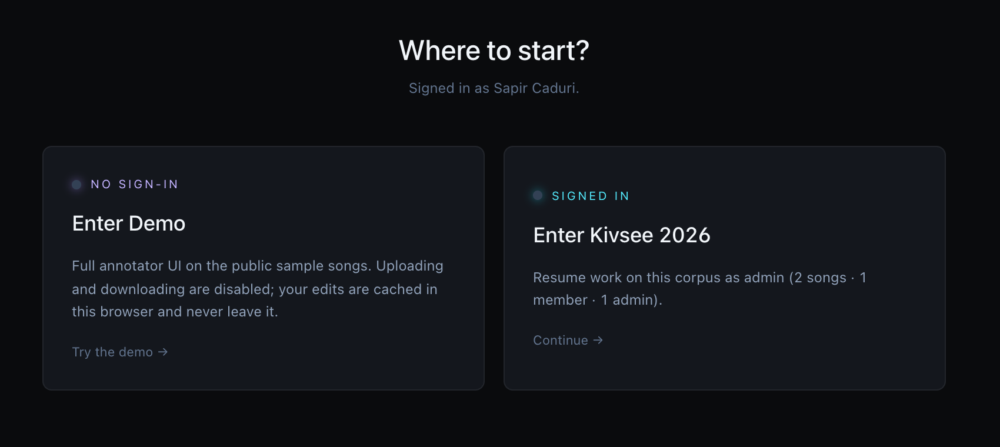

`/` is the main page — a quiet landing screen with **two** entry cards: **Enter Demo**, plus exactly one of **Start a new dataset** or **Enter `<corpus>`**. A single deploy hosts a single corpus, so the second slot reflects whether anyone has claimed it yet:

| Slot | Card | Shown when | What it does | Login required? |
|---|---|---|---|---|
| 1 | **Enter Demo** | always | Anonymous full UI on the public sample songs. Uploading and downloading are disabled. Edits are cached in your browser and never reach the server — clearing site data (cache / cookies) wipes them. | No |
| 2 | **Start a new dataset** | no admin claimed yet (bootstrap) | Routes to `/new-dataset`, where you type a corpus name and sign in with **Google** *or* **Username or email**. On success you become the corpus's first admin and land in **Dataprep**. New datasets always start in per-annotator mode; admins can switch to shared-corpus mode later under **Settings → Corpus management**. | Yes — Google or Username/email |
| 2 | **Enter `<corpus>`** | an admin exists | Sign in (Google or *Username or email*) and resume work on the existing corpus. The card title uses the corpus name; the body shows song count, member count, and the admin count (never specific addresses — the access list isn't exposed to anonymous visitors). When you're already signed in with a real identity, the eyebrow flips to **Signed in**, the call to action becomes **Continue →**, and the body names your tier (e.g. "Resume work on this corpus as admin"). Demo Mode does *not* count as signed in here — the synthetic *Demo visitor* identity can't access a real corpus, so the card keeps the **Returning user** eyebrow and the **Sign in →** call to action even while demo is active. | Yes — sign-in on click |

The dataset's **corpus name** comes from the `corpusName` field in `data/dataset-config.json`. It's set when the first admin claims the dataset via the **Start a new dataset** flow, and is shown in three places: the **Enter `<corpus>`** card title on the main page, a cyan chip next to the *TimeCues / Studio* mark in the workspace header (hidden in Demo Mode), and (when set) the browser tab. When unset (e.g. legacy configs from before this flow existed), the labels fall back to "TimeCues Studio". Admins can rename it later from **Settings → Corpus management → Corpus identity**; leaving the field blank reverts every label to the "TimeCues Studio" fallback. Saving the new name reloads the page so the workspace header chip, landing-card title, and browser-tab title update immediately.

> ℹ **The "Start a new dataset" card accepts both sign-in flows.** Google is offered as the default tab when `VITE_GOOGLE_CLIENT_ID` is configured because it ties admin to a verified email, but *Username or email* is available as a fallback so operators without a Google account (or deploys without a configured client ID) can still claim a fresh corpus. Whichever identity you use becomes the corpus's first admin; admin-tier additions after that go through `Team → Invite annotator`.

Clicking the existing-dataset card routes through `/login?returnTo=/prep`; after sign-in you're sent straight to **Dataset Prep** so you can verify BPM / grid and pick a song before opening the Annotator Tool from the tab strip. The **Start a new dataset** card routes directly to `/new-dataset` (no `/login` detour, since it carries its own sign-in widget), and on success also lands in Dataset Prep. The unified **← Back** chip in the top-left of every screen returns to the main page.

### Demo Mode

Demo Mode is a no-strings, no-sign-in path to try the annotator on the public sample songs. It lives at `/demo` and starts via the **Enter Demo** card on the main page; clicking *Start Demo →* drops you into **Dataset Prep** on the demo corpus, from which the tab strip leads to the Annotator Tool and Algorithm Inspect.

Behaviour:
- **Anonymous** — a synthetic `demo-anonymous` annotator is used internally; the server treats demo visitors as the public tier and serves only the shipped default corpus.
- **No server writes** — every annotation save (Manual / Auto-guess) goes to `localStorage` under the `tc:demo:` namespace instead of the network.
- **No server reads either** — demo `loadAnnotation()` / `loadAutoGuessAnnotation()` read from `localStorage` only, so demo visitors never see other users' work.
- **Pre-seeded BPM and grid** — each of the three shipped CC0 tracks lands in `/demo` with the correct BPM and grid already filled in: `edm-at-midnight` (130 BPM), `pantheon` (107 BPM, grid offset 11.302s), `phonk-remix` (123 BPM). Values live in [`data-default/song-info/<slug>.json`](../data-default/song-info/) and seed every fresh visit — demo requests resolve `GET /api/song-info/:slug` exclusively under `data-default/`, never under the team corpus. Demo visitors can still nudge or override these — overrides go to `localStorage` under `tc:demo:songInfo:<slug>` exactly like any other demo edit.
- **Pre-stemmed audio** — Demucs output is baked into the image at [`data-default/stems/<slug>/`](../data-default/stems/) (192 kbps MP3, ~16 MB per song). Clicking **Vocals / Drums / Bass / Other** in the Source picker switches stems instantly without running Demucs (which is admin-gated anyway). Demo `GET /stems/<slug>/<file>` requests resolve exclusively under `data-default/stems/` — the team's `web-app/public/stems/` tree is never consulted, even if an admin has re-run Demucs on a same-named slug locally.
- **BPM and grid offset are editable** — the **Dataprep** tab's *Song info* card is fully editable in demo (BPM input, time signature, grid offset, **Set bar 1 here** button, Alt+drag on the waveform, and the `G` shortcut all work). Demo edits never touch the canonical `data/song-info/*.json` — they go to `localStorage` under `tc:demo:songInfo:<slug>` and override the server copy for that browser only. **Re-running BPM detection** stays admin-only; demo users still see the cached detector chips from the shipped corpus and can click one to apply.
- **Upload / download disabled** — the public tier already hides admin-gated buttons (upload, delete, export); demo inherits that automatically.
- **Playground and Team hidden** — the **Playground** (`/custom`) and **Team** (`/team`) tabs are removed from the workspace tab strip while in demo, and the routes themselves redirect back to `/` when accessed directly. Playground would let an anonymous visitor upload and execute arbitrary Python on the host; both the Vite proxy and `tools/python/custom_server.py` independently refuse `POST /api/custom-scripts/{upload,run/*,reload,*/flags}` and `DELETE /api/custom-scripts/*` when the request carries the `demo-anonymous` identity, so a hand-crafted client that skips the UI still hits a 403. Read-only Playground endpoints (registry list, cached results, source view) stay open so Algorithm Inspect keeps showing the shipped detectors' output in demo.
- **Tab strip + Back** — the workspace tab header shows a violet **DEMO** chip while in demo, the corpus-name chip is hidden, and the back button reads "← Exit demo" instead of "← Back".
  - **Three exit triggers**: "← Exit demo" in the tab header, clicking the *TimeCues / Studio* wordmark in the tab header, and the "Exit demo" item in the identity badge dropdown. All three behave the same.
  - **Exit dialog with three choices.** When you have any saved demo edits (manual/song-info entries on one or more songs), the trigger opens a modal asking what to do:
    - **Keep my work & exit** — leaves the `tc:demo:*` localStorage in place. Re-entering demo on this device picks up where you left off; signing in as a real user ignores it. Clearing site data still wipes it.
    - **Discard my work & exit** — deletes every `tc:demo:*` key. **No undo.**
    - **Cancel — stay in demo** — closes the modal and keeps you in demo. Escape and clicking outside the dialog also cancel.
  - If you have no saved edits, the dialog is skipped and exit runs immediately (nothing to lose).
- **Persistence** — the demo flag itself lives in `sessionStorage`, so refreshes within the same tab keep you in demo; closing the tab ends the demo. Edits, however, live in `localStorage` and survive a tab close until you clear browser site data.

Implementation entry points:
- [`web-app/src/state/demoFlag.ts`](../web-app/src/state/demoFlag.ts) — module-level flag (the source of truth, read from service-layer code).
- [`web-app/src/context/DemoContext.tsx`](../web-app/src/context/DemoContext.tsx) — React provider; `useDemo()` exposes `isDemo`, `enterDemo`, the primitives `exitDemo` (wipe and clear flag) and `exitDemoKeepWork` (just clear the flag), and `requestExitDemo(after?)` which opens the three-choice dialog and runs `after` once the user picks Keep or Discard.
- [`web-app/src/services/demoStorage.ts`](../web-app/src/services/demoStorage.ts) — localStorage helpers for the three annotation kinds plus song info.
- Branches in [`autoGuessAnnotations.ts`](../web-app/src/services/autoGuessAnnotations.ts) and [`songInfo.ts`](../web-app/src/services/songInfo.ts) — every load/save checks `getIsDemo()` first.

## The Five Workspaces


<!-- tc-videos:the-five-workspaces -->

**▶ Workspace tab strip**

<div style="position:relative;padding-bottom:56.25%;height:0;overflow:hidden;max-width:720px;margin:1rem 0;border-radius:8px;"><iframe style="position:absolute;top:0;left:0;width:100%;height:100%;" src="https://www.youtube.com/embed/NzpXp7zJOJM" title="Workspace tab strip" frameborder="0" loading="lazy" allow="accelerometer; autoplay; clipboard-write; encrypted-media; gyroscope; picture-in-picture" allowfullscreen></iframe></div>

**▶ Per-workspace info banner**

<div style="position:relative;padding-bottom:56.25%;height:0;overflow:hidden;max-width:720px;margin:1rem 0;border-radius:8px;"><iframe style="position:absolute;top:0;left:0;width:100%;height:100%;" src="https://www.youtube.com/embed/StsQGjDBDAQ" title="Per-workspace info banner" frameborder="0" loading="lazy" allow="accelerometer; autoplay; clipboard-write; encrypted-media; gyroscope; picture-in-picture" allowfullscreen></iframe></div>

**▶ BPM not set confirmation dialog**

<div style="position:relative;padding-bottom:56.25%;height:0;overflow:hidden;max-width:720px;margin:1rem 0;border-radius:8px;"><iframe style="position:absolute;top:0;left:0;width:100%;height:100%;" src="https://www.youtube.com/embed/NJSshrQ2LKY" title="BPM not set confirmation dialog" frameborder="0" loading="lazy" allow="accelerometer; autoplay; clipboard-write; encrypted-media; gyroscope; picture-in-picture" allowfullscreen></iframe></div>

<!-- /tc-videos:the-five-workspaces -->
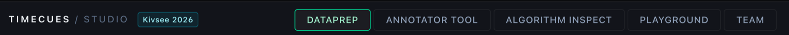

Once you're inside any workspace the top bar shows a **tab strip** — one click to switch between them. The same audio canvas is reused across the first three with mode-specific chrome (emerald = Dataprep, cyan = Annotator Tool, violet = Algorithm Inspect, amber = Playground, rose = Team).

| # | Route | Tab label | Purpose |
|---|-------|-----------|---------|
| 1 | `/prep` | **Dataprep** | BPM, batch algorithm runs, storage management, song upload/delete |
| 2 | `/annotate` | **Annotator Tool** | Manual / Auto-guess editing on a single song |
| 3 | `/inspect` | **Algorithm Inspect** | Algorithm comparison and per-song / all-songs evaluation |
| 4 | `/custom` | **Playground** | Write, save, run, and inspect custom Python detectors |
| 5 | `/team` | **Team** | Admin / researcher cross-annotator dashboard (hidden for other tiers) |
| ⚗ | `/setlist` | **Setlist** | Experimental — algorithmic DJ-style ordering of the corpus. Hidden until you flip on **Enable Setlist workspace** in Settings → Experimental. |
| — | `/settings` | — | Every preference and default; reachable from the main page header |

Each workspace shows a **one-line info banner** at the top — a quick reminder of what the page is for and where the relevant controls live:

- **Dataset Prep** — set BPM and align the grid in the **Song setup** sidebar on the right edge of the workspace; switch to [Mapped](#grid-segments--the-mapped-modes-tempo-map) and lay down a tempo map if the song changes meter or restarts its count partway through; once every song has a BPM, move on to the **Annotator Tool** tab above.
- **Annotator Tool** — annotate the song with **boundaries** (non-overlapping sections), **cues** (single events at a point in time), **spans** (ranged regions that may overlap), **loops** (repeating segments with a cycle length), and **riff patterns** (motifs composed from reusable nodes) — switch types by clicking a type chip in the Annotate sidebar (the tabs in the horizontal row above the *All annotations* list); the edit list sits *below the visualization*. Press **?** for the full shortcut drawer. Toggle **signal rows** (e.g. spectrogram, chroma) from the **SIGNALS** menu in the audio visualization panel to surface different audio features. BPM and grid must be set in Dataset Prep first, since boundaries snap to the grid.
- **Algorithm Inspect — per song** — the *right sidebar* lists every detector grouped by family, each with a **cached / missing / failed** status. The sidebar splits viewing from computing: a row's **checkbox toggles that result's visibility** on the waveform (cached rows only — a missing row is greyed until you compute it), and each family has **Show all / Hide all** for its cached results. The same visibility is also reachable from the toolbar over the canvas, which in this workspace carries an **ALGOS** and a **DETECTORS** dropdown next to SIGNALS / ANNOTATIONS — useful once you collapse the sidebars to widen the canvas. To compute, click **▶ Run…** at the top: the picker opens **mirroring the sidebar** — the same detectors you have ticked for viewing, and the same stem as the **Stem filter** when that stem can be a run target — so what you were just looking at is what you are about to compute, and nothing arrives pre-ticked on your behalf. **Select missing** at the top of the picker seeds it with every not-yet-cached detector in the expanded families whenever you want that instead. Adjust the ticks, then confirm (anything you tick that is already cached is **re-run and overwritten**). Once you edit the selection inside the picker it is yours: re-opening it, or switching the **Run on** stem target, shows it back unchanged rather than re-seeding. The picker always shows a **Run on** section. Before a song has been separated it explains that detectors run on the full mix and offers a **✂ Separate stems (Demucs)** button that kicks off separation right there (in Dataset Prep, for your own uploads) — while it runs the button shows **⏳ Separating stems…** with a percentage, and once it finishes the per-stem options appear. When stems have been separated for the song (via that button or ▶ Stem this song in Dataset Prep), the **Run on** selector offers **Full mix** (default), any single separated stem (**Vocals / Drums / Bass / Other / Guitar / Piano**), or **All stems**. Choosing a single stem runs the ticked CUE / SPAN / LOOP / Pattern / lyrics detectors against that isolated stem instead of the mix; **All stems** fans each ticked stem-capable detector out to *every* separated stem at once (one job per stem). Either way boundary detectors always use the full mix; results cache separately as **per-stem rows** labelled **"detector · stem"** (e.g. *librosa onsets · drums*, *Whisper-base · vocals*). A single **Stem filter** sits above the family chips and *composes* with them: the chips choose **which** algorithms are shown, then the Stem filter narrows those to one stem. It is **single-select** — **All** (every selected row, full-mix and per-stem), **Full mix** (only the full-mix rows), or one of **Vocals / Drums / Bass / Other / Guitar / Piano** (each selected algorithm's row for that stem — open the algorithm's family chip first so its base row is selected). A per-stem row you tick **by name** — in the toolbar's **ALGOS** dropdown, or as a per-stem row inside a family chip — is exempt: ticking *Whisper-base lyrics · vocals* draws it whatever the Stem filter says, because naming the row is the only way to ask for it and the filter is there to narrow the rows that arrived implicitly (a family chip selects base rows, and their stem variants ride along). Untick it to put it away. A **full-mix** row is the one exception that stays vetoed — the Stem filter has to mean something for the mix — so the app says so rather than leaving you with a ticked box and no lane: while a single stem is selected, the toolbar's **ALGOS** badge reads **drawn / ticked** (e.g. `1/2`) instead of a plain count, the popover opens on an amber note naming the stem and how many ticked rows are full-mix, with a **show all stems** link that resets the filter to **All**, and each affected row is struck through and marked **hidden**. Only stems that already have a per-stem result are pickable; a stem no algorithm has run on yet shows **greyed-out and disabled**, and the whole strip is hidden until at least one per-stem result exists. The Stem filter is **locked to the player's stem** by default: pick *Vocals* in the filter and the player switches to the vocals stem (when the song has one), and pick *Drums* in the player's stem selector and the filter narrows to drums (when some algorithm has drum rows) — so what you hear is what the sidebar shows. **All** is not a stem, so choosing it leaves the audio as it is; **Full mix** in either place plays and shows the mix. To hear one stem while reading another's rows, untick **Lock player stem to stem filter** in the toolbar's **Misc** dropdown; ticking it again brings the filter over to whatever is playing. Each pickable stem button carries a small **count** of how many of your **currently-selected** algorithms have a result on that stem (and **All** shows the running total), so you can tell at a glance which stems your ticked chips cover without clicking each one — tick or untick a family chip and the counts update. (Boundary detectors run on the full mix only, so the Stem filter narrows nothing for them — it's the CUE / SPAN / LOOP / Pattern / lyrics families that produce per-stem rows.) When a single stem is selected, the sidebar makes per-stem availability explicit so a checked family no longer reads as if it applies to that stem: each **family chip's count** flips to *how many of its detectors have a result for that stem* (zero for the full-mix-only MSAF / Ruptures / All-In-One families), and inside an open family every detector row that can't target that stem shows a grey **"mix only"** status and is disabled, while stem-capable rows show **cached / missing** for their *per-stem* variant rather than the full mix. Algorithm Inspect's timeline shows **algorithm overlays** plus any **boundary curators** you tick — the latter are no longer an algorithm family but live in their own [Detectors sidebar](#annotation-workspace) (a **Boundaries** list, empty unless a curator that emits boundaries is installed), shown here to the left of the Algorithms sidebar; the curated detector-sourced *layers* ("*… (stem)*") are listed there too, filtered per stem — everything a detector proposed is in this workspace, and nothing a detector proposed is in the Annotator Tool until you copy it. Click an algorithm lane's label to select it and a small **ⓘ icon** appears just under the lane name (e.g. *Silero-VAD · vocals*); clicking the ⓘ opens a popover with the **Model** (what algorithm/network produced the lane), what it **Extracts**, and its **Input** and **Output** — the same provenance affordance as the curated lanes' ⓘ, so you can confirm what a row is without leaving the canvas. Click the ⓘ again, click elsewhere, or press **Esc** to dismiss it. Visible predictions stack as colored timelines, each drawn to match its output type: boundary detectors as contiguous section blocks, onset / cue detectors as individual tick marks, and span / loop / note / lyric detectors as translucent colored bands. Metrics vs. your manual annotation appear in the panel below. A **Merge** row sits with those lanes: drag boundary lanes onto it (or press the **⊕** on a selected lane) to blend several detectors into one set of boundaries for this song, then commit the result to an editable boundary layer — see [Merge](#merge--blending-several-boundary-lanes-into-one). Detectors that produce a single value for the whole track — the **Key** (librosa key) and the lyrics **Language** (Whisper) — are not timelines; they show as always-visible read-only pills in the toolbar's **Detected** group instead. Use the **All songs** sub-tab for dataset-wide totals.
- **Algorithm Inspect — all songs** — pick algorithms via the **⚙ options** button at the top, then **Batch run** to evaluate every song at once; the aggregate F1 / precision / recall table appears below with expandable per-song rows.

Click the **×** on the right of any banner to dismiss it; the choice is remembered per browser, so dismissed banners stay hidden on future visits.

**The address bar remembers what you are looking at.** Dataprep, the Annotator Tool and Algorithm Inspect keep the current view in the page URL: the open song, the annotation type you are editing, what Algorithm Inspect is examining and which of its tabs is open, the algorithm lanes drawn on the timeline (per-stem lanes included), the curated detectors shown, which signal rows are on, the Manual / Auto-guess / Prominence / Consensus switches, the algorithm families opened in the sidebar, the stem the player is playing, the **Stem filter**, whether the stem lock is off, the playback speed, the grid unit, and — once you zoom in — the stretch of the song on screen. Refreshing the page brings you back to exactly that view, and copying the URL is how you show someone else what you are looking at. They open the same song, with the same lanes drawn over the same seconds of music, even when their screen is a different width (they need access to the song and its algorithm results). A link to a song that is not in the recipient's dataset opens their first song instead. A link that turns the stem lock off does so only for that visit; it does not change the recipient's own **Misc** setting. Opening a workspace without a song in the URL (from the main page, say) reopens the last song you had open in that browser.

When the sidebar list is empty, the workspace body shows a context-aware empty state instead of "Select a song above to begin": Dataset Prep prompts you to **Upload songs to begin** (with an inline `+ Upload songs` shortcut for admins); the other workspaces tell you to open **Dataset Prep** to upload first. Once songs exist but none is selected, the prompt shifts per workspace — Dataset Prep nudges you to **set BPM and align the grid**, Annotator Tool says **begin annotating**, Algorithm Inspect says **compare algorithms**.

A **"BPM not set"** confirmation dialog guards the Annotator Tool, since annotations snap to the grid and a missing BPM means every section lands off-beat. It appears two ways: **clicking a song that has no BPM yet** while in Annotator Tool (instead of jumping straight into the editor), and **switching into the Annotator Tool tab** while the already-selected song has no BPM — the case you hit right after uploading, where the song is already loaded in Dataprep. The dialog offers **Set BPM in Dataset Prep** (recommended; switches the workspace, selecting the same song), **Annotate anyway** (proceeds without a grid), or **Cancel**. Songs that already have a BPM open straight into the editor as before; re-selecting the currently-loaded song never re-prompts, and once you've chosen **Annotate anyway** for a song the tab-switch warning stays quiet for it for the rest of the session.

### On a phone

TimeCues Studio has a phone layout. It is the same app, the same songs and the same annotations, in a frame built for a small touch screen. You get it three ways:

- **`m.timecues-studio.lol`**, the phone address. The rule is the address: `m.<host>` is the phone shell and the host without it is the desktop one, so the two never fight over the same URL. That holds while developing too — `http://m.localhost:5174/` is the phone shell of your dev server, `http://localhost:5174/` the desktop one.
- **Any phone-sized touch screen** on the main address. A phone that opens the desktop address is not left with a squeezed desktop.
- **`?mobile=1`** on any address, for a quick look on a computer without changing the address (in Chrome, turn on the device toolbar with Cmd+Shift+M so touch works too). `?mobile=0` does the reverse on the phone address. Both last for that visit only and are not remembered.

Only one thing is remembered: **Desktop site**, in the avatar menu, which is how a phone leaves the phone layout for good. It takes you to the desktop address and keeps you there on later visits, until you open the phone address again.

#### The frame: top bar, bottom tabs, panels

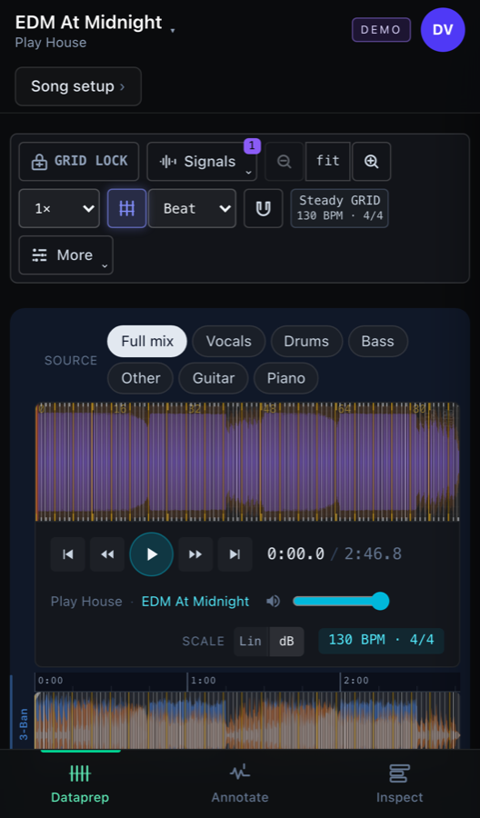 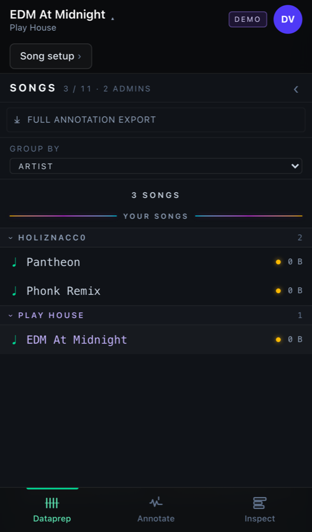 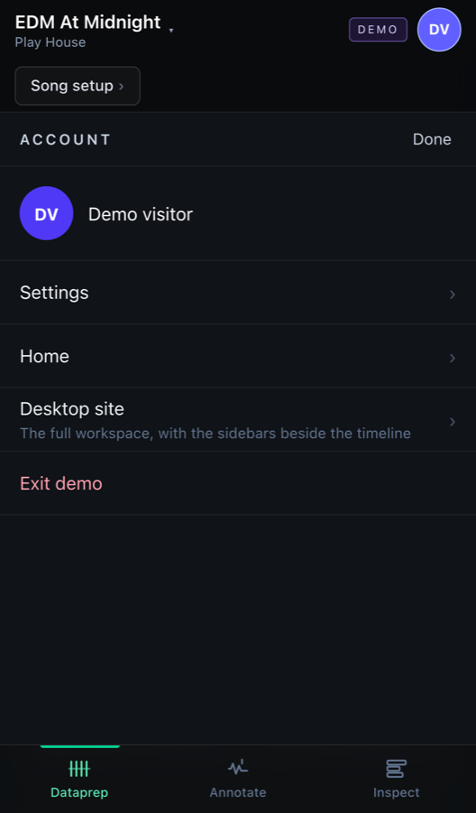

- **The workspace tabs are a bar along the bottom:** **Dataprep · Annotate · Inspect · Playground · Team**. They are the desktop tabs, in the same order, with the same colours and the same rules about who sees which one (Team only for researchers and admins, Playground not in demo). **Setlist** is not in the bar; when it is turned on in Settings it is in the avatar menu.
- **The top bar names the song you are on.** Tap the song name (**▾**) to open the song list, which on desktop is the left sidebar. Picking a song closes it again.
- **The avatar**, top right, opens the account menu: who you are signed in as, the corpus, **Settings**, **Setlist**, **Home**, **Desktop site**, and **Sign out** (or **Exit demo**).
- **Each workspace's sidebars are buttons in a second row of the top bar:** **Song setup** in Dataprep, **Edit list** and **Annotation tools** in the Annotator Tool, **Algorithms** and **Detector layers** in Algorithm Inspect. A button opens its sidebar over the timeline, with the same contents as on desktop. Tap it again (it shows **✕** while open) or tap the sidebar's own **›** to go back to the timeline.
- **Annotation tools dock to the bottom half**, not over the whole screen: you annotate by looking at the timeline, so the lanes stay visible and draggable above them, the transport stays on screen, and opening the tools brings the lanes up into that space (the viz toolbar stands down while they are open, since the sheet carries what you are using). Drag or tap the grip at the top of the sheet — **Expand** — to take it full height for the long lists, and **Shrink** to put the timeline back.

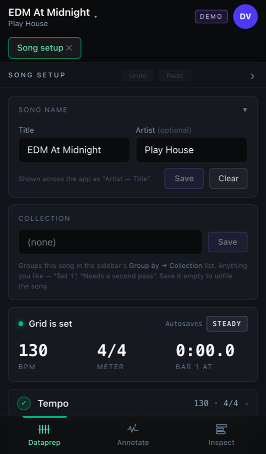 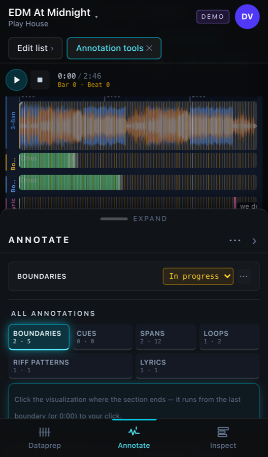 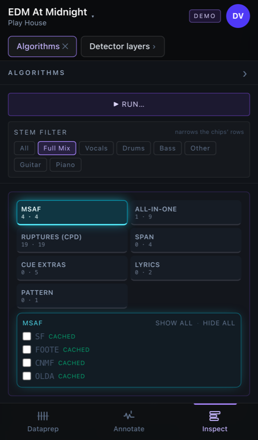

#### The timeline

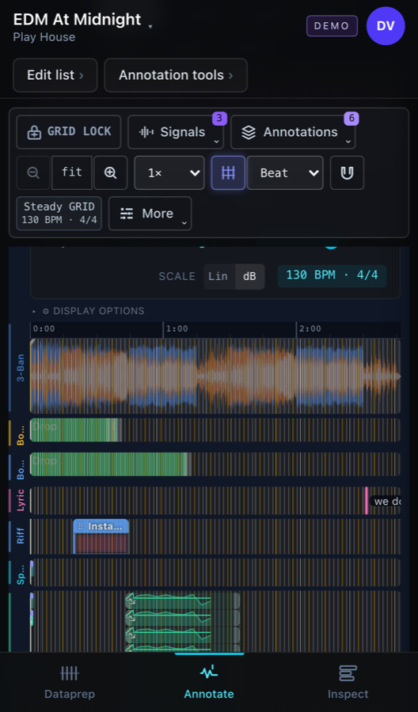 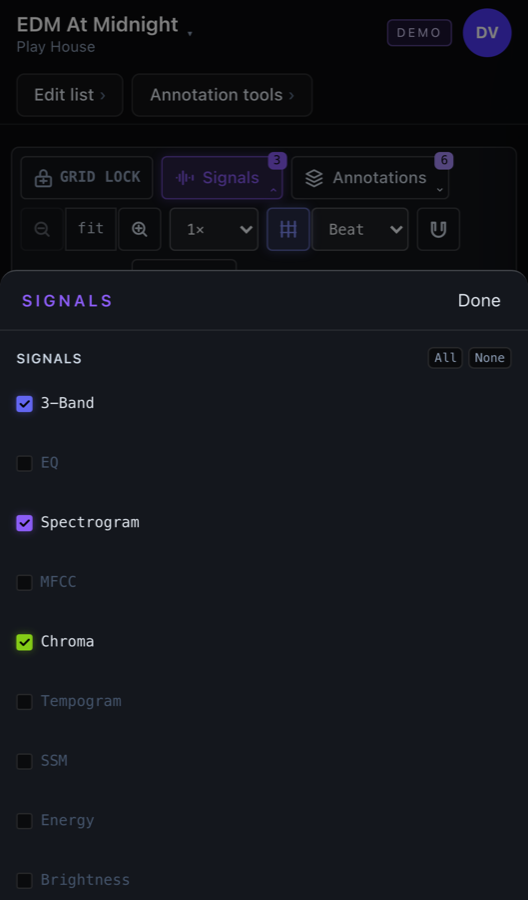 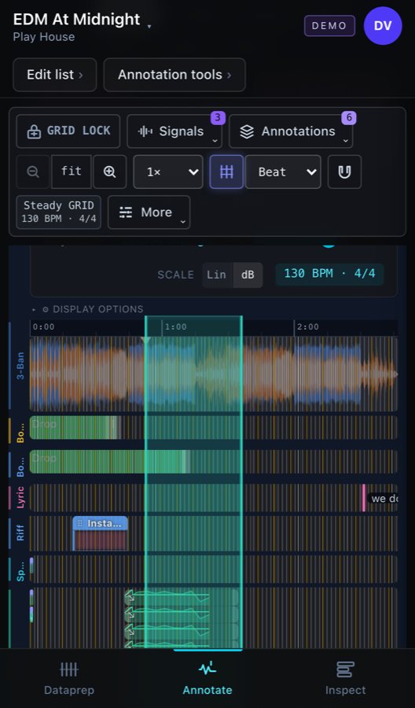

- **The toolbar wraps onto short rows** of smaller buttons, so every control stays in view. Its menus say their names (**Signals**, **Annotations**, **Algorithms**, **Detectors**, **More**), and each opens as a sheet from the bottom of the screen. Tap **Done** or the dimmed timeline to close it.
- **Touch works everywhere the mouse does.** Drag a finger sideways across a row to select a stretch of the song, and drag a boundary, cue, loop or span edge to move it. A vertical swipe over the timeline still scrolls the page, so a selection is a *sideways* drag. On touch screens the small handles have a larger grab area than they show, without ever covering the middle of a short loop or span, which still moves the whole band. A tap on the timeline closes any open menu or card.
- **Row names are a narrow strip.** Down the left of the timeline, each row shows the first five letters of its name (**Bound**, **Chrom**, **Riff**), written sideways in the row's colour, so the timeline gets almost the whole width of the screen. A row too short even for that ends in **…**. Tap the name to read it in full. Swipe sideways on the strip to pull it open, and the names read across as on a desktop, pencil and all. Swipe it back in to close it to the strip again. A tap still opens the row sheet either way.
- **The big playback and selection clocks are hidden.** The time is under the waveform, and the selection is the painted band.
- **The one-line info banners are not shown.** Their directions ("the sidebar on the right") describe the desktop layout.

#### The row sheet — tap a row's name

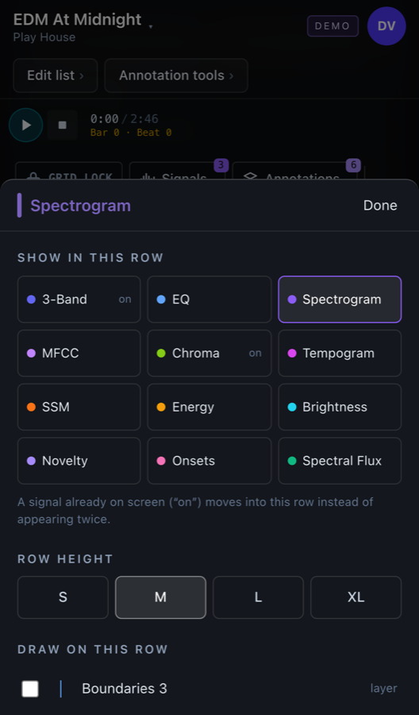 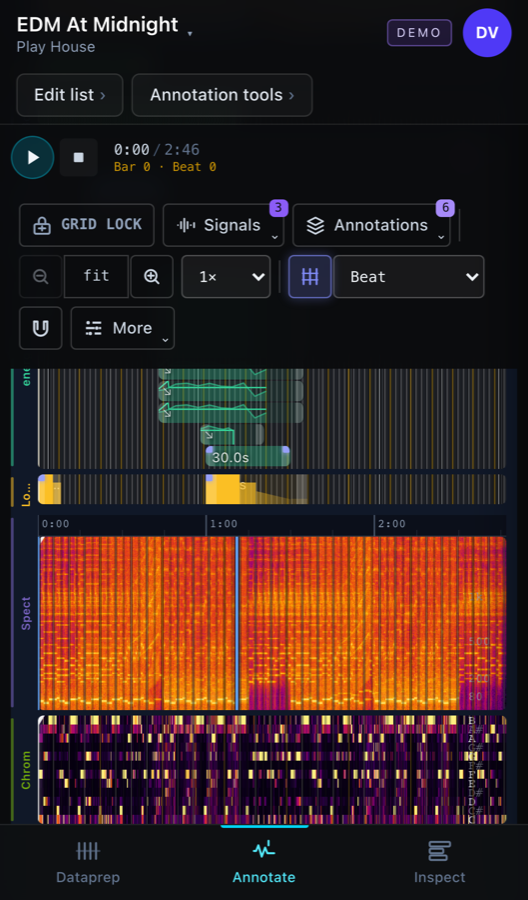

Tapping a row's name opens its **row sheet**, with the full name and the row's controls:

- **Show in this row** (signal rows): pick any of the 12 signals to replace this one in the same place. A signal that is already another row (marked **on**) moves here instead of appearing twice. The row keeps its height and its marks.
- **Row height** (signal rows): **S**, **M** (the row's normal height), **L** or **XL**. XL gives a tall spectrogram without leaving the stack of rows it lines up with. Remembered in this browser.
- **Draw on this row** (signal rows): tick a boundary layer to draw its section starts over the signal as thin full-height lines, or a boundary detector to draw its boundaries as short narrow bars along the top edge. The signal and the marks share the same time axis, so you can check a boundary against what the audio does there. Remembered in this browser.
- **Move up / Move down**, and **Hide row** for a signal row.

Tapping an annotation lane's name also makes it the active layer, as clicking it does on desktop.

#### Edit list and Algorithm Inspect

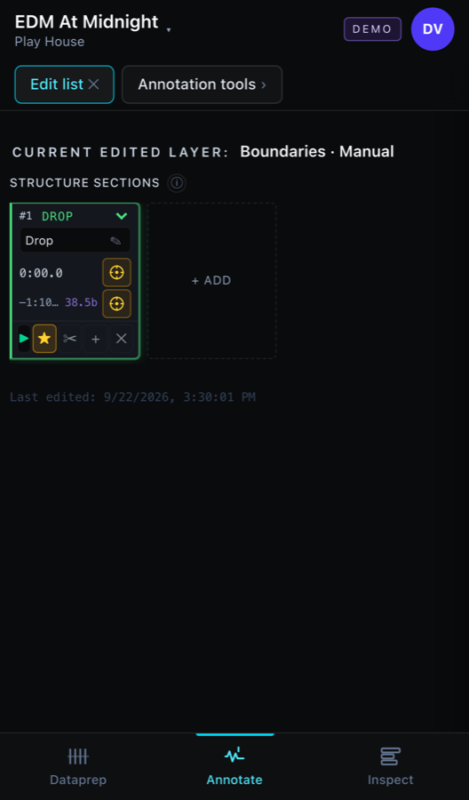 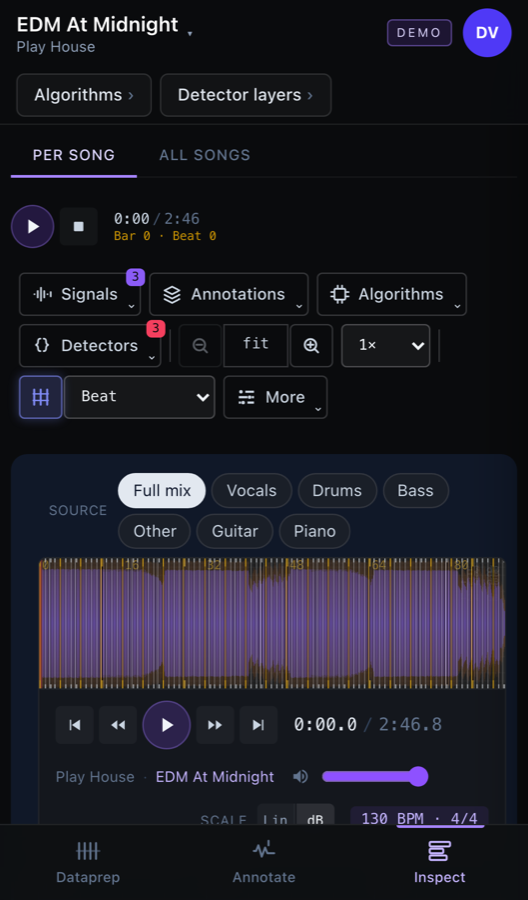 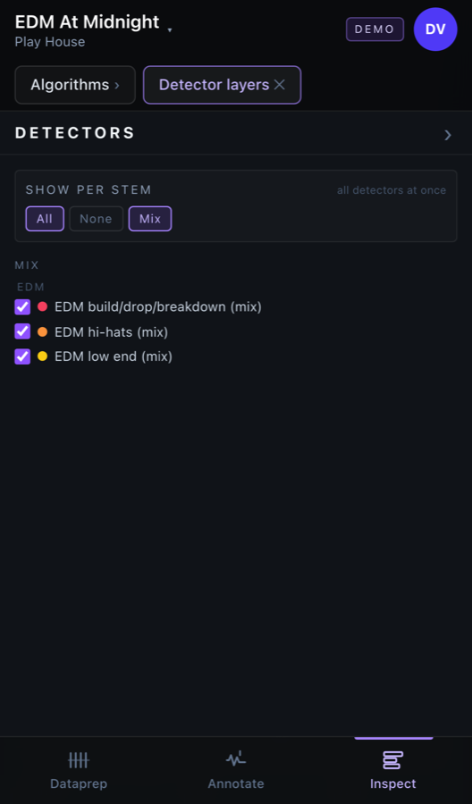

- **Edit list** (Annotator Tool) shows the edit list on its own, without the timeline above it, three cards to a row. Tap it again (**✕**) to bring the timeline back.
- In **Algorithm Inspect**, **Algorithms** opens the algorithm list (tick, run, show/hide) and **Detector layers** the curated detector layers, each full-screen.

#### Signing in

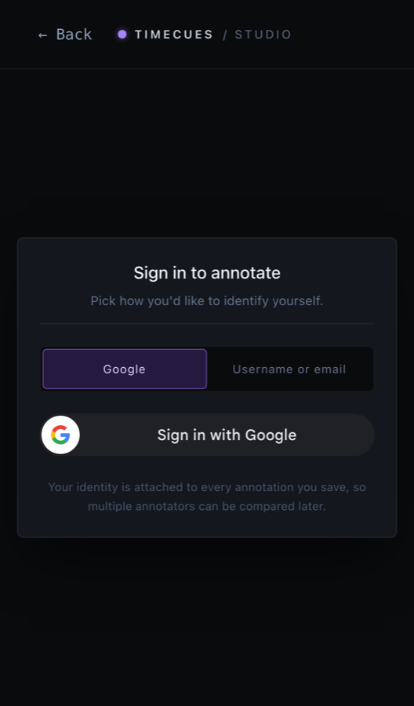

Sign-in with Google works the same on a phone; the button fits the screen and is always in English. The phone address is its own web origin, so an administrator has to add `https://m.<your domain>` to the Google OAuth client's **Authorized JavaScript origins** (see [Deployment](DEPLOYMENT.md)) before Google sign-in works there. `localhost` needs nothing extra: `?mobile=1` is not part of the origin.

---

## Sign-In & Identity


<!-- tc-videos:sign-in-identity -->

**▶ Username or email field**

<div style="position:relative;padding-bottom:56.25%;height:0;overflow:hidden;max-width:720px;margin:1rem 0;border-radius:8px;"><iframe style="position:absolute;top:0;left:0;width:100%;height:100%;" src="https://www.youtube.com/embed/Vm4amcahmzM" title="Username or email field" frameborder="0" loading="lazy" allow="accelerometer; autoplay; clipboard-write; encrypted-media; gyroscope; picture-in-picture" allowfullscreen></iframe></div>

**▶ Annotator badge dropdown**

<div style="position:relative;padding-bottom:56.25%;height:0;overflow:hidden;max-width:720px;margin:1rem 0;border-radius:8px;"><iframe style="position:absolute;top:0;left:0;width:100%;height:100%;" src="https://www.youtube.com/embed/J38ByTFxIiY" title="Annotator badge dropdown" frameborder="0" loading="lazy" allow="accelerometer; autoplay; clipboard-write; encrypted-media; gyroscope; picture-in-picture" allowfullscreen></iframe></div>

<!-- /tc-videos:sign-in-identity -->
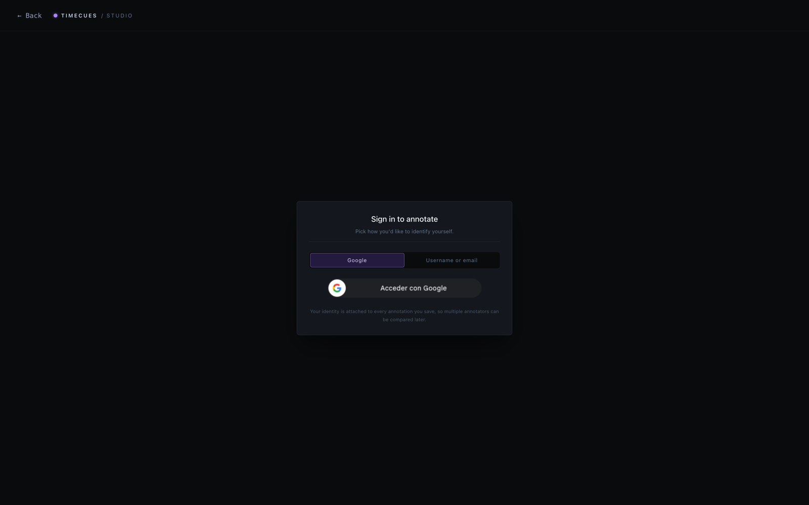

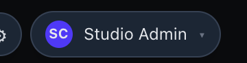

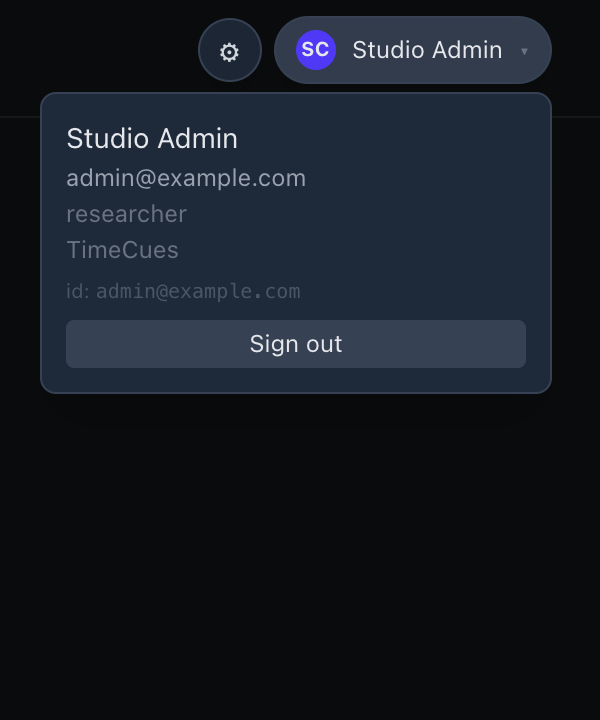

Login is **lazy**: only the main page (`/`), the Demo (`/demo`), the new-dataset claim flow (`/new-dataset`), and the login screen itself render without an identity. Every workspace (`/prep`, `/annotate`, `/inspect`, `/custom`, `/team`) and the settings page (`/settings`) require sign-in — anonymous visitors who hit those URLs directly are bounced to `/login?returnTo=<path>` and resume there after signing in. The destination is whitelisted to in-app paths, so a crafted `returnTo` cannot bounce you off-site.

The sign-in screen offers two passwordless flows: **Google** (one-click OAuth) and **Username or email** (a single field that accepts either form of identity). There is no separate "email" flow — the field treats `jane` and `jane@example.com` as equivalent inputs that each become an annotator id; whether you typed an email-shaped value or a bare handle, it goes through the same logic.

The accepted character set is **letters, digits, underscore, dot, hyphen, and `@`** — no spaces or other punctuation. Minimum length is 2 characters. An email address is just a special case of the same alphabet.

| Sign-in path | Verification | Annotator ID format | Example | Eligible for admin? |
|---|---|---|---|---|
| **Google** | Email verified by Google OAuth | `<email>` (no prefix) | `you@example.com` | Yes |
| **Username or email** | Self-attested, **not verified** | `local-<sanitized>` | `local-jane` or `local-jane@example.com` | Yes (any tier admin assigns) |

The self-attested identity is namespaced under `local-…` so it cannot collide with a Google-verified id — typing a Google user's email in the identity field does **not** impersonate them.

When you type a valid identity, the form checks in real time:

- **If a profile already exists** for the typed value (matching either the new `local-…` id or the legacy `email-…` id from earlier versions of the app), the form collapses to a one-click "Welcome back, *Name*" panel — no need to retype role/affiliation.
- **If the canonical id already has annotations on disk** but no profile, the form offers **Continue as `<identity>`** to pick up that work, plus three suggested alternative names if it isn't you (e.g. `alice-2`, `alice-25`, `alice-x7k2`).
- **If the id is fresh**, a green "✓ Available" line appears and clicking **Continue** signs you in immediately.

There is no password and no domain check — when you type an email-shaped value the form does **not** validate the domain or send a confirmation. The allowlist still gates actual access (see *Roles* below), and Google sign-in remains the only path that verifies the email cryptographically.

Your identity persists in browser storage and is attached as `X-Annotator-Id` to every save. Annotations are written under `data/annotations/<layer>/<annotator>/<slug>.json`, and the **profile** itself (name, email if any, role, affiliation, sign-in method) is stored at `data/annotators/<id>.json` so returning users can be recognized on any device.

The **Annotator badge** (top-right of every page) shows your ID and signs you out. The dropdown also surfaces an **Admin** chip when you're the team leader.

### Roles: Admin (team leader) vs Annotator

Access is **one tier per email**. All assignments live in `data/dataset-config.json` under `peopleByEmail` (the single source of truth), and are edited from the **Team page → Members tab**.

> 🔒 **The whitelist is server-only.** `peopleByEmail`, `adminEmails`, and `teamEmails` are stripped from the public `GET /api/dataset-config` response — only admins and researchers receive those fields (so the Team and Settings pages can render member lists). Anonymous visitors and `team`-tier users see aggregate counts (`adminCount`, `memberCount`) via `/api/admin-status` but never peer addresses. The sign-in denial decision itself runs server-side through `/api/check-access?id=<id>`, so the JavaScript bundle and network panel never contain enough information to enumerate admin/researcher/team email addresses.

Once a dataset has any allowlist entries, **sign-in is gated by that list**. Anyone whose annotator id (Google `<email>` or `local-…`) is not in `peopleByEmail` (or the legacy `adminEmails` / `teamEmails`, or the legacy `email-…` ids written by older versions of the app) sees an **Access denied** panel on the sign-in screen with the message:

> ⛔ `<your-id>` isn't on this dataset's access list. Contact your dataset admin to request access, then try signing in again.

The panel deliberately does not list specific admin addresses — surfacing them would defeat the server-side whitelist hardening described above. Users who need access must reach out to a dataset admin out-of-band. Casual exploration without an account is still possible through **Demo mode** (`/demo`), which does not consult the allowlist.

A dataset with an empty `peopleByEmail` (and no legacy `adminEmails` / `teamEmails`) is in **bootstrap mode** — the first signed-in user is implicitly admin and can invite the rest of the team.

| Capability | Admin | Researcher | Team | Public |
|---|:---:|:---:|:---:|:---:|
| Manage members (assign/remove tiers, invite people) | ✓ | — | — | — |
| Set per-song BPM / time-signature / grid-offset | ✓ | — | — | — |
| Upload songs · delete songs | ✓ | ✓ | — | — |
| Open the `/team` Team Dashboard | ✓ | ✓ | — | — |
| See every annotator's manual/auto-guess work | ✓ | ✓ | — | — |
| Export the full dataset (`scope=all`) | ✓ | ✓ | — | — |
| Annotate the full corpus (own work only) | ✓ | ✓ | ✓ | — |
| Annotate shipped default songs (own work only) | ✓ | ✓ | ✓ | ✓ |

Tiers stack — every capability of a lower tier is included in the tiers above it. Researchers are the "trusted collaborator" rung: full data access for analysis and curation, but no power to change tiers or edit the dataset's BPM grid.

> ⚠ **Legacy compatibility**: `adminEmails` and `teamEmails` arrays are still written next to `peopleByEmail` so older code paths keep working. Researchers are intentionally NOT folded into `adminEmails` — their access flows only through `peopleByEmail`.

In annotation views, each annotator only sees their **own** manual/auto-guess work — there is no automatic fallback to anyone else's data. Researchers and admins can compare across annotators from the `/team` Team Dashboard or via the `Compare` sub-tab.

### Collaborative songs (one shared annotation, one editor at a time)

A song is normally **solo**: every annotator keeps their own layers document, and nobody can overwrite anybody. A song can instead be made **collaborative**, so the team builds *one* annotation together — the usual choice for ground-truthing, where the point is to converge on a single reading rather than compare several.

Collaboration is **per song**, not per corpus. Making one song collaborative leaves every other song alone, and the Compare sub-tab keeps working normally everywhere else.

**Turning it on** (admin only): open the song in the **Annotator Tool**. Just above the editor, a line reads *Per-annotator song — everyone keeps their own annotation*; click **Make collaborative…**, pick whose existing work seeds the shared annotation — or start from an empty one — and confirm. Only admins see that line; for everyone else a solo song looks exactly as it always has. The seed is copied; the annotator's own document is left untouched as history. A song that is already collaborative is never re-seeded, so a second click can't wipe the team's work.

**Editing one.** A collaborative song opens **read-only** for everyone. To change anything you press **Lock to edit**; when you are done you press **Unlock**, which hands it back and makes you read-only again. Until you unlock, nobody else can take it — that is the point.

A bar directly under the song title — above the waveform, so it is on screen the moment you open the song — names who has it:

| State | What you see | What you can do |
|---|---|---|
| Free | *No one is editing* | **Lock to edit** |
| Yours | *You're editing · 12 min* | edit; **Unlock** when done |
| Someone else's | *Alice Cohen is editing* | read, play, export — **Take over** (asks first) |
| Theirs, gone quiet | *Alice Cohen · no heartbeat for 8 min (tab likely closed)* | **Take over** |

Two clocks feed that line. A **heartbeat** every minute from the holder's open tab, and the time since their last actual **save**. So "is editing", "holds this · no changes for 26 min" and "no heartbeat for 8 min" mean three different things, and the wording stays honest about which one was observed — a silent heartbeat is evidence a tab closed, not proof.

While the lock is someone else's, the annotation panel is dimmed and marked **🔒 Read-only**, and edits are refused rather than accepted-then-dropped: a marker won't move, a layer won't appear. You can still play, scrub, inspect and export.

> A lock is **never** taken away automatically. Going quiet only changes how the take-over button asks. If you take a song from someone, their work up to that moment is already saved as a version, and their screen switches to read-only with an offer to keep their own copy as a separate layer.

**Every hand-off is a saved version.** Each collaborative song keeps its own history — who held it, how long, what changed — and the **History** panel can show any earlier version and restore it. Restoring writes the old content forward as a *new* version, so nothing is ever overwritten and a restore you regret is itself undoable. Locking and unlocking without editing records nothing; the history is a list of real changes, not of clicks.

> ⚠ **Deleting a collaborative song deletes its history too.** "Delete everything" removes the shared annotation and every saved version along with the audio. Export them first if they matter — the confirmation will tell you how many versions are about to go.

**Turning it off** (admin only): **Stop collaborating**, at the right-hand end of the shared-song bar, returns the song to per-annotator editing. The shared annotation and its whole history are archived rather than deleted, but new edits go back to each annotator's own document.

> ⚠ **Corpus-wide shared mode** (`sharedCorpus` in `data/dataset-config.json`, admin-only, experimental) is the older, blunter version of this and applies to auto-guess data only. Prefer per-song collaboration above.

---

## The Song Sidebar (everywhere)


<!-- tc-videos:the-song-sidebar-everywhere -->

**▶ Sidebar collapse and resize**

<div style="position:relative;padding-bottom:56.25%;height:0;overflow:hidden;max-width:720px;margin:1rem 0;border-radius:8px;"><iframe style="position:absolute;top:0;left:0;width:100%;height:100%;" src="https://www.youtube.com/embed/nONb8MCXdao" title="Sidebar collapse and resize" frameborder="0" loading="lazy" allow="accelerometer; autoplay; clipboard-write; encrypted-media; gyroscope; picture-in-picture" allowfullscreen></iframe></div>

**▶ Grid-readiness glyph**

<div style="position:relative;padding-bottom:56.25%;height:0;overflow:hidden;max-width:720px;margin:1rem 0;border-radius:8px;"><iframe style="position:absolute;top:0;left:0;width:100%;height:100%;" src="https://www.youtube.com/embed/GKSSoWJ_djg" title="Grid-readiness glyph" frameborder="0" loading="lazy" allow="accelerometer; autoplay; clipboard-write; encrypted-media; gyroscope; picture-in-picture" allowfullscreen></iframe></div>

**▶ Disk usage chip**

<div style="position:relative;padding-bottom:56.25%;height:0;overflow:hidden;max-width:720px;margin:1rem 0;border-radius:8px;"><iframe style="position:absolute;top:0;left:0;width:100%;height:100%;" src="https://www.youtube.com/embed/TSR367f6nDM" title="Disk usage chip" frameborder="0" loading="lazy" allow="accelerometer; autoplay; clipboard-write; encrypted-media; gyroscope; picture-in-picture" allowfullscreen></iframe></div>

<!-- /tc-videos:the-song-sidebar-everywhere -->
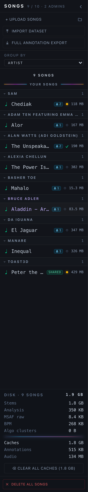

The Song Sidebar is the narrow panel fixed to the left edge of the window. It stays put as you move between the four main screens (Annotator Tool, Algorithm Inspect, Dataprep, and Playground), giving you one consistent place to see the list of songs and choose the one you're working on.

Three of its settings are remembered in your browser between visits (so the sidebar looks the same next time you open the app):
- Whether you've collapsed it out of the way is saved under the key `tc:song-sidebar-collapsed`.
- How wide you've dragged it is saved under `tc:song-sidebar-width`. You can resize it anywhere from **180 px** (narrow) to **560 px** (wide); it opens at **256 px** the first time.
- What you've set **Group by** to is saved under `tc:song-sidebar-group-by`, and which groups you've folded under `tc:song-sidebar-collapsed-groups`.

Collapsing a side panel hands its width to the workspace instead of leaving empty margin: the centre column — toolbar, waveform, and every timeline lane under it — widens by exactly what the panel gave up, so you see more of the song at the same zoom. Collapse both the Song Sidebar and the right-hand panel (Song setup / Annotate / Algorithms) and the canvas stretches nearly edge to edge. Re-opening a panel shrinks the column back.

### Header actions

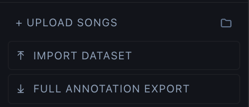

The buttons across the top of the sidebar:

| Control | Action |
|---------|--------|
| Collapse / Expand chevron (⟨ / ⟩) | Toggle the rail; the seek bar stays full-width |
| Upload song | File picker for `.mp3` / `.wav` (Prep workspace) |
| Go to Prep | Jumps to `/prep` from any other workspace |
| Group by | Chooses what the list below is grouped under — see [List structure](#list-structure) |

### List structure

What appears in the song list depends on whether you're a signed-in team member or a demo visitor — the two never mix:

- **Shipped default songs** (`edm-at-midnight`, `pantheon`, `phonk-remix`) appear **only in Demo Mode**. The two corpora are strictly separated server-side: the manifest a team / researcher / admin receives is built exclusively from `data/songs/`, and the manifest a demo / public visitor receives is built exclusively from `data-default/songs/`. No fallback in either direction — even hand-crafted `/audio/<file>` or `/stems/<…>` URLs for the wrong corpus return 404.
- The list is preceded by a glowing **"your songs"** header at the top.
- A **Group by** picker sits directly above the list (whenever there is more than one song) and decides how it is carved up. It stays pinned above the scroll area, so the answer to "why is this list shaped like this?" is always on screen. Your choice is remembered between visits (see above). Six options:

| Group by | Headings you get |
|----------|------------------|
| **Nothing** | None — one flat list, exactly as the sidebar has always looked. |
| **Artist** (default) | One heading per artist, sorted alphabetically, with the artist-less songs collected last under an italic **Unknown artist**. |
| **Collection** | One heading per **collection you named yourself** — see [Collection](#collection-your-own-grouping). Sorted alphabetically, with the unfiled songs last under an italic **No collection**. This is the only grouping the app can't work out on its own, and the only one you have to fill in. |
| **Tempo readiness** | **No BPM yet** (first — those are the songs blocking work) and **Ready to annotate**, the same split the row's ♩ glyph shows. |
| **Annotation status** | **In progress**, **All reviewed**, **Not started** — the same verdict the row's annotation dot shows, so a heading and a dot can never disagree. |
| **Shared / per-annotator** | The song's own collaborative setting — the one its header offers as *Make collaborative…*: **Shared with the team** (one team document behind an edit lock) or **Per-annotator** (everyone keeps their own copy). See [Collaborative songs](#collaborative-songs-one-shared-annotation-one-editor-at-a-time). |
| **Who else annotated** | **Shared with the team** first (a collaborative song is the team's document, so it is never filed by a head count), then how many annotators have work on each of the rest: **More than one annotator**, **Only mine**, **Someone else's** (one annotator, and it isn't you — work waiting for you to look at), **Not annotated yet**. Head count and shared setting are *different questions* — two people annotating a song separately, each in their own copy, does not make it a shared song. |


- Each heading carries its **song count** on the right, and **clicking it folds or unfolds that group** — the point of the grouping on a large corpus: fold what you're not working on and the rest of the list comes within one screen. Folds are remembered between visits, and are tracked per grouping, so folding *HoliznaCC0* under Artist doesn't fold anything under Annotation status.
- Selecting a song from outside the list — the first-song auto-select, or the song the app falls back to after a delete — unfolds whichever group holds it, so the highlighted row is never hidden. You can fold it again afterwards and it stays folded.
- A group that holds the currently selected song has its heading tinted the same violet as the selected row.
- Groups with nothing in them are not drawn at all, and a chosen grouping always draws its headings even when every song lands in the same one — "all 12 of these still have no BPM" is an answer.
- Within a group, songs are sorted **alphabetically by title** — the same text the row leads with, so the list reads in the order you'd scan it.
- The last two modes are the only ones that have to **ask the server**, so they ask when you pick them and not before, and they never guess. While an answer is in flight, or if there is no answer to be had, the whole list sits under one dimmed heading saying which — every song still listed, rather than a verdict the data doesn't support:
  - **Checking which songs are shared…** / **Checking who else annotated…** — the request is in flight.
  - **Shared setting unknown — sign in to a team corpus** / **Unknown — needs a team corpus** — you're a demo visitor, or not on this corpus's team.
  - **Shared corpus — everyone edits one set of files** (*Who else annotated* only) — the admin has turned on **Shared corpus** in Settings → Corpus management, so there are no per-annotator copies to count.

  **Who else annotated** counts an annotator only when they have **something on the song** — at least one marker on a layer, or auto-guess points. Merely opening a song writes an empty annotation document, so counting files would report a song as collaborative because two people once looked at it. It counts **annotator ids**: if you sign in two ways (a local username and Google, say), your own two ids read as two annotators. And it counts **people, never names them** — who annotated what, and for how long, stays on the [Team Dashboard](#team-dashboard), which is admin / researcher only. Demo visitors don't count, so nobody can change how a song reads by clicking Try the demo.

### Per-song row

Each entry shows:
- **Song name** — the **title first**. Songs with no curated Title fall back to the file name, split on the same `Artist — Title` convention. Set or change either half in [Display name](#display-name-title--artist). The **artist** trails the title in a dimmer grey after an em dash (*Chediak — 5AM*) — except when **Group by** is set to *Artist*, where the heading above the row already carries it and the title gets the full width instead.
- **Grid-readiness ♩** — a quarter-note glyph color-coded for tempo/grid status: **emerald ♩** = BPM set and grid locked (ready to annotate), **amber ♩** = BPM set but grid not locked yet (open Dataset Prep to lock it), **red ♩** = no BPM yet (open Dataset Prep to detect or enter one). The musical glyph keeps it visually distinct from the right-side annotation indicator below.
- **Overall annotation indicator** — one dot per song, scanning the workflow status of every **manual** annotation track you've started for that song (Boundaries, Cues, Spans, Loops, Patterns, Riff Patterns, Lyrics). Three states:
  - **Hollow gray ring** — no manual annotations yet
  - **Amber pulse** — at least one manual track in progress / awaiting review
  - **Emerald ✓** — every manual track you've started is marked *reviewed*

  **Auto-guess and custom-detector outputs don't gate the green ✓** — they're produced by algorithms, not authored by you, so requiring them to be "reviewed" would block the indicator on machine output. They are still listed in the popover (below a divider, under a small *auto-guess · detectors* label) for reference, but only manual tracks count toward the dot color. With the **Loops and Patterns** experimental flag off, Loops, Patterns and Riff Patterns are excluded from the count and the popover (matching the editor, which only shows them when the flag is on) even if a layer exists on disk.

  Click the indicator to open a popover that lists each annotation track for this song, its item count, and its current state (*in progress* / *reviewed*). Tracks with zero markers are omitted — the popover only lists what actually exists on disk. Every kind shares the same workflow pill and the same `derivePillDisplay` rule as the editor (`!hasItems` ⇒ *not started* regardless of stored stage), so the popover and the in-editor pill always agree. *Shown in every workspace, Dataset Prep included* — in Dataset Prep it sits beside the disk-usage chip rather than replacing it, so the screen you prepare a corpus on can still answer "what have I already annotated?".

  **One row per annotation *type*, not per layer.** Review status is stored per type, so all your Cues layers share one *Cues* row (its count is their items added together), all your Span layers share one *Spans* row, and so on. A song with a dozen lanes on the canvas can legitimately show four or five rows here — the extra lanes are either more layers of a type already listed, or detector/algorithm output, which is not an annotation track at all and appears below the divider only when it comes from auto-guess.

  **✓ Mark all** — the button in the popover's header flips **every type still outstanding** to *reviewed* in one click, instead of walking the editor panel-by-panel to change each pill. It touches only the types listed below it (a type with no markers has no status to set), and reads **✓ all**, greyed out, once nothing is left to mark. On a [shared song](#collaborative-songs-one-shared-annotation-one-editor-at-a-time) you need the edit lock first; without it the popover says so and changes nothing.
- **SHARED badge** — an emerald `SHARED` chip on any song that has been made [collaborative](#collaborative-songs-one-shared-annotation-one-editor-at-a-time): one team annotation, edited by one person at a time. It replaces the head count below, because on a shared song the per-annotator files left over from before it was shared describe the wrong thing. Shown in every workspace, so which songs are the team's is answerable without changing the grouping.
- **Annotator head count** — a small sky-blue badge (a person glyph and a number) showing **how many annotators have work on this song**. It is drawn **only when somebody other than you has work here** — a `1` on every song you annotated yourself would be noise, and the status dot beside it already reports your own progress. So a bare number means: *someone else is in this song too*. Hover it for the plain-English version ("2 annotators have work on this song: you and 1 other" / "One annotator has work on this song, and it is not you"), and **click it for the names**.
  - The popover lists each annotator with how many markers they have on the song, **you first**. Names, never ids: they are resolved on the server from each annotator's profile, because a non-admin never receives the member roster and a raw id is an email for anyone who signed in with Google. Someone who hasn't filled in a profile yet shows as their id, the same fallback the editing-lock bar uses.
  - The names are fetched **when you open the popover**, one song at a time — the list view only ever needs a number, so the sidebar's routine request stays anonymous.
  - Counted the same way as the [Who else annotated](#list-structure) grouping: an annotator counts only once they have **at least one marker on a layer, or auto-guess points**. Opening a song writes an empty document, which is not work and does not count.
  - It is a **head count, not a status**: it says nothing about whether the song is [collaborative](#collaborative-songs-one-shared-annotation-one-editor-at-a-time). Two annotators each keeping their own copy is the ordinary case, and that song still shows **2**.
  - Not shown on a shared song (the `SHARED` chip takes its place), never shown to demo visitors (there is no team), and never a name — who those annotators are stays on the [Team Dashboard](#team-dashboard).
- **Disk usage chip** — total bytes occupied. *Shown in Dataset Prep and Algorithm Inspect*, in both cases next to the annotation indicator, so you can decide what to re-run vs. evict at a glance. **Color tiers**:

| Total size | Color | Meaning |
|------------|-------|---------|
| `< 1 GB`   | Slate | Normal (KB / MB) |
| `≥ 1 GB`   | Cyan  | Stems extracted |
| `≥ 2 GB`   | Amber | Consider clearing |
| `≥ 5 GB`   | Red   | Almost certainly cruft |

- **Hover tooltip** — per-category breakdown: Stems / Analysis / MSAF raw / BPM / Algo clusters / MIR features / Custom-script results / Annotations / Audio.
- **⌫ Clear scope button** — opens the **"Clear storage" dialog** (described below) for freeing up this song's disk space at one of three levels. *Shown in Dataset Prep only.*
- **✕ Delete song button** — confirm-word `DELETE_SONG`; permanently removes the song from the dataset (audio file is wiped from disk; annotations stored elsewhere are not touched). *Shown in Dataset Prep only* — the Annotator and Algorithm Inspect sidebars no longer expose any per-song delete affordance, so accidental deletion from those workspaces is impossible.

### The "Clear storage" dialog — three levels of cleanup

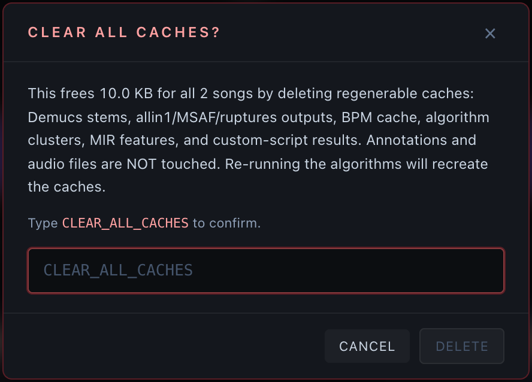

The ⌫ Clear scope button opens a dialog that frees up disk space for one song. It offers three levels of deletion — from "just throw away the heaviest re-computable files" up to "erase this song completely" — so you can reclaim space without losing work you care about. At the top the dialog shows a full size breakdown (Stems, Analysis, MSAF raw, BPM, Algo clusters, then Annotations and Audio) so you can see exactly how much each level would remove before you commit.

Whichever level you pick, you have to **type the level's name in capital letters** to confirm (the button stays dead until you do), and there is **no undo**. The dialog opens on the safest level (STEM) by default.

The three levels, safest first:

- **STEM** (type `STEM` to confirm) — deletes only the separated instrument tracks (the Demucs "stems": the vocals/drums/bass/other WAV files under `public/stems/<slug>/`). Everything else — other analysis caches, your annotations, and the original audio — is left alone. These files are large and are re-created on demand, so this is the cheapest cleanup.
- **ALGOS** (type `ALGOS` to confirm) — deletes every file the app can re-compute for this song: the stems *plus* the structure-detector outputs (All-In-One, MSAF, ruptures), the cached BPM detection, the algorithm clusters, the MIR feature cache, and any custom-detector results. Your annotations and the original audio are kept. Use this to wipe stale algorithm results and start the analysis fresh. *(Note: the in-app dialog's wording for this level is slightly off — it omits the MIR-feature and custom-detector files it actually removes, and mentions an "LLM-vision" cache it does not touch. The behavior described here matches the real code.)*
- **EVERYTHING** (type `EVERYTHING` to confirm) — erases the entire song: the audio file, the song's BPM/grid settings, every cached file, **and every annotator's** boundary-style annotations for it (Manual, Auto-guess, and custom-detector reviews). The song then vanishes from the song list. This reaches across *all* annotators, not just you. *(One thing it does not currently remove: the separate cues/spans/loops "layer" document — those files survive an EVERYTHING clear and would need to be deleted by hand.)*

> ⚠ **EVERYTHING deletes other people's work too, not only yours.** Back up first with the Full Dataset export.

> 🔒 **Demo Mode cannot delete songs.** While in Demo Mode the per-song ✕
> delete button is hidden (it is already restricted to Dataset Prep, but
> Demo also strips it there), the **Delete All Songs** footer button is
> hidden, and the EVERYTHING level of the "Clear storage" dialog is greyed
> out (STEM and ALGOS still work — they only touch the demo session's
> caches). Signed-in admins and researchers see all controls as normal
> and can delete any song from the corpus.

### Dataset-wide actions (sidebar footer)

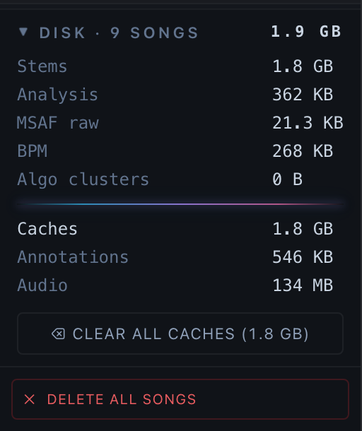

The whole **Disk · N songs** footer block (per-category byte breakdown +
**Clear all caches** button) is now scoped to Dataset Prep and Algorithm
Inspect only — the Annotator sidebar drops it entirely so the workspace
stays focused on authoring annotations, not storage hygiene.

**Collapsing it.** The **Disk · N songs** header is itself a toggle: click it
to fold the block down to that single line, which keeps showing the dataset
total while the per-category breakdown and **Clear all caches** button move
out of the way. Click again to unfold. The ▶ / ▼ caret on the left shows the
current state, and the choice is remembered per browser — fold it once and it
stays folded the next time you open the workspace.

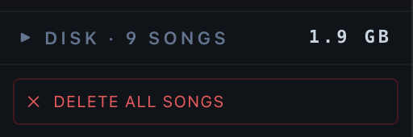

- **Clear all caches** — confirm with `CLEAR_ALL_CACHES`; equivalent to ALGOS for every song. *Visible in Dataset Prep and Algorithm Inspect* (inside the disk-usage footer).
- **⤓ Full annotation export** — opens the Export Manager so you can grab annotations (Manual / Auto-guess / Cues / Spans / Loops / Riff Patterns) plus optional buckets: audio, algorithm caches, and stems. **Visible only in Dataset Prep, at the top of the sidebar next to `+ Upload songs`.**
- **✕ Delete all songs** — destructive; admin-only; hidden in Demo Mode. **Visible only in Dataset Prep.**

---

## Song Info Bar


<!-- tc-videos:song-info-bar -->

**▶ Display name (Title + Artist)**

<div style="position:relative;padding-bottom:56.25%;height:0;overflow:hidden;max-width:720px;margin:1rem 0;border-radius:8px;"><iframe style="position:absolute;top:0;left:0;width:100%;height:100%;" src="https://www.youtube.com/embed/n3zFhnN8pcg" title="Display name (Title + Artist)" frameborder="0" loading="lazy" allow="accelerometer; autoplay; clipboard-write; encrypted-media; gyroscope; picture-in-picture" allowfullscreen></iframe></div>

**▶ BPM field**

<div style="position:relative;padding-bottom:56.25%;height:0;overflow:hidden;max-width:720px;margin:1rem 0;border-radius:8px;"><iframe style="position:absolute;top:0;left:0;width:100%;height:100%;" src="https://www.youtube.com/embed/n9BqWtSfOOo" title="BPM field" frameborder="0" loading="lazy" allow="accelerometer; autoplay; clipboard-write; encrypted-media; gyroscope; picture-in-picture" allowfullscreen></iframe></div>

**▶ Time signature dropdown**

<div style="position:relative;padding-bottom:56.25%;height:0;overflow:hidden;max-width:720px;margin:1rem 0;border-radius:8px;"><iframe style="position:absolute;top:0;left:0;width:100%;height:100%;" src="https://www.youtube.com/embed/Xy3XBuos3ho" title="Time signature dropdown" frameborder="0" loading="lazy" allow="accelerometer; autoplay; clipboard-write; encrypted-media; gyroscope; picture-in-picture" allowfullscreen></iframe></div>

**▶ Auto-detected tempo chip row**

<div style="position:relative;padding-bottom:56.25%;height:0;overflow:hidden;max-width:720px;margin:1rem 0;border-radius:8px;"><iframe style="position:absolute;top:0;left:0;width:100%;height:100%;" src="https://www.youtube.com/embed/EnF9QMc6AGw" title="Auto-detected tempo chip row" frameborder="0" loading="lazy" allow="accelerometer; autoplay; clipboard-write; encrypted-media; gyroscope; picture-in-picture" allowfullscreen></iframe></div>

**▶ Grid offset field**

<div style="position:relative;padding-bottom:56.25%;height:0;overflow:hidden;max-width:720px;margin:1rem 0;border-radius:8px;"><iframe style="position:absolute;top:0;left:0;width:100%;height:100%;" src="https://www.youtube.com/embed/SEwJasQi_eE" title="Grid offset field" frameborder="0" loading="lazy" allow="accelerometer; autoplay; clipboard-write; encrypted-media; gyroscope; picture-in-picture" allowfullscreen></iframe></div>

**▶ Set bar start button**

<div style="position:relative;padding-bottom:56.25%;height:0;overflow:hidden;max-width:720px;margin:1rem 0;border-radius:8px;"><iframe style="position:absolute;top:0;left:0;width:100%;height:100%;" src="https://www.youtube.com/embed/xs5iMP-JpqQ" title="Set bar start button" frameborder="0" loading="lazy" allow="accelerometer; autoplay; clipboard-write; encrypted-media; gyroscope; picture-in-picture" allowfullscreen></iframe></div>

**▶ Steady grid mode**

<div style="position:relative;padding-bottom:56.25%;height:0;overflow:hidden;max-width:720px;margin:1rem 0;border-radius:8px;"><iframe style="position:absolute;top:0;left:0;width:100%;height:100%;" src="https://www.youtube.com/embed/kgduv0Ymc6M" title="Steady grid mode" frameborder="0" loading="lazy" allow="accelerometer; autoplay; clipboard-write; encrypted-media; gyroscope; picture-in-picture" allowfullscreen></iframe></div>

**▶ Grid nudge row**

<div style="position:relative;padding-bottom:56.25%;height:0;overflow:hidden;max-width:720px;margin:1rem 0;border-radius:8px;"><iframe style="position:absolute;top:0;left:0;width:100%;height:100%;" src="https://www.youtube.com/embed/4R5w2Mp8jCU" title="Grid nudge row" frameborder="0" loading="lazy" allow="accelerometer; autoplay; clipboard-write; encrypted-media; gyroscope; picture-in-picture" allowfullscreen></iframe></div>

**▶ BPM warning pills**

<div style="position:relative;padding-bottom:56.25%;height:0;overflow:hidden;max-width:720px;margin:1rem 0;border-radius:8px;"><iframe style="position:absolute;top:0;left:0;width:100%;height:100%;" src="https://www.youtube.com/embed/NIq53IQgSEY" title="BPM warning pills" frameborder="0" loading="lazy" allow="accelerometer; autoplay; clipboard-write; encrypted-media; gyroscope; picture-in-picture" allowfullscreen></iframe></div>

**▶ Mapped grid mode**

<div style="position:relative;padding-bottom:56.25%;height:0;overflow:hidden;max-width:720px;margin:1rem 0;border-radius:8px;"><iframe style="position:absolute;top:0;left:0;width:100%;height:100%;" src="https://www.youtube.com/embed/gekCKpE_rkY" title="Mapped grid mode" frameborder="0" loading="lazy" allow="accelerometer; autoplay; clipboard-write; encrypted-media; gyroscope; picture-in-picture" allowfullscreen></iframe></div>

**▶ Hand-placed grid mode**

<div style="position:relative;padding-bottom:56.25%;height:0;overflow:hidden;max-width:720px;margin:1rem 0;border-radius:8px;"><iframe style="position:absolute;top:0;left:0;width:100%;height:100%;" src="https://www.youtube.com/embed/1Q-9t1zho94" title="Hand-placed grid mode" frameborder="0" loading="lazy" allow="accelerometer; autoplay; clipboard-write; encrypted-media; gyroscope; picture-in-picture" allowfullscreen></iframe></div>

**▶ Split the grid at the playhead**

<div style="position:relative;padding-bottom:56.25%;height:0;overflow:hidden;max-width:720px;margin:1rem 0;border-radius:8px;"><iframe style="position:absolute;top:0;left:0;width:100%;height:100%;" src="https://www.youtube.com/embed/E2RgMzlF7t8" title="Split the grid at the playhead" frameborder="0" loading="lazy" allow="accelerometer; autoplay; clipboard-write; encrypted-media; gyroscope; picture-in-picture" allowfullscreen></iframe></div>

**▶ The grid-segment list**

<div style="position:relative;padding-bottom:56.25%;height:0;overflow:hidden;max-width:720px;margin:1rem 0;border-radius:8px;"><iframe style="position:absolute;top:0;left:0;width:100%;height:100%;" src="https://www.youtube.com/embed/NAX9UfLnPcw" title="The grid-segment list" frameborder="0" loading="lazy" allow="accelerometer; autoplay; clipboard-write; encrypted-media; gyroscope; picture-in-picture" allowfullscreen></iframe></div>

**▶ Merge two grid segments**

<div style="position:relative;padding-bottom:56.25%;height:0;overflow:hidden;max-width:720px;margin:1rem 0;border-radius:8px;"><iframe style="position:absolute;top:0;left:0;width:100%;height:100%;" src="https://www.youtube.com/embed/3ypq0lIuP3s" title="Merge two grid segments" frameborder="0" loading="lazy" allow="accelerometer; autoplay; clipboard-write; encrypted-media; gyroscope; picture-in-picture" allowfullscreen></iframe></div>

**▶ Per-beat pin hit zones**

<div style="position:relative;padding-bottom:56.25%;height:0;overflow:hidden;max-width:720px;margin:1rem 0;border-radius:8px;"><iframe style="position:absolute;top:0;left:0;width:100%;height:100%;" src="https://www.youtube.com/embed/nD3X3J_sAbM" title="Per-beat pin hit zones" frameborder="0" loading="lazy" allow="accelerometer; autoplay; clipboard-write; encrypted-media; gyroscope; picture-in-picture" allowfullscreen></iframe></div>

**▶ Reset Grid button**

<div style="position:relative;padding-bottom:56.25%;height:0;overflow:hidden;max-width:720px;margin:1rem 0;border-radius:8px;"><iframe style="position:absolute;top:0;left:0;width:100%;height:100%;" src="https://www.youtube.com/embed/eQFj3jRsmlw" title="Reset Grid button" frameborder="0" loading="lazy" allow="accelerometer; autoplay; clipboard-write; encrypted-media; gyroscope; picture-in-picture" allowfullscreen></iframe></div>

**▶ Alt-drag to slide grid**

<div style="position:relative;padding-bottom:56.25%;height:0;overflow:hidden;max-width:720px;margin:1rem 0;border-radius:8px;"><iframe style="position:absolute;top:0;left:0;width:100%;height:100%;" src="https://www.youtube.com/embed/2sBHgeniCqY" title="Alt-drag to slide grid" frameborder="0" loading="lazy" allow="accelerometer; autoplay; clipboard-write; encrypted-media; gyroscope; picture-in-picture" allowfullscreen></iframe></div>

**▶ Pick base grid modal**

<div style="position:relative;padding-bottom:56.25%;height:0;overflow:hidden;max-width:720px;margin:1rem 0;border-radius:8px;"><iframe style="position:absolute;top:0;left:0;width:100%;height:100%;" src="https://www.youtube.com/embed/3n4hs7bTZhQ" title="Pick base grid modal" frameborder="0" loading="lazy" allow="accelerometer; autoplay; clipboard-write; encrypted-media; gyroscope; picture-in-picture" allowfullscreen></iframe></div>

**▶ Detect a segment’s own tempo**

<div style="position:relative;padding-bottom:56.25%;height:0;overflow:hidden;max-width:720px;margin:1rem 0;border-radius:8px;"><iframe style="position:absolute;top:0;left:0;width:100%;height:100%;" src="https://www.youtube.com/embed/cNG_yVMVT8A" title="Detect a segment’s own tempo" frameborder="0" loading="lazy" allow="accelerometer; autoplay; clipboard-write; encrypted-media; gyroscope; picture-in-picture" allowfullscreen></iframe></div>

<!-- /tc-videos:song-info-bar -->
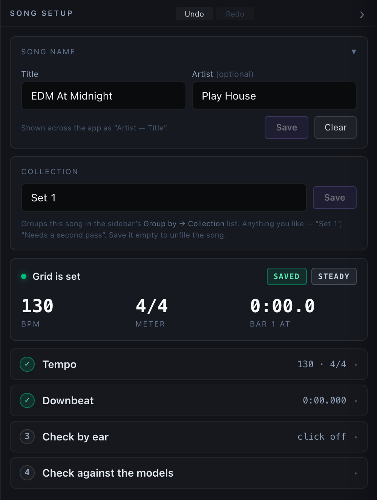

The Song Info Bar is the panel where you tell TimeCues two things about a song: what to call it, and how its beat grid is laid out (its tempo and where bar 1 starts). Getting the grid right here is the prerequisite for everything else — because annotations snap to the beat, a song with no tempo or a misplaced downbeat can't be annotated usefully. It appears in every workspace, but only admins can edit it; everyone else sees the same values read-only.

It is laid out as the task it actually is, not as a form:

**The Song name card**, at the very top, is what the song is *called*: **Title** and **Artist** side by side, with **Save** / **Clear** beneath them. It is always visible — naming a track is part of preparing it — and it never touches the file on disk. See [Display name](#display-name-title--artist).

**The Collection card**, under it, is what pile the song belongs *to* — one free-text name you choose, and the only grouping the Song Sidebar can't derive for itself. See [Collection](#collection-your-own-grouping).

**The status card**, below it, never folds away. It answers "is my grid right?" at a glance: a state line (**Grid is set** in green, or **No grid yet** in amber), the active tempo mode as a chip on the right, and three big readouts — **BPM**, **Meter**, and **Bar 1 at**. Each readout is clickable and jumps to the step that changes it. On a Mapped song the first column is labelled **BPM · seg 1** — in a tempo map the number belongs to each segment, and this is the opening one's.

**Autosave, and how you'd know it failed.** There is no Save button for the grid: every change here — BPM, meter, the downbeat, pinned beats, grid segments, and any drag on the canvas that moves them — is written to `data/song-info/<slug>.json` about half a second after you stop editing. The card's right-hand corner says where that stands: a quiet **Autosaves** while idle, **Saving…** during the write, a brief green **SAVED** when it lands. If the server refuses or never answers, it turns into a red **NOT SAVED · RETRY** chip and a matching **Grid not saved** toast appears at the bottom of the screen with a **Retry** button — your edit is still on screen but is *not* on disk, so retry it (or copy the values out) before reloading the page. The warning stays up until a save succeeds.

> ⚠️ The song name (Title / Artist) and the collection are the exceptions: each has its own **Save** button and is only written when you press it.

**Four numbered steps** follow, one accordion level deep, and only one is open at a time — you are never looking at four open forms. The first two build the ruler; the last two verify it, once by ear and once against the beat trackers:

1. **① Tempo** — what the song's tempo is: the mode picker (**Steady / Mapped / Hand-placed**), the BPM field with its `÷2` / `×2` fixers, the meter chips, and the detected-tempo suggestions. A mode's own controls appear directly under the picker, with the button that turns them on: in **Mapped**, the tempo-map list and **＋ Split the grid at the playhead**. In **Mapped** the song-level BPM field and meter chips are hidden, because there the tempo belongs to the segments — see [Grid Segments](#grid-segments--the-mapped-modes-tempo-map).
2. **② Downbeat** — where bar 1 sits: *Set bar 1 here*, the typed grid-offset field, and the step-size nudge control. In **Hand-placed** this step holds the pinned-beat list instead.
3. **③ Check by ear** — the metronome, which is how you verify the first two: click on/off, volume, tone, and tap-along.
4. **④ Check against the models** — the same verification with a different judge: every beat tracker that has run on the song, scored against the grid you are looking at. See [Check against the models](#check-against-the-models).

A step that is closed shows its current value on the right (`140 · 4/4`, `0:51.557`, `click off`) and a ✓ once it is satisfied. Steps ①–② earn theirs from the song having a BPM and a downbeat; step ③ earns its ✓ the first time you turn the click on for that song — **tapping is not required**, listening is the whole point of the step. The mark resets per song. Step ④ carries no ✓: it reports a verdict rather than a task you complete. Steps ②–④ stay dimmed and inert until the song has a BPM, and before a BPM exists the panel offers exactly one thing to click: **Use *N* BPM** if the detectors agree on one, otherwise **Detect the tempo**.

There is **no Advanced drawer**. The destructive grid **reset** — the last thing that lived in it — now sits at the foot of step **① Tempo**, directly under the mode picker it undoes, which is the only control it has ever been about. It renders only when there is something to undo: a Steady grid with no pinned beats has nothing to throw away, and read-only viewers never see it.

In **Dataprep** the panel lives in the **Song setup** sidebar docked to the right edge of the workspace (collapsible to a hover tab, and drag-the-left-edge to resize). Which step is open and which nudge step size is selected are remembered in your browser (keys `tc:prep:setup:step`, `tc:prep:setup:nudgestep`). See [Grid Mode](#grid-mode-steady--mapped--hand-placed) for how the steps change shape per mode.

### Display name (Title + Artist)

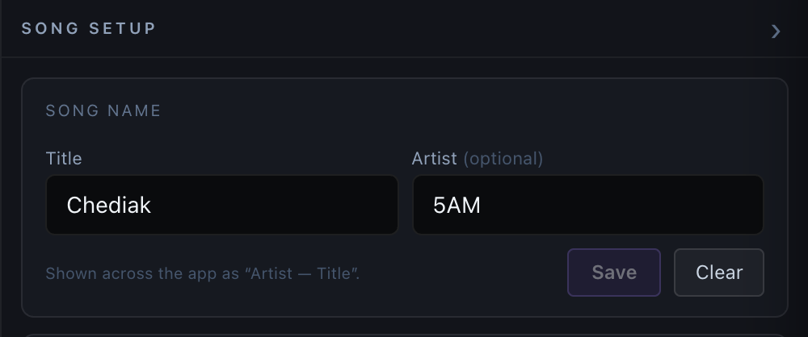

The human-readable name shown everywhere a song appears — the sidebar, the song picker, and workspace headers. **It is independent of the file on disk**: the audio file and its folder keep their lowercase-underscore slug (e.g. `midnight_drive`) no matter what you type here.

- **Title** — the visible name. Leave it blank to fall back to the file name.
- **Artist** *(optional)* — only used when a Title is set. Everywhere the two appear together the **title leads**: in the Song Sidebar they share one line as **Title — Artist**, with the artist half greyed; in the big workspace header above the waveform they stack instead — the **title** large and bold, the **artist** as a smaller greyed subtitle beneath it (Material-style hierarchy). An Artist with no Title is ignored.
- Both fields live in the **Song name** card at the very top of the Song setup panel, above the grid status card — always on screen, with no drawer to open first.
- **Edits commit on Save, not as you type.** Type into Title / Artist, then press **Save** (beneath the two fields, or hit Enter in either field) to apply — until you do, an `unsaved` flag shows and the displayed name is unchanged, so a half-typed title never replaces it. **Clear** (next to Save) resets both fields back to the file-name default.
- **Admin-only**, like BPM and grid: annotators and researchers see these fields read-only. After a Save the song list updates within ~1 second.
- *Demo Mode:* title edits are kept in your browser only and do not change the name shown in the song list (the demo corpus is read-only).

### Collection (your own grouping)

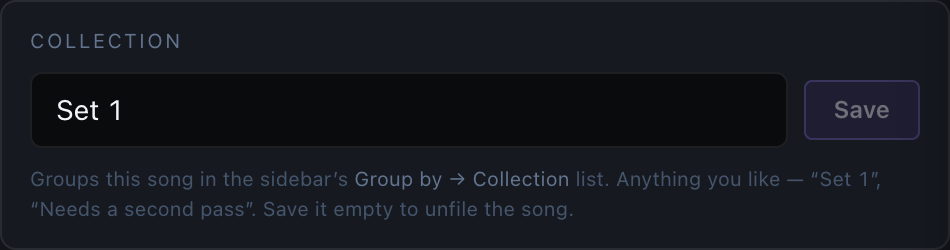

The **Collection** card sits just under **Song name** in the Song setup panel. It holds one free-text name per song, and it exists for the one way of carving up a corpus the app can never work out for itself: yours. *Set 1*, *Needs a second pass*, *Examples for the paper* — whatever the pile is called in your head.

- Type a name and press **Save** (or hit Enter in the field). The song refiles itself in the Song Sidebar immediately — switch **Group by** to **Collection** to see the list rearrange.
- **Save it empty to unfile the song**; it drops back under **No collection**.
- As you type, the browser offers **every collection name already in use** in the corpus, so the second song in a pile is one click rather than a re-typing (and one typo away from a second heading). Names are matched case-insensitively — `Set 1` and `set 1` are one collection, and the first spelling used supplies the heading.
- One collection per song. It is **corpus metadata, not a private bookmark**: it is stored next to the BPM in `data/song-info/<slug>.json`, so everyone on the team sees the same piles.
- **Admin-only**, like BPM and the display name. Annotators and researchers see the name read-only, and the card is hidden entirely for them when the song has no collection.
- *Demo Mode:* collections are kept in your browser only.

### BPM (the song's tempo)

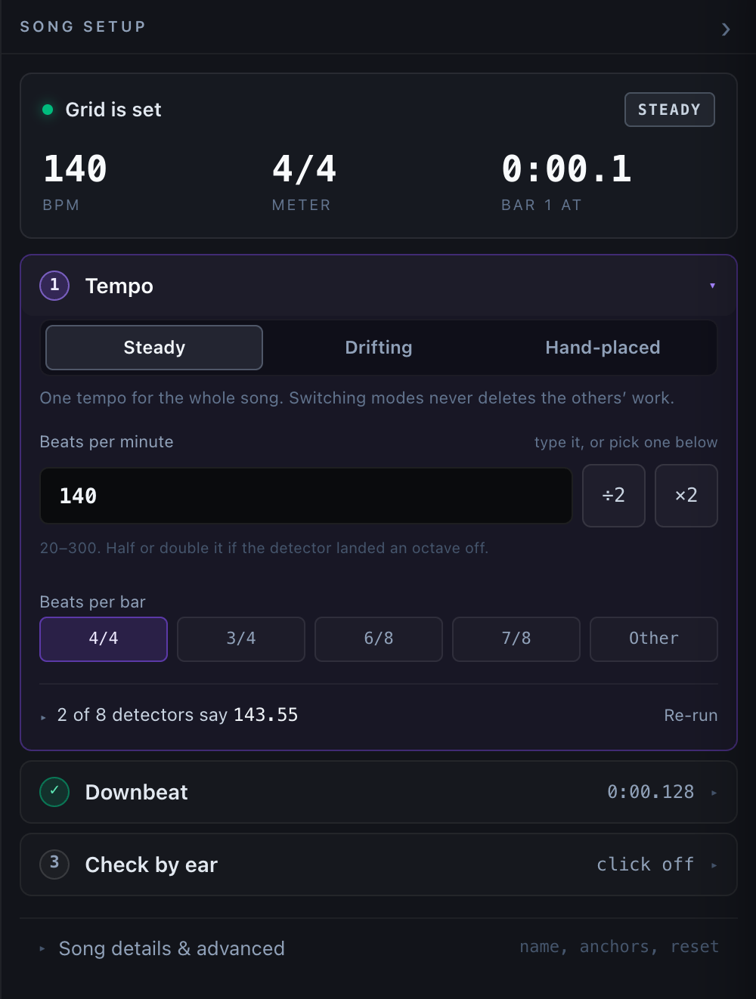

BPM (beats per minute) is the song's tempo, and it drives the whole beat grid. You can set it anywhere from **20 to 300**, in fine increments of **0.01** so you can dial in a tempo precisely. There are two ways to fill it: type a number directly, or click one of the auto-detected suggestion chips in the row below.

- It's a numeric field you **type into directly** — the panel's own arrows are for the grid offset, not the tempo. When no tempo is set yet the field is simply blank (no placeholder number to mistake for a real value).
- **`÷2` / `×2` buttons** sit just right of the field — one click halves or doubles the current BPM. Detectors frequently lock onto the wrong octave (reporting 140 for a 70-BPM song, or vice versa); these fix it in a single tap instead of retyping. A button disables itself when the result would fall outside the 20–300 range.
- Values outside the 20–300 range are rejected and not saved — this guards against a nonsensical tempo producing an absurd number of grid lines.
- A line under the field carries both the range reminder (`20–300. Half or double it if the detector landed an octave off.`) and, when the typed value is out of bounds, the red `⚠ BPM must be 20–300`. A missing BPM is called out by the status card's amber **No grid yet** instead of a pill beside the field.

### Auto-detected chip row — tempo suggestions you can click

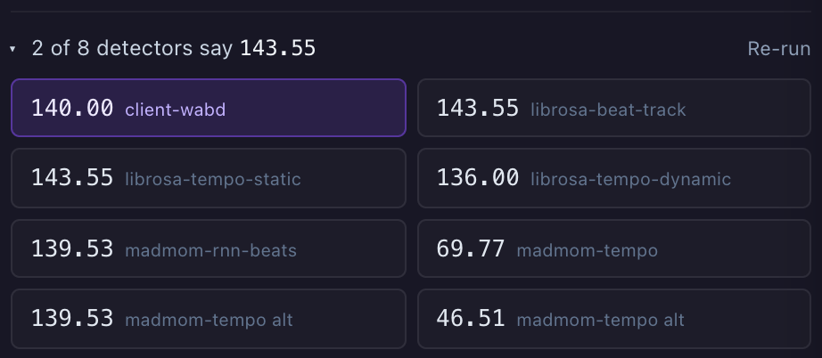

Rather than make you tap out the tempo by hand, TimeCues runs several beat-detection algorithms over the audio and shows each one's guess as a chip. The chips fold behind a disclosure at the bottom of step **① Tempo**, whose header states the consensus outright — *"6 of 8 detectors say 140.00"*. Expand it to see one chip per detector: each chip carries the **BPM value** alongside the **detector's name**, so the numbers mean something without hovering them one at a time (confidence strength, when reported, is still on hover). The chips sit two to a row, so a long detector name is trimmed with an ellipsis rather than pushing the row wide (hover for the full name). Click a chip to adopt that value as the song's BPM; the chip matching the current BPM is highlighted and inert. The **Re-run** button recomputes the suggestions from scratch, ignoring any cached result.

The first chip to appear is usually **`client-wabd`**, a detector that runs right inside your browser (powered by the `web-audio-beat-detector` library) the instant the audio finishes loading — so it shows up before the heavier server-side detectors finish. The rest come from a small Python service (`bpm_server.py`, running on port 8004):

| Detector | Family |
|----------|--------|
| `client-wabd` | in-browser `web-audio-beat-detector` (fastest; one-shot on decode) |
| `librosa-beat-track` | librosa onset → beat tracking |
| `librosa-tempo-static` | librosa global tempo estimate |
| `librosa-tempo-dynamic` | librosa frame-wise tempo (dominant mode) |
| `madmom-rnn-beats` | madmom RNN beat tracker (CPJKU fork) |
| `madmom-tempo` | madmom tempo histogram |

(*`aubio` was removed 2026-05-12.*) Filter which chips are shown in **Settings → BPM Detection**.

### Time Signature

The time signature tells the grid how many beats make up a bar, which sets where the accented downbeats fall. The four common meters — `4/4`, `3/4`, `6/8`, `7/8` — are chips you click straight away, under the label **Beats per bar**. The fifth chip, **Other**, opens a dropdown with `5/4`, `2/4` and `12/8` (and shows a custom value already on the song). It's stored as a plain text string. When BeatNet has detected a meter that differs from the current one, a *"BeatNet heard 3/4 — use it"* link appears beneath the chips.

### Grid Offset — where bar 1 starts (in seconds)

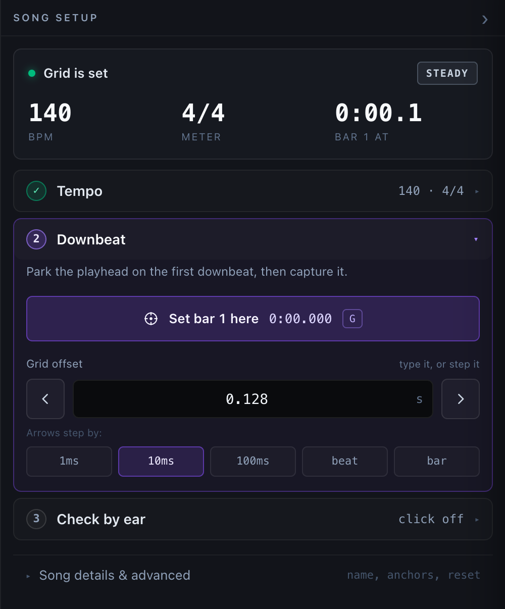

The grid offset slides the entire beat grid earlier or later in time so that downbeat 1 lands exactly on the song's first audible kick. It's measured in seconds, can't go below 0, and adjusts in steps of **0.001 s** (one millisecond) for tight alignment. It lives in step **② Downbeat**, and there are four ways to set it:
- **Type it** into the Grid offset field (an `s` suffix marks the unit). The field holds whatever you type while it has focus, so a value on its way to being finished is never snapped out from under you; it re-seeds from what was stored on blur.
- Click **Set bar 1 here (G)** — the panel's one dominant button — to capture the current playhead, which the button previews as `M:SS.sss`
- Hold **Alt** and drag the waveform to slide the grid live
- **Step it** with the ‹ › arrows flanking the field. Rather than a row of twelve fixed-size buttons, you pick the step size once from the **Arrows step by:** chips — `1ms` · `10ms` · `100ms` · `beat` · `bar` — and then step with the arrows as many times as you need. Beat and bar deltas are computed from the current BPM and time signature, and your chosen step size is remembered across sessions. Easiest to use with step ④'s click switched on, so you can hear the realignment in real time.

The typed field and the arrows are hidden in Hand-placed mode — step ② holds the pinned-beat list there instead. In Mapped mode each segment carries its own start, edited from the segment list.

For non-admin viewers (researcher / team / public) all four inputs are read-only — only admins edit the dataset's grid parameters.

### Grid Mode (Steady · Mapped · Hand-placed)

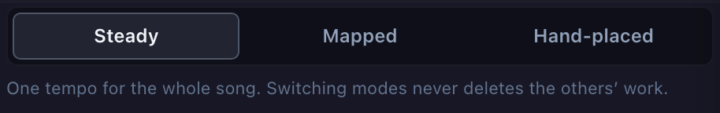

At the top of step **① Tempo**, a three-way segmented control picks how the grid is laid out across the song. The modes read in plain language; the values stored on disk are `static`, `mapped` and `manual`:

- **Steady** *(default; `static`)* — one global tempo + grid offset, the legacy behavior. Every beat is spaced by `60 / bpm` seconds.
- **Mapped** (`mapped`) — a tempo map. You place markers, and each one starts a **new bar 1** with its own tempo and its own time signature; the bar the previous grid was in the middle of is cut where the marker lands. This is the mode for a song whose *count restarts* partway through — a meter change, a splice, a free intro before the band enters. See [Grid Segments](#grid-segments--the-mapped-modes-tempo-map) for the lane, the editor and the rules.
- **Hand-placed** (`manual`) — pins individual beats on top of a base grid you pick when entering the mode. The first time you click *Hand-placed*, a modal asks **"Pick base grid"**: choose **Steady** (pinned beats ride a single-tempo grid) or **Mapped** (the song's tempo map is applied — pinned beats ride a grid that restarts bar 1 at each marker; greyed out until the song has a map). Press **Esc** or click the **✕** to abort — the mode reverts to whichever grid you were on before. You can switch the base at any time via the **Change base…** button that appears under the picker while Hand-placed is active; the modal also reopens itself if you ever flip back to Hand-placed and the song has no remembered base. Pinned beats survive a base switch — only their drift relative to the underlying grid changes.

#### Which mode does this song need?

**What the grid is.** The grid is the row of vertical lines TimeCues draws over
the song. They are meant to land exactly where you would clap along. To draw
them the app needs two things: how fast the song is (the BPM) and where the
first clap goes. From those two numbers it works out every other line by
arithmetic. Everything you mark later attaches to those lines, so if the lines
are in the wrong place, so is your work — and you won't notice, because your
marks will look neatly lined up against a grid that is itself wrong.

**The one question these three buttons ask.** That arithmetic only holds if the
song keeps one steady count from beginning to end. Some songs do, some don't:

- **Steady** — the song holds one speed. One number covers all of it.
- **Mapped** — somewhere in the middle the song stops and starts counting
  again. You mark where, and the new stretch gets its own speed and meter.
- **Hand-placed** — a few beats refuse to line up, so you put them where you
  want them by hand.

**How to choose, without reading music.** Turn the click on (step ③) and play
the song. Listen at the beginning, in the middle, and — the part people skip —
at the very end. If the click still lands with the music at the end, the mode
you're on is right. If it has wandered off, you need one of the other two.
Pick the simplest mode that passes that test; there is no prize for using a
fancier one.

**Steady — the song holds one speed.**
You give one speed and one starting point, and the app spaces every line
evenly, forever, by `60 / bpm` seconds. It's the default because it's the
cheapest to set and, when it fits, it is exactly right. It fits anything made
on a computer or played to a click: electronic music, most pop and hip-hop from
the drum-machine era on, and anything built out of a loop. The machine that
made those songs never sped up or slowed down, so one number really does
describe the whole track. Start here for every song and only move on if the
click drifts off.

**Mapped — the song starts counting again.**
Here the count itself breaks and restarts: the song changes from 4/4 to 6/8,
drops into half-time or double-time, opens with a free intro before the band
comes in, or is an edit, splice or mashup of two pieces. What's wrong is
**where bar 1 sits**, and often how many beats a bar holds. So you place
markers, and each marker says "a brand-new grid starts here" with its own speed
and its own time signature. The bar the old grid was in the middle of gets cut
where the marker lands. **Symptom:** the individual beats line up fine, but
after a certain point the strong beat — the one you'd count "1" on — is in the
wrong place, or the bars stop holding the right number of beats.

**Hand-placed — you put the beats where you want them.**
Some audio gives the detectors nothing to hold on to: free or rubato playing,
heavy swing or syncopation, a section that slows down deliberately at the end,
a passage with no drums, a solo instrument, or spoken word and field
recordings, where there is no steady pulse to find in the first place. It's
also the mode for the last stubborn stretch of a song that is otherwise fine.
You pick one of the other two modes as the **base grid** and then pin
individual beats wherever that grid disagrees with your ears; everything you
don't pin keeps following the base. It's the most expensive mode, because every
pinned beat is a decision you make by hand, so reach for it after the other two
have been tried.

| What you hear | Mode |
| --- | --- |
| Click stays with the music from first bar to last | **Steady** |
| Beats are fine, but the "1" or the bar length is wrong after some point | **Mapped** |
| No steady pulse to follow, or a few beats that refuse to line up | **Hand-placed** |

The modes stack rather than compete: **Hand-placed** sits on top of whichever
of the other two you give it as a base, so a song with one loose bridge is
normally *Steady* with a few pinned beats, not a song hand-placed from scratch.

**A live take that speeds up and slows down.** TimeCues has no mode that
follows a drummer's natural drift automatically — a *Drifting* mode existed and
was removed, because its anchors were derived from a tempo detector, which made
any annotation snapped to them partly a detector's opinion rather than ground
truth. For a live take, set the BPM that fits the bulk of the song, then either
**Mapped** (a marker where the feel changes) or **Hand-placed** (pins on the
beats that wandered) is the honest tool.

> A song last saved by an older build may still be carrying the removed mode's
> leftovers in `data/song-info/<slug>.json` — a `tempoAnchors` list, or a
> `gridMode` of `dynamic`. Nothing reads either any more, and opening such a
> song shows the Steady grid it was already drawing; the stale fields are
> written out of the file the next time you save it. To sweep a whole corpus at
> once without opening every song, run
> `python3 tools/strip_drifting_grid_mode.py --data data` (add `--apply` to
> write; without it you get a dry run listing what would change).

**Status badge** — right of the **Snap** big icon in the VizControlBar, a small pill always tells you the active mode and the song's tempo / meter:

| Mode | Badge (two lines) | Color |
|------|-------------------|-------|
| Steady | `Steady GRID` / `N BPM · 4/4` | slate |
| Mapped | `Mapped GRID` / `(N grids) · 4/4` | violet |
| Hand-placed | `Hand-placed GRID` / `N BPM · N pinned · 4/4` | emerald |

The badge appears in every workspace (Dataset Prep, Annotate, and Algorithm Inspect) — outside Dataset Prep it's read-only, so you can still see the active mode + BPM + time signature at a glance without flipping back to switch them.

**Beats are always rendered inside each bar of a split song.** When a tempo map is active (Mapped, or Hand-placed on a Mapped base), the beat-grid unit dropdown's bar-level choices (Bar, 2bar, 4bar, …) are automatically augmented to also draw the beats inside each bar — otherwise a 100-BPM segment next to a 130-BPM segment would be visually indistinguishable. The finer-than-bar choices (8th, 16th, 32nd, etc.) already show beats and are left as-is. The augmentation applies across every visualization row (waveform, spectrogram, MFCC, sparklines, section bars), so the per-segment tempo reads off consistently everywhere.

### Grid Segments — the Mapped mode's tempo map


Some songs don't keep one grid from start to finish: the meter changes, a
breakdown restarts the count, a tape splice drops half a bar. A **grid
segment** handles that. Wherever you drop one, that instant becomes **bar 1,
beat 1** of a new grid with its own tempo and its own time signature — and
whatever the previous grid was halfway through simply stops.

Grid segments are **not boundaries**. They carry no type, no label and no
vocabulary; they are the ruler itself, not an annotation on it. They live in
Dataset Prep only, and every other workspace reads the grid they produce
without being able to reshape it.

**Segments are the Mapped mode.** Picking **Mapped** in step ① is what turns
them on, and the list of markers appears directly under the mode picker — the
same place each mode keeps its own controls. In any other mode the map stays
on disk, inert: switching to Steady to hear the song against one tempo does not
cost you the map, and switching back brings it straight back. The one exception
is **Hand-placed on a Mapped base**, where pinned beats ride the mapped grid.

Other DAWs call this a **tempo map**: Reaper's *tempo/time signature markers*,
Logic's *Signature track*, Pro Tools' *Bar|Beat markers*, Ableton's *Set 1.1.1
Here*. In notation, the moment itself is a **double barline** — which is exactly
how the marker is drawn.

**The segment lane.** A strip under the waveform in Dataset Prep shows one
block per segment, laid end to end, each stamped with its tempo and meter
(`92.00 · 6/8` — the BPM first, since the tempo is what usually differs
between segments, and it is the part that survives when a short block can
only fit one value). The head of each segment is drawn as a **double bar line** —
the notation a score uses for a meter change. The lane rides the same zoom and
scroll as the beat grid, so a block always sits over the audio it governs. It
appears as soon as you pick **Mapped**, before there is any split: a
one-segment map still has an opening head worth dragging.

**Where the list lives.** Directly under the mode picker in step **① Tempo**,
appearing when you select **Mapped** — the same place each mode keeps its
Sensitivity slider. The map is one of the answers to "what is this song's
tempo", so it lives with that question rather than in a step of its own.

**Splitting.** In Mapped mode, put the playhead where the new grid should
start and click **＋ Split the grid at the playhead**, or
double-click the lane at that spot. The new segment inherits the tempo and
meter of the segment it splits, so nothing visibly jumps until you change
something. A split closer than one beat to an existing head is refused with an
inline message rather than nudged into place.

**Moving a head.** Drag the double bar line — including the opening one; see
*The opening segment* below for what that one does differently. The whole
downstream grid follows,
and a live readout — parked just below the lane, clear of the line you're
dragging — says where you are, whether this drag is snapping (**snap** /
**free**), and how much of the outgoing bar survives. The dragged position is
mirrored onto the signal rows below as a bright white cursor for the length of
the drag, so you can line a head up against the transient you're aiming at on
the 3-Band or a sparkline rather than by eye on the lane alone.
Whether the head snaps is up to the **SNAP** toggle in the control bar (and
**Grid Lock**, which implies it), exactly as for every other marker: with snap
on, the head lands on the nearest beat of the **outgoing** grid — the one the
music is running on where you're landing; with snap off it lands exactly where
you drop it, which is how you catch a section that starts a half-beat early.
**Holding Shift inverts whichever setting is current**, so the other behaviour
is always one key away.

**Editing a segment.** Click a block (or a row in the sidebar list) to open its
editor: **Starts at**, **Tempo**, **Meter**, **♪ Detect from this segment**, and
**⇤ Merge with previous**. The Starts-at field takes either seconds (`10.07`) or
clock time (`0:10.070`).

**In Mapped, the segment list is the only tempo editor.** The song-level *Beats
per minute* field, the *Beats per bar* chips and the whole-song detector row all
disappear from step ① while Mapped is active — in a tempo map those numbers
belong to the segments, and a song-level BPM sitting under the list would be a
second control for the opening segment's tempo. The status card at the top of
the panel keeps showing a BPM and a meter, but relabels them **BPM · seg 1** and
**METER · seg 1** once the map has more than one grid, and its mode chip reads
**MAPPED · N GRIDS**. Every segment, including row 1, is edited by clicking its
row.

**Editing a segment's tempo.** The tempo field applies as you type it: every
in-range value goes straight onto the grid, and the beat lines behind the
editor re-space while you type, so a tempo is judged against the waveform
instead of against its own digits. ↑ / ↓ nudge it by 0.01 BPM with the same
live effect. Half-typed values are skipped — typing `144` never dips the grid
to the 20 BPM floor on its way past `1` and `14`. **Esc** puts the tempo back
to what it was when you started typing, and the whole run of keystrokes is a
**single Ctrl+Z**, not one undo step per digit.

**Detecting one segment's tempo.** *♪ Detect from this segment* runs the tempo
detectors over **that segment's audio only** — from its start to the next
segment's start (or the end of the song). This is the detection that means
something in a tempo map: a song that runs 100 BPM and then 150 comes back from
a whole-song detector as one blended ≈150, which is wrong for the first half and
only accidentally right for the second.


- The result appears as one row you can apply: the tempo the most detectors
  agreed on, the meter beside it when BeatNet is available, and a note saying
  whether they **all agree** or only **2 of 3** did. Clicking it sets the
  segment's tempo (and meter).
- Detectors that heard something else are one click away under *N others heard
  it differently*; applying one of those sets only the tempo.
- The result is discarded as soon as you move the segment's head, because it was
  an answer about audio the segment no longer covers.
- A segment shorter than **2 seconds** can't be read — the button greys out and
  says so. Below roughly that, a tempo estimate is noise.
- The meter comes from BeatNet, which is an **experimental** model behind the
  `experimental-models` compose profile. When it isn't running you get the tempo
  and no meter, which is the normal case on the public demo.
- Nothing is cached: a ranged detection is computed fresh each time and never
  touches the whole-song detector cache in either direction.
- Like the whole-song **Detect the tempo** button in step ①, it is **admin-only** —
  analysis runs are gated on team membership, so the button isn't offered to a
  demo visitor rather than being offered and refused.
- If the tempo server is running a build from before this feature it accepts the
  range, ignores it, and answers about the whole song. That answer looks
  perfectly plausible, so the app checks that the reply is about the span it
  asked for and refuses it otherwise, naming the fix: restart
  `python tools/python/bpm_server.py`. An out-of-date BeatNet costs you only the
  meter.

**The cut bar.** The bar the previous segment was in the middle of is cut
exactly where the split lands, and the app never rounds the split to complete
it — that would silently move a downbeat you placed by hand. The cut bar is
drawn hatched over the waveform, labelled with what it kept (`3.5 of 4 beats`),
so it reads as deliberate rather than as a rendering bug. A head that lands on
a bar line cuts nothing and is not hatched at all — and because a head is
stored to the millisecond, one that lands within a few milliseconds of the line
counts as on it. When a cut really is a hair short of a whole bar the label
spends another decimal on it (`3.96 of 4 beats`) rather than rounding to a full
bar it didn't keep.

The **hatch is always there**; the **label comes and goes with the segment
editor**. The label sits on top of the audio, so it is shown only while that
segment's editor is open — open the segment (from the lane or the list) and the
count appears on its cut bar; close the editor and the label goes, leaving the
hatch. Nothing is hidden by it: hovering the hatch always says what the bar
kept, and the footer of the segment editor says it in words. There is no
setting to dismiss and no state to restore.

**The opening segment.** Row 1 of the list is the song's own grid: its start
*is* the **Bar 1 at** value from step ②, and its tempo and meter *are* the
song's BPM and time signature, kept in sync both ways. It always exists and
cannot be deleted.

Its head is draggable like any other — a song whose first downbeat isn't at
0:00 is the normal case, not an edge case — but it moves the **downbeat**
rather than a split, so it behaves differently in three ways:

- **It cuts nothing.** There is no segment before it; the whole grid slides
  with it, and the readout says so.
- **It doesn't snap.** Snapping lands a head on a beat of the *outgoing* grid,
  and the opening head has nothing before it to measure against — the readout
  reads **free** whatever the SNAP toggle says.
- **It folds into the first bar.** `Bar 1 at` is a *phase*, not a position: an
  offset larger than one bar is folded back and the bar numbers shift to
  compensate, which leaves every grid line exactly where it was. So dragging
  the opening head across a bar line lands it inside the first bar, and the
  readout shows where it will actually land — `0:00.300 · same grid,
  renumbered` — rather than a downbeat the commit is about to move. At the
  zoom where you'd really be lining up a downbeat, the fold never comes up.

It also can't be dragged past segment 2, which would delete that segment on
the way through: an offset at or beyond a split drops it. The drag stops at
the barrier and says why.

**Bar numbering** keeps counting across a split by default, and the cut bar
still spends a number — so a song that splits after a cut bar 5 opens the next
segment on bar 6, and "bar 42" stays a stable reference in exports and review
notes.

**What a split does and doesn't move.** It rewrites the ruler, not the data:
every cue, span and loop keeps the absolute time it was placed at, and only the
bar.beat label that time resolves to changes. Because that renumbers bars
downstream, adding or moving a segment counts as a grid change and raises the
usual **Grid Lock** prompt on songs that already carry annotations. Hand-placed
pinned beats are carried across a split — a pin whose beat still exists stays
on it, and one whose beat no longer exists is dropped rather than silently
moved onto a different beat.

**Merging two segments.** Two segments are always neighbours — they tile the
track with no gaps — so combining them just means dropping the split between
them. Right-click a head on the lane, use the **⇤** at the end of a row in the
sidebar list, or click **⇤ Merge with previous** in the segment editor: the
head goes, and the segment on its left grows to swallow the span, counting on
at **its own** tempo and meter. That is the only thing the merge decides, and
it is why the button names the surviving tempo in its tooltip — merge segment 3
into segment 2 and segment 3's BPM is what you give up. Nothing else moves:
every cue, span and loop keeps its absolute time, and the bars downstream
simply renumber. **⌘Z** brings the split back (see *Undoing a grid edit*
below).

Segment 1 has nothing before it, so it can never be merged away — its ⇤ is
disabled, and the editor says why.

**Splits and the tempo modes.** A segment is its own answer to "where does the
grid come from", and it wins over the song-level BPM. The moment a song has
more than one segment, every grid line is drawn from the segment table, each
segment using its own BPM and meter. **Hand-placed** pinned beats still apply
on top, so splits compose with Hand-placed.

Segments are stored as `gridSegments` in `data/song-info/<slug>.json` and only
the splits after the opening one are written, so a song you never split keeps
exactly the file it had before.

### Undoing a grid edit

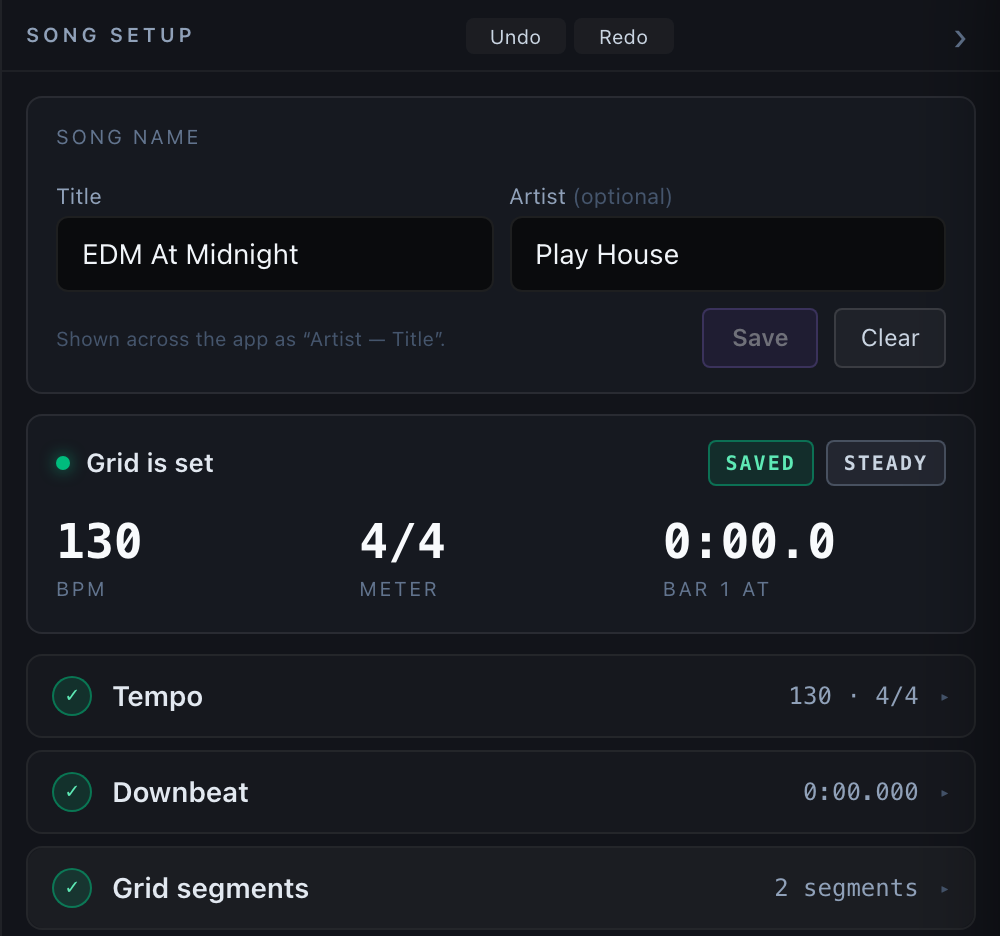

Every edit the Song setup sidebar can make is undoable, from one history:
**BPM**, **meter**, **Bar 1 at** (including the *Align grid to playhead*
button and an Alt-drag of the downbeat on the waveform), the **tempo mode**
switch, **hand-placed pinned beats**, the **display name**, the grid **reset**, and every **grid segment**
split, move, edit and delete.

**Undo** and **Redo** sit in the **Song setup** sidebar header, next to the
collapse chevron, and are disabled when there is nothing to walk back. The
keyboard shortcuts are the usual **⌘Z / ⌃Z** and **⇧⌘Z / ⇧⌃Z**.

- **What counts as one step.** A typed value collapses into a single step —
  typing `1`, `5`, `5` into the BPM box is one undo, not three — and so does a
  whole drag of a segment head, a pinned beat or the downbeat. A
  split, a delete, a meter change and a mode switch each get their own step.
- **The undo is saved, not just shown.** Whatever the grid comes back to is
  written to `data/song-info/<slug>.json` the same way an edit is, so ⌘Z
  survives a reload.
- **It's per song, and it's the grid's own stack.** Switching songs clears the
  history — the previous song's edits mean nothing on this one. In every other
  workspace ⌘Z walks the *annotation* history instead (see the shortcut table),
  so you always undo where you edited; neither stack can reach the other.
- **The history is in memory only** (up to 50 steps). Reloading the page keeps
  your grid — that's on disk — but not the ability to walk it back.
- Turning **Grid Lock** on or off is a preference, not a grid edit, and never
  takes an undo step.

### Manual mode is a two-layer system

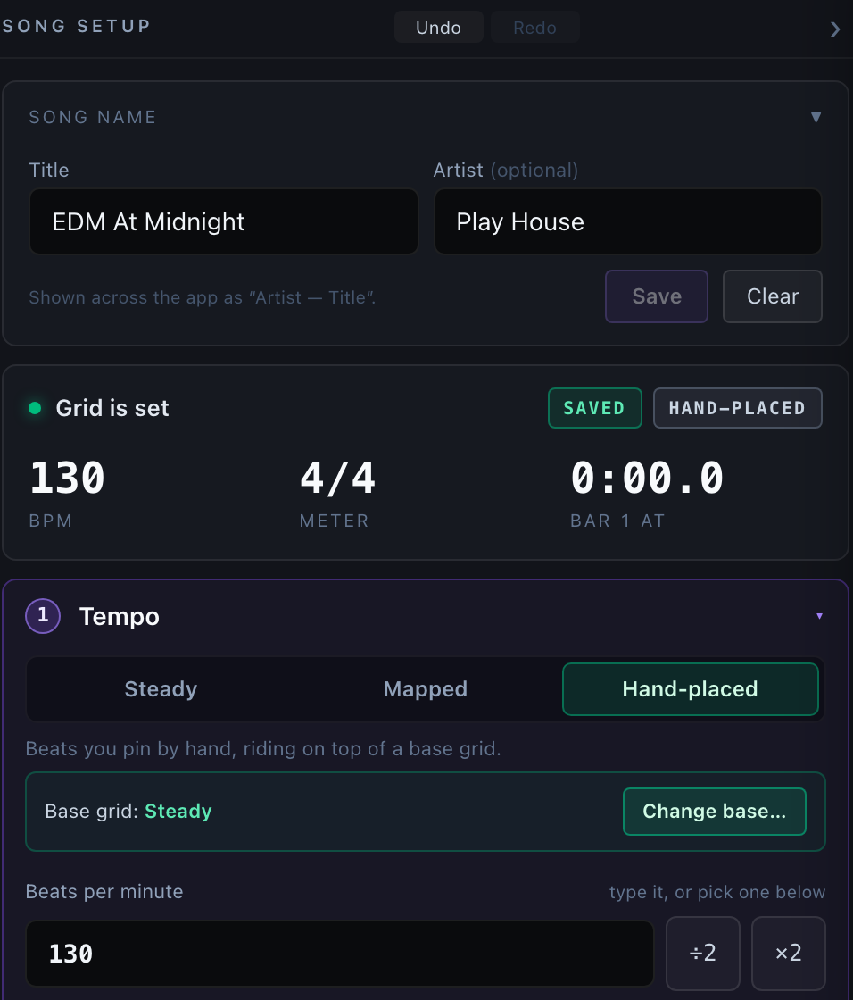

Hand-placed mode rides on top of a base grid you pick at first entry (**Steady** or **Mapped** — see the Hand-placed bullet above). Pinned beats are the *micro* layer; the base grid you chose is the *macro* layer. Fix a problem at the scale it actually has: a whole section that is off belongs to the base grid (a different BPM in Steady, or a split in Mapped), and only the beats that are still wrong afterwards are worth pinning.

| Surface | Used for | Visual | Affects |
|---|---|---|---|
| **Per-beat hit zones** (overlaid directly on the waveform) | Micro fixes — a single late kick, a syncopated hit, a transient detection glitch on one specific beat. | Faint emerald beat lines drawn through the waveform, with ~9 px grabbable hit zones at each beat. Pinned beats turn solid amber with a small dot at the top. Click-to-seek still works *between* beats — only the hit zones intercept the gesture; Alt-drag-to-slide-grid is unaffected. | Only the dragged beat. Neighbours stay put. |

**Per-beat hit zones (micro):**

Every macro beat is drawn as a thin emerald line through the waveform with a ~9 px grabbable hit zone centered on it. Each line sits where the base grid puts it — the global BPM in Steady, or the owning segment's tempo in Mapped. Click *between* beats and you'll still seek normally — the hit zones are the only spots that intercept the drag/right-click gesture.

1. **Drag a beat** horizontally to pin it to a new time. An amber preview line follows the cursor. Release to commit.
2. The dragged beat is now **pinned** — it shows as a solid amber line with a small dot above. The neighbouring beats stay exactly where the macro grid put them.
3. **Right-click a pinned (amber) line** to clear the pin and return that beat to its macro-grid position.
4. Sub-5-millisecond drags are ignored, so a stationary click won't accidentally pin a beat.
5. Sub-beat lines (8ths, 16ths) are *not* pinnable — only integer beats are. If you have a subdivision visible, pinning beat 14 will not pin the 8th-note between beats 13 and 14.

Pins survive macro edits. The pin key is the beat's cumulative integer index from the song origin, not its timestamp, so changing the global BPM doesn't orphan your micro fixes. The one thing that re-indexes existing pins is *adding a split before them*, which changes how many beats precede them — so build the tempo map first, then pin.

The pinned-beat count appears in amber in the line under the mode picker — e.g. `Beats you pin by hand, riding on top of a base grid. 7 pinned beats.` — and also rides in the status card's mode chip.

> ⚠ **Reset the grid** — the red button at the foot of step **① Tempo** purges every pinned beat and reverts to Steady. Cannot be undone. The card says what it will actually take before you press it, per mode — *"Drops 2 pinned beats, back to Steady."*, or on a Mapped song *"Back to Steady. The 2-grid map is parked, not deleted."* (switching away from Mapped is what makes a map inactive; the splits stay on disk). The confirm prompt repeats it: *"Discard 2 pinned beats?"*, or *"Switch back to Steady?"* when there is nothing to discard.

---

## Metronome Panel (Dataset Prep)


<!-- tc-videos:metronome-panel-dataset-prep -->

**▶ Metronome ON/OFF toggle**

<div style="position:relative;padding-bottom:56.25%;height:0;overflow:hidden;max-width:720px;margin:1rem 0;border-radius:8px;"><iframe style="position:absolute;top:0;left:0;width:100%;height:100%;" src="https://www.youtube.com/embed/iEcjEro0cW4" title="Metronome ON/OFF toggle" frameborder="0" loading="lazy" allow="accelerometer; autoplay; clipboard-write; encrypted-media; gyroscope; picture-in-picture" allowfullscreen></iframe></div>

**▶ Tap tempo finder**

<div style="position:relative;padding-bottom:56.25%;height:0;overflow:hidden;max-width:720px;margin:1rem 0;border-radius:8px;"><iframe style="position:absolute;top:0;left:0;width:100%;height:100%;" src="https://www.youtube.com/embed/lqcUsZ_H_SM" title="Tap tempo finder" frameborder="0" loading="lazy" allow="accelerometer; autoplay; clipboard-write; encrypted-media; gyroscope; picture-in-picture" allowfullscreen></iframe></div>

**▶ Metronome volume slider**

<div style="position:relative;padding-bottom:56.25%;height:0;overflow:hidden;max-width:720px;margin:1rem 0;border-radius:8px;"><iframe style="position:absolute;top:0;left:0;width:100%;height:100%;" src="https://www.youtube.com/embed/7_KoYsE6OdI" title="Metronome volume slider" frameborder="0" loading="lazy" allow="accelerometer; autoplay; clipboard-write; encrypted-media; gyroscope; picture-in-picture" allowfullscreen></iframe></div>

**▶ Pitch preset buttons**

<div style="position:relative;padding-bottom:56.25%;height:0;overflow:hidden;max-width:720px;margin:1rem 0;border-radius:8px;"><iframe style="position:absolute;top:0;left:0;width:100%;height:100%;" src="https://www.youtube.com/embed/OUcfRfqjOAs" title="Pitch preset buttons" frameborder="0" loading="lazy" allow="accelerometer; autoplay; clipboard-write; encrypted-media; gyroscope; picture-in-picture" allowfullscreen></iframe></div>

<!-- /tc-videos:metronome-panel-dataset-prep -->
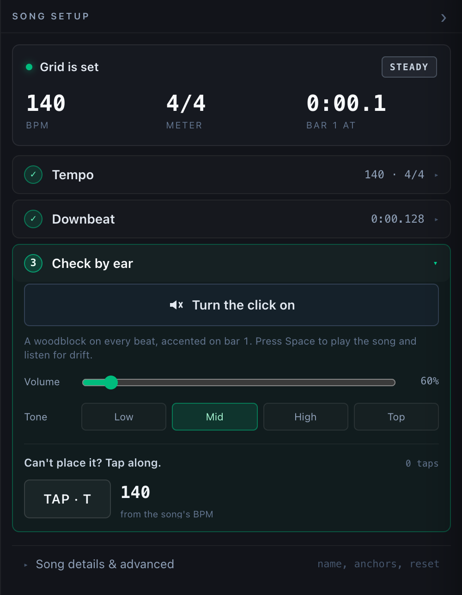

The Metronome plays a click on every beat as the song runs, so you can *hear* whether the beat grid lines up with the music instead of judging it by eye. It's the tool you reach for while aligning the grid: if the click drifts away from the kick drum, the grid is off and needs nudging.

It is step **③ Check by ear** of the **Song setup** sidebar in the Dataprep (`/prep`) workspace — not a separate panel, because verifying the grid is the job it exists for. Open the step to reveal the controls; the collapsed header tells you whether the click is on. Each control shows a tooltip on hover.

The step holds **two separate features**:

- **The click track** — the toggle at the top, plus **Volume** and **Tone**. It plays a woodblock on every beat at the song's tempo, accented on bar 1. It clicks the **active grid**, whatever shape that grid has: a **Mapped** song clicks each segment's own tempo and meter and accents that segment's own bar 1, so the click re-phases at every split exactly where the grid lines do. It also follows the player's **Speed** setting — at 0.5× you hear the same beats, half as fast, not twice as many.
- **Tap along** — a tap-along BPM finder at the bottom. It sets the *click's own* tempo and never changes the song's grid on its own, so it's available to everyone, including non-admin viewers. When your taps land on a tempo that differs from the song's, a **Use *N* as the song BPM** button appears: that — and only that — writes it into the grid, so the two tempo numbers can never silently disagree. **Discard** throws the tapped value away and the click falls back to the song's BPM.

Because the metronome and the grid controls are steps of one panel, you can leave the click running while you step the offset in step ② — folding one step open does not close the sound.

### How to use it

1. Click **Turn the click on** — it flips to **Click is on**. This is just a flag; it does **not** start the song.
2. Press **Spacebar** (or the player's ▶ button) to play. You'll hear a woodblock click on every beat, with a louder accent on beat 1 of each bar.
3. If the click drifts from the kick, go back to step **② Downbeat** and step the offset until they line up — or, if the drift grows across the song rather than staying constant, the tempo itself is wrong: fix the BPM in step ①, or split the grid where the feel changes in **Mapped**.
4. The **BPM** readout beside the Tap button shows the click's current tempo and where it comes from — *from the song's BPM*, or *from your taps* once you've tapped.

### Pitch preset

- Four chips on the **Tone** row: `Low` · `Mid` · `High` · `Top`. Each maps the woodblock's bandpass to a different frequency pair (regular beat / downbeat):
  - **Low** — 600 Hz / 900 Hz. Best when the song is bright and high-frequency-heavy.
  - **Mid** (default) — 1.4 kHz / 2.2 kHz.
  - **High** — 2.8 kHz / 4.2 kHz. Cuts through most kicks and bass; may clash with vocals.
  - **Top** — 5 kHz / 7 kHz. Sits above almost all musical content — use when the click is being masked by a dense mix.
- Persisted per-user in `localStorage` under `tc:metronome:pitch`.

### Volume slider — how loud the click is

This controls only the click's loudness, separately from the song's own playback volume, so you can make the metronome louder than a loud track. It runs from **0% (silent) to 800%**, starts at **60%**, and your setting is remembered in your browser under `tc:metronome:volume`. **100% is normal full volume, not the maximum.** The click is a narrow filtered burst, so even at 100% most of its headroom is unspent — the range above it is where you get a click that's genuinely audible over a loud song, and it stays clean the whole way (a limiter on the output catches the peaks of the `High` and `Top` presets near the very top of the slider, which are the only settings that would otherwise break up). The readout turns amber above 100% and red above 400% so you can see how hard you're pushing it. The slider sits on the **Volume** row, directly under the on/off button.

> ℹ️ The slider's top used to be 200%, so a setting saved before 2026-09-01 now sits a quarter of the way along the track. It sounds exactly as it did — there's simply four times more range to its right.

### Metronome toggle

- **Click is on / Turn the click on** — passive flag. The click plays at the tempo shown in the readout beside the Tap button (your tapped value, or the song's BPM + grid offset when you haven't tapped one), so any edit there is instantly audible while the song plays. Hardcoded woodblock sound, one click per beat, downbeat (beat 1 of each bar) accented.

### Tap along

A Rekordbox-style tap-along BPM finder, at the bottom of step ④ under the heading *"Can't place it? Tap along."* Use this when you can hear the beat but the auto-detected BPM is wrong or missing.

> ℹ️ Tapping on its own sets the **click's tempo only** — it does not write back to the song's grid. It's a local, non-destructive control, so it works for every viewer (no admin permission needed). Adopting it into the grid is the separate, explicit button described below, and that one *is* admin-only.

1. Press play (or just listen along in your head).
2. Click **TAP · T** on every beat — or press **T**. The readout beside it shows the live BPM and, once you've tapped, what the song's own BPM is for comparison; the tap count sits in the header.
3. From the **second tap onward**, every accepted tap updates the click's tempo — there is no separate Apply step.
4. **Use *N* as the song BPM** writes the tapped value into the grid. It appears only once the taps have settled on a value at least 0.05 BPM away from what the song already has, and it's hidden for read-only viewers.
5. **Discard** resets the tapped tempo and empties the tap buffer; the click falls back to following the song's BPM.

How the estimate is computed:

- BPM = `round(60 000 / avg(inter-tap interval in ms))` over the last **up to 5 taps**, so newer taps refine the reading and a single mistap is rolled out of the window within a bar or two.
- Taps closer together than **240 ms** (≈ >250 BPM) are ignored as accidental double-clicks — the BPM readout doesn't jump.
- No idle timeout: the buffer is preserved across breaks. Instead, if your next tap is **more than 30% off the running average interval**, the reducer treats it as the first tap of a new tempo and the buffer restarts on that tap (so switching tracks doesn't need an explicit reset).
- BPM values are constrained to the **60–240** DJ range. A tap that would push the rounded value outside that band is recorded into the rolling window but does not overwrite the metronome tempo, so a single mis-counted beat won't throw the click off.

---

## Check against the models

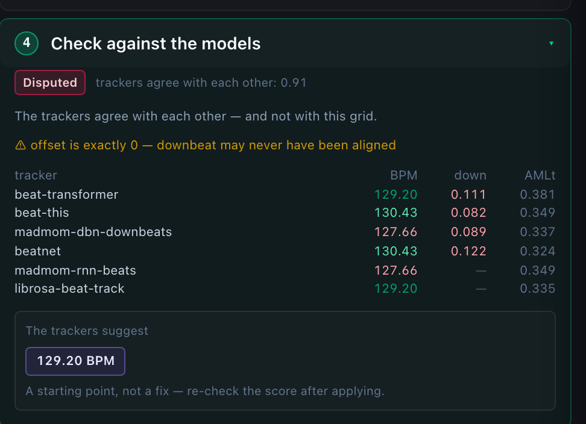

Step **④ Check against the models** of the **Song setup** sidebar is step ③'s
question — *is this grid right?* — put to a different judge. Every beat
tracker that has run on the song is scored against the grid currently on
screen, using the same `mir_eval` metrics a beat-tracking paper reports.

It scores the grid you are **looking at**, not the one last saved, so it
updates as you edit: nudge the downbeat and the numbers move. Scoring uses
each tracker's cached output, so it costs milliseconds and never starts a
model run.

The step always explains itself rather than going blank. If no tracker has
run on the song yet, or the grid is a shape it can't expand, or the scoring
server isn't running, it says which — and for the last case it prints the
command that starts it (`python tools/python/mir_eval_server.py`, or just
`./run.sh`).

### The verdict

The badge is the part to read first. It exists because a single F-measure is
genuinely misleading on its own:

- **Confirmed** (green) — the trackers agree with your grid. Nothing to do.
- **Disputed** (red) — the trackers agree with *each other* and not with your
  grid. They are independent models with different architectures and training
  sets, so they do not fail the same way by accident; when they agree and you
  don't, the grid is the outlier. Worth re-curating.
- **Half / double time** (amber) — a low beat score but a high **AMLt**. Your
  grid is on the right pulse, counted at a different metrical level. This is
  a judgment call, **not an error** — a song curated at 75 BPM that the
  trackers read as 150 is not wrong.
- **No verdict** — nothing matches well and the trackers disagree with each
  other too, so there is nothing to conclude.

Beside the badge, *trackers agree with each other* is that independent
agreement as a number — it is what separates "your grid is wrong" from
"this song is hard for everyone".

### The score table

One row per tracker, best-performing first:

| column | what it is |
|---|---|
| **BPM** | The tempo that tracker actually heard. Compare it to the BPM in step ①. It is coloured by how it relates to your grid: **green** within half a BPM (or a shade off, which is a detector's frame-grid artifact rather than a disagreement), **amber** for half or double time with a `÷2` / `×2` hint beside it, **red** for a genuine mismatch. |
| **down** | F-measure against your grid's **downbeats** — the number that decides whether bar 1 is in the right place, and the one that actually varies. A dash means that detector reports no downbeats (librosa, madmom-rnn-beats), not that it scored zero. Green above 0.9, amber above 0.7, red below. |
| **AMLt** | Continuity allowing half/double time and off-beat. High AMLt next to a low **down** score is the signature of an octave disagreement rather than a mistake. |

**Why BPM and not a beat score.** The panel used to show an F-measure against
your grid's beats. It was the wrong number to lead with: an F-measure of 0.02
says *"this tracker disagrees with your grid"* without saying **how**, and a
tracker can have the tempo exactly right and still score near zero because the
phase is off by half a beat. The tempo separates those two cases, and it is
the one a curator can act on. The beat F-measure and CMLt are still there — hover
the BPM cell.

That distinction is the common case, not a corner. A song showing every
tracker at 127–130 against a grid of 130, with every **down** score in the
red, is not six failing trackers: the tempo is right and the *downbeat* is
wrong, which is one drag in step ② rather than a new tempo.

**Which trackers appear.** Only the ones that have actually run on that song,
so the table is often shorter than this list:

| tracker | what it is |
|---|---|
| `beat-transformer` | Reads the song's **Demucs stems** rather than the mix, so the drum track drives its downbeat decision. The only one with a prerequisite — **it is missing entirely for a song with no stems**, which is not a failure, just nothing to report. |
| `beat-this` | Transformer tracker on the full mix. Best downbeat scores on this corpus so far. |
| `madmom-dbn-downbeats` | Classic RNN + dynamic-Bayesian-network tracker. Can only represent 3/4 and 4/4, so it has nothing useful to say about a 5/4 or 7/8 song. |
| `beatnet` | Real-time/streaming tracker. Accurate on beats, noticeably weaker on downbeats — it pays for being causal. |
| `madmom-rnn-beats`, `librosa-beat-track` | Beats only, hence the dash in the **down** column. |

No single tracker is the authority, and the panel deliberately doesn't crown
one. Their **disagreement** is the signal: where they all land together, the
answer is close to certain, and where they split, that's the spot to open in
step ③ and listen to.

### The suggestion

When the trackers' consensus differs from your grid, chips appear offering
their median tempo and their first downbeat. Clicking one applies it like any
other grid edit — undoable, autosaved.

They are labelled *a starting point, not a fix* deliberately. The suggestion
is a median across detectors plus one downbeat; on a song whose real problem
is tempo drift rather than a misplaced bar 1, applying it barely moves the
score. Re-check after applying.

> A caveat line appears above the table when something weakens the result —
> most often **offset is exactly 0**, the shape of a tempo that was typed in
> and a downbeat that was never aligned. The beats may be plausible while the
> phase is not, and phase is most of what this step measures.

### Scoring the whole corpus

The same scoring runs across every song from the command line:

```bash
python tools/python/beat_eval.py                 # every song
python tools/python/beat_eval.py --slug <slug>   # one song
python tools/python/beat_eval.py --json out.json
```

The CLI adds what a per-song panel can't show: a ranking of the trackers
averaged over the corpus, and a list of which grids are disputed — the
re-curation worklist. Songs whose grid shape can't be expanded into beats
are skipped with a reason rather than scored against an approximation —
Hand-placed grids with per-beat overrides, and any song still carrying the
per-song tempo curve of the retired Drifting mode.

## The Shared Visualization Canvas


<!-- tc-videos:the-shared-visualization-canvas -->

**▶ Player transport controls**

<div style="position:relative;padding-bottom:56.25%;height:0;overflow:hidden;max-width:720px;margin:1rem 0;border-radius:8px;"><iframe style="position:absolute;top:0;left:0;width:100%;height:100%;" src="https://www.youtube.com/embed/_RAS7JG3OgA" title="Player transport controls" frameborder="0" loading="lazy" allow="accelerometer; autoplay; clipboard-write; encrypted-media; gyroscope; picture-in-picture" allowfullscreen></iframe></div>

**▶ Group lanes into a band**

<div style="position:relative;padding-bottom:56.25%;height:0;overflow:hidden;max-width:720px;margin:1rem 0;border-radius:8px;"><iframe style="position:absolute;top:0;left:0;width:100%;height:100%;" src="https://www.youtube.com/embed/zTcRxRx8ROg" title="Group lanes into a band" frameborder="0" loading="lazy" allow="accelerometer; autoplay; clipboard-write; encrypted-media; gyroscope; picture-in-picture" allowfullscreen></iframe></div>

<!-- /tc-videos:the-shared-visualization-canvas -->
The visualization canvas is the big stack of synchronized timelines in the centre of the screen — the waveform, the audio-analysis rows beneath it, and any annotation or algorithm rows you've turned on. It's the heart of the app, and the *same* canvas is reused in every workspace (only the surrounding controls change), so what you learn to read here applies everywhere. Each row is a different view of the same moment in time, and they all scroll and zoom together as one.

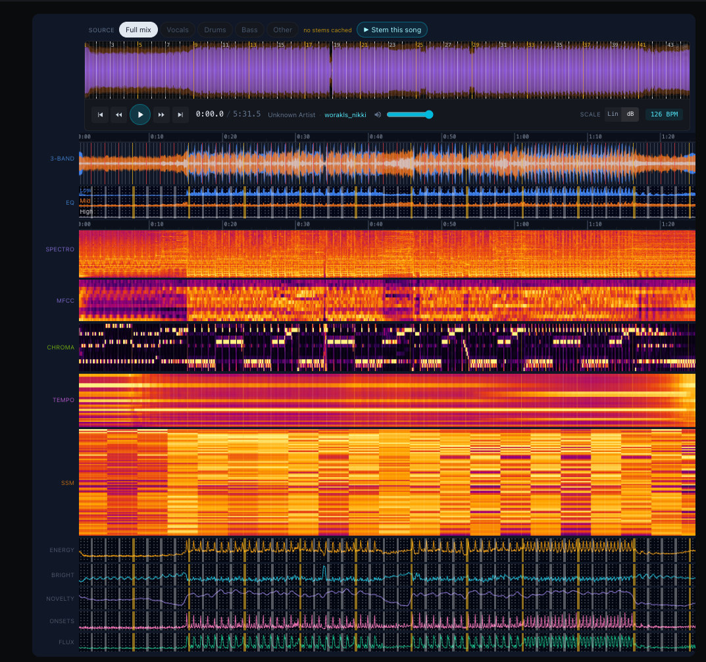

### Player — transport controls

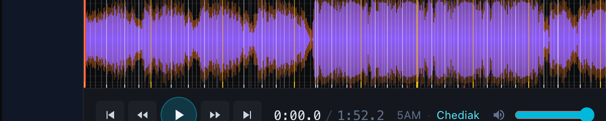

The player is the transport bar above the canvas: the play button, the skip and jump buttons, the seek bar, the time readouts, the playback-speed slider, and (when stems exist) the picker that swaps between the full mix and individual instruments. It's how you move through and listen to the audio while you work.

| Control | Action |
|---------|--------|
| Play / Pause | Spacebar toggle |
| `\|◀` Jump to start | Seek to 0:00 (also `Home`) |
| `◀◀` Skip back | Seek backward by the **small** step (default `1 s`, configurable in Settings → Display & playback; also `←`). Combine with `Shift` / `Alt` for the medium / large steps. |
| `▶▶` Skip forward | Seek forward by the **small** step (default `1 s`, configurable in Settings → Display & playback; also `→`). Combine with `Shift` / `Alt` for the medium / large steps. |
| `▶\|` Jump to end | Seek to end of song (also `End`) |
| Seek bar | Click or drag |
| Time readout | MM:SS.mmm (live) |
| Duration | MM:SS.mmm |
| Playback rate | Slider 0.5× – 2× (step 0.05); default from Settings.`defaultPlaybackRate` |
| Stem source picker (`StemSourcePicker.tsx`) | When Demucs stems are cached: Mix (default) / Vocals / Drums / Bass / Other |
| Preview button | Same as `L` (when no loop is focused): opens the 6-second preview window |

**Scrolling away from the player keeps one transport, never two.** Scroll far enough down a song and the title header above the canvas folds into a **slim bar** — one line with play / stop, the clock and the bar · beat readout, the song title, and the compact viz controls — so playback stays in reach with the lanes on screen. The slim bar takes over only once the player's own transport row has gone under the header, and hands back the moment it comes out again, so exactly one set of play controls is on screen at a time. On a short song page, where there is not enough to scroll for the player to clear the header, the slim bar appears at the bottom of the page anyway rather than leaving you with no transport at all.

**Curated layers name the stem they were built from.** (They draw in **Algorithm Inspect**; the Annotator Tool shows only your own layers.) Each curated / detector layer reads from one source — a Demucs stem or the full Mix — and its lane label says which, rather than a generic *(curated)* tag. A curator that reads the full mix gets a lane reading **(mix)**; one built from a separated stem names that stem instead. When you switch the **Stem source picker** to a specific instrument and listen to it, every curated layer built from that stem **lights up** in the gutter — a tinted lane, a soft left ring, and a bolder label — so you can see at a glance which layers belong to the stem you're hearing. (Auditioning the full **Mix** highlights every mix-built curated layer.) Click a curated/detector lane's label to select it and a small **ⓘ icon** appears just under the lane name; clicking the ⓘ opens a popover naming the **heuristic/algorithm** that built the layer (the detector's one-line description, e.g. *"Kick + sub-bass presence: energy gate on <150 Hz of the full mix"*), its **source stem**, and the underlying **detector id** (e.g. `example_energy`) — so you can confirm exactly what a layer is without leaving the canvas. Click the ⓘ again, click anywhere else, or press **Esc** to dismiss the popover. The ⓘ appears only on curated/detector lanes, not on your own manual layers, and only while that lane is selected — an unselected gutter cell is just its name.

### Stacked rows (top-down, draggable order)

| Row | Source | Notes |
|-----|--------|-------|
| **Time ruler** (`TimeRuler.tsx`) | — | 16 px ruler rendered inline above the signals |
| **3-Band waveform** (`FrequencyWaveform.tsx`) | Low (<150 Hz) / Mid / High (>2.5 kHz) | Palette selectable in Settings |
| **EQ visualizer** (`EQVisualizer.tsx`) | 3-band gain trace | Off by default |
| **Mel spectrogram** (`SpectrogramAnnotated.tsx`) | librosa STFT + mel filterbank | Roseus colormap |
| **Cepstrogram** (`CepstrogramAnnotated.tsx`) | MFCC heatmap | Off by default |
| **Energy** | RMS | Amber |
| **Brightness** | Spectral centroid | Cyan |
| **Novelty** | Self-similarity novelty | Purple |
| **Onsets** | Half-wave rectified spectral flux | Pink — only attacks |
| **Spectral Flux** | Full L2 flux | Green — attacks + releases |
| **Algorithm rows** | One row per loaded detector | Inspect mode |
| **Annotation rows** | Manual / Auto-guess / Cue / Span / Loop | Editable in Annotate mode |
| **Overview waveform** (`OverviewWaveform.tsx`) | Mini timeline at bottom | Click to seek |

### Beat grid overlay — the bar/beat lines

The beat grid is the set of evenly spaced vertical lines drawn across every row to show where the bars and beats fall, so you can place annotations in time with the music. The lines are indigo (`#818cf8`), and they fade out automatically when you zoom far enough out that they'd be packed too tightly to read.

### Preview Window — audition a stretch of the song

The Preview Window lets you grab a short stretch of the song and listen to just that part, on its own or on repeat — handy for checking exactly where a transition happens before you mark it.

- Open it by pressing **L** (when no loop is focused), clicking the player preview button, **Shift-dragging** on the waveform, **or dragging on any row in the stack** — 3-Band, Spectrogram, EQ, MFCC, Chroma, Tempogram, SSM, and the Energy / Brightness / Novelty / Onsets / Flux sparklines, **plus every annotation / detector ("curator") layer row** (Cues / Spans / Loops / Riff Patterns / Lyrics, user-created or read-only detector output) all accept drag-to-region so you can highlight a segment to listen to from whichever row your eye is on. On the annotation lane rows the gesture lands on **empty space between the ticks / bands** — clicking or dragging directly on an item still edits that item (open its card, move it, drag its edge); the empty gaps seek (click) or highlight (drag). **L is loop-aware** — if you've clicked a loop band on the canvas or selected one in the Loops editor, pressing **L** instead toggles seamless playback of that focused loop (same effect as the **P** hotkey while the Loops tab is active). Once you defocus the loop, **L** reverts to opening the 6-second preview.
- Single tall translucent cyan band that spans **every** viz row — one selection, one visible highlight across the whole stack, so the band stays aligned with whichever signal you're inspecting. Resize from either edge; control bar above the band offers play / loop-toggle / dismiss.
- Plays in one-shot or loop mode. In the **Loops** annotation tab a new drag-selection opens the preview already in loop mode (highlighted region plays infinitely until you toggle loop off or dismiss).
- **Loop mode repeats seamlessly** — the same engine the Loops editor's own playback uses. The repeat is sample-accurate and pulled to the nearest zero crossing (within 20 ms) at both ends, so a bar-long highlight comes back round on the beat instead of leaking a sliver of the next bar and clicking at the seam. It follows the **SPEED** setting, keeps the playback cursor and the elapsed-time readout sweeping through every repetition, and never drifts however long you leave it running. Resizing the band while it loops moves the seam under the audio rather than restarting the phrase from its head. Toggling loop off hands playback straight back to the player.
- Dismiss with **Esc** or by clicking empty space on any visualization — a click on any viz row uniformly clears the band and seeks the playhead to the click.

### Annotation overlays — how your marks are drawn

Whenever you have an annotation layer turned on, its marks are drawn onto the canvas as an overlay. Here's what each annotation row shows:
- A color-coded **cap** + section index on the row's lane.
- A floating popover when you click a section bar — quick in-context edit of type, label, start time. The popover (shared by every kind: cues, spans, boundaries, loops, riff patterns) **opens fully on-screen** — it re-clamps to its real height so a tall card never hangs off the bottom of the page — and is **draggable by its header**: grab the title bar (cursor turns to `move`) to reposition it anywhere, e.g. to uncover the marker underneath.
- The **playback cursor** — a thin white hairline at the playhead, drawn on *every* annotation lane (Cues, Spans, Loops, Lyrics, Riff Patterns, Lead) at the same position as on the waveform above. So whichever row your eye is on, you can see which mark — which riff instance, which repeat of it — you are hearing right now, without looking back up at the player.

### Drag-to-retime markers (every layer)

Every annotation marker on the canvas is grabbable with the same shared
implementation (`useTimelineDrag`) — grab the marker, the cursor turns to
`↔`, drag horizontally, drop. Updates stream live so the marker tracks the
cursor and every row that draws the same item moves together.

The same drags work with a finger on a touch screen: press the marker and
slide sideways. Handles get a wider invisible grab area on touch screens, and
a vertical swipe over a row scrolls the page instead of moving anything (see
[On a phone](#on-a-phone)).

| Layer | Grab point |
|-------|------------|
| **Manual** | The colored right edge of any section band, **or** the colored cap of the Manual ghost line that appears on any signal row (waveform / spectrogram / chroma / …). Clamped between its neighbours. |
| **Auto-guess** | *Not draggable.* Auto-guess points are review-only — each point shows ✓/✗ buttons on the timeline; use them to accept/reject without changing the time. To refine timing, copy the points into a manual annotation (see below) and drag from there. |
| **Cues** | The vertical tick. A clean click opens the edit popover; a real drag suppresses the click. The label is no longer drawn on the timeline — it shows in the tick's hover tooltip and on the cue's card in the editor panel. *Detector-sourced cue layers are review-only:* their ticks render with inline ✓/✗ buttons and cannot be dragged or edited (use the Detector Review card, then the **Copy → Manual** button, to make them editable). |
| **Loops** | Either edge of a loop band (left = start, right = end) **resizes** that edge. Grabbing the **middle of the band** instead **moves the whole loop** without changing its width (start and end shift by the same delta, clamped so the loop stays inside the song). Edge cursor is `↔`, body cursor is `✋`. Each edge is clamped to the opposite edge with a 50 ms minimum interval width. A small (≤ 3 px) movement is treated as a click and opens the edit popover instead of starting a drag. *Detector-sourced loop layers are review-only with inline ✓/✗ — clicking one opens its read-only info card.* |
| **Spans** | Either edge resizes; the body moves the whole span. Same clamp rules as loops. A clean click opens the edit popover. *Detector-sourced span layers are review-only with inline ✓/✗ — clicking one opens its read-only info card.* |

Dragging in any of these places goes through the standard per-type undo
stack — one drag = one undo entry, not one per pixel.

### Row reordering

Don't like the default top-to-bottom order of the rows? Drag any row by its left-edge label to move it up or down the stack. The new order applies for the rest of your session but is **not** saved between page reloads — reopening the app brings the rows back in their default order.

The same drag also moves lanes **into and out of a [band](#group-lanes-into-a-band)**: drop a lane on a band's header or on one of its members to add it, or drag a member out to somewhere else in the stack to take it back out. Unlike the row order itself, that part *is* saved with the song.

By default the **curated / detector lanes are grouped by the stem they were built from**, in the same order as the **Source** picker reads: **Mix → Vocals → Drums → Bass → Other → Guitar → Piano** (whole-track layers like the EDM bands sort with the Mix). So the lanes line up with the stem buttons above the waveform instead of appearing in detector-registry order. The moment you hand-drag any row, this auto-grouping switches off for the rest of the session — your manual order is never reshuffled underneath you.

### Click a row label to make that layer active

In the Annotator workspace, the left-edge labels of the **Cues / Spans / Loops / Riff Patterns** layer rows are **clickable**: a single click makes that type active (Cues / Spans / Loops / Riff Patterns), switches the Marker config panel's **Source** picker to that layer's origin, and aims the drag-region **+ Add** pill at the chosen layer — so the next add writes into it (a playhead add is pressed on the card itself). The active layer's row gets a **neon glow** (layer-color ring + soft shadow on the row) and a brighter, glowing label, so you can see at a glance which row is the current ADD+ target. The *All annotations* sidebar lists your **manual** layers only — read-only detector ("curated") layers are managed from the separate **Detectors** sidebar, not here. Exactly one row across the whole canvas is highlighted at a time — it matches the active card in the *All annotations* sidebar.

**Rename a layer inline.** A small **✎ pencil** sits just after the name on each of your own **Cues / Spans / Loops / Riff Patterns** lane labels; click it to turn the name into an input, type a new name, and press **Enter** (or click away) to save — **Esc** cancels. The same pencil affordance appears in the *All annotations* sidebar next to each **layer name** and next to each **item label** (including **Boundary** points, so you can rename a section's label — *intro*, *drop*, … — without opening its card), and on each **Boundary** card in the Manual editor. Curated / detector-sourced lanes regenerate from their source, so they carry no pencil.

### Group lanes into a band

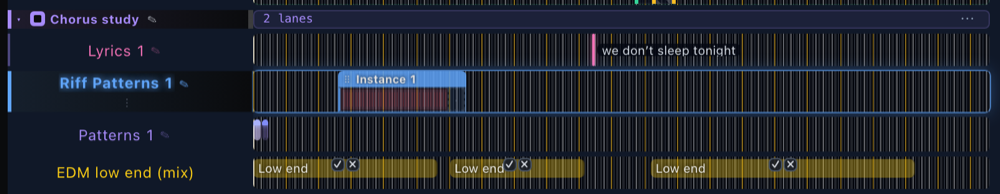

Related lanes can be tied together into a **group**: a named, coloured band that sits above them in the stack. One chorus usually spans several layers — the cues you tapped, the spans you drew over them, the pattern you traced — and a group lets you name that once and treat the lanes as a unit.

Grouping is **independent of layer type**. A Cues layer, two Spans layers and a Loops layer can share one band, and nothing about a layer changes by joining one: it keeps its own name, colour, snap mode, items and editor. A lane belongs to at most one group, and groups don't nest.

**To make one:** click a lane's label to select it, then click the **⋮** button in its affordance strip and choose **New group from this lane**. The same menu on any other lane lists every band you've made under **Move to**, so that's how the rest join — the band it is already in is marked with a dot. **Remove from group** takes a lane back out; the lane itself is untouched either way.

**Or drag lanes in and out.** The same label you [drag to reorder rows](#row-reordering) also drops into a band:

- **Drop on the band's header** → the lane joins at the **top** of the band. The header lights up in the band's colour and reads *drop to add to the top of …* while you're over it, and the band stays where it was drawn instead of jumping to wherever the lane came from.
- **Drop on a lane that's already in the band** → the dragged lane joins **above** that lane, so you place it and order it in one gesture.
- **Drop a member lane anywhere outside its band** → it **leaves** the band and stays where you dropped it. Dragging a lane out is the drag equivalent of *Remove from group*; nothing about the lane itself changes.
- Dropping into a **collapsed** band **expands it**, so you can see what it just took rather than watching the lane disappear behind the header.

Only lanes that can hold a membership are accepted — the same ones that get the **⋮** menu, so curated / detector lanes and the signal rows can't be dragged into a band (the header ignores them rather than swallowing the drop).

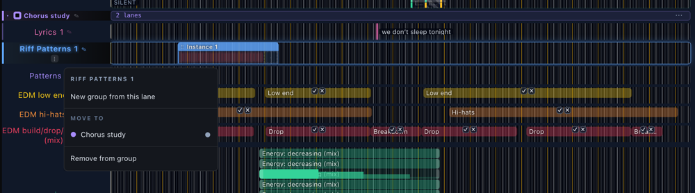

**The header row** carries everything the band does:

| Control | What it does |
| --- | --- |
| **▾ / ▸** | Collapse the band — the member lanes fold away behind the header, and the chevron flips. Expand brings them back in the same order. |
| **checkbox** | Show or hide every lane in the band at once. It's a three-state box: filled when they're all shown, a **dash** when only some are, empty when none are. Each lane still has its own visibility, so hiding one member turns the box into the dash rather than lying to you. |
| **✎ pencil** | Rename the band inline, exactly like a lane name. |
| **N lanes** | How many lanes are in it. |
| **⋯** | Collapse, and the two ways to end a band — below. |

Member lanes are marked with a short rule in the band's colour down the left edge of their label, so you can see where the band starts and stops when it's expanded.

**Ending a band comes in two flavours, and they are deliberately not the same word.** **Ungroup** dissolves the band and leaves every lane exactly where it was. **Delete group and its N lanes…** removes the lanes too.

> ⚠ **Delete group takes the annotations with it.** It asks first and names the lanes it would remove, so read the list before confirming. Ungroup is the one you want if you only meant to undo the grouping. Both are undoable with **⌘Z** while you're still in the session.

Unlike [row reordering](#row-reordering), which lasts only for the session, **groups are saved with the song's annotations** — they live in the same document as the layers themselves (see [the boundary layer schema](#boundary-layer-schema)), so they come back when you reopen the song. The corpus **Export** writes one file per layer, so bands are not part of *that* export.

Two lanes can't join a band: **curated / detector lanes** (they're rebuilt from their detector on every render, so a membership couldn't survive a reload — the **⋮** doesn't appear on them) and, for now, **Boundary lanes**.

**Bands are an Annotator Tool thing.** Dataprep draws no annotation lanes at all, and Algorithm Inspect draws none of *your* layers either — it shows what the detectors said (see [the Annotations dropdown](#1-annotations-dropdown)) — so in both of those workspaces the band's header row is left out along with its lanes, rather than hanging over nothing. The group is still there; it comes back with the lanes when you return to the Annotator Tool.

### Resize the label gutter

The left-edge label column is **resizable**: hover the right edge of any row label, grab the cyan handle, and drag to widen it (up to 240 px) or narrow it. The width applies to every row at once, survives switching songs or tabs, and resets to the narrowest setting when you reload the page.

**The width decides how names are written.** At its narrowest, which is how the page opens, the column is a single 36 px strip. Every row's name there (signal rows, annotation lanes and group headers alike) runs up the row in the row's colour, as on the phone. Drag the handle a little to the right and the column snaps open, with names reading across. Drag it back in past that point and it snaps shut to the strip. It never stops at a width in between.

**A long lane name is elided, never stretched.** A name gets at most **two lines** in the gutter; past that it ends in an **…** instead of wrapping down the row and dragging the lane's height with it — so *Percussive onset density (drums)* reads as *Percussive on…* at the narrowest width, and its lane stays as short as the annotations in it. **In the narrow strip**, each row is kept tall enough for its first six letters (**Bounda…**, **Riff P…**), so thin lanes grow a little. A shorter name such as *EQ* costs only its own length. A group header stacks its **▾** and visibility box above the name. The **✎** pencil moves into the menu. Click a lane to select it, then pick **⋮ ▸ Rename…**, or pick **⋯ ▸ Rename…** on a group header's band. Open the column and the two-line rule above applies, with the pencil back inline. Nothing is lost: the full name is one **hover** away in the lane's tooltip, and widening the gutter fits more of every name per line without making a single row taller.

**The lane's own affordances follow the selection.** The **ⓘ / ⬇ / ◇ / ⋮** buttons take a line of their own under the name, which is rent an idle lane shouldn't pay — so they appear on the **selected lane only** (click the lane label to select it), and every other cell in the gutter is just its name. The **✎ pencil** is the exception: it sits inline right after the name on your own layers and is always there.

---

## The Viz Control Bar


<!-- tc-videos:the-viz-control-bar -->

**▶ Annotations menu**

<div style="position:relative;padding-bottom:56.25%;height:0;overflow:hidden;max-width:720px;margin:1rem 0;border-radius:8px;"><iframe style="position:absolute;top:0;left:0;width:100%;height:100%;" src="https://www.youtube.com/embed/1N2zT39j0Vw" title="Annotations menu" frameborder="0" loading="lazy" allow="accelerometer; autoplay; clipboard-write; encrypted-media; gyroscope; picture-in-picture" allowfullscreen></iframe></div>

**▶ Signals dropdown**

<div style="position:relative;padding-bottom:56.25%;height:0;overflow:hidden;max-width:720px;margin:1rem 0;border-radius:8px;"><iframe style="position:absolute;top:0;left:0;width:100%;height:100%;" src="https://www.youtube.com/embed/KlNjuTRdFsc" title="Signals dropdown" frameborder="0" loading="lazy" allow="accelerometer; autoplay; clipboard-write; encrypted-media; gyroscope; picture-in-picture" allowfullscreen></iframe></div>

**▶ Zoom cluster**

<div style="position:relative;padding-bottom:56.25%;height:0;overflow:hidden;max-width:720px;margin:1rem 0;border-radius:8px;"><iframe style="position:absolute;top:0;left:0;width:100%;height:100%;" src="https://www.youtube.com/embed/6fogup_gIUs" title="Zoom cluster" frameborder="0" loading="lazy" allow="accelerometer; autoplay; clipboard-write; encrypted-media; gyroscope; picture-in-picture" allowfullscreen></iframe></div>

**▶ Grid toggle**

<div style="position:relative;padding-bottom:56.25%;height:0;overflow:hidden;max-width:720px;margin:1rem 0;border-radius:8px;"><iframe style="position:absolute;top:0;left:0;width:100%;height:100%;" src="https://www.youtube.com/embed/JXuYSLaRbQQ" title="Grid toggle" frameborder="0" loading="lazy" allow="accelerometer; autoplay; clipboard-write; encrypted-media; gyroscope; picture-in-picture" allowfullscreen></iframe></div>

**▶ Beat-grid unit selector**

<div style="position:relative;padding-bottom:56.25%;height:0;overflow:hidden;max-width:720px;margin:1rem 0;border-radius:8px;"><iframe style="position:absolute;top:0;left:0;width:100%;height:100%;" src="https://www.youtube.com/embed/UENd9Izshyg" title="Beat-grid unit selector" frameborder="0" loading="lazy" allow="accelerometer; autoplay; clipboard-write; encrypted-media; gyroscope; picture-in-picture" allowfullscreen></iframe></div>

**▶ Snap toggle**

<div style="position:relative;padding-bottom:56.25%;height:0;overflow:hidden;max-width:720px;margin:1rem 0;border-radius:8px;"><iframe style="position:absolute;top:0;left:0;width:100%;height:100%;" src="https://www.youtube.com/embed/QR9DfiOL6tU" title="Snap toggle" frameborder="0" loading="lazy" allow="accelerometer; autoplay; clipboard-write; encrypted-media; gyroscope; picture-in-picture" allowfullscreen></iframe></div>

**▶ Misc dropdown**

<div style="position:relative;padding-bottom:56.25%;height:0;overflow:hidden;max-width:720px;margin:1rem 0;border-radius:8px;"><iframe style="position:absolute;top:0;left:0;width:100%;height:100%;" src="https://www.youtube.com/embed/hG7xC4FETEQ" title="Misc dropdown" frameborder="0" loading="lazy" allow="accelerometer; autoplay; clipboard-write; encrypted-media; gyroscope; picture-in-picture" allowfullscreen></iframe></div>

**▶ The Prominence lane**

<div style="position:relative;padding-bottom:56.25%;height:0;overflow:hidden;max-width:720px;margin:1rem 0;border-radius:8px;"><iframe style="position:absolute;top:0;left:0;width:100%;height:100%;" src="https://www.youtube.com/embed/9rMfAWvUsKA" title="The Prominence lane" frameborder="0" loading="lazy" allow="accelerometer; autoplay; clipboard-write; encrypted-media; gyroscope; picture-in-picture" allowfullscreen></iframe></div>

<!-- /tc-videos:the-viz-control-bar -->
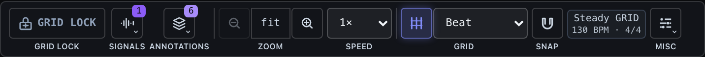

The Viz Control Bar is the strip of buttons that sits over the canvas and decides what the canvas shows: which annotation layers and audio signals are drawn, how far you're zoomed in, whether the beat grid is on, and so on. Think of it as the canvas's "view" menu. Every button is a big icon with its name spelled out underneath in capitals, so they all line up as one neat row. From left to right: **Signals** and **Annotations** (each opens a checklist popover), **Zoom** (− / ×N / +), **Speed** (a playback-rate selector), **Grid** (an on/off toggle plus a grid-spacing selector), **Snap**, and **Misc** (a popover for a couple of less-used options). Click anywhere outside an open popover to close it.

**In Algorithm Inspect the bar grows two more popovers**, **Algos** and **Detectors**, extending that first cluster to **Signals · Annotations · Algos · Detectors** — the overlays are what you came to that workspace to look at, so they are reachable from the bar and not only from the sidebars (which you may well have collapsed to widen the canvas). Both drive exactly the same visibility as the sidebar checkboxes: tick a row in either place and the other follows.

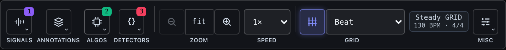

### 1. Annotations dropdown

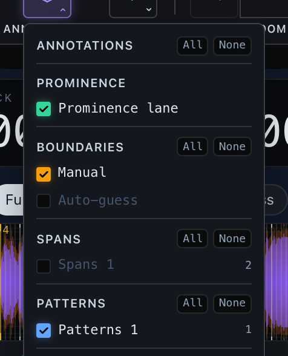

A badge in the header shows the count of active annotation layers. The
popover lists the **human-authored** layers first, organised by **marker
type**, with each group only rendered if it has a user-created layer to
show ("Boundaries" is always shown because Manual / Auto-guess are
toggleable even when there are zero annotations yet; the others appear
when a user layer of that kind exists). Every script-defined **detector**
overlay is pulled out of its type group and collected at the **bottom**
under a single **Detectors** section (see below) — except in
**Algorithm Inspect**, where that whole section is promoted to its own
**Detectors** popover on the bar (its badge and its All / None follow it).

**Each workspace shows its own kind of output, and the split is *approved* vs
*proposed*.** Approved isn't a kind of annotation, it's a place: your own folder,
`data/annotations/layers/<you>/<song>.json`. Anything in it — boundaries, cues,
spans, loops, patterns, lyrics, riff patterns, no type more special than
another — is work you decided to keep, and the Annotator Tool is where you see
it. Everything else is a *proposal*: detector output, algorithm overlays, the
live Auto-guess consensus, a merge you haven't committed. Those live in
Algorithm Inspect until you copy one, and copying is what moves it across.

So in Algorithm Inspect this dropdown lists **none of your layers** and draws
none of them — the **Boundaries** group there holds **Auto-guess** and nothing
else, the one row that is still a proposal. The **Prominence lane** toggle is
gone from that workspace too: it reads your own durational items, which are no
longer drawn there. Go to the Annotator Tool to see your own work.

That folder is also exactly what a downstream consumer reads — the light-show
agent takes your boundaries and layers and ignores every uncommitted proposal —
so "did I copy it?" is the same question as "will anything downstream see it?"

**All / None.** Every heading in the popover carries an **All** / **None**
pair. On a group heading it flips that group only; on the **Annotations**
heading at the very top it flips *everything the popover lists* —
boundaries, the Prominence lane, every user layer, and (outside Algorithm
Inspect, where they have their own popover) every detector overlay — in
one click.

**Prominence** group (one derived row, not a layer list — hence a single
checkbox and no All / None of its own):

| Row | Color swatch | What it controls |
|-----|--------------|------------------|
| **Prominence lane** | `#34d399` (emerald) | Visibility of the Prominence lane — *who is in front*, read across every layer at once (see [Prominence (front ↔ back)](#prominence-front--back)). **Annotator Tool only**, and **off by default** — the lane is a derived, cross-layer read, so you turn it on when you go looking for it rather than paying four tiers of canvas height before you ask. Front/back placement is your own annotation work rather than a detector output you went there to read, so Algorithm Inspect neither draws the lane nor offers the toggle — it reads the durational items that workspace no longer shows. The lane also hides itself on songs with nothing for it to read — no durational annotations and no lyrics — so ticking it there shows nothing. It is not a saved setting, so it goes back to off with the next song. |

**Boundaries** group:

| Row | Color swatch | What it controls |
|-----|--------------|------------------|
| **Boundaries** | `#f59e0b` (amber) | Visibility of the Boundaries row (manual, human-drawn) |
| **Auto-guess** + chips ≥2 / ≥3 / ≥4 | `#a78bfa` (violet) | Visibility + inline min-consensus filter — how many *distinct algorithms* must agree (clicking the same chip twice steps back) |

**Cues**, **Spans**, **Loops**, **Riff Patterns** groups (each only rendered
when at least one **user-created** layer of that kind exists; Loops +
Riff Patterns also gated by the `experimentalLoopsAndPatterns` flag):

| Row | What it controls |
|-----|------------------|
| **\<layer name\>**   *N* | One row per user-created layer. Color is the layer's own color; *N* is the item count. |

**Detectors** group (at the very bottom of the popover; only
rendered when at least one detector overlay exists for this song — in
**Algorithm Inspect** this is its own **Detectors** popover instead, with
the same contents and a badge counting the overlays currently on):

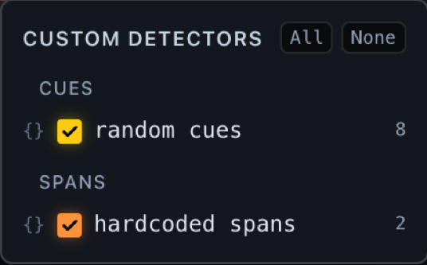

- The same **All** / **None** pair every other heading carries, here
  showing or hiding **every** detector overlay at once — handy when many
  detectors are cached and you want a clean canvas (None) or a full
  sweep (All).
- When the song has overlays from both the shipped detectors and your own,
  they are split under a **Custom** title with a **Default** title below it (see
  [Default and Custom](#default-and-custom)); with only one kind present
  the titles are left off.
- Below that, one **sub-heading per annotation type** the detectors emit —
  **Boundaries**, **Cues**, **Spans**, **Loops**, **Riff Patterns** — each only
  shown when at least one detector of that type is present. Every row
  carries the `{}` detector glyph; layer-typed detectors also show their
  item count.
- Detector overlays are **off by default** — each starts hidden until you
  check it (or hit **All**), so the canvas isn't auto-cluttered. Detector
  outputs are read-only on the canvas and all share the same *Hide
  detector* visibility set.

A per-marker-type **Auto-guess** control (parallel to the Boundaries one)
is on the roadmap for Cues / Spans / Loops; it'll land inside
each group once the feature ships.

### 2. Signals dropdown

"Signals" are the different analytical views of the audio that TimeCues can draw under the waveform — things like the spectrogram, the energy curve, or the pitch-class chromagram. Each reveals a different aspect of the sound, and this dropdown is a checklist for turning each one on or off; the button itself shows how many are currently on.

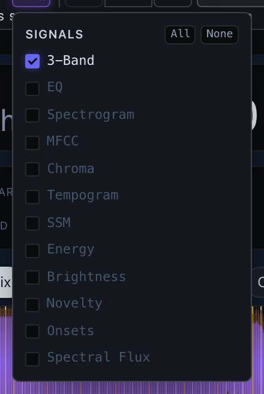

There's one checkbox per signal row, under a **SIGNALS** heading with the same **All** / **None** pair the Annotations popover uses — **All** draws every analysis at once (heavy on a long song), **None** clears the canvas back to the waveform. The color swatch in each row is the color that signal is drawn in, and the "Settings key" is the stored preference that controls whether it's on when a song first opens:

| Label | Color | Settings key | Default |
|-------|-------|-------------|---------|
| 3-Band | `#6366f1` | `defaultShowWaveform` | ✓ |
| EQ | `#60a5fa` | `defaultShowEQ` | ☐ |
| Spectrogram | `#8b5cf6` | `defaultShowSpectrogram` | ☐ |
| MFCC | `#c084fc` | `defaultShowCepstrogram` | ☐ |
| Chroma | `#84cc16` | `defaultShowChroma` | ☐ |
| Tempogram | `#d946ef` | `defaultShowTempogram` | ☐ |
| SSM | `#f97316` | `defaultShowSsm` | ☐ |
| Energy | `#f59e0b` | `defaultShowEnergy` | ☐ |
| Brightness | `#22d3ee` | `defaultShowBrightness` | ☐ |
| Novelty | `#a78bfa` | `defaultShowNovelty` | ☐ |
| Onsets | `#f472b6` | `defaultShowOnsets` | ☐ |
| Spectral Flux | `#10b981` | `defaultShowFlux` | ☐ |

> **A ticked signal always keeps its lane.** The Energy, Brightness, Novelty, Onsets and Spectral Flux curves are computed in your browser from the decoded audio, which takes a second or two after a song opens. Until they arrive the lane is still drawn, saying **Computing Energy…** (and so on) with a spinner, and **No Energy analysis** if the curve genuinely isn't there — the same empty states the EQ lane has always shown. A checked box never leaves you with a blank gap where a lane should be.

> **Onsets vs Spectral Flux.** Onsets is half-wave-rectified flux — peaks only on magnitude *increases* (attacks). Spectral Flux is the full L2 distance — peaks on both increases and decreases, so it also catches note releases and filter closings.

> **Chroma (chromagram).** 12-row heatmap of pitch-class energy (C, C#, D … B from bottom to top). Each frame is max-normalised so the strongest pitch class glows brightest regardless of overall loudness. Use it to spot key changes, chord progressions, and tonal sections that look identical on the spectrogram but are harmonically distinct.

> **Tempogram.** Heatmap of tempo strength over time, log-spaced from 30 to 300 BPM (slowest at the bottom, fastest at the top). Each column shows how strongly each tempo is present at that moment — a steady horizontal band marks a stable BPM, drifting or splitting bands flag tempo changes or polyrhythms. Computed as windowed autocorrelation of the onset envelope.

> **SSM (Self-Similarity Matrix).** Square heatmap where both axes are time, and each cell colors the cosine similarity between aggregated chroma vectors at those two moments. The bright diagonal is each frame matching itself; **off-diagonal bright stripes parallel to the diagonal mark repeated content** (e.g. a chorus heard twice glows where its first occurrence "meets" its repeat). Bright square blocks along the diagonal mark internally-similar sections. Use it to spot song-form structure: verse-chorus-verse repetition jumps out instantly. The playhead draws a crosshair so you can see what "now" is similar to. Note: the row is rendered wider-than-tall, so off-diagonal stripes appear sheared (≠ 45°) but stay readable.

### 3. Big-icon controls (Zoom · Speed · Grid · Snap · Misc)

Every always-visible control is a 40-pixel square icon button with an
uppercase label below it (**ZOOM**, **SPEED**, **GRID**, **SNAP**, **MISC** — and the
dropdowns above use the same shape: **SIGNALS**, **ANNOTATIONS**, and, in
Algorithm Inspect, **ALGOS** and **DETECTORS**).
All heights line up so the bar reads as one row of equal columns.


| Control | Behavior |
|---------|----------|
| **Zoom** cluster (`−` · `×N` / `fit` · `+`) | Same player zoom that used to sit on the player header — moved into the toolbar so it sits next to the grid controls it interacts with. The middle button shows the current multiplier (`fit`, `×1.5`, `×2`, …) and resets to fit on click. `−` is disabled at `fit`. **Every zoom step re-centers on whatever you're working on**, in this order: (1) a **range with its picker open** — the Prominence lane's *Lead over bars…* panel, or the energy-span export panel; (2) the **highlighted region** — the pending selection pill or the drag preview band, centred on its midpoint — or the **selected annotation item** — the focused cue, span, loop, pattern, riff pattern, lyric or boundary, from **any** layer type, not just the tab you're on, with intervals centred on their midpoint. Both of those outlive the gesture that made them (a preview band sits there until you click it away; clicking the waveform moves the cursor without deselecting a card), so when both are live at once the **more recent** of the two wins — the one you last reached for is the one you are looking at; (3) the **playback cursor** — wherever it is, on screen or not, the view scrolls so the cursor sits in the middle. Near the two ends of the track — a cursor parked at `0:00` or in the tail, where there isn't half a screen of track on one side of it to centre against — the scroll clamps at the edge and the cursor sits off-centre, but it is always in frame. That start/end zone shrinks as you zoom deeper, so a cursor a little way into the song takes the centre back after a step or two. So zooming in on a span you just clicked keeps that span in the middle of the panel instead of jumping back to the playhead, and dragging a fresh highlight somewhere else frames that highlight on the next step, even with an older item still selected. The mouse position is never used. The same rule applies to trackpad pinch / Ctrl+wheel zoom. Note that a selection outranks the cursor until you actually clear it — clicking elsewhere on the waveform moves the playhead but does not deselect the item. The `+` cap escalates in three tiers: (1) **standard** — typically `×32`, depending on display density and panel width; (2) **extended** — clicking `+` past the standard cap opens an **Allow extended zoom?** prompt that roughly doubles it; (3) **ultra** — clicking `+` past that opens an **Allow ultra zoom?** prompt that lifts the cap to `×1024`, which is about where one screen pixel covers one audio sample and there is nothing left to resolve. **Every row stays pixel-sharp at every zoom level.** Each full-width visualization — waveform, 3-Band, spectrogram, MFCC, chroma, tempogram, SSM and the signal sparklines — is drawn as a strip of tiles, and only the tiles near the viewport are rendered, so no row is ever a stretched low-resolution bitmap and none of them costs more memory at `×1024` than at `×1`. Zooming in buys real detail rather than magnification: the player waveform re-reads the decoded audio once a screen pixel covers less than ~1.5 ms, and the spectrogram re-runs its FFT centred on each column at the finer time resolution. What you eventually hit is the resolution of the analysis itself — the 3-Band envelope is kept at 0.5 ms, and the MFCC / chroma / tempogram / SSM rows at their analysis hop — so past roughly `×300` those rows stay sharp but stop revealing anything new. The trade-off at extreme zoom is **speed, not sharpness**: rows repaint section by section as you pan, which with every signal row enabled is roughly a tenth of a second of work per section — turn off rows you aren't using from the **SIGNALS** menu and panning gets noticeably lighter. Memory stays bounded and is released on zoom-out: only the sections near the viewport are held, so a fully zoomed timeline with all rows on costs about 45 MB of canvas versus 12 MB at fit, and returns to 12 MB the moment you zoom back out. Tick **Don't ask me again** + **Keep current limit** in either dialog to silence that prompt permanently and stay at the previous cap. Once approved, each tier persists across sessions. Keyboard shortcuts `+` / `−` / `0` are unchanged. |
| **Speed** (inline selector) | Playback speed for the whole song: **1×** (normal), **0.75×**, **0.5×**, or **0.25×**. Slowing it down lets you study a fast passage at half- or quarter-speed, and because the slow-down is applied once at the audio source, **everything that tracks playback slows with it in lockstep** — the playhead, the karaoke sweep on the riff node's sub-beat grid, and the beat-grid cursor all move at the new rate. **Pitch is preserved**, so the song stays musically recognizable when slowed (no chipmunk / record-drag effect). The selector tints green whenever it's set to anything other than 1×, so a non-normal speed is obvious at a glance. The starting value comes from **Settings → Display & playback → Default playback rate**. |
| **Grid** (big icon) | Toggle for the beat-grid overlay (`defaultShowBeatGrid`, **on by default**). If the grid is on for a song with no BPM saved, the icon turns amber and a **⚠ Grid can't render — set a BPM for this song** chip appears next to it — the overlay can only render once a BPM is set, so fill in the Song Info Bar's BPM field (or use the Dataset Prep BPM picker) to make the grid lines appear. |
| **Unit selector** (big inline element, right of the Grid icon) | Grid line spacing, **default `Beat`**, listed coarsest to finest: `16 Bars`, `8 Bars (Block)`, `4 Bars (Phrase)`, `2 Bars`, `Bar`, `Compound (×3 beats)`, `Beat`, `1/2 beat`, `1/3 beat · triplet`, `1/4 beat`, `1/6 beat · triplet`, `1/8 beat`. The selector grows or shrinks to fit the current selection (so `Bar` looks compact and `1/3 beat · triplet` is wider) — no ellipsis. Disabled (greyed out) when the grid is off or the song has no BPM. Labels are intentionally **beat-relative** — in 4/4 they line up with the familiar music-notation values (1/2 beat = 8th, 1/4 beat = 16th, 1/8 beat = 32nd, triplets divide the beat into 3 / 6); in compound meters where the BPM counts 8ths (6/8, 9/8, 12/8) the same fractions stay accurate. `Compound (×3 beats)` is the perceived dotted-quarter pulse for compound meters and is hidden in simple meters (4/4, 3/4, 5/4, 7/8) where it would drift against bar lines. |
| **Grid-mode badge** (inline, right of the Snap icon) | A colored two-line pill always tells you the active grid mode plus the song's BPM, time signature, and bar numbering. Line 1 names the mode (`Steady GRID`, `Mapped GRID`, or `Hand-placed GRID`); line 2 shows `N BPM · T/S · bars from 0`, with `(N grids)` in Mapped and an amber `N pinned` in Hand-placed. The `bars from 0` / `bars from 1` tag is the always-visible reminder of which numbering convention is active (**Settings → Annotations — display → First bar / first beat numbered**); hover the badge for the full explanation. Visible in every workspace — outside Dataset Prep it's read-only so you can confirm tempo + meter without leaving the page. |
| **Snap** (big icon, next to Grid — **Annotator Tool only**) | Single source of truth for snap behavior. When on (and a song BPM is set), every annotation entry rounds to the grid — to whichever unit **GRID** is set to, triplets included (a whole beat by default, or 1/2, 1/3, 1/4, 1/6, 1/8 of one, or a bar): live drag-selection highlight on the 3-Band waveform / Spectrogram, the Manual-boundary drag, the **+ Add cue @ playhead** button in the Cues editor, the snap-to-playhead buttons in the Spans / Loops editors, and a section marked at the playhead with **M** while the song plays. Independent of Beat-grid visibility — you can snap without drawing the grid, and the on-canvas snap indicator (see below) tells you which boundaries actually landed on the grid. **Hidden in Dataset Prep and Algorithm Inspect**, where the user isn't placing annotations. |
| **Misc** (dropdown) | Catch-all for less-frequent controls. Entries: **Block browser swipe-back**, **Lock player stem to stem filter** (Algorithm Inspect only), and **Grid line thickness** (with its **Adapt to zoom** checkbox). *Block browser swipe-back* — **On (default):** the browser's swipe-back/forward gesture is suppressed everywhere on the page, and every horizontal trackpad/wheel gesture scrolls the timeline instead — so you never accidentally bounce back through history while scrubbing. **Off:** only gestures *over* the waveform or signal-viz panels are intercepted and routed to scroll the timeline; horizontal swipes elsewhere on the page (e.g. the workspace tab strip) still navigate history. Persisted across sessions in `tc.captureGlobalHScroll`. Vertical scrolling is never touched. *Lock player stem to stem filter* — **on by default**, shown in Algorithm Inspect: the player's stem and the sidebar's **Stem filter** move together, so choosing a stem on either picks it on the other (as far as the other side has that stem — the player only has the stems Demucs separated, the filter only the stems some algorithm has rows for). Untick it to set them independently. Persisted in `tc.stemLock`. *Grid line thickness* — a slider (**0.25×–10×, default 1×**, in 0.25 steps) that scales the width of every beat-grid line uniformly across all rows (waveform, spectrogram, chroma, MFCC, tempogram, SSM, and the section / cue / span / loop / riff lanes), preserving the bar > beat > sub-beat hierarchy. Use a higher value to make the grid pop on dense signal panels, or a lower value to thin it out. Persisted in `tc.gridLineThickness`. *Adapt to zoom* — a checkbox under the slider, **on by default**. When on, the slider's value rides the player's zoom: the grid stays hairline-thin when the whole song is fitted on screen (where lines crowd together and smear the waveform) and thickens as you zoom into a handful of bars. The readout beside the slider shows both numbers — your multiplier and the width actually in use right now (e.g. `1× → 1.6×`). Turn it off to have the slider's value taken literally at every zoom. Persisted in `tc.gridThicknessAdaptive`. |

> **Snap indicator.** Any boundary that lies on a beat-grid line renders a small violet dot (matching the BeatGrid checkbox color) at its cap on the canvas. Span / Loop bands show one dot per end-cap, so you can tell at a glance whether *both* boundaries are snapped or only one. The pending **+Add** selection pill also shows a violet **snapped** chip when both endpoints lie on the grid. The indicator only depends on the boundary's value — it shows up whether the boundary was snapped on entry, dragged onto a grid line later, or typed in by hand. **Cue-row flash:** when **M** (or any add) places a new cue and snap-to-grid pulls the value onto a grid line, the cue's tick flashes a brief violet halo so it's obvious the click was snapped — the persistent dot stays for as long as the cue remains on the grid.

#### Grid Lock — and what happens when the grid moves

**GRID LOCK** (the padlock button at the left of the toolbar) is the "this song
is annotated musically" switch. It forces Snap on and keeps it on, so
everything you place or drag lands on the grid, and it switches the Cue / Loop
/ Span cards to `Bar X · Beat Y` readouts. It needs a BPM above 20, and it is
remembered per song — reopen the song and it comes back on. One thing other
than the button itself can switch it off: answering *"keep their milliseconds"*
when [the grid moves](#when-the-grid-moves-under-grid-lock), which is a
statement that this song's marks are not to be held to the grid. That, too, is
remembered per song.

Turning it on **aligns every existing annotation to the grid** — that is the
point of the lock, so it is not optional. Everything lands on **the unit the
GRID selector is showing**, the same one live snapping uses: one unit for the
whole song, named in the confirm dialog so you can see what you are agreeing
to. Marks placed against a `1/3 beat · triplet` grid therefore come back on
thirds, instead of each type being rounded a different way. Lyrics are left
alone. A riff-pattern instance moves as a whole: its start snaps and its
length rides along, because that length is the pattern's own content (its node
sequence × repeat count) rather than two independent edges. The confirm
dialog lists how many items will move, per type, and the whole re-snap is undoable from the toast that follows — that
toast clears itself after about 5 seconds, so take the undo while it is up.

##### Dragging a band snaps at the zoom you are working at

Placing a time and *dragging* one are different gestures, and the grid treats
them differently. Anything you place by its time — **+ Add @ playhead**, a
typed value, the snap-to-playhead buttons — lands on exactly the unit the grid
is set to. But when you **drag a Span / Loop / Pattern / Riff-pattern band**
across the canvas, or drag one of its end handles, the snap widens to the
finest unit still worth aiming at *on screen*.

The reason is arithmetic. A five-minute song fitted on screen is drawn at about
4 px per second, so at 100 BPM a beat is **under 3 px wide**. Snapping in 3 px
steps is a snap you can neither see nor steer: the band just slides under the
pointer, which is exactly what "Grid Lock is on but nothing snaps" feels like.
So at that zoom a dragged band clicks onto **bars** instead — a 10 px step you
can aim at, and every bar line is a beat line, so nothing lands off the finer
grid. Zoom in and the beat comes straight back the moment it is wide enough to
hit; zoom in further and the sub-beat units follow. On a very long track the
widening carries on past the bar, to 2, 4 and 8 bars.

Nothing else changes behaviour: cues, boundaries, prominence breakpoints and
every placement-by-time keep the grid's own unit, and **Snap** off still means
free dragging.

##### Lyrics opt out of the global switches

Lyrics are the one family that ignores both the **Snap** toggle and **Grid
Lock**. Everything else you place is a claim about the song's structure — a
section starts on a downbeat, a loop is a whole number of bars — but a lyric
records when a singer actually opened their mouth, and a vocalist lands ahead
of or behind the beat on purpose. At 120 BPM, rounding to the nearest beat can
move a word by up to 250 ms, which is far past the point where the karaoke
highlight visibly drifts off the voice, and the original onset is gone once it
has been rounded.

So a lyrics layer obeys only its own **snap picker**, in the layer's toolbar
row in the Lyrics editor, and it ships set to **Off**. That one setting governs
every way a lyric time can be set — dragging a word or its end on the canvas,
the editor's snap-to-playhead buttons, **+ Add @ playhead**, and a dragged
region committed as a line. While the Lyrics editor is the active type the
**playhead itself** follows it too, since a cursor rounded to the beat would
hand every add-at-playhead a beat-aligned time however fine the layer was set.
See [Lyrics](#cue-span-loop-and-riff-pattern-layers) for the granularities on offer.

##### Both coordinates are saved — and Grid Lock decides which one is the truth

Every annotation is stored **twice**: the absolute time in seconds and the
musical position it falls on, in fractional beats from the grid origin (`beat`
on points, `startBeat` / `endBeat` on ranges). Lyrics are the exception — a
sung word is not a grid event, so it carries times only.

Which of the two is authoritative depends on Grid Lock:

- **Grid Lock off** — seconds are canonical. The beat rides along as a stamp,
  refreshed from the times on every save. The grid can move underneath and
  annotations stay where they are.
- **Grid Lock on** — the **beat** is canonical. The song is annotated
  musically, so a marker belongs to its bar.beat, and its seconds are simply
  that beat's position on the current grid. Change the grid and the times are
  recomputed from the beats.

Seconds are always written either way, so exports, scoring, detector
comparison, and every other consumer keep reading plain seconds and never have
to know about beats.

An annotation can also carry **no** beat at all: items written before the grid
existed have none, and answering *"keep their milliseconds"* to the prompt
below drops them on purpose. A marker with no stamp is left alone by everything
that moves times onto beats — there is nothing to say where it belongs
musically, and the app does not guess.

That last point is what makes the beat worth storing. If the grid is edited
**somewhere else** — in Dataset Prep, in another browser session, by another
annotator, by a script — a locked song reopens with its times recomputed from
the saved beats, and a toast tells you how many moved:

> 39 annotations re-snapped to the updated grid

It is undoable from that toast — which, like every grid toast here, clears
itself about **5 seconds** after it appears (or immediately, via its **✕**).
The move itself is never undone by that: only the **Undo** button is, so take
it while the toast is up. Without the stored beat there would be no record of
what the annotator actually meant, and the markers would simply be left behind
by the grid.

##### When the grid moves under Grid Lock

Editing BPM, dragging the grid offset, changing the time signature, or adding
or moving a grid split moves every beat in the song — and that makes an
annotation's two coordinates disagree. Only you know which one you meant: a
kick you tapped belongs to its **instant**, a downbeat you placed belongs to
its **beat**. So with Grid Lock on, the app asks once the edit settles:

> **The grid moved.** BPM 107 → 214. Grid Lock is on, so 37 annotations now sit
> at a different bar.beat than before. What should they keep?

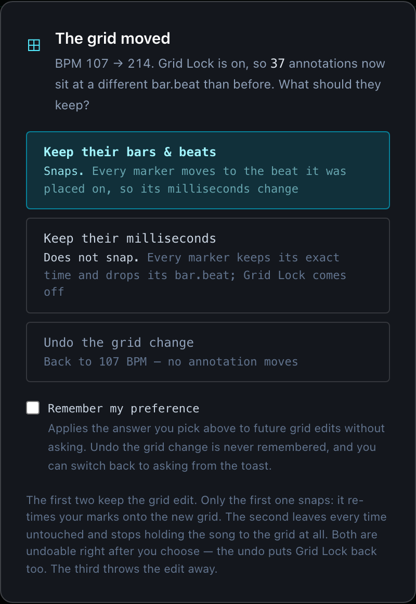

- **Keep their bars & beats** — *snaps.* Every marker moves to the beat it was
  placed on, so its milliseconds change.
- **Keep their milliseconds** — *does not snap.* Every marker keeps its exact
  time, its stored bar.beat is dropped, and **Grid Lock comes off** (see below).
- **Undo the grid change** — the escape hatch for an edit you didn't mean to
  make (a mis-clicked `×2`, a stray offset drag). The grid goes back to what it
  was, and no annotation moves. The button names what it restores, e.g.
  *"Back to 130 BPM"*. Clicking the backdrop does the same.

**Only the first answer snaps.** Keeping the bars & beats re-times every marker
onto the new grid. Keeping the milliseconds holds every time untouched, because
a mark is a claim about the **sound**, and a grid edit does not move the sound.
(It used to round the times onto the nearest new line as well, which is not
keeping them: a `×2` only *adds* lines, so marks that were already exactly right
were nudged off the instants they were placed at.)

Keeping the milliseconds does two further things, both of them the answer
rather than bookkeeping around it:

- **The bar.beat companions are dropped.** A musical position read off a grid
  you have just declined isn't worth keeping — and an annotation with no stamp
  is skipped by the once-per-load realign described above, so nothing can pull its
  seconds onto a bar.beat you never chose. The stamps come back on the next
  save, re-derived from the times you kept: a description of where the marks
  are, not a move.
- **Grid Lock comes off**, and stays off for the song. The lock means the beat
  is the marker's real position; this answer says the millisecond is, and both
  can't be true at once. Left on, it would re-snap on the next grid edit, the
  next load, and every mark placed in between. **Snap to grid** is untouched —
  it only affects marks you place from now on. Turning Grid Lock back on snaps
  the song to the grid again, with its own confirmation and its own undo.

Either answer keeps the grid edit, and the change is undoable from the toast
that follows (it clears itself after about 5 seconds, so undo it while it is
up) — the undo puts Grid Lock back with the annotations. The third answer
throws the edit away instead. The prompt only appears when at least one
annotation would actually land somewhere new.

**Remember my preference.** If you always mean the same thing, tick the
checkbox below the buttons before you answer. That answer is then applied to
later grid edits without asking — the grid moves, the annotations follow, and
you get the undo toast rather than the question. Two things are deliberately
kept out of it:

- **Only the two "keep" answers can be remembered.** *Undo the grid change* is
  never stored — a standing "always undo" would make the grid uneditable.
- **A remembered answer never re-times silently.** The toast still comes up, it
  says the answer was remembered, and it carries an **Ask me next time** button
  next to **Undo** — one click puts the question back for good.

The preference is saved in your browser (under `tc:grid-change-choice`), so it
is per-machine, not per-song and not part of the dataset.

With Grid Lock **off**, seconds are simply canonical: the grid moves and
annotations stay where they are, exactly as before.

Which grid units appear in the dropdown is remembered between visits, saved in your browser under `timecues.inspector.beatGridUnitOptions.v2` (the `v2` reflects a past rewrite of the unit names to be beat-relative). The currently-selected unit itself is *not* persisted — it returns to the default (`Beat`) when you reload the page.

### 4. Algorithm overlays — the Algos dropdown and the Algorithms sidebar

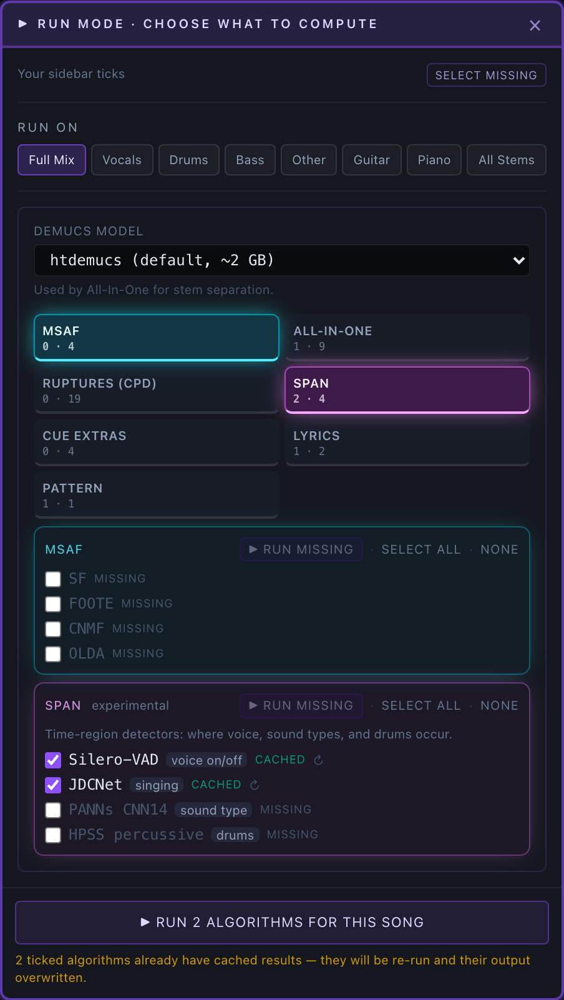

In Algorithm Inspect, which detector results are drawn on the canvas can be set from either of two places, both writing the same visibility set:

- The workspace's right **Algorithms** sidebar: each detector row, grouped by family (Ruptures, MSAF, All-In-One, the experimental SPAN / LOOP / CUE-extras / LYRICS / PATTERN families, and your `is_algorithm=True` custom detectors), carries a checkbox that toggles **that result's overlay** on the waveform. The checkbox is only enabled once the result is **cached** — a missing row stays greyed until you compute it. Each family header also offers **Show all / Hide all** over its cached results. This is the surface that also *computes*: **▶ Run…**, the stem filter, and the cached / missing / failed status all live here.
- The bar's **Algos** popover, for when the sidebar is collapsed. It lists every row that has a result, grouped **Ruptures / MSAF / All-In-One / Custom / Other**, with an **All** / **None** on each group heading and on the popover as a whole, and a badge on the button counting how many overlays are on — which becomes **drawn / ticked** (`1/2`) whenever the sidebar's **Stem filter** is hiding a ticked full-mix row, with an amber note and a **show all stems** link at the top of the popover and a **hidden** marker on the row itself. The list is deliberately *not* narrowed by the Stem filter: dropping the filtered rows out of it would only move the mystery. It is a pure visibility picker — a song with nothing cached yet shows a short note pointing you at the sidebar to run something.

A **Consensus** group sits in that list directly under the boundary families (Ruptures / MSAF / All-In-One) and above the cue / span detectors — one checkbox, `#8b5cf6` (violet), for the Consensus lane: the blend the [Consensus Inspect](#sub-tabs) stage built out of the checked detectors. It lives here rather than under **Annotations ▸ Boundaries**, where it used to sit, because that is what it is — an algorithm result with no items to edit and nothing to save, not something you annotated. It is offered only while that stage has a consensus to draw, starts **off**, and stays out of the **Algorithms** All / None above (which speaks for the overlay rows). Its settings stay in the stage below the timeline; see [Where the consensus is drawn](#sub-tabs) for the lane's own **⬇** and **✕**.

Auto-guess is **not** an algorithm overlay — its live consensus row is toggled from the **Annotations** dropdown's **Auto-guess** control (with the ≥2 / ≥3 / ≥4 min-consensus chips).

Loading an overlay reads `data/algorithm-outputs/analysis/<slug>/<algoId>.json`; results are populated when a song is opened, and computing a missing one is done from the sidebar's **▶ Run…** picker (`runTool`, `src/tools/runTool.ts`).

### 5. Palette

Color swatches for each section type. Click a swatch to change the active palette color; reset to defaults available.

---

## Annotation Workspace


<!-- tc-videos:annotation-workspace -->

**▶ Karaoke lyrics view**

<div style="position:relative;padding-bottom:56.25%;height:0;overflow:hidden;max-width:720px;margin:1rem 0;border-radius:8px;"><iframe style="position:absolute;top:0;left:0;width:100%;height:100%;" src="https://www.youtube.com/embed/S_-2gYOkLuI" title="Karaoke lyrics view" frameborder="0" loading="lazy" allow="accelerometer; autoplay; clipboard-write; encrypted-media; gyroscope; picture-in-picture" allowfullscreen></iframe></div>

**▶ Annotation type tabs**

<div style="position:relative;padding-bottom:56.25%;height:0;overflow:hidden;max-width:720px;margin:1rem 0;border-radius:8px;"><iframe style="position:absolute;top:0;left:0;width:100%;height:100%;" src="https://www.youtube.com/embed/nw6lkLg06Dc" title="Annotation type tabs" frameborder="0" loading="lazy" allow="accelerometer; autoplay; clipboard-write; encrypted-media; gyroscope; picture-in-picture" allowfullscreen></iframe></div>

**▶ Add at playhead chip**

<div style="position:relative;padding-bottom:56.25%;height:0;overflow:hidden;max-width:720px;margin:1rem 0;border-radius:8px;"><iframe style="position:absolute;top:0;left:0;width:100%;height:100%;" src="https://www.youtube.com/embed/aO5A2KgeEeA" title="Add at playhead chip" frameborder="0" loading="lazy" allow="accelerometer; autoplay; clipboard-write; encrypted-media; gyroscope; picture-in-picture" allowfullscreen></iframe></div>

**▶ Workflow status pill**

<div style="position:relative;padding-bottom:56.25%;height:0;overflow:hidden;max-width:720px;margin:1rem 0;border-radius:8px;"><iframe style="position:absolute;top:0;left:0;width:100%;height:100%;" src="https://www.youtube.com/embed/ojc8zd7fJlw" title="Workflow status pill" frameborder="0" loading="lazy" allow="accelerometer; autoplay; clipboard-write; encrypted-media; gyroscope; picture-in-picture" allowfullscreen></iframe></div>

**▶ Choose structure modal**

<div style="position:relative;padding-bottom:56.25%;height:0;overflow:hidden;max-width:720px;margin:1rem 0;border-radius:8px;"><iframe style="position:absolute;top:0;left:0;width:100%;height:100%;" src="https://www.youtube.com/embed/LpwG7tYCDkg" title="Choose structure modal" frameborder="0" loading="lazy" allow="accelerometer; autoplay; clipboard-write; encrypted-media; gyroscope; picture-in-picture" allowfullscreen></iframe></div>

**▶ Split section**

<div style="position:relative;padding-bottom:56.25%;height:0;overflow:hidden;max-width:720px;margin:1rem 0;border-radius:8px;"><iframe style="position:absolute;top:0;left:0;width:100%;height:100%;" src="https://www.youtube.com/embed/ETA_IiTyLl4" title="Split section" frameborder="0" loading="lazy" allow="accelerometer; autoplay; clipboard-write; encrypted-media; gyroscope; picture-in-picture" allowfullscreen></iframe></div>

<!-- /tc-videos:annotation-workspace -->
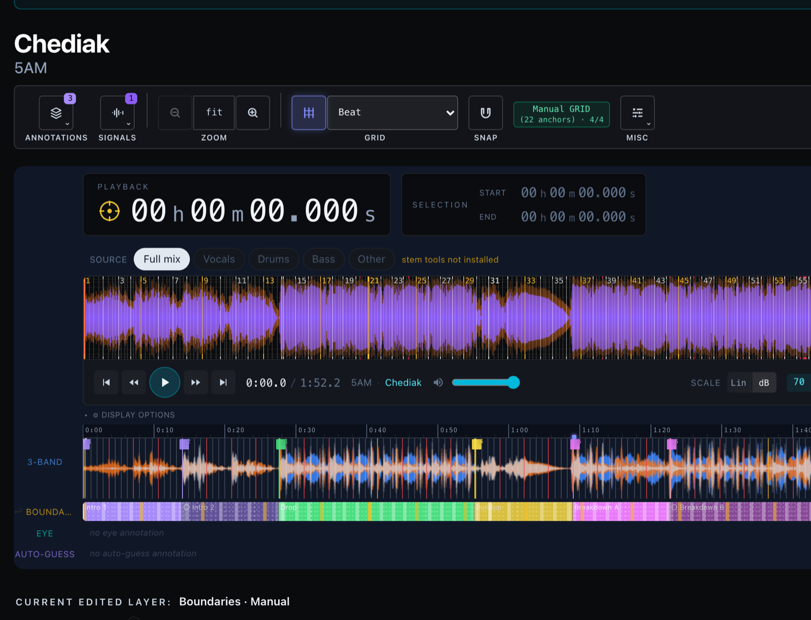

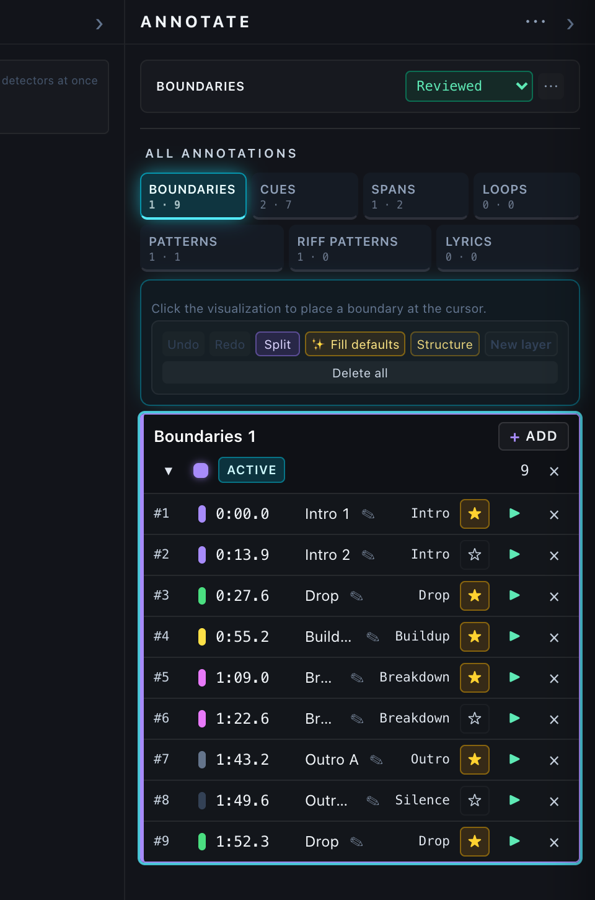

The Annotation Workspace (the **Annotator Tool** tab) is where you mark up one song by hand — labelling where its sections begin and end, and dropping the various kinds of markers (cues, spans, loops, riff patterns) onto the timeline. The song's tools are arranged in three areas you use together: the song list on the left, the audio canvas in the centre with the editor cards directly beneath it, and the annotation controls on the right. This section walks through that right-hand panel, which is where all the marking-up actually happens.

The annotation tools live in a dedicated **right-edge sidebar** (the **Annotate** rail), mirroring the song sidebar on the left. The sidebar holds a slim title bar (**ANNOTATE** label · **⋯** overflow menu · **›** collapse), the **Marker info** panel (one row: the active type's title · Status pill · **⋯** toggle — with the Source picker, Save status and detector Re-run, the Record controls and running-time readout, and Import / Export all sharing a single second row behind the **⋯** toggle), and the **All annotations** list below — which carries a horizontal row of annotation-type chips (Boundaries / Cues / Spans / Loops / Riff Patterns) that select the active type. The **Marker actions** panel — every edit button (Undo / Redo, Split, Mark In / Out, the pending pill, `+ Add layer`, Fill defaults / Choose structure, Delete) shown inline — renders *inside* the list, at the top of the content column for whichever type is currently focused, so the edit controls sit with the markers they act on. The editor cards (Manual sections list, Cues / Spans / Loops / Riff Patterns layer cards, Auto-guess clusters, Detector review list) stay in the centre column directly below the waveform — so the canvas above, the cards below, and the controls on the right are all visible at once. Collapse the sidebar with the **›** chevron in its title bar; reopen it via the **‹ Annotate** tab that pops out on the right edge. Width persists per browser under `tc:annotate-sidebar-width` (min **180 px**, max **640 px**, default **256 px**); collapsed state under `tc:annotate-sidebar-collapsed`. Drag the left edge of the sidebar to resize, or double-click the handle to reset. The keyboard shortcuts panel (press **?**) is also right-anchored and overlays the annotation sidebar while open.

Every custom detector is a **curator**, and none of them appear among the algorithm families any more — their output lives in this **Detectors** sidebar instead, which lists a detector only once it has a result for the song. To compute one, open the Algorithms sidebar's **▶ Run…** picker, open its **Custom** chip, tick the detector and run it. Inside that chip, and in this sidebar, the shipped detectors and your own are listed under separate **Custom** and **Default** titles (yours first), each with its stem headings inside, whenever both kinds are present (see [Default and Custom](#default-and-custom)). When the run finishes the detector appears here, shown on the timeline. **Which curators you see depends on your deployment.** A fresh clone ships only the `example_*` scaffolding detectors and `template.py` (in `tools/python/custom-default/`), kept as reference for writing your own (the contract is `tools/python/custom/CLAUDE.md`), so this sidebar starts nearly empty and fills as you add detectors; a curated deployment such as the hosted demo adds start/stop layers of its own on top. A curator that emits boundaries shows under the **Boundaries** heading in Algorithm Inspect's Detectors sidebar — with none installed, that heading stays empty.

A curator that emits **patterns** — a figure that repeats, like a drum groove — surfaces as a **Riff Patterns** layer, because that is what the riff model already says: the figure is a reusable **node** and each run of it an **instance**. A groove made of several instruments arrives as one node *per instrument* (*Groove A · Kick*, *Groove A · Snare*, *Groove A · Hat*), all placed over the same bars, so the lane stacks them into the three lines a drummer actually plays and you can edit each line on its own. A groove that comes back later in the song reuses the same nodes rather than making new ones, so the document records that the drop plays the verse's groove. Each instance's card carries how its repeats differed — how many were exact, and which step each variation added or dropped. Where the detector measured **how hard** each step was struck, the chip grid draws it as **brightness** — a ghost note faint, an accent full — in the lane and in the node editor alike. It is a hint, not a second switch: a step the detector said nothing about draws at full strength, so hand-drawn nodes look exactly as they always have, and painting or re-tapping a step never writes a loudness. One thing a pattern curator does need: the song must have a **tempo grid**, since a node's length is measured in beats.

The **Detectors** sidebar lives in **Algorithm Inspect**, to the *left* of the Algorithms sidebar. A curated layer is a **proposal**: it is rebuilt from the detector's cache on every render, exists nowhere in your annotation folder, and nothing downstream reads it — so it belongs with the other machine output, not among your own work. (It used to be listed in the Annotator Tool as well, where a guess sat beside a decision with only a colour between them. Copy a curated lane with its **⬇** and the copy — a real, editable layer — turns up in the Annotator Tool; that copy is the whole point of the gesture.) It lists the curated layers **grouped by the Demucs stem they were built from** — currently always **mix**, since all three EDM curators read the full track — and at the top carries a **Show per stem** chip strip — an **All** chip, a **None** chip, and one chip per stem present. **All** shows every curated layer; **None** hides every curated layer in one click (the symmetric clear, lit while nothing is shown). Hiding a stem removes those detector layers from the **timeline canvas** — it drives the same per-layer visibility as the individual checkboxes below each stem heading (so a single checkbox and the stem chip stay in sync). The Annotate rail's **All annotations** list is **your work only** — the hand-authored Boundaries / Cues / Spans / Loops / Riff Patterns (plus the Auto-guess boundary track), never the curated/detector layers, which are not in that workspace at all. The Detectors sidebar collapses to a **‹ Detectors** tab on the right edge and is independently resizable; width persists under `tc:curated-sidebar-width` (max **400 px**, default **340 px**) and collapsed state under `tc:curated-sidebar-collapsed`.

The title bar's **⋯** overflow menu (next to the collapse chevron) groups the two whole-song actions that used to live in a dedicated header row: **↓ Export annotations…** opens the full multi-scope Export Manager (Manual / Auto-guess / every layer type, with optional audio / algo caches / stems buckets), and **✕ Delete all annotations** wipes *every* annotation for the current song — Manual, Auto-guess, plus all user-created Cues / Spans / Loops / Riff Patterns layers — in one shot after a typed `DELETE_ALL` confirmation; only this song's annotations are affected (other songs and other annotators are untouched). The per-marker **↓ Export** (single-click JSON dump of just the active marker) and the per-marker **✕ Delete** (only the active marker type) live inside the **Marker actions** panel (under the active type's chip); see *Marker info & actions panels*.

> ⚠️ **⋯ menu → Delete all annotations is destructive and has no undo.** It removes every annotation kind for the current song in a single operation. Other songs are unaffected. Export first if you want a backup.

The sidebar swaps between editors based on the **type tab row** plus the Source dropdown inside the Marker config panel. The tabs select the annotation kind — **Boundaries**, **Cues**, **Spans**, **Loops**, **Riff Patterns** (Loops + Riff Patterns sit behind the *Experimental annotation types → Loops and Patterns* flag). Inside the Marker config panel the **Source** dropdown lets you switch what's being authored or reviewed for the active kind:

- **Manual** — the canonical user-authored editor (default).
- **Auto-guess** — for **Boundaries** this opens the full AutoGuess clustering + per-point ✓/✗/@ review (unchanged). For Cues, Spans, and Loops it currently shows a *Coming soon* banner — no clustering algorithm has been wired up for those types yet.
- **One entry per matching Custom Detector** — every detector whose `output_kind` matches the active kind appears here (cue detectors under **Cues**, span detectors under **Spans**, loop detectors under **Loops** when the experimental flag is on). Detector entries are prefixed with a small amber `{}` glyph so they're distinguishable from built-in sources at a glance. Selecting one renders the detector's items read-only with **✓ Accept** / **✗ Reject** chips next to each item.

> ⚠ **Detector outputs are a separate file per annotator.** Your first ✓/✗ on a detector's output writes a *copy-on-write* file at `data/annotations/detector-outputs/<detector>/<annotator>/<slug>.json`. Subsequent edits patch that file; the detector's algorithm cache is never mutated. A small amber dot next to the detector entry in the Source dropdown signals "edited copy on disk".

> ⚠ **Re-running a detector that has edited output triggers a confirmation.** If you re-run a detector whose editable file already exists, the run is blocked with a 409 and the UI surfaces a warning suggesting you rename the detector (e.g. `<name>_v01`, `<name>_v02`) or delete the edited file first.

**Copy to manual layer — one prominent button.** Copying a detector's output into something editable is a single, hard-to-miss control: a full-width **Copy → Manual** button sits at the top of the panel (in the *Current edited layer* header) whenever a custom-detector source is selected, for **every** annotation type — Boundaries, Cues, Spans, Loops, and Lyrics alike. The detector-review card below it no longer carries its own copy buttons; the big button is the one place to copy. It **adapts to your review**: with nothing accepted yet it reads **Copy "detector" → …** and copies the whole output in one click (no ✓/✗ review required first, so it works for algorithms with no per-item review state); once you've ✓-accepted at least one item it reads **Copy N accepted → …** and copies only those, with a subtle *"or copy all N items instead"* link beneath it that grabs every item except the ones you ✗-rejected. Copied Cues / Spans / Loops / Lyrics behave identically to a hand-authored layer — fully editable, persist in `data/annotations/layers/<you>/<slug>.json`, and group under **Manual** in the annotations sidebar — but the layer's name keeps the detector label (e.g. *spectral-flux (✓ accepted)* when you copied the accepted subset) and an `importedFrom` field on disk remembers the origin. The original detector-output review file is untouched, so you can keep ✓-ing further items and copy again later.

**Where the output lands.** Type determines the destination: **Boundaries** copy in as **Manual boundary sections** (merged into your existing manual annotation, sorted by time, or a new annotation if none exists yet); **Cues / Spans / Loops / Lyrics** copy in as a brand-new **Manual layer**. **LoCoMotif is the one exception** — see [Copying LoCoMotif into a riff layer](#copying-locomotif-into-a-riff-layer). Either way the Source picker flips back to **Manual** so the freshly-copied, fully-editable result is selected. The button is disabled (with a tooltip) until the detector has produced output for the song — run it from the Detectors panel first. This is the recommended path for promoting a boundary detector's output: selecting a boundary detector source shows its predictions read-only with ✓/✗ chips, and the big button transfers them into Manual.

#### Copying LoCoMotif into a riff layer

Every other interval detector copies into a **Spans** layer, which flattens
what a motif detector actually found. LoCoMotif's answer is *"this figure
recurs — here, and here, and here"*, and a span layer has no way to say that
three bands are the same figure; you would get five unrelated regions and lose
the grouping the model worked to find.

So copying a **LoCoMotif** lane builds a **Riff Patterns** layer instead:

- each `motif_id` becomes one **node** — a boundary node, because LoCoMotif
  reports *where* a motif sits and never how it is subdivided, so the block
  stays honest instead of inventing an empty sub-beat grid;
- each occurrence becomes one **instance** of that node on the timeline.

Occurrences of the same motif therefore share a node and a colour, and the node
carries its **median** occurrence length — LoCoMotif warps occurrences against
each other, so they genuinely differ in duration and no single one is the right
answer. Each instance keeps its own measured length in its sequence entry, and
its end is snapped to the sub-beat grid the riff model derives ends from.

The result is an ordinary layer you own: rename the nodes to what the motifs
actually are, retime the instances, or chain them into combos. It needs a
**BPM** (a riff node's length is measured in beats) — without a beat grid the
copy falls back to the normal Spans behaviour.

**Undo a copy.** Right after any copy-to-manual (the big *Copy → Manual* button, in either its *accepted* or *copy all* mode), an amber **Undo copy** banner appears in the *Current edited layer* header. Clicking it removes the layer that was just added (or, for boundaries, restores your manual annotation to its pre-copy state) and flips the Source picker back to the detector you copied from — handy when you click *Copy* by accident. The banner is dismissable with ✕, and clears automatically when you switch songs. (You can also reach the same undo with `Ctrl/Cmd + Z`, which steps back the shared Cues / Spans / Loops / Riff Patterns edit stack.)

**Review without leaving the canvas.** Detector-sourced cue / span / loop layers render on the timeline in *review mode*: a small ✓/✗ button pair sits on each item. Clicking ✓ or ✗ writes the same `data/annotations/detector-outputs/<detector>/<annotator>/<slug>.json` file the side panel writes — the two surfaces are interchangeable. Accepted items turn teal; rejected items dim to 40% opacity. Editing the item (label, time, range) is disabled in review mode; copy to a manual layer first if you want to refine.

**Auto-guess gets the same copy affordance.** The auto-guess editor header now exposes a **Copy to manual** pair (**✓ accepted** / **all**) parallel to the detector buttons. Because auto-guess produces section boundaries (not layer items), the copied points become **manual section boundaries** in your existing manual annotation (or create one if absent) — the boundaries land sorted by time with `label: "Auto-guess"` and `type: "drop"`, ready to retype or rename. Auto-guess points themselves are also no longer draggable on the timeline: review them with ✓/✗ and copy what you want into the manual annotation when you're ready to refine.

Switching out of Boundaries and back restores whichever Source you last used in this session.

Switching tabs while the song is playing **auto-pauses** the player before the tab change takes effect, so you don't lose your place in the audio while re-orienting in a new editor. Resume with **Space** once you're ready.

**All annotations list** (bottom of the Annotate sidebar). Below the per-type controls, the sidebar carries a single scrollable list that groups every annotation on the current song by type — **BOUNDARIES**, **CUES**, **SPANS**, and (when the experimental flag is on) **LOOPS** + **PATTERNS**. The annotation-type chips (BOUNDARIES / CUES / SPANS / LOOPS / PATTERNS) live in a **horizontal tab row** across the top of the list — all types share one row and split the width evenly; each tab shows its type label plus a compact `layers · items` count. Clicking a tab makes that type active (the tab highlights cyan, or fuchsia for the experimental Loops / Patterns) and points the Marker config + ADD+ controls below at that type. Only the **active** type's controls and layer cards render in the content area beneath the tabs — switching tabs swaps the content. The active type's edit controls sit inside an **accent-tinted frame** that matches the active tab's color (cyan, or fuchsia for Loops / Patterns), so the highlighted tab and its controls read as one panel for the selected type; the layer cards render below that frame. Inside the content column, every layer is rendered as a compact card with the same visualization across types (color stripe, layer name, item count). **Clicking a layer card makes it the active target**: the top tab strip flips to that type, the Source picker in the Marker config panel above swaps to that layer's source (Manual / Auto-guess / a specific detector / a specific user layer), and the ADD+ panel's layer picker aims at the chosen layer. Each editable card also carries its own **+ Add** button in the card header, right of the layer name — press it to insert at the playhead into *that* layer (which also makes the card active); it sits in the header rather than under the item list so it stays in reach on layers with hundreds of items. The active card gets a cyan **active** badge + a brighter accent ring; the layer is also auto-expanded on click so you can see the items you're about to add to. **Exactly one card across the whole sidebar is highlighted as active at a time** — the one that matches the currently-active tab. The other sections still *remember* their last clicked layer (so flipping tabs lands ADD+ on the right target), but they don't render an active badge until you switch to their tab. The little **▾ / ▸ caret** on the left of the card header is a dedicated **collapse toggle** — click it to fold the item list away (the header stays visible with its count) without changing the selection. Collapse state is per-card and resets when you reload the page. The card header also carries a small **× delete** button on its far right that removes the **whole layer** in one click (⌘Z to undo) — for boundaries this clears every Manual section; for the multi-layer types it drops the entire layer from the document. There is **no confirmation** — the action is immediately undoable from the editor's undo stack. On user-created **Cues / Spans / Loops / Patterns** layers the **layer name in the card header is editable inline** — click the **✎ pencil** directly beside the name and type to rename (⌘Z to undo); the whole rename coalesces into a single undo step. Boundary cards keep their fixed source name (Manual / Auto-guess / detector) and read-only layers stay non-editable. Each item row shows `#N`, the timestamp (or start → end for intervals), the label, a **critical/optional ★ toggle**, a ▶ glyph, and a small **× delete** button on the far right; clicking the row body **seeks the playhead** to that time (and plays the item's whole extent — a **boundary** runs to the next boundary, since that stretch is the section it opens (the last one plays to the end of the track), spans and loops run to their own end, a **pattern** or **riff pattern** runs through *every* repeat — the row shows one cycle, but playing it audits the whole tiled region (`start + ×N cycles`), which is what you see on the canvas; a repeating row is marked with its ×N count beside the label — and a lone **cue** has no extent so it gets a short audition blip), while the **★** toggles between critical (amber) and optional (muted) and the **×** removes that single item (⌘Z to undo — deletes go through the same undo stack as the rich editor below the waveform). On those same editable user layers the **label is an inline text field** — click it in the row and type to edit (⌘Z to undo); on boundaries and read-only sources the label stays static and is edited from the panel in the centre column. Boundary "layers" are synthesised one-per-source (Manual / Auto-guess / each cached boundary detector) so the section reads the same way as the multi-layer types — only sources that actually have data show up; clicking one of them switches the Boundaries source picker to that origin. The ★, the per-item ×, and the per-layer × all render only on editable layers: **Manual boundaries** and user-created **Cues / Spans / Loops / Patterns** layers. Read-only sources (**Auto-guess**, custom-detector outputs, detector-derived layers) still show the row's label + ▶ but the edit buttons are hidden — edit those from their own panel in the centre column. Switching the active type — by clicking a rail tab, a layer card here, or **an annotation on the canvas** (see [Shared edit popover](#shared-edit-popover-annotationpointcardtsx)) — updates the highlighted tab and aims the per-type controls above at that type.

A per-tab **stopwatch** runs whenever that tab is focused; the cumulative duration is saved to `data/annotations/timing/<annotator>/<slug>.json` on tab switch, song change, or page unload. The running time shows under the Marker info panel's **⋯** toggle, on the same row as its Start/Stop/Reset controls, and applies to **every** annotation type — the boundary sources (Manual / Auto-guess) key the timer on the active source, while the layer types (Cues / Spans / Loops / Riff Patterns) key it on the type itself.

### Marker info & actions panels

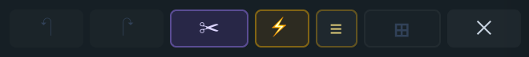

The per-marker controls are split across **two** panels. The **Marker info** panel sits at the top of the Annotate sidebar; the **Marker actions** panel renders *inside* the All-annotations list, at the top of the content column for the currently-focused type (so the edit buttons live next to the markers they act on, and move as you switch types).

**Marker info panel** (top of the sidebar). Two rows, never more. The first row is the whole collapsed panel: the active type's **title** (re-labelled when you click a different type chip), the workflow **Status** pill, and the **⋯** toggle. Pressing **⋯** adds a single second row carrying everything else — the **Source** picker with the inline **Save** indicator and the detector **↻ Re-run** button, the **●/▶ Record** / **■ Stop** / **↺ Reset** controls with the running-**time** readout, and the **↑ Import** / **↓ Export** buttons. The record/stop/reset buttons are icon-only (hover for the label) and the Source picker truncates its name in a narrow sidebar (its full name is in the tooltip and in the open dropdown) — the open dropdown lists Manual and Auto-guess first, then the detectors, under **Custom** and **Default** titles when both kinds are present, so the row fits on one line at the default sidebar width; drag the sidebar wider for more breathing room. Boundaries' **Coloring** toggle keeps a line of its own below. The toggle's open/closed state persists per browser under `tc:annotate-info-more-open` (default closed).

**Marker actions panel** (under the active chip). Every edit button is shown **inline** (no ⋯ toggle), each one **labelled with the verb it performs** — *Undo · Redo · Split · Mark In · Mark Out · ✨ Fill defaults · Structure · New layer · Delete all* — laid out on an even **grid**: every button gets the same column width, so the verbs line up in tidy lanes however many of them there are (hover any button for the longer explanation and its keyboard shortcut). Only the verbs that apply to the active type render, and the grid wraps onto further lines for the types that expose many of them (Manual boundaries, Spans / Loops); a verb left alone on the last line keeps its column width instead of stretching across the panel. **Import / Export are not in this row** — they live behind the Marker **info** panel's **⋯** toggle (when the source is a custom detector, Import is replaced by the **↻ Re-run** button there). The full multi-scope export and the whole-song delete-all still sit in the sidebar title bar's **⋯** overflow menu (one level up).

The row behaviors below are unchanged; only their location moved — every button that used to be "always visible" or "under ⋯ More" in the old single strip now shows inline in the actions panel, except the Source / Save / Re-run / Status / Record fields which live in the info panel.

| Panel row | Behavior |
|-----------|----------|
| **Source** *(always)* | The Source dropdown described above (Manual / Auto-guess / one entry per matching custom detector). |
| **Status** *(always)* | `● Not started` / `● In progress` / `● Reviewed`. Auto-bumps to *In progress* on the first added marker and falls back to *Not started* when the last marker is deleted — including after a *✕ Delete* on a track you had marked *Reviewed* (deleting every marker resets the workflow so re-adding starts fresh in *In progress*). Each annotation type carries its own status (Manual's lives in the annotation JSON, the layer types in `statusByType` on the layers document). The inline save indicator (`Saving…` / ✓ `Saved` / ⚠ `Save failed`) sits next to the pill. |
| **↻ Re-run** *(always, detector sources only)* | Replaces Import when the active source is a custom detector — clicking re-runs the Python script for the current song (no file upload — detector outputs come from the script, not from disk). If you've already accepted/rejected items on the detector's output (an edited copy-on-write file exists at `data/annotations/detector-outputs/<detector>/<annotator>/<slug>.json`), a confirm dialog warns that re-running will overwrite your edits and suggests renaming the detector (e.g. `<name>_v01`, `<name>_v02`) instead. |
| **Time** *(under ⋯, every annotation type)* | Cumulative duration readout tucked under the **⋯** toggle, on the same row as the icon-only **●/▶ Record** / **■ Stop** / **↺ Reset** buttons. Boundary sources (Manual / Auto-guess) key the timer on the active source; layer types (Cues / Spans / Loops / Riff Patterns) key it on the type itself. |
| **✕ Delete** *(always)* | Far right of the row. Wipes this annotation type for the current song after a confirm dialog. |
| **Import** *(under ⋯, Manual only)* | TimeCues JSON, Audacity `.txt`, Sonic Vis / REAPER `.csv`, JAMS, mir_eval `.lab` for boundaries; JSON-only for layer types. Hidden when the source is a custom detector (replaced by **↻ Re-run**, also under **⋯**). |
| **↓ Export** *(under ⋯)* | Single-click JSON dump of just the active marker. The filename always carries the marker kind so unrelated downloads don't collide: `manual-<slug>-<stamp>.json`, `auto-guess-…`, or `cues-all_layers-…` / `spans-all_layers-…` / `loops-all_layers-…` / `patterns-all_layers-…` for layer types (one file = every layer of that type for the current song). For multi-scope / multi-format / dataset-wide exports, use the title bar's **⋯ → Export annotations…** instead. |
| **Edit** *(actions panel)* | **Undo** (⌘Z), **Redo** (⇧⌘Z) on supported types, and **Split** at the playhead when applicable. For **Manual** Split splits any section containing the playhead. For **Spans/Loops** the *focused* item (click it on the canvas) must contain the playhead, otherwise Split is disabled with an explanatory tooltip — we never silently pick a layer the user can't see being chosen. Hidden on **Cues** (points can't split) and **Riff Patterns** (splitting a cycle would break the `repeatCount` × cycle tiling). |
| **▶\| Mark In @ `<time>`** / **\|◀ Mark Out @ `<time>`** *(always visible on the Spans / Loops marker bar — between the timer slot and the Delete button)* | Two-step ADD buttons that build a **brand-new** span / loop at the cursor — they do **not** edit any existing item. **Mark In** (green) stashes the current playhead as the start of a new region; the pending pill below the toolbar updates to show `@ <time>` with a "Click Mark Out or drag for a region" hint. **Mark Out** (red) commits the new item with `[stashed Mark In, current playhead]` as its range and zoom-to-fits the new item so you can immediately see what you created. Mark Out is disabled with a "Click Mark In first" tooltip until a Mark In has been stashed. Use the per-row **⌐ / ¬** chips inside the editor list to snap an *existing* item's start / end instead. Keyboard shortcuts: **`I`** (Mark In) / **`O`** (Mark Out). The pending **range** band (drawn once Mark Out fires, or as soon as you drag a region) renders on **every** row in the viz stack — 3-Band, Spectrogram, EQ, MFCC, Chroma, Tempogram, SSM, the Energy / Brightness / Novelty / Onsets / Flux sparklines, **and** the Boundaries / Auto-G lane rows plus every user-created Cue / Span / Loop / Riff Pattern layer row — independent of the **Overlay on signals** toggle, so the in-progress selection stays visible no matter which row your eye is on. |

Directly below the panel, the **add-panel** shows one of two mutually-exclusive controls (never both, to avoid two competing "Add" buttons side-by-side):

- **Pending viz selection pill** — appears whenever you click or drag the visualization above. It reads as two lines: a **caption line** with the selected timestamp (or `t1 → t2` range), the **name of the layer the add will land in** when the type has more than one, and the **✕** that clears the selection; and an **action row** below it whose buttons (**+ Add**, its layer **▾**, and the extras *that type* offers — **→ Riff Node** on Cues, **⚡ Energy** on Spans) share equal columns. Each extra appears only under the type that owns what it makes, so a button in this row never quietly files its result under a type you aren't looking at. The target layer is named on the caption line rather than inside the **+ Add** label, so a long layer name can't push the other actions off the row. While this pill's **+ Add** is actionable, the playhead chip below is hidden. **Boundaries (Manual)** accept both: a single click anchors a t1-only pill (on confirm the click is where the section *ends* — it runs from the previous boundary, or `0:00`, up to t1, and an `unset` cap is left at t1), and a drag opens a `t1 → t2` range pill that drops **two** boundaries on confirm — a `Drop` at t1 and an `unset` placeholder at t2 to cap the new section. Spans / Loops / Patterns are range-only and always require a drag.
  > **Any highlighted region counts as the selection.** If a preview highlight is on the canvas — a fresh drag, a band you moved or resized afterwards, or the 6-second window **L** opens — **+ Add** adopts *that* range, on every type. Adding never falls back to the playhead while something is highlighted, so what you see selected is what gets created. This applies to Spans, Loops, Patterns, Lyrics, Riff Patterns (its **+ Add** menu offers *New Node / New Boundary Node / New Instance (from selection)*), Manual boundaries, and Cues. It applies to the Riff Patterns sidebar's own section adds too: the **Instances** header's button reads **+ Add 1:14.7–1:59.5** while a region is highlighted and creates exactly that span, and falls back to **+ Add @ 0:00.0** — a 4-second instance at the playhead — only when nothing is.
  >
  > **Every add surface follows the rule, not just the pill.** The layer toolbar above the editor cards, the trailing **+ Add** card at the end of the item row, the **+ Add** button on each layer card in the sidebar, and the keyboard **M** all adopt the highlighted region too. Each of those buttons **relabels itself** to what it is about to create — `+ Add 0:32.9→0:34.2` while a region is highlighted, `+ Add @ 0:30.8` when nothing is — so the button never advertises the playhead and then lands something else. On **Loops** the two bar quick-adds (`+ 4-bar loop` / `+ 8-bar loop`) collapse into that single range button while a region is highlighted, since the region already carries its own length. The one carve-out is the **Cues** layer toolbar's `+ Add cue @ <time>`, which stays a playhead drop — cues are points, and the pill above is the surface that turns a region into one.
  > **The drag doesn't have to stay on the row.** Once a drag starts, it keeps painting wherever the pointer goes — off the top or bottom of the row, or left past the start of the song, which is how you select a region that begins at `0:00`: press inside the canvas and pull left past the label column. The times simply clamp to the song. Press **Esc** mid-drag to abandon the selection.
  > **Cues are the exception on shape, not on position:** a cue is a single point, so a highlighted region adds **one cue at the region's start** and the region's end is discarded. The pill flags this up front with a small *start only* note, and a toast confirms it after the add — if you meant to mark a region, use Spans or Loops instead.
- **+ Add @ `<time>`** — with nothing highlighted (see the rule above), inserting a new item at the current playhead happens **on the layer card itself**: every editable layer card in the *All annotations* list below carries a **+ Add** button in its header, so the card you press is the layer the item lands in. The add-panel only falls back to a single big **+** when the active type has **no layer card yet** — that press bootstraps the first layer/section along with the first item. (For region-only types like Spans/Loops/Patterns, a single click on the canvas leaves the pill in a "Drag for a region" hint state — the per-layer add rows stay available in that case.) **Riff Patterns** keeps the big **+** regardless: it has to ask *what kind* of thing to create (Node / Boundary Node / Combo / Instance) before it can pick a target.

The accent color tracks the active type (violet for Manual, etc.).

### Boundaries editor

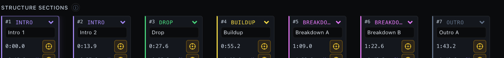

The Boundaries editor is where you build a song's structural map by hand: a list of sections (intro, build-up, drop, and so on), each with a start time, a label, and an importance flag. This is the canonical, audio-driven ground truth — the thing detectors are scored against. Each section appears as a card below the waveform, and you add, split, retime, and label them here.

**Empty state** — when the Manual annotation has no sections yet, the editor matches the other annotation types: a slim **Structure Sections** header (just the section-vocabulary ⓘ info button) and a single italic line in the body pointing the annotator at the **Annotate** sidebar on the right. Both bootstrap (no annotation file yet) and "annotation exists, zero sections" share this layout. Every setup action — **+ Add @ `<time>`**, **✨ Fill defaults**, **≡ Choose structure…** — lives in that right sidebar; in the bootstrap state the first press of **+ Add** also creates the annotation file along with the first section.

The Manual-only setup buttons live in the Annotate sidebar directly below the **+ Add** chip and only appear when BPM is set (without one, bar-based layouts can't be projected onto song time):

- **✨ Fill defaults** — pre-fills immediately using either the cached algorithm suggestion (label shows `✨ Fill (N)` when N suggestions are available) or the genre preset configured in Settings → Vocabularies & taxonomies → **Manual ‘Fill default’ layout**. The tooltip shows which preset is currently configured.
- **≡ Choose structure…** — opens `FillDefaultsModal` so you can pick a layout for this song (genre preset, equal-bar split, or a free-form `type:bars` list). Applying it affects only the current song and does **not** change your saved default — unless you press **☆ Set as default** (footer, left of Cancel/Apply), which persists the current selection to Settings → Vocabularies & taxonomies → **Manual ‘Fill default’ layout** so it's pre-selected for every song from now on. The dialog opens pre-selected to that saved default; once the selection matches it, the control reads **★ Default structure**. (Equal-bar splits adapt to each song's length and can't be saved as a default — pick a preset or a custom list to enable the control.) When the chosen layout exceeds the song, a **Shrink to fit song length** checkbox appears in the preview — toggle it to keep section ratios while scaling every section's bar count so the whole layout fits inside the song (instead of trimming sections off the end).

**A single marked point is where a section ENDS.** Sections tile, so a lone mark can't mean "start here" without leaving the music in front of it unannotated — the annotator would be left with a hole at the head of the lane. So one mark closes the stretch that was still open:

| Layer state | One mark at `t` gives |
|-------------|-----------------------|
| Empty | `Drop` at **0:00** + an `unset` cap at `t` — the first section covers the song from the start up to your mark |
| Ends with an `unset` cap | That cap becomes a real `Drop` (it's the start of the section you just closed) + a new `unset` cap at `t` |
| Ends with a typed section | An `unset` cap at `t` — the trailing section now stops at your mark instead of running to the song end |
| `t` falls *inside* the annotated region | A plain split: a new `Drop` at `t`, everything else untouched |

Marking along with the music therefore lays sections down back-to-back, each one closed by the mark that ends it, with the undecided tail always carrying an `unset` cap. A mark that lands on an existing boundary (±50 ms) changes nothing.

**The mark lands where the cursor is when you press ADD**, not where it was when you clicked. Every add path — the pill's **+ Add**, a layer card's **+Add**, the **M** shortcut — reads the playhead at the instant of the press, straight off the audio clock. So you can click once to set up, hit play, listen, and tap ADD on the beat the section ends: the boundary goes *there*. While the song is playing the pending pill stops showing a timestamp and reads **@ playhead** to say so. Paused, the cursor is still sitting on your click, so the pill's own (snapped) time is what gets written.

> **This is how every annotation type places a mark**, not just boundaries — Cues, Spans, Loops, Lyrics and Riff Patterns all read the same audio clock at the moment of the press, and **M** additionally dates the mark to the instant the key went *down* rather than the instant the app got round to handling it. The times shown on screen (the `+ Add @ 0:30.8` labels, the transport readout) can only refresh once per frame, so on a busy timeline they run a few tens of milliseconds behind what you are hearing; what gets written does not. If a mark still lands somewhere you did not expect, check **Snap to grid** — with snap on, the mark is rounded onto the grid by design, to the unit **GRID** is set to. Two marks placed inside the same grid step therefore round to the same instant, and the second is refused as a duplicate rather than stacked invisibly on the first; pick a finer unit if you need them apart.

> **A second mark on the exact same spot is refused.** Adding twice at one
> instant is easy to do by accident — paused, the clock isn't moving, so a
> double-press of **M** (or a second click of **+ Add** when you weren't sure
> the first registered) resolves to the identical time; with **Snap to grid**
> or **Grid Lock** on it happens during playback too, because every time
> inside a beat rounds to the same beat. The duplicate would land exactly
> underneath the first one and you'd have no way to see it on the canvas — it
> would only turn up later in an export or as a phantom disagreement in an
> evaluation score. So the add doesn't happen: the item already there is
> selected instead, and a notice at the bottom of the screen names its time.
> This applies per **layer** and per **kind** — the same cue time in two
> different cue layers is the point of having layers, a span only counts as a
> duplicate when *both* its edges match, and a lyric word and a lyric line
> that begin together are different annotations. The bar is the millisecond
> the document stores, so anything you could hear as two separate events (a
> flam 30 ms apart, say) still goes in. Boundaries are the one layer that is
> stricter, and always has been: they tile, so a mark within **±50 ms** of an
> existing boundary changes nothing.

**Adding sections** — three insertion paths:
- **+Add** at the end of the list
- The hover-revealed **+** between two existing cards (this one inserts *between* the two cards at the playhead, so it's a plain split, not an end-mark)
- Keyboard **M** at the current playhead. The shortcut is context-aware: it adds a section boundary in **Manual** mode, or a cue (in the focused / first cue layer) in **Cues** mode.

Plus the **pending viz-selection +Add** (described in the *Annotations toolbar* above):

- **Single click** anchors a t1-only pending pill at the cursor; **+ Add** applies the end-mark rule above. A t1-only pending mark shows only in the pill — nothing is drawn on the canvas, so the playhead stays the one cursor on the timeline.
- **Drag** opens a `t1 → t2` range pill *and* starts preview-play of the highlighted range. **+ Add** drops **two** boundaries in one gesture: a `Drop` at t1 (the labeled section you just highlighted) and an `unset` placeholder at t2 (a `—` end-cap so the new section actually stops at t2 instead of swallowing whatever follows). Convert the placeholder to a real type from the dropdown when you're ready. If a drag-end coincides (≤50 ms) with an existing boundary, only the novel endpoint is inserted; a zero-width drag collapses to the single-click behavior.

**Per-section card** (`SectionCard.tsx`)

| Control | Behavior |
|---------|----------|
| **Type** | Dropdown driven by `sectionTypeVocabulary` setting. Default: `intro`, `buildup`, `drop`, `breakdown`, `bridge`, `outro`, `silence`. The sentinel type **`unset`** (an invisible placeholder for boundaries whose type you haven't decided yet) is always appended — it can never be removed from the dropdown. Auto-generated labels are kept in sync with the type; manual labels are preserved. |
| **Label** | Free text (e.g. *Drop 1*), edited inline directly on the card — click the field under the type dropdown and type. The floating edit popover edits the same field. |
| **Notes** | Longer free-form description. Stored on the boundary as `description`. Visible only in the floating edit popover, not on the inline card. |
| **Start time / End time** | MM:SS.mmm. Toggleable to beats/bars when BPM is set (Settings → Time unit). Each has a `@` snap-to-playhead button. |
| **Importance** ★ / ☆ | Critical (★) vs. optional (☆). Optional sections render with a dotted overlay; excluded from critical-only evaluation. |
| **Candidate starts** | The **+** below the start time records an alternative timestamp for ambiguous boundaries. Duplicates within 0.05 s are silently rejected. Each candidate is a small pill below the label. |
| **Split (S)** | Divides the section at the current playhead; the two new labels get `~A` / `~B` appended. |
| **▶ Play** | Auditions from the section start to the next section's start. |
| **× Delete** | Removes the card. |

**Bulk actions**

- The Source dropdown, status pill + save indicator, recording timer, and per-marker **✕ Delete** live in the **Marker config** panel above this editor (see *Marker config panel* above) — not inside the editor itself. Import, single-click **↓ Export**, Undo / Redo, and Split sit one click away behind the panel's **⋯** toggle. The full multi-scope **↓ Export annotations…** and the whole-song **✕ Delete all annotations** live in the sidebar title bar's **⋯** overflow menu.
- **Info modal** — opens definitions and default colors of the section types.

**Persistence**

Edits debounce 800 ms to `data/annotations/layers/<annotator>/<slug>.json` — the same document that holds your Cues, Spans and every other layer type. Schema in §20.

### Auto-guess panel

Auto-guess is a head start on annotating: instead of marking every boundary from scratch, it runs 30+ detectors, groups their predictions into clusters wherever several algorithms agree a transition happens, and presents each cluster as a candidate you accept (✓), reject (✗), or nudge. It's the fastest way to bootstrap ground truth on a fresh song — you're reviewing the machine's guesses rather than starting from a blank timeline. The controls below set how aggressively predictions are clustered; the per-cluster cards are where you do the accept/reject review.

**Marker config** — Auto-guess uses the shared Marker config panel above too: Status (Not started / In progress / Reviewed) writes the `auto_guess_status` field on the auto-guess annotation (`none` / `wip` / `done`), which drives the sidebar status badge and the per-song color tier; the panel's single-click **↓ Export** drops a `auto-guess-<slug>-<stamp>.json`; the section header's **⤓ Export** reuses the full Export Manager modal; Delete clears the saved auto-guess annotation for this song. There is no Undo, Import, Split, or shared "+ Add" affordance — auto-guess is computed from algorithm outputs, not authored, so the per-cluster ✓/✗/@ review below is the canonical edit surface.

**"Evaluate as 'Manual'" header**

The Auto-guess panel introduces its clustering controls under a single labeled header. Two inline controls always stay visible; a popover holds the rest. (Consensus Inspect clusters the same way but no longer shares this shape — it leads with a verdict and keeps the same four parameters in a drawer; see [The verdict, and the drawer under it](#the-verdict-and-the-drawer-under-it).)

- **Cluster window** (inline slider) — `0.5–10 s`, default `3 s`. Moved out of the popover so τ is always visible.
- **SETTINGS chip** — opens the popover. Summary mirrors popover state, e.g. `3/3 · 3s · MetaMed · ≥2`. Inside:
  - **Algorithms** (multi-select). Toggles per detector. In the Consensus Inspect panel — where the same list lives behind the **N of M detectors** button in the drawer — the example detectors (`example_*`) ship as templates, so they start **unchecked** and stay out of the consensus until you tick them on — real detectors are selected automatically as they finish. A detector is only ever offered **once**: one you uncheck stays unchecked through the next detector run, and a selection that arrived from the other panel is kept as it came. Only a genuinely new detector — one this panel hasn't seen for this song — joins on its own.
  - **Centroid method** (radio): `Mean`, `EqGrp`, `MetaMed`, `Plural`, `NearRaw` — see [Auto-Guess Internals](#auto-guess-internals).
  - **Min-consensus / Min-agreement** (1–N): only clusters backed by ≥N *distinct algorithms* survive — see [Min-agreement filter](#min-agreement-filter).

**Moving the settings between the two panels**

Both panels cluster the same detector output with the same four controls, but
only one of them can tell you whether a setting is any *good*: Consensus
Inspect scores its blend against a reference live (mir_eval P/R/F1, the custom
metrics, the hit/miss tiles on the timeline), while Auto-guess is where the
result is reviewed and saved. Two buttons carry one configuration — cluster
window, min-agreement, centroid method, and the checked detectors — between
them, so a setting tuned against the scores doesn't have to be retyped into the
panel that keeps it:

- **Tune in Consensus Inspect →** (Auto-guess panel, beside **Generate**) —
  opens Consensus Inspect with the Auto-guess panel's current settings. A line
  under that panel's header says they arrived from Auto-guess.
- **⬇ Use for Auto-guess** (beside the Consensus Inspect verdict) — opens the Annotator Tool's
  Auto-guess panel with the settings you just tuned. A line under the header
  spells out what landed — `±4s · ≥3 · NearRaw · 45 detectors` — and reminds you
  to press **Generate**, which is the only action that rebuilds the points.
  Until then nothing in the saved annotation has changed; dismiss the line with
  **✕** to go back to the settings the stored points were built with.

> ⚠️ **The circularity guard.** Consensus Inspect can score its blend against
> *Auto-guess* (see [Reference toggle](#reference-toggle--what-youre-scoring-against)) — and building
> Auto-guess from a consensus that was graded against Auto-guess is the
> consensus grading itself, which reads as a perfect F1 and means nothing. So
> with the reference set to Auto-guess, **⬇ Use for Auto-guess** stops and says
> so: **Use Boundaries** switches the reference to your manual boundaries so
> the numbers mean something (and cancels the trip), **Send anyway** goes
> through unchanged.

**Per-cluster review card**

Each cluster has:

- **Size badge ×N**: green (≥4), blue (3), amber (2), gray (1).
- **Representative-time button** — seekable. Amber pencil indicator = manually adjusted.
- **Per-source chips** — each contributing algorithm + its original prediction time. In "partial" mode each chip carries an independent ✓/✗ toggle ("accept individual sources").
- **Top-level review buttons**: ✓ correct, ✗ incorrect, ⋮ expand, ☒ delete.
- Inside expand: ▶ audition (~4 s from the source's original time), numeric override, **Use player**, **Reset to mean**, **Adopt from `<algo>`**.
- **No drag on the canvas.** Auto-guess and `is_annotation=True` custom-detector boundary points are review-only on the timeline — ✓/✗ and play, but not drag-to-retime. If you want to refine timing, copy the points into a manual annotation via the **Copy to manual** buttons in the side panel and drag from there.

**Macro-zoom collapse**

When the canvas is zoomed below `autoGuessExpandZoomThreshold` (Settings → Auto-Guess defaults, default **2×**), each cluster collapses to a single **chevron**. Click the chevron (or its section block above) to reveal that point's button cluster. Set the threshold to `0` to disable the collapse and always show full buttons.

**Adding missed boundaries**

- **+Add at `<player time>`** creates a size-1 cluster at the playhead. The new point carries `status=correct`, `correctionSource=manual`, empty `sources`.

**Persistence**

Debounced 1 s to `data/annotations/auto-guess/<annotator>/<slug>.json`.

---

## Cue, Span, Loop, and Riff Pattern Layers


<!-- tc-videos:cue-span-loop-and-riff-pattern-layers -->

**▶ Cue layer**

<div style="position:relative;padding-bottom:56.25%;height:0;overflow:hidden;max-width:720px;margin:1rem 0;border-radius:8px;"><iframe style="position:absolute;top:0;left:0;width:100%;height:100%;" src="https://www.youtube.com/embed/-9GAFn4ve_E" title="Cue layer" frameborder="0" loading="lazy" allow="accelerometer; autoplay; clipboard-write; encrypted-media; gyroscope; picture-in-picture" allowfullscreen></iframe></div>

**▶ Span layer**

<div style="position:relative;padding-bottom:56.25%;height:0;overflow:hidden;max-width:720px;margin:1rem 0;border-radius:8px;"><iframe style="position:absolute;top:0;left:0;width:100%;height:100%;" src="https://www.youtube.com/embed/HEZ-inM2tes" title="Span layer" frameborder="0" loading="lazy" allow="accelerometer; autoplay; clipboard-write; encrypted-media; gyroscope; picture-in-picture" allowfullscreen></iframe></div>

**▶ Loop layer**

<div style="position:relative;padding-bottom:56.25%;height:0;overflow:hidden;max-width:720px;margin:1rem 0;border-radius:8px;"><iframe style="position:absolute;top:0;left:0;width:100%;height:100%;" src="https://www.youtube.com/embed/z__Evjya3TA" title="Loop layer" frameborder="0" loading="lazy" allow="accelerometer; autoplay; clipboard-write; encrypted-media; gyroscope; picture-in-picture" allowfullscreen></iframe></div>

<!-- /tc-videos:cue-span-loop-and-riff-pattern-layers -->
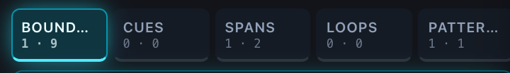

Boundaries divide a song into sections, but a lot of what you might want to mark doesn't fit that mould — a single hit, a region where the vocal sits, a four-bar loop to practice, a recurring rhythmic figure. These four annotation *kinds* cover those cases, and they sit alongside boundaries rather than replacing them. Each kind is organised into **layers**: a layer is just a named, colored container of marks, so you can keep (say) your "kick hits" cues separate from your "FX triggers" cues. Briefly:

- a **cue** is a single moment in time (a point);
- a **span** is a labelled stretch with a start and an end (spans may overlap);
- a **loop** is a bar-aligned region meant for seamless repeat playback;
- a **lyric** is a word (a point) or a line (a start–end stretch) of the sung text, shown on the timeline as a tick with the word next to it.

**Cues and Spans are always available.** Loops and Riff Patterns are off until you switch on **Experimental annotation types → Loops and Riff Patterns** in Settings; **Lyrics** is off until you switch on **Experimental annotation types → Lyrics** (`experimentalLyricsFamily`). There is no curated Lyrics detector — get a lyrics layer by running the **Whisper** or **CTC forced-aligner** algorithm (Algorithm Inspect) on the vocals stem and using **Copy to manual layer** on its overlay, then correct it in the Lyrics editor: each row carries the time, the text, a **word ⇄ line** toggle, and — for lines — an end time. When a stretch of the song came back wrong or empty, you don't have to retype it or re-run the whole song: [Re-transcribe this section](#re-transcribe-this-section-lyrics) in Algorithm Inspect re-reads just that window — on a cleaner stem if you like — and writes the words into this layer. Toggle a row to *line* to give it a duration band; *word* rows are points.

**Lyrics have their own snap picker, and it starts Off.** The layer toolbar row
in the Lyrics editor carries a granularity selector that only this layer obeys —
the global **Snap** toggle and **Grid Lock** never move lyric times (see
[Lyrics opt out of the global switches](#lyrics-opt-out-of-the-global-switches)).

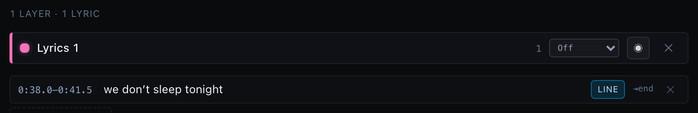

The choices, loosest to tightest:

| Setting | What it does |
| --- | --- |
| **Off** (default) | Nothing is ever moved. The times stay exactly as sung — what an aligner produced, or where you tapped. |
| **Magnetic** | Pulls a time onto the nearest 1/16 line **only when it is already within about 30–40 ms** of it (the window tightens at fast tempi so it stays an assist rather than a hard snap). A hand-tapped word gets tidied; a deliberately laid-back or pushed line keeps the offset that makes it sound human. |
| **¼ Beat / ½ Beat / 1 Beat** | Hard snap to 1/16, 1/8, or the beat. Worth it on genuinely quantised material — rap on 16ths, a chanted hook — where the vocal really is locked to the grid. |

There is deliberately no **1 Bar** option: a sung word landing exactly on a
downbeat happens, but forcing every word there would turn a vocal into a
metronome. The setting is per layer, so a tight rap layer and a free-sung
chorus layer on the same song can differ.

#### The Karaoke panel — and which layer it follows

While the **Lyrics** type is active, a **Karaoke** card sits under the canvas and
renders the lyrics as flowing text rather than the thin timeline row that is built
for alignment work: the current line large and centered with the word under the
playhead lit, the previous and next lines dimmed for context, and a `line n/total`
counter on the right. Click any word to seek to it.

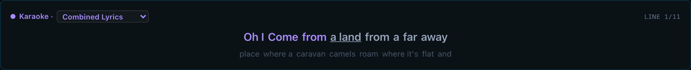

With **one** lyrics layer the header simply names it. With **two or more** — a
Whisper transcript next to the hand-corrected copy you made from it, say — the name
becomes a **picker**, tinted in the chosen layer's color, so you can read either
version against the same playback.

Picking a layer here **selects it everywhere else too**: its timeline row becomes the
selected one and the editor below switches to it, so the karaoke text, the row you
are looking at, and the rows you would edit are never three different layers. If the
layer you pick was **toggled off the canvas**, picking it turns it back on — the
picker deliberately lists hidden layers for exactly that reason, since choosing to
sing along with a layer you cannot see would be no use.

The pick holds until you click a lyric word somewhere else (on the canvas or in the
editor list); clicking a word has always steered this panel and still wins, so the
two controls never fight over it. With nothing picked and nothing clicked, the card
falls back to the layer selected in the editor, then to the first **visible** layer
that has words — a layer you hid never becomes the karaoke source on its own.

The same card is what **Algorithm Inspect** shows when you click a lyrics lane
there — a lyrics layer or a lyrics **detector** lane — except that it lives in a
**Karaoke** sub-tab of its own rather than under the canvas, and a detector lane
brings no picker with it. See [Sub-tabs](#sub-tabs).

### Shared edit popover (`AnnotationPointCard.tsx`)

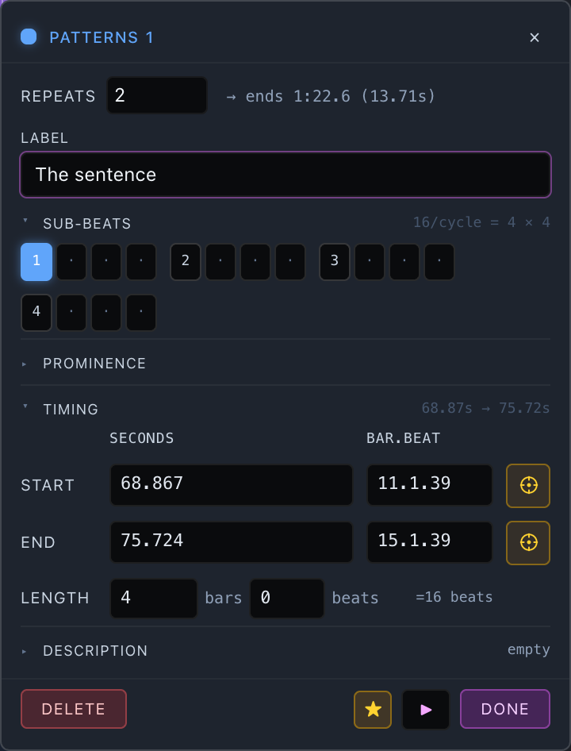

Every annotation kind — Cues, Spans, **Boundaries**, Loops, Riff Patterns, **Lyrics**, and the custom-detector preview — uses a single floating edit card. Clicking any tick, band, tile, lyric, or section marker on the canvas anchors the card near the click; outside-click or **Esc** closes it.

The card opens **everywhere the annotation layer is drawn** — both the Annotator Tool and Algorithm Inspect — because the visualization (and its popovers) are shared across the two workspaces. Clicking a **user-created** item opens the card editable — which in practice means the Annotator Tool, the only workspace that draws your own layers; clicking a **detector- or algo-sourced** item (all Algorithm Inspect draws) opens the **same card read-only** — every field is shown but inputs are disabled, Delete is hidden, and a riff node's sub-beat chips and Repeats are locked. The read-only card's header **names the generator / algorithm the item came from** (a badge with the detector's name). Playback (▶) still works so you can audition a read-only item. This makes click-to-card behavior identical across Cues, Spans, Loops, Riff Patterns, and Lyrics; it previously worked only for Cues. Lyrics show **word** items as a single point and **line** items as a start → end range (a small badge marks which).

**Selecting on the canvas aims the Annotate sidebar.** Opening an item's card
also **makes that item's layer the active one** — exactly as if you had clicked
its layer card in the *All annotations* list. The type chip flips to the item's
kind (Boundaries / Cues / Spans / Loops / Patterns / Riff Patterns / Lyrics),
the Source picker swaps to that layer's origin (Manual, or the specific
detector for a read-only lane), the ADD+ layer picker aims at it, and the
*Current edited layer* header below the waveform renames to match. So the card
you're editing and the edit toolbar you'd reach for are always pointed at the
same thing — before, a Loop's card could open while the sidebar still showed
Boundaries, and **+ Add** / **Split** / **Delete** would quietly act on the type
you'd left behind. Clicking an item you reached from the sidebar changes
nothing (you're already there).

**Everything below the Label is a collapsible section.** The card had grown a
lot of rows — a prominence editor, a repeats spinner, a sub-beat grid, a riff
sequence tree — all stacked above the ordinary label / time / description
fields with nothing naming them. Now each block sits behind a **▸ titled
header** you can fold away: *Sequence*, *Sub-beats*, *Prominence*, *Timing*,
*Description*, *Raw model output*. A folded header still shows an
**at-a-glance summary** on the right — the prominence arc (*Lead → Backing*),
the time range (*27.56s → 30.99s*), the first words of the description, the
number of sequence entries — so you can tell whether it's worth opening.

Sections **do not all open at once**: *Prominence*, *Description* and *Raw
model output* start folded, *Timing* and the kind-specific content (a riff's
*Sequence* and *Sub-beats*) start open. **Your choice is remembered**
per section, across cards and across reloads — fold *Prominence* away once and
it stays folded on every span, loop and riff instance until you open
it again. *Prominence* is the one section that doesn't open in
the card at all when it can help it: expanding it opens the breakpoint editor
on the timeline lane and the card steps off the screen until you close that
again (see [Prominence (front ↔ back)](#prominence-front--back)). Nothing
you'd folded is forgotten while it's away. Above the sections, the **Label** and the one-line headline field for
the kind (a boundary's **Type** dropdown, a pattern's or riff's **Repeats**
count) stay always visible.

Common controls on the card:

- **Header** — layer color chip + name (or *Boundary #n* for sections) and ×. The time is *not* repeated here — it lives in the Start / End rows and the Length row below, so it shows once. Read-only items carry a badge naming the **generator / algorithm origin** — the detector the annotation came from (e.g. *whisper-base*, *librosa-onsets*), with a hover tooltip spelling out it's read-only detector / algorithm output. Lyrics also prefix the badge with the item kind (e.g. *word · whisper-base*).
- **Timing** *(section, open by default)* — holds the Start / End / Length rows below. Folded summary: the time range.
- **Start / End rows** — each editable timestamp is a three-column row: **seconds** (3 dp), **bar.beat** (e.g. `11.2.833` — bar 11, beat 2, plus 0.833 of a beat), and a ⊕ **crosshair** button that snaps that field to the current playhead. The two columns are wired to the same source; editing either propagates to the other. The bar.beat input is disabled when no BPM is set on Song Info, and the crosshair is disabled when playback hasn't started. End is hidden for cues and disabled (read-only) for boundaries — boundary ends follow the next boundary.
- **Length row** — third row for spans / loops: **bars + beats** inputs with a `=N beats` total, all derived from the current BPM. Editing either input recomputes End. Disabled when BPM isn't set (the start/end seconds still work).
- **Label** — short text, with autocomplete when the per-type taxonomy is on (cues / spans).
- **Description** *(section, folded by default)* — longer free-form note (now available on **boundaries** too — persisted under `sections[i].description`). Folded summary: the first ~34 characters, or *empty*.
- **Raw model output** *(section, folded by default; read-only detector / algorithm cards only)* — a block, below the description, that pretty-prints the exact object the detector emitted for *this* item (e.g. a loop's `{ start_ms, duration_ms, label, snap_zero_cross }`). It shows the model's unmapped output — including any fields the card doesn't surface — so you can inspect precisely what the generator produced for that point / span / loop / lyric. Collapsed by default; click to expand.
- **Prominence (front ↔ back)** *(section, folded by default)* — for the durational kinds (spans / loops / patterns / riff patterns): four level buttons and, once you place one, a row of breakpoint chips. **Expanding it hands editing to the item's own lane**: the breakpoint editor opens there and the card stops drawing itself until you close it again, so the two are never on screen competing for the same attention. Folded summary: the arc (*Lead → Backing*). See [Prominence (front ↔ back)](#prominence-front--back) below.
- **Envelope (A / D / S / R)** *(section, **open** by default; energy spans only)* — a span saved by **⚡ Energy** gets this **instead of Prominence**: the measured A/D/S/R curve drawn in the card with the cyan brightness line over it, the four times below, not four buttons. Prominence is something you *say* about an annotation; an envelope is something measured off the audio, so there is nothing here to set — and unlike Prominence it stays in the card rather than handing over to the lane. It opens expanded because on an energy span it is the card's whole point. Folded summary: the shape, the four times and the brightness reading (*sustained · A 120ms D 400ms S 1.20s R 900ms · brightening 1.1kHz → 5.6kHz*). See [Reading the envelope back on the timeline](#reading-the-envelope-back-on-the-timeline) below.
- **Pulse** *(section, folded by default; authored spans — not ⚡ Energy spans)* — seven chips naming how fast this stretch is hitting: *1/8*, *1/6T*, *1/4*, *1/3T*, *1/2*, *Beat*, *Bar*, read as fractions of a beat, and — past a short divider — an eighth chip, *Silent*, for a stretch where nothing hits at all. Picking a rate draws that pulse as ticks inside the band on the timeline; picking *Silent* draws a dashed line straight through the band instead; clicking the chosen chip again clears it, which leaves the span unannotated rather than silent. Under the chips is the same rate spelled out in time — *1/2 beat · every 250 ms · 8 per bar* — which is the quickest way to confirm it by ear, and the quickest way to notice a wrong BPM; *Silent* reads *Silent · nothing hits here*. Folded summary: the rate (*1/2 beat*, or *Silent*). See [Pulse (how fast it's hitting)](#pulse-how-fast-its-hitting) below.
- **Hit** *(section, folded by default; cues only; every field optional)* — **Velocity** (1–127: how hard the hit was struck, compared with the hardest hit of the same instrument), **Level dB** (0 or below: its level compared with the loudest hit in the track), **Note** (0–127 MIDI note number, with its name beside it: 60 is *C4*), **Decay ms** (how long the hit rings) and **Colour** (paints this one tick instead of the layer colour; **reset** goes back to the layer colour). A cue with a velocity draws as tall as it was struck, so a ghost note is a short stub. A cue with a decay trails a faint tail as long as it rings. Hovering the tick shows its velocity, level, note and decay. Empty means *not set*: a value outside the range is refused and the field goes back to what it was. These are the same three fields a detector can fill in (a custom detector's `Cue` or the built-in **drum transients**), so a copied drum hit keeps them. **Copy → Manual** carries them over from both, and you can then change them here. Folded summary: what is set, or *not set*. All of them are exported with the cue.
- **Importance ★ / ☆** — critical (default) vs optional. Available on every editable kind that carries the flag — cues, spans, boundaries, loops, patterns and **riff instances** — and mirrored by the same star in the sidebar's annotation list, so the two always agree. Persisted on the item as `importance: "optional"` (omitted ⇒ critical). Hidden for read-only detector cards, and for Lyrics (which have no importance).
- **▶ / ⏹ Play** — auditions the item. Cues and boundaries play a **0.5-second preview** starting at the point; spans play through the interval; loops loop seamlessly via `useLoopPlayback`.
- **Delete** — removes the item on a single click and closes the card (⌘Z to undo); hidden for read-only detector cards.
- **Done** — closes the card. The card autosaves changes through the same per-panel debounce as the inline editor list.

The detector preview card adds **✓ Accept / ✗ Reject** buttons in the footer next to Done; their state stays in sync with the row chips in the panel below.

**Pattern and riff-instance cards** keep the **Repeats** spinner always visible
at the top — it's the field that decides where the whole repeated region ends,
so it reads as the card's headline alongside the Label. Their other
kind-specific content is sectioned: a pattern's **Sub-beats** chip grid, a riff
instance's **Sequence** tree. On both, Repeats accepts a cleared field while
you retype it — an in-progress value that isn't a whole number 1–256 shows red
and blocks **Done**, and is never written to the annotation.

### Prominence (front ↔ back)

![A loop whose prominence steps down from Lead through Counter and Backing to Silent. The whole editor sits in the lane: the band with its skyline on top, then the strip's own header (the four level buttons, clear, Done), then the four breakpoint rows. The handles are the transitions; the levels held at either end are marked with caps instead — Lead at the left edge, Silent running out to the annotation's end at the right. The first two hops are instant switches — the line steps across and then drops — and the last is a crossfade, which slopes into it](images/prominence-editor.png)

An annotation is rarely equally prominent for its whole length. A guitar figure
often *enters as the lead line* and then drops back the moment the vocal comes
in — it's the same part throughout, just no longer the thing you're meant to
follow. Prominence records that arc **inside a single annotation**, so you no
longer have to split one musical gesture into several spans to say it.

This is the idea Schoenberg notated as *Hauptstimme* (principal voice) and
*Nebenstimme* (secondary voice) — a bracket over part of a line marking where
it takes the lead and where it hands over. TimeCues uses plain-English names:

| Level | Meaning |
|---|---|
| **Lead** | Lead / primary melody — the main tune, vocal, or lead hook at the front of the mix. |
| **Counter** | Counter-melody / secondary line — a complementary or response line that supports the lead without stealing full focus. |
| **Backing** | Accompaniment / background — chords, basslines, rhythm tracks, and pads filling out the harmony and groove. |
| **Silent** | Mute / rest — the part isn't playing. |

The scale is deliberately **four named levels rather than a free 0–100 %
slider**. Four buckets are something two annotators can actually agree on by
ear; a continuous percentage has no reliable ground truth, and agreement
between annotators would collapse into arguing about 60 % vs 75 %.

**Which kinds have it** — spans, loops, patterns, and riff patterns. Cues and
boundaries are instants, and an arc over an instant means nothing.

**Setting it from the popover.** Click any band to open its edit card and
expand the **Prominence** section (folded by default; its header shows the
current arc). The four buttons apply **at the playhead** when the playhead is
inside the annotation (a line above them says *applies at playhead*), and
otherwise to the annotation's start (*applies at start*). So the normal
workflow is: scrub to where the vocal enters, click **Backing**, done.

**Setting it on the canvas.** **Expanding the Prominence section hands the job
to the timeline**: the card stops drawing itself and the annotation grows a
four-row **breakpoint editor** under its band — one row per level, top to
bottom, with its own small header carrying the four level buttons, *clear*, and
**Done**. Only ever one of the two is on screen, so nothing floats over the
lane you're working in. Click any row to drop a breakpoint there, drag a handle
sideways to retime it or up/down to change its level, **⌥-click** (Alt-click) a
handle to turn its arrival into a crossfade, and **right-click a handle to
remove it**. Handles can't cross each other. The line drawn through them says
which is which: an instant switch **steps** across at the old level and drops
at the breakpoint, a crossfade **slopes** into it.

**Breakpoints obey Snap.** Placing one or dragging one lands it on the beat
grid whenever **Snap to grid** (or **Grid Lock**) is on, at the grid's own
granularity — the same switch that governs dragging the band itself. A
handover is a musical instant (*the vocal takes the lead on the downbeat*), and
one that lands three-hundredths of a beat off is noise in every export. Snap
never overrides the rule that handles can't cross: a grid line on the far side
of the next handle gives way to that handle. Turn Snap off to place a
breakpoint anywhere, for a performance that doesn't sit on the grid.

**Both ends are capped.** The handles on the strip are the *transitions* —
the moments you placed. What happens at either end of them is a level being
**held**, and each is marked by a bright cap on its own row rather than by a
handle:

- **The opening cap**, at the left edge. An annotation with an arc has to say
  what its level is from its very first moment — there's no unset stretch
  inside it — so an arc always opens on something. Place your first breakpoint
  somewhere in the middle and the opening cap appears at **Lead**, holding
  until your breakpoint: in front, then dropping back when the vocal enters,
  which is the shape the feature is for. (Place that first one on the **Lead**
  row and there's nothing to say — the whole annotation leads, and the cap is
  all you get.) **Drag the cap up or down** to change the level it opens on;
  it can't move sideways, because an arc's first point is always the start.
- **The run-out cap**, at the right edge. The last breakpoint holds from where
  it sits until the annotation stops, so the line runs on past it and is capped
  there — the same stretch the band above fills in. Nothing can be placed at
  the very end: a breakpoint says *"from here, this level"*, and at the end
  there's no time left for it to describe. To change how the annotation
  finishes, drag the **last handle** up or down.

**Getting back to the card.** The card isn't closed while you're on the lane,
just not drawn, so nothing is lost and there are two ways back:

- **Done** on the strip's header — ends prominence editing, gives the row its
  height back, and puts the card straight back where it was. Nothing is being
  held unsaved while you're there: every edit on the strip goes through the
  same autosave as the card's own fields, so Done only means *finished*.
- **Escape** — leaves both, as it does anywhere else.

Clicking the annotation again reopens its card as normal; prominence editing
doesn't carry over to the next item you click. Where the lane editor **can't**
open — a read-only detector card, review mode, the Dataset Prep workspace —
expanding *Prominence* simply expands it in the card, with the level buttons
and a row of breakpoint chips, and nothing on the lane changes.

**Crossfades.** By default a breakpoint is an instant switch. **⌥-click a
handle** on the lane editor — or, where that editor can't open, click the `⌐`
symbol on the breakpoint chip in the card — to turn it into a **crossfade**
(`∿`): the level then eases in from the previous one across the gap, for a part
that recedes gradually rather than dropping out. Do it again to go back to an
instant switch. The first breakpoint can't be one — nothing precedes it. It's a
property of each breakpoint, not a mode you switch on, so the popover and the
canvas editor can never disagree about what the next click will do.

**How it reads on the canvas.** Spans and loops draw the arc *inside* the
existing band as a skyline — the fill's height and brightness both track the
level, so Lead is a full-height solid block and Backing a dim, short one; a
crossfade renders as a taper between the two. Patterns and riff patterns are
already dense grids of sub-beat chips, so instead of filling inside them each
**repetition** is dimmed as a whole — one cycle is the natural unit for "the
hats lead for four bars, then sit back". The editor-panel cards show a compact
`Lead → Backing` badge, and the band's hover tooltip carries the same summary.

**Nothing is exclusive.** Two annotations may both claim Lead at the same
moment — call-and-response, a doubled hook, and unison stabs are all real, so
TimeCues doesn't fight you about it. When you *do* want a clean handover, the
[Prominence lane](#the-prominence-lane--whos-where-in-the-mix) below writes one for you.

**On disk** the arc is a `prominence` array on the item, sorted by time, with
each entry holding `t` (**seconds from the annotation's own start**, not from
the start of the song), a `level`, and an optional `ramp: "ramp"` for a
crossfade:

```json
{
  "id": "…", "start": 37.477, "end": 83.963, "label": "Hi-hats",
  "prominence": [
    { "t": 0,     "level": "lead" },
    { "t": 22.04, "level": "backing", "ramp": "ramp" }
  ]
}
```

Because `t` is relative to the annotation, moving a whole annotation carries
its arc along unchanged, and dragging its **start** edge re-anchors the arc so
it stays locked to the audio. Annotations you haven't given a prominence to
simply have no `prominence` key and look exactly as they always did — the
field is optional and older files load unchanged.

### Pulse (how fast it's hitting)

Prominence says *where a part sits*; **Pulse** says *how often it hits*. A
hi-hat stretch running in 16ths and the same hi-hat halving to 8ths through the
breakdown are two different things to a light show, a remixer or a model, and
neither the label nor the length says which is which.

Pulse is **one value for the whole span**, chosen in the card's *Pulse* section
from the same beat-relative vocabulary the grid menu uses — *1/8*, *1/6 · triplet*,
*1/4*, *1/3 · triplet*, *1/2*, *Beat*, *Bar*. They are fractions of a **beat**,
not note values, so they stay honest in any meter: in 6/8, where the BPM counts
an 8th note, *1/2 beat* really is a 16th.

**Silence is the eighth answer.** Past a short divider at the end of the row
sits *Silent*, for a stretch where nothing hits at all — a drop, a bar of air
before the chorus, a part cut out under a held pad. It is deliberately *not*
the same as leaving the section alone: an unannotated span says nobody has
listened yet, while *Silent* says somebody listened and found nothing there,
which is exactly what a light show, a remixer or a model needs to be told
before it fills the gap with something. Clicking the active chip again clears
the pulse and puts the span back in the first state, not the second.

A silent span draws a **dashed line straight through its band** rather than
ticks. That matters as much as the chips do: a band with nothing drawn in it is
what an unannotated span looks like, so silence had to be given a mark of its
own. The line needs no grid to place, so it shows even before the song has a
BPM, and it can't be mistaken for very dense ticks however far out you zoom.

(The *Prominence* section has a level called *Silent* too, for a part that
stops playing part-way through the span. The two agree about what the word
means; prominence says it about one part over time, pulse says it about the
whole stretch.)

**The ticks are drawn, not stored.** Once a span carries a pulse, the timeline
marks every hit it implies inside the band — but those marks are computed from
the song's own grid each time they're drawn, straight off the same beat lines
the grid overlay uses. That is the point of recording a rate rather than a list
of hits: trim the span, drag it, re-fit the grid, pin a beat by hand in Manual
mode, and the marks follow the beats instead of remembering where the beats
used to be. A stored list would quietly go on claiming hits at times the audio
no longer has.

Two consequences worth knowing:

- **No grid, no ticks.** Without a BPM there is nothing to derive a pulse
  against, so nothing is drawn. The chips still work — the annotation is about
  the music, not about whether you've set the grid yet — and the readout says
  so until you do.
- **Very dense pulses draw nothing.** Past ~500 ticks in one span (a 1/8-beat
  pulse over several minutes) the marks would be closer together than the
  screen can separate them, so the band leaves them out rather than drawing a
  thinned-out set — half the marks would show a pulse half as fast as the one
  you annotated. The rate is still on the card, in the list below the timeline,
  and in the band's tooltip.

**Not on ⚡ Energy spans.** A span saved by the Energy tool shows *Envelope*
where an authored span shows *Prominence*, and it is offered no *Pulse* section
at all. An energy span is a **measurement** — a level over time, taken by the
tool — while a pulse is a claim about rhythm made by ear; putting the two on
one card invites reading the envelope as though it said something about rate,
which it doesn't. Such a span draws no ticks and no silence line on its band
either.

**When it is the wrong tool:** when the individual hits *are* the annotation —
they're uneven, or each one means something separate — a pulse is the wrong
shape for them. Mark them as cues, or build the rhythm as a riff node, where
each hit is a thing you placed.

**On disk** it is a single optional `pulse` key on the span:

```json
{
  "id": "…", "start": 37.477, "end": 83.963, "label": "Hi-hats",
  "pulse": "16th"
}
```

with `"silent"` as its eighth legal value. No key at all still means the span
carries no pulse annotation — older files load unchanged.

Spans without one simply have no `pulse` key and look exactly as they always
did — the field is optional and older files load unchanged.

### The Prominence lane — who's where in the mix


Setting prominence one annotation at a time answers *"what does this guitar
part do?"*. It's the wrong shape for the question you usually ask first —
**over these bars, who leads?** — because answering that from the individual
cards means opening every competing annotation by hand and hoping they end up
agreeing with each other.

The **Prominence** row, above the annotation layers on the canvas, turns the
question around. It is **off until you ask for it** — tick **Prominence lane**
under [Annotations → Prominence](#1-annotations-dropdown) in the Viz Control Bar
to bring the row on screen. It is **four stacked tiers — Lead, Counter, Backing, Silent —**
each named down the left edge of the row. A tier shows a block for every stretch
where somebody sits at that level, labelled by whichever annotation holds it,
with the gaps left empty where nobody does. One annotation whose arc steps down
mid-way appears on the Lead tier for its first half and on the Counter tier for
its second, so a handover reads as a diagonal down the row.

**The lane is drawn as a meter, not as another annotation layer.** It is a
*readout* of layers you already have, and it sits one row away from them, so
looking like them was the fastest way to be misread as a fifth place your
annotations live. Everything here is therefore **grey**: colour on this canvas
means "an annotation you can put somewhere", and the Prominence lane has nothing
of its own to put. Blocks are square-cornered columns hanging off a bright
**level rule** along their top edge, over a faint front-to-back wash that shades
the four tiers even when the lane is empty. The row is framed in the same
emerald as its name in the gutter.

The annotation that holds a block keeps its own colour as a **tab down the
block's left edge** — enough to tell the guitar loop from the vocal span when
both sit on the same tier, without the block impersonating either of them. When
two annotations share a level over the same stretch, the block is hatched and
the tab splits between them, top half and bottom half.

Both the fill and the level rule get dimmer as you go back — Lead is near-solid
and brightly capped, Silent barely there — matching the per-annotation bands,
where fill height and brightness both track the level. It means the front still
stands out on a song where everything has been annotated.

**Every tier is editable, and each asks its own question.** On the **Lead** tier
the question is *who is in front over these bars* — a cross-layer contest, so
the picker lists every annotation alive in the range, and handing it to one
demotes whoever held it. On the tiers **below** Lead a block already names one
annotation, so the question becomes *what does this one do from here*: the
picker turns into that annotation's own four levels — Lead, Counter, Backing,
Silent — with its current one marked. Choosing Lead there routes through the
same exclusive handover, so the front is never left claimed twice.

**The tier names stay put.** Lead / Counter / Backing / Silent ride along with
the horizontal scroll and stay pinned beside the row's own name, so the tiers
are still identifiable when you have zoomed deep into the middle of a song.

**Handing over the lead.** Drag across the lane to select a range, or click an
existing block to reselect its range, and pick the winner from the list.
Everything alive in that range is offered, **across every one of your layers** —
the vocal span, the guitar loop and the riff pattern all compete for the same
front, so the picker doesn't care which row they live in. Escape closes the
picker without changing anything.

When a range is pending, the lane marks it twice: **teal edges spanning the
whole row**, because the assignment covers that stretch of the track whatever
tier you took it from, and a **wash over just the block you clicked**, so
picking the Counter line underneath a Lead block never looks like you selected
both. A painted drag has no source block, so it washes the whole row.

**Splitting a block in two.** A block often needs dividing rather than
reassigning whole — the hi-hats lead the first half of the phrase and the bass
takes the second. Two ways, and both leave everything before the cut exactly as
it was:

- **In the picker** — the reliable one, at any zoom. Click a block and the
  picker lists **✂ split at beat** followed by a chip for every beat inside the
  range. A chip on a downbeat reads as its bar (`16`); one mid-bar reads as
  bar·beat (`15·3`). Click a chip and the selection narrows to *that beat
  onwards*; then pick the winner. The chip where the playhead currently sits is
  outlined, so "split where I'm listening" is one glance away. Chips re-derive
  from the narrowed range, so you can split again immediately to get a third
  leader. When a range holds more than sixteen beats the list thins to the
  **downbeats** only, and past sixteen of those it falls back to a single
  **✂ split at … (playhead)** row rather than printing a wall of chips — the
  rail on the block still gives beat precision either way.
- **On the block itself.** A block you can divide wears a **pale rail along its
  top edge** — that rail is the control, and its presence is how you tell at a
  glance which blocks are divisible. Move the pointer over the block and a white
  cut marker appears on it, snapping to the **beat nearest your pointer**; slide
  left and right until it sits where you want the handover, then click the rail.
  The picker opens for that beat to the end of the block. Because the marker
  follows your pointer rather than sitting on a fixed handle per beat, this
  works at any zoom — it is always exactly under the cursor even when the grid
  lines are only a few pixels apart. The rail is the top few pixels only, so
  clicking the block's **body** still reselects its whole range; the two
  gestures never compete. **Every tier has a rail** — dividing a Counter or
  Backing stretch works the same way, and what opens afterwards is that
  annotation's own four levels rather than the cross-layer pick-list.

**Cuts land on beats, not bars.** A handover rarely waits for the bar line —
a vocal comes in on the 3, a fill hands over on the last beat — and a block only
one bar long has no downbeat inside it at all, so a bar-only cut grid could not
divide it anywhere. Painted *ranges* still snap to whole bars, as below; it is
the cut that is the finer gesture. A range that ends up starting mid-bar is
labelled that way throughout: *"Lead over bars 15·3–23"*.

> A block **shorter than one beat has no rail** — there is no grid line inside
> it and nothing to divide. The picker says so rather than leaving a blank where
> the cut controls would be.

Splitting the same block twice gives you three leaders across it. There is no
separate "un-split": handing two adjacent stretches back to the same annotation
merges them into one block again, because the lane draws what the arcs say.

**How the picker names things.** Each candidate is listed under its own label
when it has one. Most annotations don't — you name the part once, on the layer
("Chello parts", "Contra Bass (Riff)"), and leave the individual spans and riff
instances as they came — so those are listed under **their layer's name**
instead, with the occurrence ("Instance 5") or the bars they cover shown beside
it to tell two items on the same layer apart. A vocal run is listed under its
lyrics layer's name with its **opening words** beside it, which is the fastest
way to tell the second chorus from the first.

Choosing a winner writes the whole handover at once:

- the winner reads **Lead** across the range;
- **anyone else who was leading there drops to Counter** — the part that just
  handed over is still a foreground line, not background;
- everyone gets their previous level back at the **end** of the range, so an
  assignment stops exactly where you put it instead of running to the end of
  the annotation;
- annotations that were *not* leading are left completely alone. Giving the
  vocal the front doesn't promote every pad in the song.

It lands as a **single undo step**, however many annotations and layers it
touched.

**Ranges snap to bars — and to the blocks themselves.** The lane's ranges land
on whole bars and are labelled that way — *"Lead over bars 23–35"* — because the
question is a musical one and a handover that lands a fraction of a beat off the
downbeat is noise in every export. Songs without a BPM on Song Info fall back to
free seconds.

Bar lines aren't the only thing a painted edge sticks to. **The edges of the
blocks and annotations you can see are magnetic too**, and a lead block's own
edges win over everything else nearby. So a rough drag along a block selects
*that block*, exactly, instead of rounding to the downbeats just outside it and
handing you a range a bar too long at one end and a bar short at the other. Aim
away from any edge and the bar grid takes over as before.

**What it doesn't do.** It won't hand the lead *back* when a range ends. Whether
the guitar returns to the front after the vocal stops is a musical judgement —
often it stays behind for the rest of the song — so you say so by assigning the
next range. And it never invents exclusivity it wasn't asked for: a shared front
(two annotations both reading Lead) is drawn as a **striped block naming both**,
left exactly as you annotated it.

**It stores almost nothing of its own.** Every block is derived from the same
`prominence` arcs the bands draw, so the lane and the annotations can never
disagree — and the lane hides itself entirely on a song with nothing for it to
read. Hidden layers still count: hiding a row declutters the canvas, it doesn't
give up that annotation's claim on the front. The one thing the lane does keep
is a lyrics layer's **vocal runs**, and only once you have edited them — see
[The voice on the lane](#the-voice-on-the-lane--vocal-runs) below.

#### The voice on the lane — vocal runs


A lyrics layer joins the lane too, but **not one block per word**. A word is an
instant, several hundred of them to a song, and a Lead tier carrying a sliver
per syllable is a readout of nothing. The unit the lane uses instead is the
**vocal run** — one stretch of continuous singing. Two choruses either side of
an instrumental break are **two blocks**, and the break gets nothing at all:
the voice isn't resting there as an annotation, it simply isn't singing, and
drawing a Silent block over it would be claiming something you never said.

Runs are worked out from the word timings, and three rules shape them:

- **The voice has to stop for two bars** before one run becomes two. One bar of
  rest between lines is ordinary phrasing inside a verse, and splitting there
  would break a single chorus into a block per line. The threshold is in bars,
  so it follows the tempo, and you can change it — see below.
- **Run edges snap outward to the bar.** Singers come in on a pickup, and the
  last note rings past the last word, so a run that began on its first syllable
  would sit a beat behind the chorus it belongs to. Songs without a BPM keep the
  raw word timings instead.
- **A snap never swallows a break.** Where pushing two runs outward would close
  the gap between them, both edges retreat to the middle of the original silence
  and the two stay separate.

**An un-annotated voice reads as Lead.** A vocal is the front of the mix until
someone says otherwise, so a run you have never touched is drawn on the Lead
tier — but that is the lane *reading* your lyrics, not an annotation, and it
changes nothing else. If a guitar loop already claimed the front over the same
bars, you will see the two **sharing** it as a striped block. That is the honest
picture until you decide, and deciding is the button below.

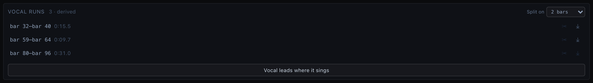

**The Vocal runs panel** sits at the top of the **Lyrics** tab, under the layer
name, and it is where a run's *extent* is corrected — where the voice starts and
stops. Levels are not set here; that is the lane's job, and a second place to
say it would be a second place to disagree.

| Control | What it does |
| --- | --- |
| **_N_ · derived / edited** | How many runs there are, and whether they are still being worked out from the words (*derived*) or have been edited and stored (*edited*). |
| **Split on _N_ bars** | The silence that starts a new run. Lower it when a real break is being missed, raise it when one long phrase is coming apart. Available while the runs are still *derived* — once you have edited them, they're yours, and the threshold stops second-guessing you. |
| **Rebuild** | Appears once the runs are stored. Rebuilds them from the current word timings at the gap above. If you have set levels on any run it asks once — **Discard levels?** — before throwing them away. |
| Each run row | Its bars (or clock time with no BPM) and its length. Click to seek to its start. |
| **✂** | Cut the run at the playhead — *the voice does stop here*, where the threshold didn't see it. Greyed out until the playhead is inside that run. |
| **⤓** | Join the run to the one after it — it was one phrase, not two. Greyed out on the last run. |
| **Vocal leads where it sings** | Hands the front to the voice across **every** run at once, dropping whoever else held it there to Counter — the same handover the lane writes, applied to each sung stretch. One undo step, however many parts it touches. |

> The handover is a button you press, never something that happens because a
> lyrics layer exists. It can rewrite the arc of every instrumental part in the
> song, so it waits to be asked.

**Editing a run stores the whole list.** Up to the first edit — a split, a
merge, or the handover above — nothing about the runs is on disk, and correcting
a lyric reshapes them freely. The first edit freezes them, ids and all, so that
fixing a word's timing later can't renumber a run you have already annotated.
That is also why the gap control locks at that point, and why **Rebuild** is
the deliberate way back.

**Getting the lane on screen — and putting it away.** The lane starts
**off**: it is four tiers of vertical space, and most passes over a song don't
need them. Tick **Prominence lane** under
[Annotations → Prominence](#1-annotations-dropdown) in the Viz Control Bar to
show the row, and untick it when you're doing something else. Either way the
arcs themselves are untouched, so the per-item bands and every claim on the
front stay exactly as you left them. It's a per-session view choice, not a
saved setting — the next song starts with the lane hidden again.

### Picking which layer **+ Add** targets

Adding at the playhead is done **per layer**: every editable layer card in the
*All annotations* sidebar carries its own **+ Add** button in the card header,
on the same line as the layer name and to its right — so it stays reachable
even when the layer holds hundreds of items and the list runs long. There is
no single "+" above the cards to aim — you press Add on the layer you mean, so
the target is never a guess. Pressing it also promotes that card to **active**, so a follow-up
drag-region **+ Add** pill and the keyboard add both stay on the same layer.

The drag-region **+ Add** pill still grows a `▾` dropdown listing every layer
of the active type, for when you want a *dragged region* to land somewhere
other than the active card. Clicking a layer card (or an item inside it) also
makes that layer the active target.

When no layer is explicitly selected, the pill and the keyboard add fall back
to the focused item's layer (if any), then the first layer of that type, and
finally auto-create a fresh layer so the first-ever add doesn't need setup —
which is also what the add-panel's fallback **+** does when a type has no
layer card yet.

### Exporting a selection's energy trend (**⚡ Energy**)

Dragging a region on the canvas **with the Spans type active** adds a
**⚡ Energy** button to the drag-region pill alongside **+ Add**. It is a Spans
button because what it saves is a span — an energy reading lands in the
**energies** Span layer — so measuring one from the Boundaries or Cues panel
would have added an item that panel can't show you. Select Spans first, then
drag the range you want measured. It opens a small popover
where you pick a **source** — the full mix, or one isolated Demucs stem
(vocals / drums / bass / other / guitar / piano, whichever have been
separated for that song) — and see how that source's loudness rises or falls
across the selected range. Picking a stem instead of the mix gives a much
cleaner trend, since the other instruments no longer mask it.

The popover shows a **Brightness** row, a one-line summary (e.g. *"Energy on
the drums stem falls from 0.82 to 0.15 over 6.0s"*), an **Envelope** panel
(both below), a **Save into** dropdown, and a **Save to Span layer** button.

> **Rising or falling is measured across the whole selection, not from its
> two ends.** Both the energy trend and the Brightness row fit a line through
> every frame in the range and report that line's direction. This matters on
> any selection holding more than one hit: read from the first frame against
> the last, a passage of three louder-and-louder swells comes back
> **decreasing** whenever your drag happened to finish in the tail after the
> third one — true of that one frame, and the opposite of the passage. It also
> means trimming a selection by a beat nudges the numbers instead of flipping
> the verdict. The two levels quoted in the summary are that fitted line's own
> start and end, which is why they can differ slightly from the first and last
> points of the drawn curve — and why they always agree with the direction
> printed beside them.

**Save into** always opens on the song's **energies** lane, so energy exports
collect in one dedicated Span layer instead of landing in whichever layer
happened to be first. The first time you export energy for a song that lane
doesn't exist yet — the dropdown offers it regardless, and the layer is
created (named `energies`) when you press **Save**, so cancelling the popover
leaves nothing behind. Every later export on that song defaults to the same
lane and appends to it. The song's other Span layers are still listed
underneath, along with **+ New Span Layer**, if you'd rather file a particular
reading elsewhere — an energy export is an ordinary span item and any Span
layer will take it.

Once a song has an **energies** lane, that lane's own **+ ADD** button (in
its card header in the annotation list) opens this same popover instead of
dropping a blank span. The lane holds energy readings and nothing else, so a
plain span filed in it would be an item the downstream consumer reads as an
energy export and finds no measurement inside. The range it measures follows
the same rule **+ Add span** does: the highlighted region when you have one
dragged, and otherwise a default-length window at the playhead (one bar when
the song has a grid, two seconds when it doesn't). The button's tooltip reads
**⚡ Measure energy** on that lane so the difference is visible before you
click, and **Save into** opens on the lane you pressed. Every other Span
layer's **+ ADD** is unchanged.

Clicking Save adds a new span over the selected range:
the **Label** is a short tag naming both readings and the source —
*"Energy: falling, brightening (other)"*, or just *"Energy: falling (drums)"*
when the timbre didn't move — and the **Description** holds the full JSON
(start/end times, both directions, a short sampled curve carrying level and
brightness on one grid, the envelope block, and that summary sentence). From
there it's a normal span —
visible on the timeline, editable in its card, and it flows out through the
regular per-layer/global **Export** to hand off to an external tool (such as
the LOL light-show agent). On the timeline it keeps showing its measurement:
see [Reading the envelope back on the timeline](#reading-the-envelope-back-on-the-timeline).

#### The **Brightness** row (spectral centroid)

Loudness alone mis-reads the most common gesture in dance music. A build
strips the kick and the bass out and hands the tension to a riser: the level
*falls* through it while the sound gets steadily brighter. Measured on energy
alone, the bar before a drop comes back **decreasing** — true of the level,
and the opposite of what the passage does.

So every export measures **brightness** over the same selection, on the same
source: the *spectral centroid*, the frequency the sound's energy is centred
on. It is the same measurement the **Bright** signal row draws under the
waveform (see [Signals dropdown](#2-signals-dropdown)), taken over just your
selection,
which is why a rise you can see on that row is the rise you get here.

The row reads *rises 1.1kHz → 5.6kHz*, *falls …*, or *flat near 1.3kHz*, and
when the two readings disagree the way a build does — level falling, timbre
opening — it adds **reads as a build**.

Because it is measured per source, brightness is the reading that tells you
*which stem to pick*. Over one 53-second stretch of *EDM At Midnight*:

| Source | Energy | Brightness |
| --- | --- | --- |
| mix | roughly flat | rises 729Hz → 6.3kHz |
| bass | rises | rises 89Hz → 143Hz |
| drums | rises | rises 244Hz → 7.8kHz |
| **other** | **falls** | **rises 1.1kHz → 5.6kHz** — reads as a build |
| piano | falls | flat near 1.2kHz |

The mix hears the brightening — everything in the song is in it — but its
level is flat, so on the mix this passage is just *getting brighter*. Only on
**other** does the level fall *while* the timbre opens, which is the pair that
names a build. That is the reading a stem buys you, and why the Source select
is worth flipping through before you save.

> **The mix is decoded from the song file, not borrowed from the player.**
> The waveform you see is drawn from a heavily downsampled decode — all a
> waveform needs is peaks — and measuring off it would throw away everything
> above 4kHz, which is exactly where a riser lives. So choosing **mix** fetches
> and decodes the song itself the first time you pick it, the same way a stem
> does. That costs a moment on a long track; it is then cached for as long as
> the popover is open.

Two things worth knowing:

- **The curve is peak-normalized, the frequencies are not.** `curve[].brightness`
  in the export is a fraction of the selection's own brightest moment, the way
  `energy` is a fraction of its own peak — the absolute anchor is the
  `brightness_hz` block (start, end, peak in Hz), which is what you compare
  between two selections.
- **A silent selection reports no brightness at all.** The centroid of a noise
  floor is a number, not a timbre, so frames too quiet to mean anything are
  skipped, and a selection with none left over saves with `brightness_trend`
  set to `null` and no row in the popover.

Both readings land in the span's **Description** JSON — `brightness_trend`
alongside `trend`, `brightness_hz` beside the curve — and the summary sentence
gains a matching clause (*"Brightness rises 1.1kHz → 5.6kHz — level falling
while the timbre opens up, the shape of a build."*).

#### The **Envelope** panel (A / D / S / R)

The trend line says which *direction* the selection moves. The **Envelope**
panel underneath says what *shape* it has, in the four terms a synthesizer
uses — **Attack**, **Decay**, **Sustain**, **Release** — read off the same
source you picked, on a finer pass than the trend (a 10 ms window instead of
50 ms, so a drum transient doesn't get smeared into a single reading).

| Reading | What it measures |
| --- | --- |
| **A** — Attack | How long the source takes to rise into its loudest point, measured from 10% up to 90% of that peak. Short on a drum hit, seconds long on a filter sweep. |
| **D** — Decay | Peak until the fall levels off. |
| **S** — Sustain | How long it then holds roughly steady. The **sustain level** below the row gives the height of that plateau, as a fraction of the selection's own peak. |
| **R** — Release | The final fall, from where the level starts dropping again to the end of the selection. |

Alongside them sits a one-word **shape** — *percussive*, *swell*,
*sustained*, or *decaying* — so you (or a downstream tool) can branch on the
gesture without reading the numbers, and a **peak** figure giving the raw
loudness at the peak. *Percussive* is reserved for an actual hit: the
selection has to contain the onset, rise into it in under 100 ms, and be
spent (down to a tenth of its peak) within half a second. A long fade-out
reads *decaying*, however abruptly it happens to start — and a build reads
*swell* even when the drop it lands on is a single fast hit, because the
gesture is the rise, not the transient that ends it.

Three things worth knowing when you read these numbers:

- **Levels are relative to the selection, not the song.** The sustain level
  is a fraction of *this selection's* peak, so a whisper-quiet passage and a
  drop can both report a sustain of `0.80`. The **peak** figure is the one
  absolute number in the panel — use it when you need to compare two
  selections' loudness against each other.
- **Attack doesn't start at the selection's edge.** It's a 10%→90% rise time,
  which is the standard envelope measurement and holds up when the selection
  opens mid-note. So A + D + S + R won't add up to the selection's duration.
  The rise is measured from the last point the source was *genuinely* quiet —
  a momentary gap between two hits doesn't count as one, or a six-second build
  would report the attack of its final kick.
- **A selection that peaks at its very end reads *swell*, not *decaying*.**
  Nothing came down inside it. The attack can still be short there — a drop
  that rises out of a stop really does have a fast attack — so read the shape
  and the numbers as answering different questions: *what gesture is this*
  versus *how fast was the last onset in it*.
- **A sustain of 0 is a real answer.** A fade that never levels off has no
  plateau to report, so the sustain reads zero and the whole fall is reported
  once, as **R** — *decay* means "down to the sustain level", and there's no
  sustain level to decay to. A long sustain at a low level is only reported
  when the level really does hold there.
- **The plateau is measured between the hits, not through them.** Percussion
  rides on top of whatever is being held, so the panel looks for the hold in
  the selection's *lower* envelope — the level it returns to between transients.
  A kick every half-second therefore doesn't break a pad's sustain, and the
  sustain level you get is the pad's, not an average of pad-plus-kick.
- **A / D / S / R boundaries are approximate to within about a tenth of the
  selection.** The panel smooths before it segments, so the exact frame where
  decay becomes sustain carries some slack. Treat the numbers as the shape of
  the gesture, not as sample-accurate edges; **A** is the one measured on the
  fine contour and is precise.

#### When a selection has no envelope

A/D/S/R describes *one* gesture — one onset, one peak, one decline. If your
selection spans two of them (two drops, a swell and then another swell), no
single envelope describes it, so the panel refuses to invent one: instead of
the A/D/S/R row you get **not a single gesture (2)** and the timestamps where
you'd split the selection to get one envelope per gesture. Drag a shorter
region around either half and the panel comes back.

**It still tells you which way the gestures are going.** Above the split-point
line, a multi-gesture selection reports its **peak sequence** — each gesture's
loudest moment as a fraction of the loudest in the selection, in order, with
the direction named: *peaks rising 0.61 → 0.78 → 1.00*. That is usually the
reading the selection was made for, and it is the one a refusal used to
withhold: knowing a passage holds three swells says nothing about whether it
is building, and three peaks climbing toward 1.00 says exactly that. The
folded section header carries the same word (*3 gestures · peaks rising*).
The sequence is fitted like every other direction here, so one loud outlier
at either end doesn't decide it, and it reads *holding level* when the peaks
genuinely don't travel.

The trend line, the curve and the summary are unaffected — a multi-gesture
selection still saves and exports normally, just with no envelope in it.

Everything in the panel is saved into the span's **Description** JSON under
an `envelope` key, and the summary sentence gains a matching clause (*"Envelope
reads percussive: attack 12ms, decay 80ms, sustain 0ms at 0.09 of peak,
release 910ms."*). When the selection was rejected, `envelope` is `null`,
an `envelope_rejected` key carries the gesture count, the split points and
the `peak_levels` sequence, and the sentence says so instead (*"No envelope
reported: this span holds 3 separate gestures (peaks at 44.6s, 46.3s, 50.0s),
and A/D/S/R describes one — peaks rising 0.61 → 0.78 → 1.00. Split it at
45.3s, 48.6s…"*).

#### Reading the envelope back on the timeline

An energy span keeps showing its measurement after it is saved, so the reading
doesn't disappear into a JSON description the moment the popover closes. It is
shown in two places, at two sizes.

**In the band — the curve, in place.** Every span carrying an energy export
draws its own **energy contour** inside its band on the lane: the measured
curve as a filled shape, with the idealized A/D/S/R polyline over it. A hit, a
swell and a long hold are told apart at a glance, without opening anything.
It is drawn to scale against the audio, so the peak in the band sits under the
peak in the waveform.

Over it runs the **brightness line**, in the same cyan the **Bright** signal
row uses. It has its own vertical scale rather than sharing the contour's:
a centroid never approaches zero, so drawn on the energy axis every brightness
line would be pinned to the top of the band with its gesture flattened out of
it. That scale is taken from the whole measurement, never from the part you
can currently see, so trimming a band cuts the line without reshaping it.

> **The band shows no label text.** Every energy span is named *"Energy:
> \<trends\> (\<stem\>)"*, so on a 15px band that text covered the one thing that
> differs between them — their shape. What's left is a small **↗ / ↘ / →**
> arrow for the energy trend, joined by a second, cyan arrow **only when the
> two trends disagree** — *↘↗* is a build, and a band that rises in both is
> just a loud one. The label is still on the card, in the item list below
> the timeline, and in the band's tooltip, which also gives the shape, the
> four times and the brightness reading ahead of the export's one-sentence
> summary.

**In the card — the readable copy, with the numbers.** Clicking the span opens
its card with an **Envelope** section where an ordinary span offers
*Prominence*, and it opens **already expanded**: the curve is drawn large with
the **peak** marked ▲, a dashed line at the sustain level, a divider where each
stage ends and the stage letters along the bottom, then the brightness
frequencies (*brightness 1.1kHz → 5.6kHz · peak 5.6kHz*), and **A / D / S / R**
with their times, the one-word shape, the sustain level and where the peak
falls in the song. A stage too short to hold its letter keeps its divider.

The line above the curve names both readings — *measured on the other stem ·
energy decreasing · brightness increasing · read-only* — and when they
disagree the way a build does, the card says so in words:
*level falling while the timbre opens up — the shape of a build*.

Unlike Prominence, this section stays in the card — it doesn't hand the job to
the lane. The prominence editor moves out there because its handles have to
line up with the audio and because the card would sit on top of the lane it is
editing; a measurement has nothing to grab, and the band already carries the
in-place copy. So the card is where the readable one lives: a card's width
whatever the span's duration or the timeline's zoom, which is what makes a
two-second span legible at all.

**Dragging an energy band's edge trims the reading, it doesn't rescale it.**
The measurement belongs to the audio, not to the band: every time in it is a
position in the song. So when you drag an edge in, the curve is **cut** there —
what survives stays exactly where it was, under the same audio, and the part
you dragged past is no longer drawn. (Squeezing the whole 8-second reading into
a 4-second band would slide its peak seconds away from the sound it was
measured from.) Drag the edge back out and the rest returns — the cut is only
what's shown, never a change to the saved measurement, and past the measured
audio the band simply stays empty rather than stretching to fill.

The band's tooltip then says how much is left (*"showing 3.9s of the 7.7s
measured at 46.5s–54.3s"*), and the card repeats it above the curve, because
the **A / D / S / R numbers and the brightness frequencies still describe the
whole measurement** — they were read off the audio and no drag re-reads them. Re-run **⚡ Energy** on the new
bounds when you want numbers for what the band now holds. Move a band clean off
the audio it was measured from and there is nothing left to draw: the band says
*⚡ measured at `<time>`* and the card says the band no longer covers it.

Nothing in the readout is editable, because nothing in it is an annotation:
it is what the ⚡ Energy pass measured, and it is re-measured by exporting the
selection again. Spans with envelopes and spans with prominence arcs live
happily in the same lane — each band shows whichever of the two it has.

> A span only counts as an energy span if its **Description** still holds the
> export JSON. Overwrite that description by hand and the span reverts to an
> ordinary one: its label comes back on the band, and the Prominence editor
> returns in place of the Envelope.

### Cue layers

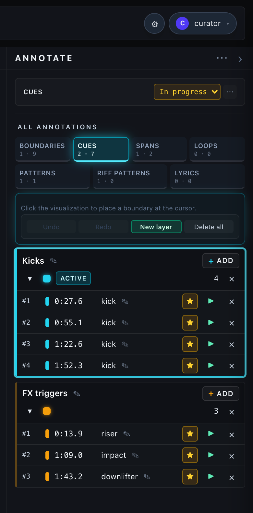

A cue marks a single instant in the song — a kick, a vocal entry, an FX trigger — with an optional label. On disk each cue is a small record holding its id, its `time`, an optional `label`, and optionally a list of alternative `candidates` times. Cues are organised into one or more named layers (e.g. *kicks*, *FX triggers*).

- **Horizontal cards** — the editor mirrors the Boundaries layout: each cue is a compact vertical card in a flex-wrap row beneath the waveform, sharing the same shell (`ItemCard.tsx`) as Boundary `SectionCard` and `LoopItemCard`. Only the **currently-selected cue layer** renders below — switch active layer from the right-edge sidebar's *All annotations* list or by clicking a layer card there. A trailing `+ Add @ <time>` card at the end of the row drops a cue at the playhead.
- **Slim per-layer toolbar** — sits above the card row with the layer's color stripe + name (inline editable), item count, **+ Add @ `<time>`** button, visibility toggle, and a one-click layer delete. Layer-level controls live here so the cards themselves only carry per-cue actions.
- **+ Add layer** (sidebar) — the unified button at the bottom of the Annotate sidebar creates a new empty layer of the active type. Same button across Cues / Spans / Loops / Riff Patterns; rendered disabled with a tooltip on the Boundaries tab (boundaries live in a single layer per source for now). Multiple layers can coexist (e.g. *kicks*, *FX triggers*).
- **+Add at playhead** — appears in the shared add-panel above (chip labeled `+ Add @ <time> → <layer>`) and on each per-layer toolbar / trailing add-card. The chip targets the active layer (see *Picking which layer ADD targets* above) and grows a `▾` dropdown when more than one cue layer exists. Adding into a layer also promotes it to active.
- **Inline edit popover** — click any cue on the canvas to edit time + label.
- **Label autocomplete** — when **Cues — label taxonomy** is on in Settings, suggestions are drawn from `cueTaxonomy` (default: `kick`, `snare`, `hat`, `fx`, `vox`). The card's label input wires into the same datalist.
- **Importance ★ / ☆** — same star toggle as Manual boundaries, available on every cue card and in the canvas popover footer. Default is **critical** (★); click to flip to **optional** (☆). The flag is persisted on the cue as `importance: "optional"` (omitted ⇒ critical).
- **Alt-candidates** — each card carries a `+` button (left of the ✕) that records an alternative time at the playhead, identical to Boundary candidates. Chips with the alt times appear under the card and can be removed with their own `✕`. During evaluation any candidate within tolerance counts as a hit, so a detector / annotator can name two equally plausible times for the same event (on-beat vs. anticipated-by-a-16th) without losing credit on either. Persisted as `candidates: number[]` (seconds in the TS shape, ms in JSON / custom-detector output).
- **Marker config** — Status pill, Import (JSON only), single-click **↓ Export** (downloads `cues-all_layers-<song>-<timestamp>.json` — every cue layer for this song bundled), **↶ Undo** / **↷ Redo** (shared layers-doc stack — see below), Delete (wipes every cue layer for this song after confirm). No Split — points can't be split. The section header's **⤓ Export** opens the multi-scope Export Manager.

> ⚠️ **Delete is destructive and has no undo.** The toolbar's Delete on the Cues tab removes every cue layer for the current song. Other layer types (spans/loops/riff patterns) on the same song are unaffected.

### Span layers

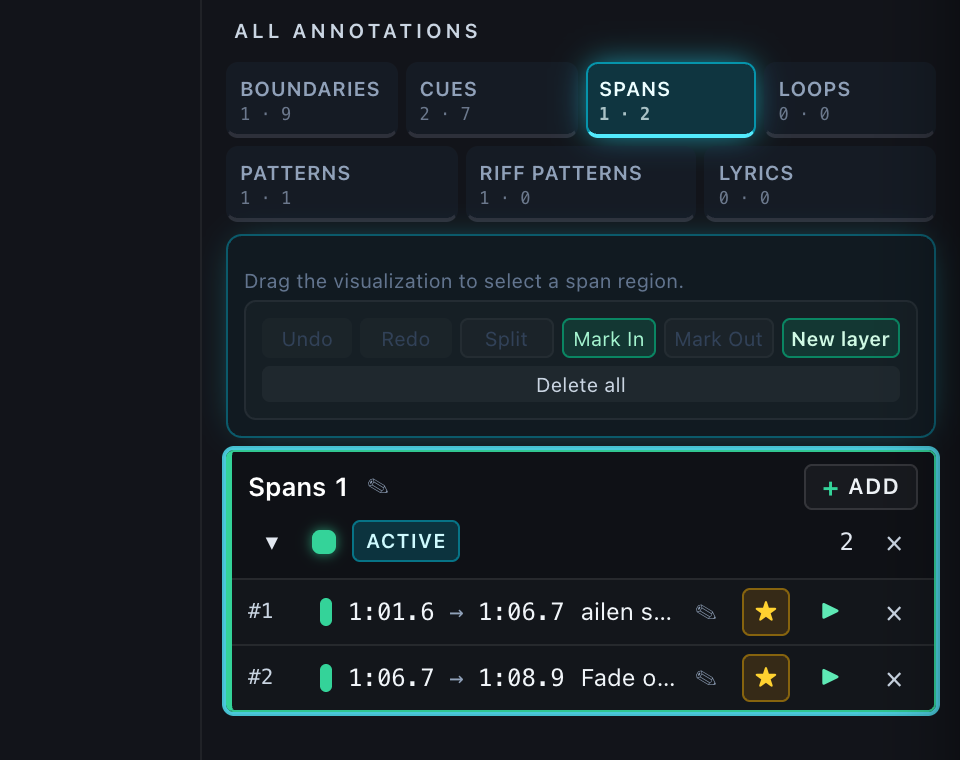

A span marks a labelled stretch of the song with a start and an end — for example the region where the lead vocal is present, or where a pad sustains. On disk each span holds its id, a `startTime`, an `endTime`, and a `label`. Unlike boundaries, spans are allowed to overlap each other (two things can be happening at once).

- **Horizontal cards** — same shell (`ItemCard.tsx`) as the Boundary `SectionCard` and the Cue / Loop cards. Only the **currently-selected span layer** renders below the waveform; switch active layers from the right-edge *All annotations* sidebar. Each card carries start + end times (with crosshair snap-to-playhead buttons), a duration chip (`Δs`), the label input, an importance ★, and a delete ✕. A trailing `+ Add @ <time>` card at the end of the row drops a default-length span (1 bar with grid, 2 s without) at the playhead.
- **Slim per-layer toolbar** — color stripe + layer name (inline editable), count, **+ Add @ `<time>`**, visibility, and a one-click layer delete.
- Click a row on the canvas to drop a pending region; drag to extend.
- Multi-row: each span lane stacks; overlapping spans render as ribbons.
- **Label autocomplete** — `spanTaxonomy` (default: `vocals`, `pad`, `bass`, `lead`, `fx`). Wired into the card's label input via the shared datalist.
- **Importance ★ / ☆** — per-span critical/optional toggle (same star icon used for Manual boundaries). Available on every card and in the canvas popover footer; default is critical (★).
- **Marker config** — Status pill, Import (JSON only — `spans-all_layers-<song>-<timestamp>.json` from Export), single-click **↓ Export** (downloads every span layer for this song in one file), **↶ Undo** / **↷ Redo** (shared layers-doc stack), **Split**, Delete. The section header's **⤓ Export** opens the multi-scope Export Manager. The pending-selection pill above is shared with Cues/Loops (it requires a drag — a single click can't define a span's duration).
- **Prominence (front ↔ back)** — per-span arc from Lead through Counter / Backing to Silent, so one span can lead and then recede without being split. See [Prominence (front ↔ back)](#prominence-front--back).
- **Split at playhead** — focus a span (click it on the canvas) whose body contains the playhead and press Split in the toolbar. The span splits in two; the halves inherit color/description and get `<label> A` / `<label> B` suffixes. The Split button is disabled with an explanatory tooltip when no focused span contains the playhead.

> ⚠️ **Delete is destructive and has no undo.** The toolbar's Delete on the Spans tab removes every span layer for the current song; other layer types are unaffected.

### Loop layers

A loop is a region you can play on a seamless repeat — useful for studying or practising a passage. It's defined in musical terms (a start time plus a length in **bars**) rather than raw seconds, so it always lands cleanly on the grid. On disk each loop holds its id, a `startTime`, a length in `bars`, and an optional `label`.

- **Horizontal cards** — same shell (`ItemCard.tsx`) as the Boundary `SectionCard` and the new `CueItemCard`. Only the **currently-selected loop layer** renders below the waveform — pick a different layer from the right-edge *All annotations* sidebar. Each card carries start + end times (with crosshair snap-to-playhead buttons), the bar-length chip (e.g. `4.0b`), the DJ-style **÷2 / ×2** halve/double buttons, the **loop-play** button — a repeat bracket wrapped around a play triangle, deliberately not a circular arrow so it doesn't read as the ↻ Re-run/Re-derive buttons elsewhere in the app (it toggles to **⏹** while playing), an importance ★, and a delete ✕. A trailing `+ N-bar loop` card at the end of the row drops a new loop at the playhead.
- **Slim per-layer toolbar** — sits above the card row with the layer's color stripe + name (inline editable), item count, the two **+ N-bar loop** quick-add buttons (disabled with an inline reason when no BPM is set), visibility toggle, and a one-click layer delete.
- **Quick-add buttons** — Settings → `loopQuickAddBars` (default `[4, 8]`): two buttons in the toolbar labeled `+ 4-bar loop`, `+ 8-bar loop`.
- Bars convert to seconds via the song's BPM + time signature.
- Active loop plays back as a tight repeat (managed by `useLoopPlayback`). The **playhead sweeps the loop** while it repeats — the waveform cursor, the lane rows and the clock in the transport all follow the preview, and wrap back to the loop's start on each pass. Stopping the preview returns the playhead to where the main player sits, so pressing Play resumes from there.
- **Importance ★ / ☆** — per-loop critical/optional toggle on the card and in the canvas popover footer (default critical).
- **Marker config** — Status pill, Import (JSON only — `loops-all_layers-<song>-<timestamp>.json` from Export), single-click **↓ Export** (downloads every loop layer for this song in one file), **↶ Undo** / **↷ Redo** (shared layers-doc stack), **Split**, Delete. The section header's **⤓ Export** opens the multi-scope Export Manager. Same drag-only pending pill as Spans.
- **Split at playhead** — same rule as Spans: focus a loop containing the playhead, then press Split. Halves inherit `snapZeroCross` and the per-bar cached length recomputes from the new endpoints.

> ⚠️ **Delete is destructive and has no undo.** The toolbar's Delete on the Loops tab removes every loop layer for the current song.

### Riff Pattern layers

*(Experimental — gated behind the same **Loops and Riff Patterns** flag as Loops above.)*

A Riff Pattern layer is a small library of reusable rhythmic figures rather than a flat list of timed marks, with three levels: a **node** is a short, timeless motif (its own length in beats, and its own rhythmic content — it has no position in the song by itself); a **combo** chains nodes (and other combos) into a longer reusable sequence; an **instance** places a node, combo, or sequence at a specific point on the timeline, optionally repeated. Switch to the **Riff Patterns** tab in the Annotate sidebar to build and place them; **+ Add** there asks whether you're creating a Node, a Boundary Node, a Combo, or an Instance.

**Which editor a click on the lane opens — the title bar is the instance, the blocks are the nodes.** An instance draws on the canvas as a slim **title bar** (its label, a `⠿` grip, and `×N` when it repeats) sitting on top of a **body** of sequence blocks, and the split tells you which of the two editors a click will open, without guessing:

- **Click the title bar** → the **instance** popup — its sequence, its repeat count, its prominence, its ★. **Drag the title bar** to move the instance and all of its repeats along the timeline. The bar spans every repeat, so it also reads as the bracket that groups them into one placement.
- **Click a block in the body** → that **node's** popup, the one whose beats the block is drawing. A block belonging to a **combo** (or a silence block) has no node of its own, so it opens the instance popup instead, expanded to that entry.
- Blocks light up on hover, so the target under the cursor is always the thing that will open.

**An instance is exactly as long as what it plays.** You place an instance by its **start**; its **end** is not yours to set — it is derived, and always equals the start plus however long the sequence actually plays for. Add a node to the sequence and the instance grows; remove one, or drag a block's right edge to shorten it, and the instance shrinks to match. The sidebar's **End** row says *↳ follows the sequence* instead of offering a snap button, and the **Start** row's `⊙ snap` therefore *moves* the instance to the playhead without changing its length. Every repeat is that same tight cycle, so `×4` of a two-second riff covers exactly eight seconds with no gap between the repeats.

> The one exception is a song with **no BPM set**. Steps only convert to seconds through a tempo, so with no grid there is nothing to fit against: the sequence is laid out from the start of the cycle and whatever is left over draws as a dashed empty tail with a `·` in it, at the end of every repeat. Set the song's BPM in Dataset Prep and the cycle trims itself the next time the song is opened.

To have both editors on screen at once, open the instance popup first and click a node chip *inside* it — that opens the node popup alongside it rather than replacing it. An instance can also be edited from the sidebar's **Instances** list, via the **▼** on its row.

#### Two kinds of node: grid and boundary

Nodes come in two flavours, and they differ only in how they describe rhythm. Both have a length in beats, both are placed and repeated identically, and both can sit side by side in the same layer, combo, or instance.

- **Node** (the sub-beat grid) — you pick a subdivision (**Divide beat into**: quarters, eighths, sixteenths, or eighth/sixteenth triplets) and then switch individual chips on and off. Everything lands on that grid. Good when the figure genuinely *is* on a grid.
- **Boundary Node** (free-form blocks) — no subdivision at all. The node is a gapless list of **blocks**, each one a `start – end` range in beats measured from the node's own start, marked either **Tick** (something sounds) or **Empty** (a rest). Edges stay exactly where they are put — an onset 0.37 beats in stays at 0.37, it is never rounded to the nearest sixteenth. Two **Tick** blocks in a row are two separate hits, not one held note.

  ```
  [0   – 2  ]  Empty
  [2   – 2.5]  Tick
  [2.5 – 3  ]  Tick
  [3   – 4  ]  Empty
  ```

  Create one with **+ Blocks** in the sidebar's Nodes header, or **New Boundary Node** in the **+ Add** menu. It's listed with a small `blocks` tag so the two kinds are distinguishable at a glance, and its popup is titled **Boundary Node**.

  > Reach for a boundary node whenever the grid one fights you — a rubato or swung figure, a live take that drifts, a rhythm whose real subdivision is somewhere between the offered ones. A grid node has to guess a subdivision; when that guess is wrong every hit sits on the wrong chip and the karaoke highlight visibly drifts from the audio. A boundary node has no guess to get wrong, so its highlight always tracks what you hear.

**Editing the blocks.** The block strip across the top of the popup is the node's whole length; whole beats are marked with faint guide lines (informational only — they are a ruler, not clickable cells, and blocks don't snap to them unless you ask). A **brand-new node** — one full-length **Empty** block, nothing marked yet — is drawn as a plain filled block in the node's colour, on the strip and on the canvas both, so it reads as a node waiting for content; the diagonal **rest hatch** appears only once the node has a tick to rest between, where it marks deliberate silence. On the strip you can:

- **Drag across the strip** to declare a span outright — press where the event starts, release where it ends, and that whole range becomes **one** block: a **Tick** when the drag began on a rest, an **Empty** when it began on a tick. This is the gesture the node kind exists for (*"between 2 and 3.5 beats, this happens"*); the exact range is shown live next to **BLOCKS** while you drag, and whatever blocks the span sweeps over are trimmed or swallowed by it. A painted span always comes back as a single block, never several — two blocks in a row would read as two hits.
- **Click** anywhere on a rest to drop a **short Tick** (half a beat, the same length **+ Block** uses) starting exactly where you clicked — a click is an instant, so it makes a small event rather than rewriting the block it landed in; near the end of a rest it shifts back just far enough to fit, and a rest shorter than half a beat simply becomes the tick. **Click a Tick** to clear that block, so the same gesture takes the hit away again. Nothing on the strip ever flips a block *whole* — on a fresh node that would turn the entire length into one tick; the whole-block flip lives on the **Tick / Empty** button in the list below.
- **Alt-click** anywhere to split that block in two at exactly that point.
- **Drag the edge** between two blocks to move that boundary. Outer edges are fixed — change the node's overall span with the **Length** field instead, which re-tiles the blocks to fit.
- **snap** (top right) is **free** by default, which is the point of this node kind. Set it to `1`, `1/2`, `1/4` or `1/3` of a beat only when you're hand-building a figure and want the help.

Underneath, the same blocks appear as a numbered list with editable `start`/`end` beat values, a **Tick / Empty** toggle (the one place a block is flipped whole), an optional per-block label (e.g. *snare*, *ghost*), and a **✕** whose meaning follows the block: on a **Tick** it removes the *hit* — the span becomes a rest and merges into the silence around it, which is how you delete a stray tap — and on an **Empty** it removes the *rest*, handing its span to the block before it. (⌘Z undoes either.) **+ Block** carves a new tick out of the end.

While the node's placement is playing, the block under the playhead lights up and a white line sweeps across the strip — the karaoke view, driven purely by elapsed time inside the node.

**⌨ Tap Along** works here exactly as it does on a grid node — press it, the real audio at this node's placement loops after a 3-2-1 count-in, and you tap the rhythm with **Space** — but nothing is quantised on the way in, and **the press and the release are the block**: pressing Space opens a **Tick** where the hit starts, letting Space up closes it where the hit ends. One press, one block, with the exact length you held it for. Nothing is padded out to a default length or stretched to reach the next hit — a long note comes out long, a clipped one comes out short. (Clicking the block strip during a pass still lands a hit by eye, for one your hand missed; a click has no duration to report, so it gets the same half-beat the editor's own click uses.) The blocks appear live while you tap; **Stop** ends the loop, then **Save** commits them, **Retry** starts a fresh count-in, and **Cancel** throws the take away. Tap for as many passes as you like: repeated attempts at the same hit are folded into one block at their *median* position, so extra passes sharpen the result instead of multiplying it.

Two dials appear beside the Retry / Save / Cancel row once a take has taps in it, and both re-render the preview as you change them, so a messy take can be cleaned up *before* Save:

- **fold** — how far apart two taps can land and still count as the same hit. Default `1/4` of a beat (a 16th at 4/4). Widen it when the same hit split into two blocks because your passes drifted; tighten it (or set it to `off`) when genuinely fast hits are being merged into one.
- **keep from** — how many passes have to agree before a hit is kept. Default **any pass**, which keeps everything, including a hit you tapped only once in a dozen passes — that's usually a slip rather than part of the rhythm, so raise this to **2 passes** or more to drop the strays. Passes are counted, not taps: tapping the same hit twice within one pass is still one vote. The choice never offers more passes than the take actually has, and it's disabled when **fold** is `off`, since with nothing folded there are no groups to count.

The **snap** picker applies to a tap session too, and can be changed *during* the review step: leave it **free** and every tap keeps the exact spot it landed on, or set it to `1`, `1/2`, `1/4` or `1/3` of a beat and watch the blocks re-quantise on screen before you save.

**⟳ From layer** builds blocks from another layer's marks that fall inside this node's placement, at their exact fractional beat positions. It opens a menu of every **onsets/cues** layer and every **lyrics** layer with something inside this node, each showing how many blocks it would actually produce, and each offering two buttons: **Replace** throws away the node's blocks and rebuilds them from that layer, while **Merge** keeps every block you already have and only adds the marks the node isn't marking yet (anything inside an existing Tick, or within an eighth of a beat of one, counts as already marked). Reach for Merge once the hand-built rhythm is worth keeping and you only want the hits you missed. Each mark opens a Tick that lasts as long as the audio under this placement says that hit rings for (capped by the next mark, so a long rest stays visibly a rest), everything else comes back as Empty, and the mark's own text is kept as the block's label — so lyrics arrive with their words on them, and a lyric line that carries its own end becomes a held block rather than a point tick. The button only appears when there's a placement, a BPM, and at least one layer with marks inside it.

**Checking the blocks against the audio.** Under the strip is a row that answers *"do my ticks actually sit on the hits?"* — the reason this node kind is un-quantised in the first place is that the grid it should agree with is the audio, not a subdivision.

- **onsets** picks what to compare against. **audio** (the default) is the track's own onset-strength curve, picked for peaks — available on any analysed song, with no detector layer loaded. A peak counts as an onset when it stands above **8%** of the loudest hit **within half a second either side**, rather than above the loudest hit anywhere in the placement: on a ten-second node one crash would otherwise set a bar that every quieter hit in the node fails, and the detector would look like it had missed most of them. The bar is deliberately **low**, because the strip draws the very curve it picks from and a visible peak with no tick on it is the app contradicting itself in front of you — so the rule is that a bump you can **see** in the envelope is a bump that gets an onset. Ghost notes, brush strokes and the quiet hits between accents are all in. Over-marking costs you a block to delete; under-marking asks you to go and find what is missing. A quiet passage still stays quiet — there is an absolute gate underneath, at **3%** of the node's loudest onset, so ripples in near-silence are not promoted to hits just because they are the loudest thing nearby — but the margin between a rest and a ghost note is genuinely narrow, and on a very quiet node you may see an onset or two you would not have called yourself. **The two edges are handled specifically**, because they are the two hits you check first and each used to fail for its own reason: a hit landing on the node's very first moment is found (it no longer needs audio on both sides of it to count, which is what made a node placed at **0:00** lose its own downbeat), a hit played a few milliseconds ahead of the node's start is claimed and pulled onto beat 0 rather than falling outside the placement, and a hit landing hard against the node's **end** now gets a block instead of being detected, drawn, counted in the readout and then marked by nothing. The reach outside the placement is **50 ms** either side — shorter than anything anyone plays, so a neighbouring node's hit is never dragged in. It is whatever the player is loaded with, so if you have switched the player's **SOURCE** to a stem it reads **audio · drums** and is that stem's curve. Next come the song's other **separated stems** — **audio · vocals**, **audio · drums**, **audio · bass**, **audio · other**, **audio · guitar**, **audio · piano** — one entry per stem [Demucs has separated](#per-song-stem-separation), listed whether or not you have looked at them yet. Then every **onsets/cues** layer with marks inside this node, so you can check the blocks against a specific detector instead. **off** hides the whole comparison.
- **Compare against a stem when the mix is too busy.** A full mix is a composite: the kick that defines your rhythm shares its transients with the vocal, the cymbals and the synth, so the mix's onset curve fires on all of them and a node marking the kick reads as *"3 / 3 on an onset · 14 onsets unmarked"*. Pointing the picker at **audio · drums** compares the same blocks against the drum track alone, and the count then means what you wanted it to mean — and since block lengths are read off the same source's loudness, seeding from a stem also gives them lengths that describe the instrument you meant rather than everything playing at once. The stem is fetched and analysed the first time you pick it — a moment on a long song, during which the readout says **reading audio · drums…** and neither **Snap to onsets** nor **Mark onsets** is offered — and stays loaded for as long as the card is open, so flipping between drums and bass to see which one your blocks actually follow is instant. If the stem can't be read the readout says so rather than scoring your blocks against nothing.
- **±10 ms — the default, and the one width that isn't a ceiling.** The **width** picker beside *snap* opens on **±10 ms**, which marks each onset with a **hairline block centred on it** and claims nothing at all about how long the hit lasts. This is the reading a boundary node is usually being asked for: *where are the hits*. The measured lengths described below are the more informative answer for a sparse passage and the less useful one for a dense passage, where a dozen measured blocks tile into a solid bar and the pattern you were looking at stops being readable — ten ticks you can count against the curve above them beat ten sustains you cannot. It is **10 ms of real time**, converted through the node's own tempo, so a hairline is the same hairline at 70 bpm and at 180. Because the block is *centred* on the peak it starts 10 ms **before** it, so the readout reports **`median −10 ms`** on a node built this way — that is the half-width, not a misalignment, and it is two orders of magnitude inside the eighth-of-a-beat window the readout calls *on an onset*. Pick any other **width** value to get measured blocks instead.
- **How long a block gets, when you ask for a length.** A detected onset says *where* a hit is, not how long it lasts — the onset-strength curve is a difference between one moment's spectrum and the next, so it spikes at the attack and is back at the floor while the note is still ringing. Block lengths are read off the **loudness** instead: each block runs from its onset until the level has fallen back a third of the way down the **rise that hit made** — back toward the bed it came out of, not down toward silence — and it is capped at whatever the **width** picker beside *snap* says — **1/2** a beat by default — whatever the level does. A staccato stab therefore comes out short and a held chord stops at the cap, instead of both being given a flat beat. Measuring the fall against the hit's rise rather than its peak is what makes this work in a **full mix**, which is never quiet: against the peak, a kick that lifts the level from 0.6 to 1.0 is only "over" once the whole mix drops to 0.33, which it will not do before the next onset — so every block ran into the next one and the node filled in solid. Against the rise the same kick is over as soon as the mix returns to 0.6, which is where the kick actually ended. The cap is the backstop: a block marks **where** a hit is, and a node is only readable if its blocks have gaps between them. **width** sets it — `1/8`, `1/4`, `1/2`, `1 beat` or `2 beats`, alongside the `±10 ms` marker above — because the right ceiling is a property of the music rather than of the app: a hi-hat pattern wants `1/8` and a sparse pad wants `2`. Each of those is a *ceiling*, not a block length: a hit that stops sooner still gets its own shorter block, so widening it never pads a stab out. (`±10 ms` is the exception — an exact width, not a ceiling, and no loudness is read at all.) It applies to the blocks **Mark N onsets** and **Add N unmarked** lay down (and to the flat fallback width when the song has no loudness curve yet); blocks already on the strip are left where they are, so changing it and clicking again is how you try another value. The stem picker still helps — **audio · drums** measures the instrument you meant rather than everything playing at once — but the mix no longer collapses into one continuous block without it. Hits that carry their own duration — a lyric line, a held Tap Along press — keep it; measurement never overrules a source that already knows. If the song's browser-side analysis hasn't produced a loudness curve yet, blocks fall back to the flat ceiling. None of this applies while **width** is on `±10 ms`, which reads no loudness and gives every hit the same hairline — including hits that carry their own duration, since a marker is a statement about position and a node of markers with one sustain in it would not read as either.
- With a source picked, the strip draws that source's onset-strength envelope **over** the blocks as a cyan curve, its loudness as a **faint grey fill** underneath (the shape the block lengths come from — a block ending halfway up a ringing note is something you can see), and each detected onset as a dashed cyan line — so the curve itself changes when you switch stems (a cues layer has no curve of its own and keeps the audio's behind it). A tick sitting on a transient covers its line; a tick that is early or late shows the gap directly.
- The readout beside the picker counts it: **`13 / 16 on an onset`** — how many Tick blocks start within an eighth of a beat of a detected onset — followed by the **median offset** in milliseconds (`+` means your blocks are *late* against the audio; it falls back to beats when the node isn't placed anywhere yet), and by **`N onsets unmarked`** when the audio has hits no block covers.
- **Mark N onsets** takes the blocks *from* the audio, so a node can be filled from the detector without tapping anything and without loading a layer. On a node with no ticks yet the button reads **Mark 9 onsets** and lays a Tick on each detected onset of the chosen source — at its exact fractional position, **each a ±10 ms hairline** by default, or **as long as the hit actually sounds** if you have set **width** to a beat fraction (see below), with the rest coming back as Empty. Once the node has ticks in it the same button becomes **Add N unmarked** and only adds the onsets no block is covering yet, leaving every block you already placed exactly as it is. It honours the **snap** picker, so setting snap to `1/2` before clicking quantises the incoming onsets to half-beats. The button disappears when the chosen source has nothing left to add, and ⌘Z undoes the whole fill.
- **Snap to onsets** moves every tick that has an onset within an eighth of a beat onto it, keeping each block's own length and its label. Ticks with no onset near them are left exactly where they are — this tightens the hits the detector agrees with, it does not rewrite the node the way **Replace** does. Two ticks landing on the same onset collapse into one hit. The button is disabled when nothing is close enough to snap to, and ⌘Z undoes the whole snap.

> The envelope, the blocks and the karaoke playhead all come from the same mapping through the node's placement, so what you see lined up on the strip is what you hear lined up in playback.

- **Generate a node from a Cues-tab selection** — you don't have to switch to the Riff Patterns tab to start a node. On the **Cues** tab, drag-select a range on the visualization over any cues layer — a manual layer or a detector-sourced one, like a **librosa onsets** lane — and the pending-selection pill grows an orange **→ Riff Node** button next to **+ Add**. Click it to choose which Riff Patterns layer receives the new node — or pick **+ New Riff Layer** to create one on the spot. The node's length in beats is computed from the selection's exact duration and the song's BPM. The grid's own resolution (quarters / eighths / sixteenths / triplets) is inferred from the onsets' spacing — the coarsest subdivision that explains them, same fit Tap Along uses — rather than always defaulting to sixteenths, and every onset/cue inside the selection is mapped onto its nearest grid step and comes up **already ON**, so the node's beat-grid editor opens with the selection's rhythm pre-chipped in, ready to name and refine rather than starting blank. Because a node alone has no position on the timeline, this action also drops an **instance** into the target layer spanning the exact same selected timeframe, with the new node as its sole content — the pattern is placed and audible immediately instead of sitting unplaced in the layer's node library waiting for a manual Instance to reference it.

  The **→ Riff Node** menu lists every destination twice: once plainly, which builds a **grid** node as described above, and once as **"… — as blocks (no grid)"**, which builds a [**boundary node**](#two-kinds-of-node-grid-and-boundary) instead. Same selection, same onsets — but nothing is quantised: no subdivision is inferred, each onset keeps its exact fractional beat position as a block edge, and each block runs for as long as its hit actually sounds rather than a flat beat. Pick the blocks variant when the onsets don't sit on any clean subdivision, or when the grid version came out visibly out of step with the audio.

### Layer audio — hear a layer's marks as clicks

Each annotation layer can play an audible click whenever the playhead crosses one of its marks, so you can *hear* a layer instead of only watching it — and, by panning two layers to opposite ears, hear where they agree or disagree. Every annotation row has a small speaker icon that opens a popover with:
- **Volume**: `0–100 %`
- **Pan**: `−100 %` (full left) to `+100 %` (full right)
- **Test** — plays one pip at current settings
- **Reset** — restores 60 % volume + center pan

When enabled, that layer emits a short click-pip every time playback crosses one of its boundaries. Pan Manual to left and Auto-guess to right and you can *hear* where the two disagree without taking your eyes off the canvas.

The per-layer audio mixer and the section-color palette both live behind a collapsed **⚙ Display options** toggle directly under the player (it expands them in place). It starts collapsed to keep the timeline flush under the transport, and your open/closed choice is remembered per browser.

### Import/Export per layer

The **Import menu** in the Marker config panel (paired with the panel's single-click **↓ Export** for the same type, and with the section header's multi-scope **⤓ Export**) handles a JSON `AnnotationLayersDocument`:

```json
{
  "version": 1,
  "layers": [
    {
      "type": "cue",
      "id": "<uuid>",
      "name": "Kicks",
      "color": "#22d3ee",
      "items": [
        { "id": "<uuid>", "time": 12345, "label": "kick" }
      ]
    }
  ]
}
```

---

## Inspect Workspace


<!-- tc-videos:inspect-workspace -->

**▶ Algorithm Inspect — scoring**

<div style="position:relative;padding-bottom:56.25%;height:0;overflow:hidden;max-width:720px;margin:1rem 0;border-radius:8px;"><iframe style="position:absolute;top:0;left:0;width:100%;height:100%;" src="https://www.youtube.com/embed/liZI2z2epGA" title="Algorithm Inspect — scoring" frameborder="0" loading="lazy" allow="accelerometer; autoplay; clipboard-write; encrypted-media; gyroscope; picture-in-picture" allowfullscreen></iframe></div>

<!-- /tc-videos:inspect-workspace -->
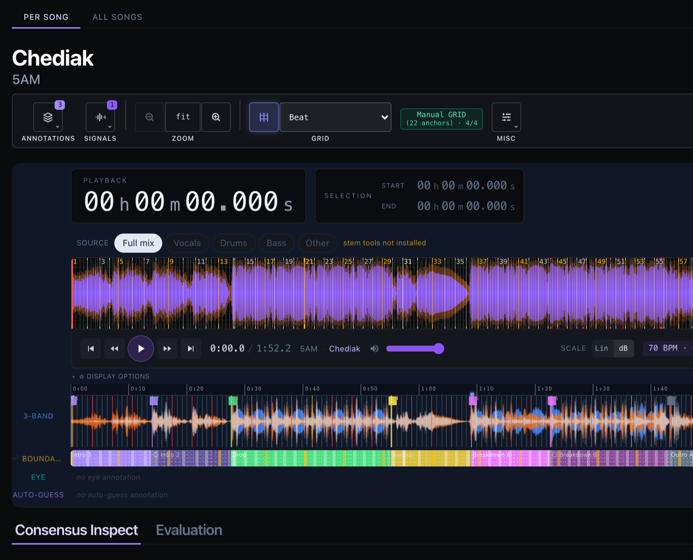

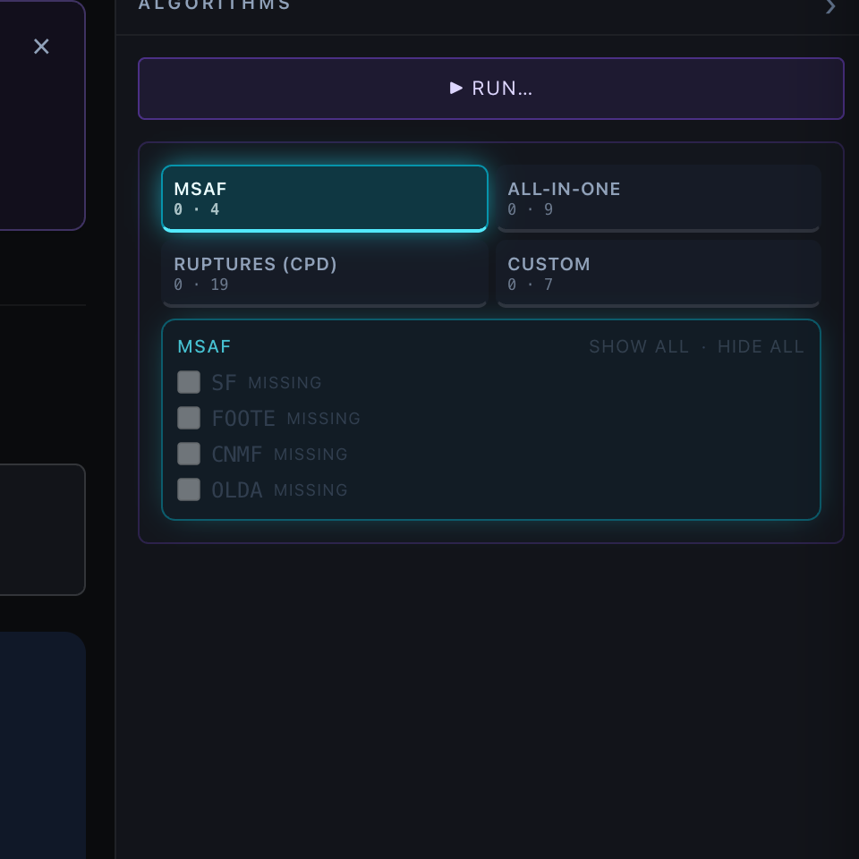

Algorithm Inspect (the violet-themed tab) is where you run structure-detection algorithms against a song and see how good they are. Each algorithm you run gets its own timeline row stacked under the waveform — drawn so you can compare what it predicted against your own hand-made annotation — and a table of scores tells you, in numbers, how closely it matched. Use it to judge which detector works best on a given track or across your whole corpus.

### Merge — blending several boundary lanes into one

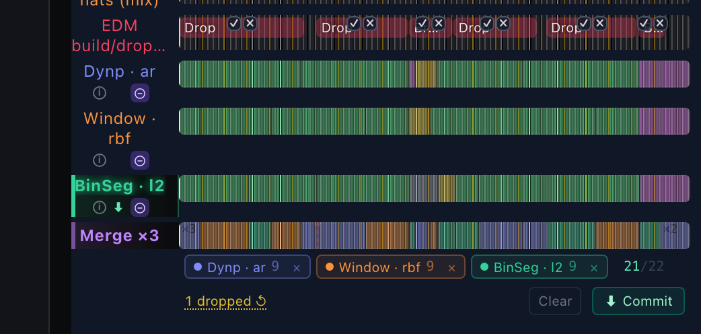

No single change-point method gets a whole song right. Looking at a stack of
ruptures lanes you can usually see it: *Dynp · ar* caught the drop, *Window ·
rbf* caught the breakdown, *BinSeg · l2* caught a turnaround the others walked
past. The **Merge** row lets you blend the lanes you trust into one set of
boundaries, for **this song only** — it is a way of reading these lanes against
each other, not a new detector, and nothing about it is saved to the corpus or
run in batch.

**Where the row is.** Merge appears on the canvas as soon as at least one
**boundary algorithm lane** is drawn — turn a ruptures / MSAF / All-In-One
family on in the Algorithms sidebar and the row is there, just under
Auto-Guess. Switch every boundary lane back off and it goes away again (unless
it still holds members), which is why you never see it in the Annotator Tool or
Dataprep: there is nothing there to blend.

**Picking the members.** The Merge row starts empty, saying so. Add a lane
either way:

- **Drag** a boundary lane's name onto the Merge row.
- Click a boundary lane's name to select it, then press the **⊕** on the small
  affordance strip under the name.

A lane that's in the blend keeps that strip visible with a **⊖** — so the
members are identifiable at a glance without opening anything — and pressing it
takes the lane back out. Only boundary lanes can join; span, note, and onset
lanes have nothing to reconcile. Switching a lane off in the Algorithms sidebar
quietly drops it from the blend and puts it back when you switch it on again:
the merge is never fed by a lane you can't see next to it.

**Everything the members found is in.** A merge is a **union**, and only a
union: every boundary from every member lane lands in the result. There is no
threshold to set, no window to tune, and no vote that can be outnumbered — if
*Dynp · ar* heard two turnarounds four seconds apart, both are in the merge,
because keeping the boundary only one lane heard is the entire reason to blend
lanes in the first place. (Narrowing a stack of lanes down to what they *agree*
on is the other tool: the [Consensus](#auto-guess-internals) lane, which has the
window and the agreement threshold precisely because that is its job.)

The only thing ever folded together is two lanes naming the **same instant** —
boundaries within **50 ms** of each other, which is already this app's rule for
"that's the same boundary" everywhere else (clicking a new boundary that close
to an existing one is a no-op too). A fold keeps the **earliest** of the real
times: every instant in a merge is one a detector actually reported, never a
synthetic average.

The row draws the result as a tiling, each block coloured by **the lane that
found it** — so you can read straight off the strip which detector contributed
which boundary, against the member chips below. Where two lanes did land on the
same instant the block carries a small **×2** badge; a block with no badge came
from one lane, which in a union is most of them.

**Dropping by eye.** Click a block to drop the boundary it starts. It isn't
discarded — it stays on the row as a dim dashed red **ghost tick**, one click
from coming back. That is the point of doing this on the canvas: a boundary that
lands audibly wrong is one click from being out of the commit. The tally beside
the chips reads *kept / found*, and a **"N dropped ↺"** link appears once you've
dropped anything; click it to put every one of them back. **Clear** empties the
blend (the member lanes themselves are untouched).

**Committing.** **⬇ Commit** copies the kept boundaries into a **new editable
boundary layer** named after its members (e.g. *Merge · Dynp · ar + Window · rbf
+ BinSeg · l2*), which then behaves like any other boundary layer in the
Annotator Tool — drag the edges, label the sections, delete what you don't want.
Every section arrives **untyped**, drawn in neutral slate and named *Section 1*,
*Section 2*, … : the merge knows *where* the structure turns, never what to call
it, so naming them is your next pass in the boundary editor. The button counts how many
layers you've already committed from this blend, so a second commit after
changing the members is obviously a second layer rather than an edit of the first.

**Committing is the approval**, and it changes what the blend *is*: a proposal
becomes a boundary layer in your own folder. Which is why it does not appear on
the Algorithm Inspect canvas — that workspace draws proposals, and this has
stopped being one. The bar says so beside the button — *⤴ Saved to your
annotations — open the Annotator Tool to see it.* Open it and there it is: it sits with the other
boundary layers at the top of the canvas, above the signal rows, since the
structure is the frame you read every other lane against. (Commit from the
Annotator Tool and the Boundaries group switches on for you.)

**Deleting one.** A committed merge is an ordinary boundary layer, stored with
your annotations for this song (`data/annotations/layers/<you>/<song>.json`) —
*not* in the algorithm-output cache and not as a custom detector. Delete it the
way you delete any layer: open the **Annotations** list, find it under
**Boundaries**, and press the **×** on its row (⌘Z undoes it). To throw away the
blend itself without committing anything, press **Clear** on the Merge row.

**The blend is remembered.** The Merge row is per-song, and each song keeps its
own: switch away and back, or reload the tab, and you find the same lanes
blended and the same boundaries dropped. It's a working view rather than an
annotation, so it's remembered **in this browser** (like the canvas's other view
settings) — it doesn't travel to another machine and it isn't part of your
annotation data. Committing is still what turns a merge into something durable
and shareable.

### Reference toggle — what you're scoring against

To score an algorithm you need a "right answer" to compare it to. This toggle, above the metric cards, picks which of your own annotation layers serves as that ground truth: **Manual** or **Auto-guess**. An option is greyed out if you have no annotation of that kind for the current song.

### Reference annotator (admin / researcher)

A second picker sits **under the sub-tabs, aligned left**, and labels itself **Reference from** — on Consensus Inspect it shares that line with **Evaluate vs**, which is the other half of the same question. It defaults to **Yourself** — your own Manual / Auto-guess files drive the canvas overlays and the boundaries scores. Researchers and admins can drop it down to any other annotator who has data for the current song; the reference boundaries on the inspect canvas, the auto-guess points, and the boundaries scoring all switch over together. Selection persists across songs, so you can flip a teammate's reference on once and step through the whole corpus comparing the algorithms against their annotations. Switch back to **Yourself** to restore the default.

> **It is a boundaries control.** Everything it moves is a boundary reading — the reference sections Consensus Inspect and the Boundaries table are scored against, and the auto-guess points on the canvas. The per-kind Evaluation tables (Cues / Spans / Loops / Lyrics) always score against **your own** annotations and never consult it, so the picker is **shown only while Examine is set to Boundaries**; on any other kind it would be a dropdown that changed nothing you were looking at. It is also hidden for team-tier and public users (only their own data is reachable), for songs where no other annotator has any data, and on the **Karaoke** tab, which has no reference at all.

### Evaluation engines (side-by-side)

The scores can be computed two ways, shown side by side so you can cross-check them. **`mir_eval`** is the standard the research community uses (so your numbers are comparable to published papers); the **Custom** engine is TimeCues' own, which adds a few extra measures the standard one doesn't report. The two columns are:

| Engine | Source | Metrics |
|--------|--------|---------|
| `mir_eval` | Real upstream Python `mir_eval.segment.detection(trim=True)`, served by `tools/python/mir_eval_server.py` on `:8001` | Precision, Recall, F |
| `Custom` | TimeCues evaluator (in-browser) | P / R / F **+** Mean Nearest-Boundary Distance (MNBD, seconds — lower is better) **+** Critical-Section Recall (CSR — recall over ★ Manual sections only) |

The Custom engine honors every candidate start (a prediction matches if it falls within τ of *any* candidate). The **optional-weight slider** (`CustomEvalControls.tsx`, 0–1) controls how much ☆ sections contribute to F.

> **mir_eval column requires the Python server.** If the `mir_eval` cells show `—` and a red "server unreachable" banner appears, start it with `python tools/python/mir_eval_server.py`. The Custom column keeps working without it.

> **MIREX trim convention.** `mir_eval` is called with `trim=True`, the canonical MIREX boundary-detection setting — the `[0, track_duration]` anchors are treated as silence padding and are **not** scored, even if a manual annotation explicitly marks time 0. This matches the numbers reported by SALAMI / MIREX papers and is the right baseline for cross-paper comparison. The Custom column scores every user-marked boundary regardless.

### Tolerance slider — how close counts as a match

When scoring, a predicted boundary rarely lands exactly on your annotated one. The tolerance is the time window within which a prediction still counts as "correct." You can set it from **0.25 s up to 5 s**, in **0.25 s** steps, and it drives both scoring engines. On the Evaluation tab the slider sits in the header; on Consensus Inspect it moved into the panel's drawer, beside the cluster window and agreement sliders, where the preview redraws as you scrub it. The Custom column re-scores instantly; the `mir_eval` column dims briefly and refreshes about 400 ms after the slider settles (one request per settled value, in-flight requests are cancelled when the slider moves again).

### Sub-tabs

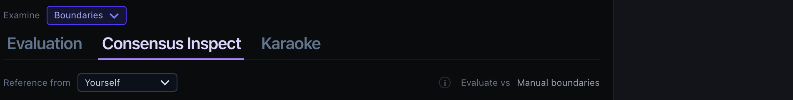

**Examine** sits on its own row above everything. It names the annotation kind,
and every sub-tab under it is a *view* of that kind:

| Sub-tab | When it's offered |
|---------|-------------------|
| **Evaluation** | Always — every examined kind can be scored, so this tab anchors the strip. |
| **Consensus Inspect** | While **Examine** is set to **Boundaries**. The consensus aggregates boundaries only, so there is nothing for it to build out of any other kind. |
| **Karaoke** | While a **lyrics lane is focused** on the canvas. See [Clicking a Lyrics lane reads the words instead](#the-verdict-and-the-drawer-under-it). |

When you have switched on any experimental annotation family (Cues / Spans / Loops / Lyrics in Settings), the **Examine** picker appears on that top row. It chooses which annotation kind you're inspecting and drives the Evaluation table; pick anything other than Boundaries and the Consensus Inspect tab goes away, leaving the Evaluation tab for that kind. The right-edge **Algorithms sidebar stays available for every Examine kind** (it no longer disappears for non-boundary kinds), and switching Examine **auto-opens the matching detector family** in that sidebar (e.g. Patterns → the PATTERN family, Cues → CUE extras) so the detectors you'd run for the examined kind are immediately visible. With no experimental family enabled there is just one kind (Boundaries), so the picker hides itself and the tabs sit at the top alone.

**Reference from** is *not* on that row. It is not a second axis of what you're examining — it is the first half of what you're **scoring against**, so it sits **below the tabs, aligned left**, paired on the same line with the stage's **Evaluate vs**: whose annotations count as the truth on the left, which of their layers on the right. On the Evaluation tab it takes the row directly above that tab's own header.

**Consensus is where you tune; Auto-guess is where it's kept.** Nothing in the
Auto-guess panel says whether ±3 s beats ±2 s — this stage does, against a
reference, live. So the Consensus Inspect panel carries a **⬇ Use for Auto-guess**
button beside the verdict: it opens the Annotator Tool's Auto-guess panel with the cluster window,
min-agreement, centroid method and detector selection you just scored, ready for
a **Generate**. The return leg is the Auto-guess panel's **Tune in Consensus
Inspect →**. See
[Moving the settings between the two panels](#auto-guess-panel) — which
also covers the guard against scoring a consensus against Auto-guess and then
building Auto-guess from it.

#### The verdict, and the drawer under it

Consensus Inspect answers one question — *is this blend any good against my
annotation?* — so it leads with the answer in a sentence and keeps the
machinery folded away until you want to tune it.

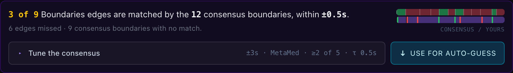

**Collapsed** there are three things: the **verdict** (`3 of 9 Boundaries edges
are matched by the 13 consensus boundaries, within ±0.5s`, with the shortfall
underneath), a **two-row thumbnail** of the consensus tiling over your own, and
the **drawer handle** — which is also the one place the current parameters are
printed: `±3s · MetaMed · ≥2 of 12 · τ 0.5s`. **⬇ Use for Auto-guess** stays
beside it, so acting on a verdict you trust never needs the drawer.

The sentence quotes the counts *the scorer* used. `mir_eval` runs with
`trim=True`, so a boundary at 0 s or at the track end is excluded from both the
metrics and the verdict — the sentence and the numbers under it always agree.
Every other state gets its own sentence rather than a stale number: no detectors
selected, nothing above the agreement threshold, no reference layer, or a score
still in flight.

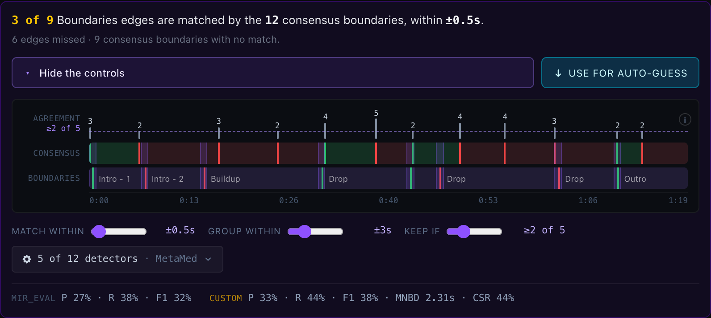

**Open it** and the same panel becomes the instrument the sentence summarised.
Three lanes share one axis across the whole track:

- **Agreement** — one stub per grouped boundary, its height *and its printed
  number* being how many distinct detectors proposed it. The dashed violet line
  is the **Keep if** threshold named in the gutter; stubs below it stay on
  screen in grey, because what the threshold is discarding is the thing you are
  choosing between.
- **Consensus** — the blend as a tiling: each boundary runs to the next one, and
  the *edge* carries the verdict — green where it matched one of your edges,
  red where it did not.
- **Boundaries** (or **Auto-guess**) — your own layer as the tiling it is,
  section names and all, hatched wherever nothing is annotated. Its edges are
  coloured the same way, so a missed edge is visible where it happened.

Straddling both tilings, a **violet gutter** marks the ±τ window each of your
edges is judged in — the target a consensus edge has to land inside, drawn at
its real width.

Under the axis, a **legend** names all three colours in the current tolerance
(*green — within ±0.5 s of a Boundaries edge*, *red — no Boundaries edge within
±0.5 s*, violet — the match window), and a **tally** counts them: how many
consensus boundaries there are against how many edges you annotated, how many
matched, how many are extra, and how many of your edges were found. When the
extras outnumber your edges more than two to one, it says so and points at
**Keep if** — a wall of red usually means weakly-agreed boundaries are getting
through, not that the detectors are wrong.

**Point at any stub or consensus edge** for a card with the rest of the story:
its time, how many of the checked detectors proposed it, *which* detectors
they were, and the verdict with a distance — "matched *Chorus* at 1:02, 0.12 s
away", or "no match; nearest Boundaries edge is the edge at 1:11, 14.2 s away —
outside ±0.5 s". A red edge 0.3 s off your boundary and one 14 s from anything
look the same on the lane; the card tells them apart. Grey stubs under the
threshold get a card too, saying they were cut.

The sliders sit directly under the picture they redraw, and each one reads as
the sentence its value finishes:

- **Match within ±0.5 s** — τ, how far a consensus boundary may sit from one of
  your edges and still count. The same tolerance the Evaluation tab uses.
- **Group within ±3 s** — the cluster window: detector boundaries closer
  together than this are treated as *one* proposed boundary. Widen it and
  neighbours merge into fewer, better-agreed boundaries; the stub counts rise.
- **Keep if ≥2 of 12** — the agreement threshold. A grouped boundary only
  enters the consensus when at least this many distinct detectors proposed it.
- **Centroid** and the **N of M detectors** picker finish the row; the picker's
  popover is where individual detectors (and the Custom-eval options) live.

Both evaluators then report on one line — `mir_eval` strict, `custom`
optional-weighted, with the weight and candidate setting spelled out after them.
They disagree on purpose; see [Evaluation engines](#evaluation-engines-side-by-side).

The drawer's open/closed state is remembered per browser, not per song, so
tuning across a corpus doesn't mean reopening it on every track. Collapsed is
the first-run default.

**Clicking a Lyrics lane reads the words instead.** Lyrics on the inspect
canvas are a transcript, not a set of boundaries, so clicking a lyrics lane's
label **adds a third sub-tab, Karaoke, and opens it** — the lyrics as flowing
text, following playback. This works for **both** kinds of lyrics lane: a
lyrics **layer** you authored or imported, and a lyrics **detector** lane
(**Whisper-base lyrics**, **CTC forced aligner**) drawn from the Algorithms
sidebar. Reading a detector lane this way is the fastest check on a
transcription — the thin per-word row is built for alignment, not for telling
whether the model actually heard the song.

The Karaoke tab is a tab like any other, so nothing is displaced and nothing is
ambiguous: **Consensus Inspect and Evaluation stay right there**, lit when they
are what's below and clickable when they are not. Click **Consensus Inspect**
and the consensus comes straight back with the lyrics lane still selected and
the Karaoke tab still on the strip. The tab disappears only when the lyrics
lane does — click the lane again to deselect it, or click any other lane — and
you land back on whichever tab you were on before the karaoke. (The Consensus
row on the timeline follows the stage, as it always does — see below.)

The card is the same one the Annotator Tool shows, with one difference: on a
detector lane the header names the detector and there is no layer picker, since
the lane you clicked *is* the pick. Clicking a lyrics **layer** hands the card
back to the layer-picking behaviour described under
[The Karaoke panel](#the-karaoke-panel--and-which-layer-it-follows). The words
it reads are the detector's own output — the same ones the lane's **⬇** copies
into a layer — so reading and copying can never disagree about what the model
said.

**Where the consensus is drawn.** The Consensus Inspect panel keeps the
*reading* — the verdict, the scores, and the preview inside its drawer — but the
consensus itself is also drawn on the timeline above, as a **Consensus** row in the viz panel
(under **Merge**, alongside the detector lanes it was blended from and the
boundary layer it is being scored against). Reading it there is the point: a
"miss" half a bar off your own boundary and a genuine disagreement look
identical in a strip of their own.

The row tiles each consensus boundary to the next one and colors it by verdict
— **green ✓** matched a reference boundary within τ, **red ✗** did not — and
carries a small **red tick** on its top edge wherever the reference has a
boundary the consensus never proposed. With no reference to score against, the
tiles stay neutral violet. Click a tile to seek to its boundary; hover for the
verdict and the time. The legend under the panel names the same three marks and
counts them. Drag its label to reorder it like any other row; it appears only
while this stage is open, since nothing else can change what it shows.

**The two buttons under the lane's name.** They are all there is to do to this
row, since it has no items to edit:

- **⬇ — copy it into an annotation.** The blend is a proposal that vanishes
  with the stage that computed it; **⬇** turns it into a boundary layer named
  *Consensus* that you own and can edit, at any point, as many times as you
  like. You get the same tiling a [Merge](#merge--blending-several-boundary-lanes-into-one) commits: one section per
  consensus boundary, a block laid at `0:00` for the opening stretch, every
  section **untyped** and named *Section 1*, *Section 2*… — the consensus knows
  *where* the structure turns, never what the sections are called, and naming
  them is your next pass in the boundary editor. The verdict colors are **not**
  copied: ✓ / ✗ score the blend against whichever reference is loaded, and that
  is an opinion about your annotation, not part of it. The copy has no link
  back — retune the consensus and the layer you already took stays as it was.
  Boundary layers are hidden by default in Algorithm Inspect, so the copy also
  switches them on; hover the **⬇** to see how many copies you have already
  taken, and delete one and the count drops.
- **✕ — take the row off the timeline.** Bring it back from
  **Algos ▸ Consensus** in the viz control bar — the same checkbox that puts it
  there in the first place, since the lane starts off.

#### Algo-Inspect

A stacked-MiniBlockRow view. Each row is colored by predicted section type. **Click any block** to open a read-only details card — same shape as the cue/span/loop popovers in the Annotator Tool — showing what the algorithm actually emitted: the row name, the section's `label`, `type`, `start` / `end` (seconds + bar.beat), length in bars/beats when BPM is set, and the swatch + hex if the detector colored the block itself. The card carries a **▶ Play** button that seeks to the block's start and auto-pauses at its end (⏹ while inside), and an *algo* badge to make the read-only origin explicit (no Delete / no importance star). Click outside or hit Esc to close. Rows are drawn in this default order (movable):

```
Band-gradient · LLM-vision · CPD (Ruptures) · MSAF · All-In-One ensemble · folds 0–7 · custom detectors
```

The **Evaluate vs** reference (top-right) scores the consensus against your **Manual boundaries** by default. **Auto-guess** only becomes available once that layer is switched on — it is hidden by default (Settings → `defaultShowAutoGuess`), matching its visibility on the main canvas. If you turn it off while it's the active reference, the reference falls back to Manual boundaries.

While Auto-guess is off there is only one reference to choose, so **Evaluate vs** is plain text rather than a dropdown — it still names the reference every score below it is measured against, and it becomes a picker again as soon as a second source has data. The label deliberately reads *Manual boundaries* rather than *Boundaries*, so it never collides with the **Examine** picker above the tabs, which uses *Boundaries* for the annotation kind.

**Run controls** depend on the active scope tab:

- *Per song* tab → the right-edge **Algorithms sidebar** is where you both **view** cached results (per-row visibility checkboxes) and **run** new ones (via the **▶ Run…** picker). The middle column shows no run controls — they would duplicate the sidebar.
- *All songs* tab → **▶ Batch run across N songs** sits at the top of the workspace with **⚙ Batch algorithm options** next to it (checkbox grid for MSAF, All-In-One, Ruptures CPD plus the **Demucs model** dropdown used by All-In-One). Runs sequentially across every song; progress and logs stream below the song title. The algorithm selection is shared with the per-song sidebar — set it once and reuse it.

**Algorithms sidebar** (per-song workspace only). The right edge of the *Per song* workspace carries a collapsible **Algorithms** panel. Families (MSAF · All-In-One · Ruptures CPD · experimental SPAN/LOOP/CUE-extras/LYRICS; custom detectors are only in the **▶ Run…** picker, their results in the Detectors sidebar) are laid out as a row of **toggle chips** — the same chips the annotation list uses. Each chip shows the family name and a compact `cached / total` count; click a chip to expand or collapse that family's rows. Several can be open at once — their frames stack below the chip row — so you can show only the families you're working with instead of scrolling the whole list. Which chips are open persists per browser. Inside each open family, every row has a checkbox that **toggles whether that detector's result is drawn on the waveform** — enabled only once the result is **cached**, so a missing row stays greyed until you compute it — followed by a status pill:

- Green **cached** — the JSON already exists for the current song.
- Slate **missing** — has not been computed yet (or was filtered out, e.g. an All-In-One model with no Demucs profile available).
- Red **failed** — the last run attempted this algorithm but it returned a non-200, a Python exception, or its sidecar isn't reachable. Hover the pill to see the error reason (HTTP status + body, `exit N`, or the connection error including which Docker profile to start). The full traceback streams into the run log panel below the song title. Failed pills clear on the next successful run and disappear if you reload the page.

The header above each open family carries **Show all / Hide all**, which draw or hide every *cached* result in that family on the waveform at once (missing rows, having nothing to show, are untouched).

To compute results, click **▶ Run…** at the top of the sidebar. The picker opens **mirroring the sidebar you just came from**: the detectors ticked there for viewing arrive ticked here for running (a per-stem row such as *Whisper-base · vocals* maps back to its base detector, since the stem is a separate **Run on** choice), and the **Run on** target is set to whatever the **Stem filter** was showing, when that stem can actually be a run target. The two panels share the same chips and the same checkbox rows, so a picker that opened on a *different* set of ticks read as the app changing your selection out from under you — it used to arrive pre-ticked with every not-yet-cached detector, which could be a dozen algorithms nobody chose. Detectors whose family isn't installed or enabled are dropped from the mirror, since they can't run. A **Select missing** button at the top of the picker applies the "everything missing in the expanded families" default on demand — that is the one-click way to fill in the gaps — and the row beside it reads *Your sidebar ticks* as a reminder of where the selection came from. With nothing ticked the footer button reads **▶ Nothing ticked — pick algorithms above** and stays disabled. Once you edit the selection inside the picker it is yours: closing and re-opening it, or switching the **Run on** stem target, leaves your ticks exactly as you left them (re-seeding on every open would throw away a selection you had just made — including the one Dataset Prep's batch runner shares with it). It lists the same families with checkboxes that select what to **run** — this run selection is shared with Dataset Prep's batch runner, so there's one set of ticks, not two. Inside the picker each family also offers **▶ Run missing (N)** (run only that family's not-yet-cached algorithms) and **All / None** (tick or untick the whole family), plus the **Demucs model** dropdown used by All-In-One. The footer **▶ Run N algorithms for this song** runs whatever is currently ticked. A ticked algorithm that already has a cached result is treated as a deliberate re-run: the footer run **recomputes it and overwrites its cached JSON**. An amber line under the button says how many ticked algorithms will be overwritten before you click, and unticking one keeps its cached output. That is how you re-run with changed settings — a different **Demucs model**, or a different **Whisper language** — without deleting files by hand. The per-family **▶ Run missing (N)** button is the opposite and stays conservative: it only computes what has no cached result. Experimental family rows additionally carry a **↻** button beside any cached algorithm, which re-runs just that one. Some of these detectors only make sense on one stem, so they show a small amber **best on vocals** or **best on drums** chip while **Run on** points somewhere else: **Silero-VAD**, **JDCNet**, **Whisper-base** and the **CTC forced aligner** need the vocals stem, and **drum transients** needs the drums stem. On the full mix a voice detector fires on synth pads, and the drum classifier calls the bass a kick. Clicking the chip sets **Run on** to that stem. **Run on** is one setting for the whole run, so the chip's tooltip warns that the change moves every ticked detector. The chip disappears once **Run on** is that stem or **All stems**. If the song hasn't been separated yet, the chip is greyed out. The chip is only a hint. Unlike a custom detector's stem, it never stops you from running the detector on another stem. The picker also has a **Custom** family chip, which exists **only in the picker**: it lists every installed custom detector, grouped by the stem each one reads (**Full mix**, **Drums**, …), with the same **cached / missing / failed** pill, **↻** re-run, **▶ Run missing (N)** and **All / None**. A custom detector always reads its own declared stem, so choosing a single stem under **Run on** narrows the list to that stem's detectors instead of retargeting them. A detector whose stem hasn't been separated for this song shows **needs <stem>** and can't be ticked. Custom results are never drawn from the Algorithms sidebar. When a run finishes, each detector that produced output appears in the **[Detectors sidebar](#annotation-workspace)**, already shown on the timeline, and that sidebar opens if it was collapsed. A detector with no result for the song is not listed there at all. Dataset Prep's **batch** run across the whole corpus still skips cached results, since there is no per-song ticking there. While a job is in flight the sidebar's button flips to **⏳ Running…** and the canvas + status pills auto-refresh as each algorithm completes; a freshly computed result can then be toggled on from its row.

Drag the sidebar's left edge to resize (320–640 px, double-click to reset to 420 px); collapse with the **›** chevron and the panel becomes a hover tab on the right edge. Width + collapsed state persist per browser.

**Status pills** in the run log panel report what *actually* happened per algorithm family (MSAF / All-In-One / Ruptures CPD / experimental sidecars / Custom — custom detectors run in the *same* job as the built-ins, so they share one report, one log, and one set of pills), not just whether the job process exited cleanly:
- **✓ green** — every requested algorithm in that family produced fresh output.
- **⚠ amber** — mixed: some succeeded, some failed or were already cached. Pill labels expand to `(N ok · M failed · K cached)`.
- **✗ red** — every requested algorithm failed (typical cause: the corresponding Python server isn't running on its expected port; full error text is in the log pane below).
- **⊝ slate** — nothing ran because every requested algorithm in the family was already cached on disk.

The summary line on the right follows the same logic: `done in Xs — 4 ran` (clean), `partially done in Xs — 1 ran, 1 cached, 4 failed` (amber), or `failed after Xs — 4 failed` (red).

Switch to *All songs* when you want to process the whole dataset; stay on *Per song* to iterate on just the song you're listening to.

#### Re-transcribe this section (Lyrics)

A whole-song transcription is a single take. Where Whisper mis-hears a line — or
skips one entirely, which it does far more readily over a dense mix than over an
isolated vocal — the only repair used to be running the whole song again and
hoping, which throws away every line the first take got right.

The **Re-transcribe this section** panel narrows that to one window on one stem.
It lives in the Algorithm Inspect **Algorithms** sidebar, inside the **LYRICS**
family — directly under the Whisper / CTC checkboxes and the Whisper language
picker, with the two detectors it re-runs. It needs **Experimental annotation
types → Lyrics** switched on.

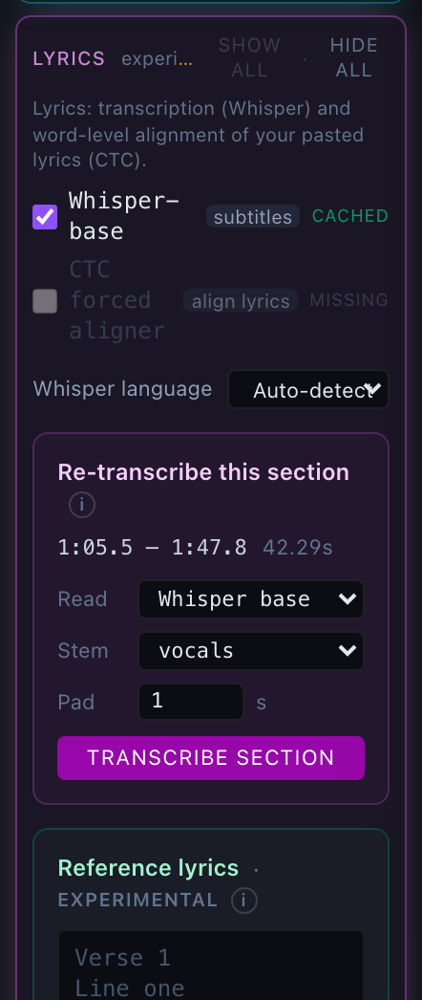

**It appears only while a region is highlighted**, because the highlight *is* the
window: there is nothing to transcribe without one. Drag over the silent gap on
the canvas, open the LYRICS family in the sidebar, and the panel is there with
that stretch already loaded — shown as a clock-time range and its length. Move
or resize the highlight and the window follows; clear it and the panel goes away
(along with any words it had heard, which belonged to the old window). The
minimum is 0.25 s — enough to hold one sung word.

Below the window:

1. **Which detector, on which stem** — **Whisper base** or **CTC forced
   aligner**, against the full mix or any stem Demucs has separated for this
   song. The stem is the setting that usually fixes a gap: Whisper hears words on
   `vocals` that it sails past on the mix. The re-run uses the **Whisper
   language** chosen just above it in the family, so a window is read the same
   way the whole-song run would read it — leave that on *auto-detect* only if you
   trust it, because a few seconds of an isolated stem is thin evidence and a
   wrong guess comes back as an English translation of the line. **pad** is how
   much surrounding audio the model hears for context — it stops the first and
   last word being clipped mid-syllable, and the padding's own words are
   discarded. Picking the CTC aligner adds a text box for **the words sung
   here**: an aligner has nothing to align without them, and the song's full
   reference lyrics are deliberately *not* used (force-aligning a whole song's
   text into eight seconds would place every line inside the window and call it
   an alignment).
2. **What it heard** — one row per word, with its times (click them to seek) and
   an editable text field. Untick a word to drop it, or correct the spelling in
   place. Whisper splits contractions oddly (`j` and `'arrête` as separate
   words); fix them here rather than in the layer afterwards.

Nothing is written until you say where it goes. **Write into** offers:

- the **detector result** itself (`whisper-base`, or `whisper-base · vocals`) —
  the cached JSON behind that algorithm row. Repairs the source, so every later
  *Copy to manual layer* includes the fixed window, and the algorithm's lane
  redraws immediately.
- any **lyrics layer** on the song — the editable layer you are actually
  correcting, patched in place.

**Replace window** writes the ticked words over that stretch and leaves the rest
of the take alone. **Clear** deletes what the target has there and puts nothing
back — the honest answer when a run hallucinated a line over silence.

> ⚠️ Both buttons are **destructive inside the window, and only inside it**. Any
> word overlapping the window is replaced, including one that starts just before
> the start time or ends just after the end time — half a word is not a word. A
> line that straddled an edge comes back split at the window. There is no undo
> on the detector-result target (the file on disk is rewritten, with a record of
> the patch kept inside it); the layer target is covered by the normal
> annotation undo.

#### Evaluation

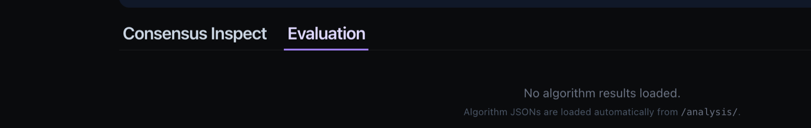

One sortable row per loaded algorithm. Click any column header (Precision, Recall, F, Hit/Ref, MNBD, CSR) to sort; default is F descending.

Cell tinting:

| Tier | F / P / R cutoff | MNBD cutoff |
|------|------------------|-------------|
| Green   | ≥ 0.70 | ≤ 0.5 s |
| Yellow  | ≥ 0.50 | ≤ 1.5 s |
| Orange  | ≥ 0.30 | ≤ 3 s   |
| Red     | < 0.30 | > 3 s   |

The best F row is starred and tinted green; the worst is tinted red. Ruptures rows carry an emerald `CPD` badge to keep family origin visible after sorting.

---

## Inspect All


<!-- tc-videos:inspect-all -->

**▶ Algorithm Inspect — all songs**

<div style="position:relative;padding-bottom:56.25%;height:0;overflow:hidden;max-width:720px;margin:1rem 0;border-radius:8px;"><iframe style="position:absolute;top:0;left:0;width:100%;height:100%;" src="https://www.youtube.com/embed/1nXYwwpL6tI" title="Algorithm Inspect — all songs" frameborder="0" loading="lazy" allow="accelerometer; autoplay; clipboard-write; encrypted-media; gyroscope; picture-in-picture" allowfullscreen></iframe></div>

<!-- /tc-videos:inspect-all -->
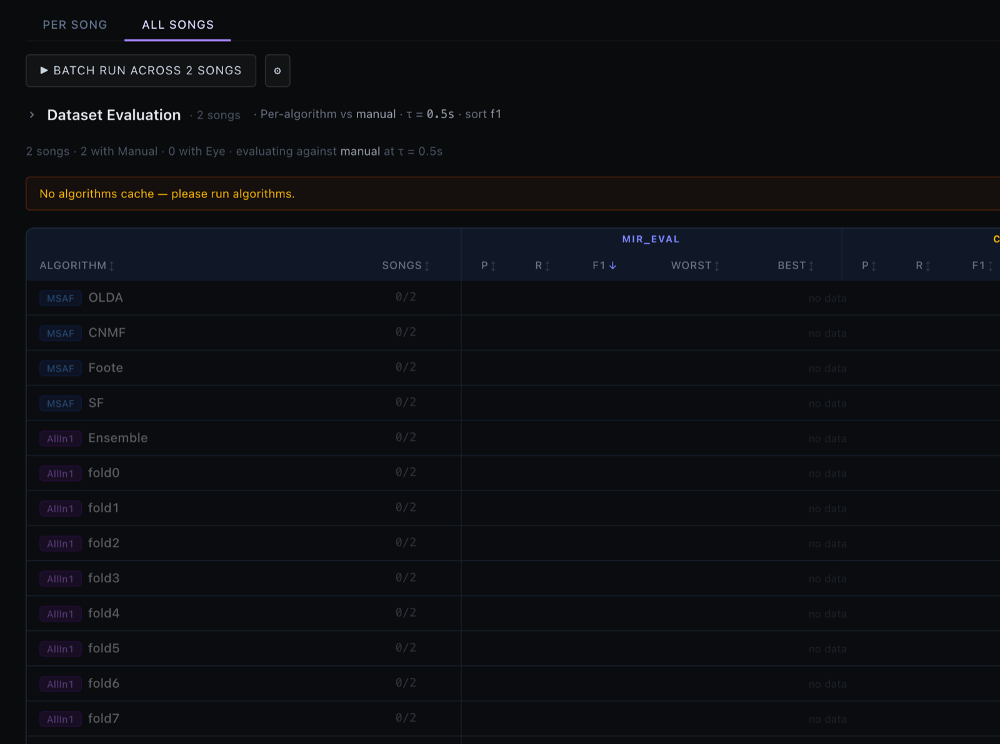

Inspect All is the corpus-wide version of Algorithm Inspect: instead of judging detectors on one song, it scores every algorithm across *all* your reviewed songs at once and ranks them on a leaderboard. This is how you answer "which detector is best overall?" rather than "which is best on this track?" It works from your Manual annotations and the algorithm results already cached for each song.

### Per-algorithm leaderboard

The leaderboard has one row per algorithm. Each row reports:
- songs scored,
- mean P / R / F,
- min / max per-song F (consistency),
- MNBD, CSR.

**Algorithm-subset presets** in the header: `MSAF only`, `AllIn1 + CPD`, `AllIn1 + Ruptures`, `MSAF + AllIn1 + CPD`, `All`. Selecting a preset filters the table and recomputes ranks but does not re-run anything.

**Per-algorithm drill-down**: clicking any row expands to show per-song F so a low-variance mid-pack detector is visually distinguishable from a high-mean detector that fails on two tracks.

Group badges: MSAF (blue), AllIn1 (purple), CPD (emerald), Ruptures (fuchsia), Other (gray).

### Auto-Guess grid search — find the best Auto-guess settings

Auto-guess has several tunable knobs (how tightly to cluster, how many detectors must agree, and so on), and the best combination isn't obvious. This tool brute-forces it: it tries every combination across a grid of settings, scores each one against your whole corpus, and ranks them, so you can adopt the settings that produce the best agreement with your ground truth. The grid sweeps four axes:

- Cluster tolerance τ: 8 steps from 0.5 → 5 s
- Min-agreement: 1 … 5
- Centroid method: `{Mean, EqGrp, MetaMed, Plural, NearRaw}`
- Algorithm subset: 19 family-combination presets

Optionally crossed with a fifth axis — the evaluation tolerance itself (5 steps) — giving up to ≈ 95,000 configurations.

Live progress reporting; on completion the top-N (default 20) configurations are listed sorted by aggregated F across the corpus. The **Apply** button on any row writes that configuration into the live Auto-Guess sliders and switches the canvas back to single-song view so the user can audit how it treats individual tracks.

---

## Dataset Prep

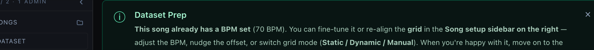

Dataprep (the emerald tab, at `/prep`) is where songs *enter* the corpus and get readied for everyone else's work — you upload audio here, set each song's tempo and beat grid, run batch analysis, and manage disk space. It uses the same audio canvas as the other workspaces but has no section/cue editors, because its job is curation, not annotation. As a rule of thumb: a new song should always be set up here first, before anyone tries to annotate or evaluate it.

### Differences from Annotate

- Annotation tabs hidden.
- The big **Playback / Selection** numeric readout above the player is hidden — grid setup doesn't need a precise playhead clock and the numbers add visual noise. The readout returns in Annotate / Inspect.
- Every step in the Song setup panel is collapsed by default (see [Song Info Bar](#song-info-bar) and [Metronome Panel](#metronome-panel-dataset-prep)), leaving only the status card, so the canvas dominates on first open.
- The `G` shortcut means **Align grid to playhead (set bar 1)**, not *Toggle Manual layer*. `Shift+G` also aligns the grid.
- Storage stats are shown more prominently in the sidebar.
- **The tempo-mode picker** (Steady · Mapped · Hand-placed) sits in step ① of the Song setup panel — see [Grid Mode](#grid-mode-steady--mapped--hand-placed) above for the contract. The grid mode is persisted per-song to `data/song-info/<slug>.json` as `gridMode` + `gridSegments` + (Hand-placed only) `beatOverrides` — the override map is keyed by the cumulative integer beat index from the song origin and stores the pinned absolute timestamp in seconds.
- The sidebar gains three Dataset-Prep-only controls:
  - **⤒ Import dataset** at the top of the sidebar (admin-only) — opens the Import Dataset dialog (see [Importing a dataset](#importing-a-dataset) below)
  - **⤓ Full annotation export** at the top of the sidebar (next to `+ Upload songs`) — opens the Export Manager with multi-song scope plus audio / algo cache / stems toggles
  - **✕ Delete all songs** in the sidebar footer (admin-only, hidden in Demo)

### Uploading songs

The **+ Upload songs** button at the top of the Songs sidebar (admins only, **Dataset Prep only** — Annotate and Algorithm Inspect deliberately have no upload affordance, so the corpus can only grow from the curation workspace) opens a multi-file picker for `.mp3` / `.wav` / `.flac` / `.ogg` / `.m4a`. A small **folder icon** to its right opens a *folder* picker instead. Either way uploads are chunked client-side (8 MB per chunk) so they sail past the 100 MB Codespaces proxy cap.

You can also **drag and drop** files or folders directly onto the Songs sidebar **while in Dataset Prep** — the whole sidebar is a drop target (it tints green while you're dragging). The drop handlers are inert in Annotate / Algorithm Inspect, so a stray drag onto the sidebar in those workspaces does nothing. Folders are walked **recursively**: if subfolders are present, you'll get a confirmation prompt — *"Found N audio files across subfolders. Upload them all flat (folder structure will not be preserved)?"* — so a misclick on the wrong folder can't dump hundreds of files into your dataset. Non-audio files in the drop are silently skipped.

While an upload is in progress:

- The button area is replaced by a compact rainbow progress bar showing **current file name**, **chunk N/M**, **bytes sent / total**, and **percent**.
- The same indicator (wider variant) appears under the Songs sidebar list when multiple files are queued.
- The bar's fill sweeps across over about three quarters of a second, and the indicator stays up for **at least ~2 seconds** even when the upload itself took a few hundred milliseconds — a local upload would otherwise finish before you could read it. Nothing waits on that: the song is on disk, selected, and queued for stems before the bar comes down.

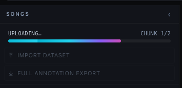

The manifest refreshes once at the end (not per file), and the last successfully uploaded song is auto-selected. Per-file failures are summarised in an alert at the end of the run.

Nothing pops up when the run finishes — you're already in **Dataprep** with the new song selected, which is exactly where its BPM gets set (boundaries snap to the grid, so the BPM has to be right before you annotate). If you leave for the **Annotator Tool** before setting one, the **BPM not set** warning catches you on the way in — see the **BPM not set** dialog under [The Five Workspaces](#the-five-workspaces).

**Stems are separated for you.** Every uploaded song is then queued for Demucs in the background — one job at a time, while you set BPM and carry on — so per-stem detectors and stem audition are ready without a second trip. A cyan strip under the upload controls shows what's running and what's still waiting. Turn it off (or switch between 6 and 4 stems) in **Settings → Research → Stem separation**; the full behaviour is under [Automatic stemming after upload](#automatic-stemming-after-upload).

### Importing a dataset

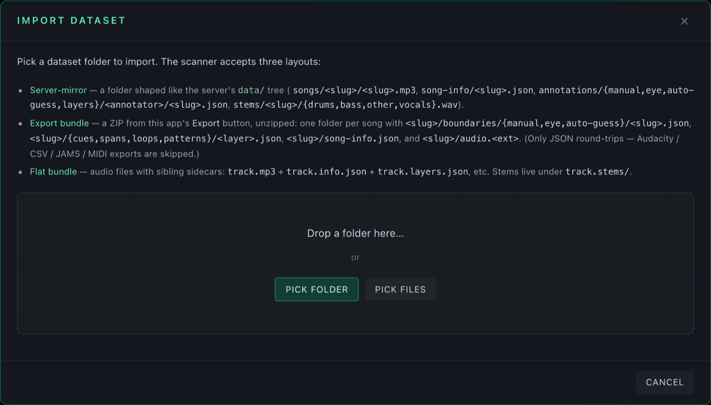

The **⤒ Import dataset** button at the top of the Songs sidebar (admin-only, **Dataset Prep only**) opens the **Import Dataset** dialog — a one-shot way to bring an entire dataset folder into the corpus (audio + song-info + annotations + cached algorithm outputs + stems) without going song-by-song through `+ Upload songs`.

**How to use it.** Drop a folder onto the dialog's drop zone, or click **Pick folder** / **Pick files**. The scanner accepts three source layouts and auto-detects which one each file uses:

1. **Server-mirror layout** — a folder shaped like the server's `data/` tree:
   ```
   <root>/
     songs/<slug>/<slug>.mp3
     song-info/<slug>.json
     annotations/{layers,auto-guess}/<annotator>/<slug>.json
     algorithm-outputs/{analysis/<slug>/*.json, bpm-detections/<slug>.json, algo-clusters/<slug>.json}
     stems/<slug>/{drums,bass,other,vocals}.wav
   ```
   (The scanner walks up to find the named buckets, so you can pick the `data/` folder itself or its parent.)
2. **Export-bundle layout** — a ZIP produced by this app's **Export** button (see [Export & Import](#export--import)), unzipped. One folder per song slug:
   ```
   <root>/
     <slug>/{boundaries,cues,spans,loops}/<layer-name>.json
     <slug>/auto-guess/<slug>.json
     <slug>/song-info.json
     <slug>/audio.<ext>
     <slug>/algos/{allin1,foote,bpm-detections,algo-clusters,…}.json
     <slug>/stems/{drums,bass,other,vocals}.<ext>
   ```
   Multi-annotator corpus dumps insert an `<annotator>/` sub-dir inside each type dir; the importer reads through it and lands everything under **your** annotator. Only the **TimeCues JSON** files round-trip — the flat marker exports (Audacity `.txt`, Sonic Visualiser / REAPER `.csv`, JAMS `.jams`, mir_eval `.lab`, MIDI `.mid`) are lossy and skipped, as is the `grid/` cache (no import endpoint). The cached algorithm outputs under `algos/` **do** round-trip: each JSON is routed back to its on-disk home — `bpm-detections.json` and `algo-clusters.json` to their own dirs, everything else into `data/algorithm-outputs/analysis/<slug>/`. The per-type **cues / spans / loops** files are reassembled into a single Layers document before upload, so they all land under the one **Layers** chip.
3. **Flat per-song bundle** — audio files with sibling sidecars sharing a basename:
   ```
   <root>/
     track_a.mp3
     track_a.info.json        ← also accepted: track_a.song-info.json
     track_a.manual.json
     track_a.auto-guess.json  ← also accepted: track_a.autoguess.json
     track_a.layers.json
     track_a.stems/{drums,bass,other,vocals}.wav   ← also _stems/ or -stems/
   ```

After the scan, the dialog shows a **per-song review table** with one row per detected song:

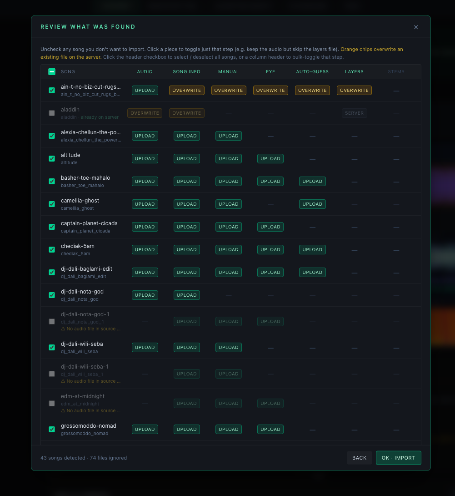

Each row has seven chips — Audio, Song info, Manual, Auto-guess, Layers, Algos, Stems — coloured by what was found and what would happen:

- **Emerald `upload`** — file is local, server has nothing; will be uploaded.
- **Amber `overwrite`** — file is local **and** the server already has one; clicking OK overwrites the server's copy. *No undo for this — overwritten annotations are not recoverable.*
- **Grey `server`** — file is missing from the source but already exists on the server; left untouched.
- **`—`** — neither local nor server.

**Multi-file steps are itemised.** Three steps bundle more than one file — **Stems** (up to four WAVs: drums / bass / other / vocals), **Layers** (the layers document plus each per-type cues / spans / loops file), and **Algos** (every cached-output JSON). For these the chip shows a `·N` count and a small line beneath it lists exactly what was found (e.g. `drums bass other vocals`, or `allin1.json foote.json bpm-detections.json`); hover the chip for the full list when it's truncated. So you can see precisely which stems — and which algorithm caches and layers — a row will import, not just that *some* exist.

Click any chip to toggle just that step (e.g. keep the audio but skip the layers file). Toggling a multi-file step on/off applies to all of its files at once. Uncheck the row's master checkbox to drop the whole song from the plan. Per-song warnings appear inline as a small **⚠** hint — most commonly "no audio file in source" when the folder only contained annotations (the annotations still upload, but they only render in the sidebar once a matching audio file exists). Files the scanner didn't recognise are collapsed under an **N files ignored** disclosure at the bottom of the table.

**Bulk select / deselect.** The header row has a master checkbox (tri-state: ticked = all songs in the plan, indeterminate = mixed, empty = none) — clicking it selects or deselects every row at once. Each column header (Audio, Song info, Manual, Auto-guess, Layers, Algos, Stems) is itself a clickable label that bulk-toggles that step across every row where the source actually has a local file for it; rows where the step is `—` or `server`-only are left alone. The header label turns emerald when every eligible cell in that column is on, so you can see column state at a glance.

**Slug merging.** Audio files, annotations, song-info, and stems all collapse into the same row when their filenames slugify to the same key (e.g. `Camellia-Ghost.mp3` and `camellia_ghost.manual.json` both end up under `camellia_ghost`). Previously the scanner kept dash-named annotations on a separate phantom row from their underscore-named audio; that mismatch is now resolved at scan time.

Clicking **OK · Import** runs the plan: per-song the dialog uploads the audio (chunked, same 8 MB chunk size as `+ Upload songs`), then POSTs the song-info / each annotation type / stems in turn, then writes a fresh `manifest.json` for the stems folder so the player picks them up without re-running Demucs. The progress bar shows the current song and step; errors on any one step don't abort the run — the **Import complete** summary at the end lists every step with `ok` / `error` / `skip` so you can re-import just the failed pieces. **Back** returns to the file picker without losing the scan.

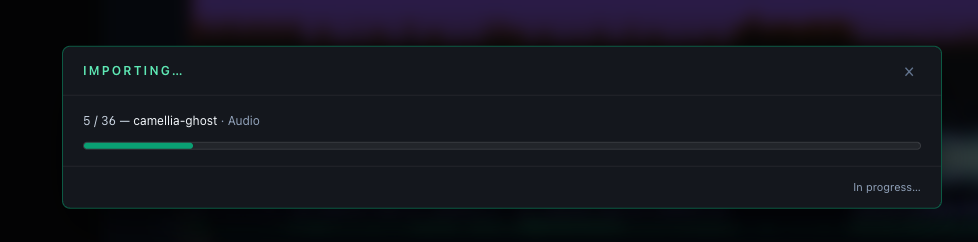

> ⚠ **The import overwrites server-side files for any chip you leave in `overwrite` mode.** Manual / Auto-guess annotations land under your own annotator subdir, but Song info, Algos, and Stems are dataset-wide and *will* clobber whatever was there before. **Algos and Stems have no cheap server probe, so they never show the amber `overwrite` warning** — a green `upload` chip for either will silently replace any matching cache already on the server. Review those chips before hitting **OK · Import**.

The same researcher/admin gate that protects `+ Upload songs` applies — non-admins won't see the button.

### Batch algorithm runner

**Moved.** The batch algorithm runner now lives in **Algorithm Inspect** (both *Per song* and *All songs* scopes) — see [Algo Inspect](#algo-inspect) below. Picking what to inspect and running it sit next to each other now. Dataset Prep no longer hosts the Run button or the ⚙ options panel.

### Per-song stem separation

> **Don't see the Stem button?** The stems daemon (Demucs) is opt-in — you need to have started compose with either `--profile demucs-cpu` or `--profile demucs-gpu` for it to be reachable. See [Installation → Run modes at a glance](#run-modes-at-a-glance) for the full picker. With no profile active, the button is hidden and the Vocals / Drums / Bass / Other entries in the Source picker show a "no stems cached" placeholder.

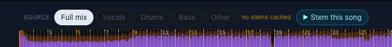

In Dataset Prep, the **Source** picker above the player gains a **▶ Stem this song** button (cyan, next to the "no stems cached" hint). Clicking it runs **Demucs** stem separation for the currently selected song, writing `vocals.wav`, `drums.wav`, `bass.wav`, `other.wav` (plus `guitar.wav` and `piano.wav` on the 6-stem model) under `public/stems/<slug>/`. While the job is running the button is replaced by a **⏳ Stemming… N% · MM:SS** pill — the percentage is parsed from Demucs's internal progress bar and the elapsed time advances every second, so a stuck job is immediately visible. A dim subtitle under the pill mirrors the latest log line (current step, e.g. *"Separating track foo.wav"*, or the live progress-bar text), giving you a "still working" signal even when the percentage doesn't move for a while.

Two stop controls sit next to the running pill: **⏸ Cancel** (amber) sends `SIGINT` to the Demucs subprocess so it shuts down cleanly between chunks — typically a few seconds — and **🛑 Kill** (red) sends `SIGKILL` to the whole subprocess group so the GPU/CPU work stops immediately. Cancel is the default; Kill stays available as an escalation if Cancel doesn't land. While a stop is in flight the pill flips to **⏳ Cancelling…** or **⏳ Killing…** (amber). Stopping leaves any partial `vocals.wav` / `drums.wav` / etc. on disk, but no `manifest.json` is written, so the Source picker just sees "no stems cached" and the **▶ Stem this song** button reappears.

> ⚠️ **Kill is a hard stop with no cleanup.** Partial WAV files from an interrupted job are orphaned under `public/stems/<slug>/` until the next successful re-stem overwrites them. Reach for Kill only when Cancel has been ignored for more than a few seconds.

If the job fails, the pill flips to a persistent red **✗ Stems failed — view log** that stays until you dismiss it; clicking it opens a modal with the tail of the Demucs log (the full log is also streamed to the browser console under `[stems]`), and a sibling **↻ Retry** button kicks off a fresh run with the same settings. Once stems exist the button label flips to **▶ Re-stem this song**.

> **Re-run prompts before overwriting.** If stems already exist for the song, you'll be asked "Re-running Demucs (6 stems) will overwrite them. Continue?" before the job starts. The Demucs-model dropdown inside Algorithm Inspect's **⚙ Batch algorithm options** is a different setting — it only affects All-In-One algorithm runs, not this button.

#### 6 stems or 4

A small **6 stems / 4 stems** switch sits next to the ▶ Stem / ▶ Re-stem button and decides what the next run produces:

| Choice | Model | Stems written | Trade-off |
|--------|-------|---------------|-----------|
| **6 stems** (default) | `htdemucs_6s` | vocals, drums, bass, other, **guitar**, **piano** | Guitar and piano get their own tracks; slower |
| **4 stems** | `htdemucs` | vocals, drums, bass, other | Guitar and piano stay inside *other*; finishes sooner |

The switch starts on whatever **Settings → Research → Stem separation → Stems per song** says, and whatever you pick sticks for the rest of the session — including the automatic post-upload runs. Re-stemming a 6-stem song as 4 stems **deletes the now-unreferenced `guitar.wav` and `piano.wav`** so the folder matches the new manifest; the Source picker's Guitar / Piano buttons go grey again. Re-stem as 6 to bring them back. While a job runs the pill names the model — **⏳ Stemming (6 stems)… 38% · 1:24**.

#### Automatic stemming after upload

Uploaded songs stem themselves. Every song that lands via **+ Upload songs** (or a folder drop) is queued for Demucs in the background, one job at a time, using the model the 6/4 switch is set to — no dialogs, and the upload progress bar is already gone by the time the first job starts. Songs that already have stems on disk are skipped rather than re-separated, and a job that fails doesn't stop the rest of the batch.

While that queue has work in it, a cyan strip appears in the Songs sidebar under the upload controls: **⏳ Auto-stemming *<song>* · 38%**, the number of songs still waiting, and a **clear queue** link that drops everything not yet started. The job already running is unaffected by *clear queue* — cancel that from the Source row's **⏸ Cancel** / **🛑 Kill** as usual. Switch the automation off in **Settings → Research → Stem separation**, and nothing is queued at all when Demucs isn't installed or you're in Demo Mode.

> **Not the same as Import dataset.** The **⤒ Import dataset** flow brings its own stems along, so it doesn't queue anything; use ▶ Stem this song afterwards for any imported track that arrived without them.

Only one Demucs job runs at a time, whether it came from the button or the queue. The button is only shown in Dataset Prep — the Annotate / Inspect player areas keep the Source picker clutter-free. For whole-dataset stemming the CLI `python tools/run_demucs_songs.py` is still the right tool.

> **Hidden in Demo Mode.** Demo visitors never see the **▶ Stem this song** / **▶ Re-stem this song** button — the three shipped CC0 tracks already have pre-baked stems under [`data-default/stems/<slug>/`](../data-default/stems/), and `/api/run-demucs` is team-gated server-side (the demo identity gets a 403), so exposing the control would only ever surface a failure. Vocals / Drums / Bass / Other still switch instantly via the Source picker.

> **Hosted deploy.** The `stems` daemon runs CPU Demucs on the prod VM (n2-standard-4, 4 vCPU, 16 GB RAM). A typical 3-4 minute song takes **~3–5 minutes** to stem; you can keep using the rest of the app while it runs. On the first request after a restart, expect ~10–20 s of extra latency while demucs cold-imports.

### Multi-Annotator Review (`AnnotatorComparisonPanel.tsx`)

When more than one annotator has saved Manual annotations for the same song, the Compare sub-tab overlays each annotator's boundaries on a shared row, colors them per annotator, and reports pairwise P/R/F at the configured tolerance. Read-only — edits remain confined to each annotator's own Manual sidebar.

---

## Custom Detectors


<!-- tc-videos:custom-detectors -->

**▶ Playground — custom detectors**

<div style="position:relative;padding-bottom:56.25%;height:0;overflow:hidden;max-width:720px;margin:1rem 0;border-radius:8px;"><iframe style="position:absolute;top:0;left:0;width:100%;height:100%;" src="https://www.youtube.com/embed/09F4sEvpKN0" title="Playground — custom detectors" frameborder="0" loading="lazy" allow="accelerometer; autoplay; clipboard-write; encrypted-media; gyroscope; picture-in-picture" allowfullscreen></iframe></div>

<!-- /tc-videos:custom-detectors -->
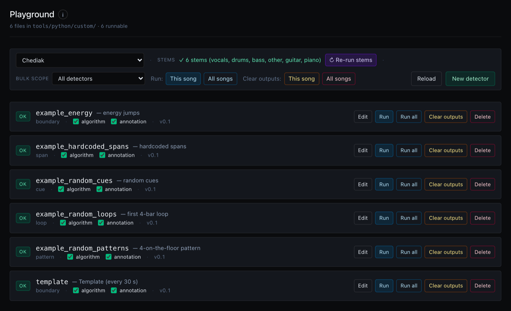

A "detector" is a small program that listens to a song and proposes annotations — boundaries, cues, spans, and so on. TimeCues ships with built-in detectors, but the **Playground** (the `/custom` tab) lets you write your own in Python: edit the code in the browser, run it on a song, and the moment it works it shows up everywhere the built-ins do (in Algorithm Inspect and in Auto-guess). This is how researchers prototype new structure-detection ideas without leaving the app.

The rest of this section is the technical contract your Python file must follow. The reference implementation of that contract is the public API in `tools/python/custom_api.py`.

> ⚠️ **Access tiers.** Uploading, editing, deleting, or toggling flags on a detector requires **researcher** or **admin** access — the source file is imported and executed on the server, so authorship is a privileged action. **Team** members can still **run** any existing detector and accept/reject its output. Public visitors see the registry read-only; demo visitors see neither the Playground tab nor the API. The server returns `403 researcher_or_admin_required` (authorship) or `403 team_required` (run) when the gate trips.

> ⚠️ **Honest-mistakes sandbox, not adversarial.** The runner executes `detect()` in a forked child process with rlimit-enforced memory (4 GiB), CPU time (120 s), and wall-clock (180 s) caps. A runaway loop, oversized allocation, or native-code crash kills the child and surfaces as `fatal` — it does not affect the sidecar or other annotators on the VM. The cap sizing assumes trusted researchers making honest mistakes; **TimeCues is not intended for deployment to untrusted users on a public network**. Override the limits via env vars `CUSTOM_DETECT_MEMORY_LIMIT_BYTES`, `CUSTOM_DETECT_CPU_LIMIT_SEC`, `CUSTOM_DETECT_WALL_LIMIT_SEC` on the custom server.

### 1. Detector contract

Every detector file lives at `tools/python/custom/<name>.py` and exports **exactly one** subclass of `CustomDetector`:

```python
from custom_api import Boundary, CustomDetector, DetectionContext

class MyDetector(CustomDetector):
    # --- Required ---
    name        = "my_detector"      # ^[a-z][a-z0-9_-]{0,30}$, unique across registry
    label       = "My Detector"      # 1–80 chars
    output_kind = "boundary"         # "boundary" | "cue" | "span" | "loop" | "lyrics"
                                     # ("loop" is gated by the
                                     # experimentalLoopsAndPatterns flag)

    # --- Surfacing (at least one must be True) ---
    is_algorithm  = True             # show as a read-only row in the Inspector
    is_annotation = False            # also surface as an editable annotation layer

    # --- Optional ---
    description = "Boundary at peaks in RMS energy."
    stem = "mix"                     # "vocals" | "drums" | "bass" | "other" | "mix"
    version = "0.1"

    # --- Required method ---
    def detect(self, ctx: DetectionContext) -> list[Boundary]:
        ...
```

**These three fields drive the lane's ⓘ info popover.** When a detector layer
is shown in the canvas (see *Curated layers name the stem they were built
from* above), clicking its **ⓘ** opens a popover that reads `description` as the
one-line blurb, `stem` as the **Stem** row, and the detector's `name` as the
**Detector** row; `label` (combined with `stem`) becomes the lane title, e.g.
`label = "Kick presence"` + `stem = "bass"` → **"Kick presence (bass)"**. All three
are optional — omit `description` and the blurb is dropped from the popover;
omit `stem` and the lane shows a generic *(curated)* tag and never lights up
during stem audition. There is nothing else to wire up: set the attributes on
your detector class and the popover appears automatically, the same as for any
curated detector already installed.

### 2. Manifest validation rules

| Field | Type | Rules | Source |
|-------|------|-------|--------|
| `name` | `str` | Must match `^[a-z][a-z0-9_-]{0,30}$`; unique | `custom_loader.py:306-311` |
| `label` | `str` | Non-empty; ≤ 80 chars | `custom_loader.py:313-317` |
| `output_kind` | `str` | One of `"boundary"`, `"cue"`, `"span"`, `"loop"`, `"lyrics"` (`"loop"` is filtered out when `experimentalLoopsAndPatterns` is off) | `custom_loader.py:323-328` |
| `is_algorithm` / `is_annotation` | `bool` | At least one `True` | `custom_loader.py:326-333` |
| `description` | `str` | Optional, cast to string. Shown as the one-line blurb in the lane's ⓘ popover | — |
| `stem` | `str` | Optional. One of `"vocals"`, `"drums"`, `"bass"`, `"other"`, `"mix"`; defaults `None`. Sets the lane's source stem — shown in the ⓘ popover, appended to the lane title (`label (stem)`), and used to light the lane up during stem audition | — |
| `version` | `str` | Optional, defaults `"0.1"` | — |
| `detect()` | method | Must override the base class | `custom_loader.py:335-342` |

If any rule fails, the detector shows status `validation_error` in the UI and the concrete error is rendered inline.

### 3. `DetectionContext` — what your detector receives

```python
@dataclass(frozen=True)
class DetectionContext:
    audio: np.ndarray              # mono float32 in [-1, 1] at sr
    sr: int                        # always 22050
    duration_ms: int               # track length (rounded)
    stems: dict[str, np.ndarray]   # "vocals", "drums", "bass", "other" — may be empty
    features: AudioFeatures        # pre-extracted librosa features
    energy_curve: np.ndarray       # composite energy, [0,1], 100 ms / sample
    tension_curve: np.ndarray      # tension proxy, [0,1], 100 ms / sample
    bpm: float                     # detected tempo
    beat_times_ms: list[int]       # beat instants in ms, sorted
```

The context is frozen — you cannot mutate it.

`AudioFeatures` (from `shared.models`):

| Field | Shape | Notes |
|-------|-------|-------|
| `rms` | `(n_frames,)` | Frame-level RMS |
| `spectral_centroid` | `(n_frames,)` | Hz |
| `spectral_bandwidth` | `(n_frames,)` | Hz |
| `spectral_flux` | `(n_frames,)` | unbounded |
| `spectral_flatness` | `(n_frames,)` | [0,1] |
| `spectral_rolloff` | `(n_frames,)` | Hz |
| `chromagram` | `(12, n_frames)` | Pitch class energy |
| `mfcc` | `(13, n_frames)` | Mel cepstral coefficients |
| `onset_env` | `(n_frames,)` | Onset strength |
| `onset_frames` | `(n_onsets,)` | Frame indices |
| `tempo` | scalar | BPM |
| `beat_frames` | `(n_beats,)` | Frame indices |
| `sr`, `hop_length`, `n_frames`, `frame_times_ms` | — | Always `sr=22050`, `hop_length=512` |

**Frame ↔ time**:

```python
# Spectrogram frame → ms
ms = int(round(frame_idx * ctx.features.hop_length * 1000 / ctx.features.sr))
# Energy / tension curve index → ms
ms = curve_idx * 100
# Beats already in ms in ctx.beat_times_ms
```

### 4. Return types

#### Boundary

```python
@dataclass
class Boundary:
    time_ms: int                            # required, int in [0, ctx.duration_ms]
    label: str | None = None
    importance: Literal["critical","optional"] | None = None
    candidates: list[int] | None = None     # alternate ms times within tolerance
```

#### Cue

```python
@dataclass
class Cue:
    time_ms: int                            # required, int in [0, ctx.duration_ms]
    label: str | None = None
    description: str | None = None          # longer note, shown only in the editor
    intensity: float | None = None          # in [0.0, 1.0]
    candidates: list[int] | None = None     # alternate ms times within tolerance
    velocity: int | None = None             # 1-127: how hard this hit was struck, vs. the same instrument's hardest
    level_db: float | None = None           # <= 0: this hit's level vs. the loudest hit in the track
    color: str | None = None                # "#rrggbb": paints this one tick instead of the lane colour
    note: int | None = None                 # 0-127 MIDI note number of the hit's pitch (60 = middle C)
    decay_ms: int | None = None             # > 0: how long the hit rings
    importance: str | None = None           # "critical" | "optional" — the same ★ a hand-placed cue has
```

**Everything after `time_ms` is optional.** A detector sets only the fields it knows, and a cue with none of them is a plain tick.

`velocity`, `level_db`, `color`, `note` and `decay_ms` are for cues that are **struck**, such as drum hits. They are the same fields every cue in the app has, whoever set them. A cue with a `note` shows its name (e.g. *C2*) when you hover it. A cue with a `decay_ms` gets a faint tail after the tick, as long as it rings. `importance` shows as the cue's ★. On the detector's cue lane, a cue with a `velocity` stands as tall as it was hit: 127 fills the lane and a ghost note is a short stub. A cue with a `color` draws in that colour, so a lane of kicks, snares and hats can use one hue per drum. Hovering a tick shows its velocity and level. **Copy → Manual** keeps all three, and the cue card's **Hit** section edits them. All of them are exported with the cue (`velocity`, `level_db`, `color`, `note`, `decay` in seconds, `importance`). Leave them out and the cue draws exactly as before.

#### Span

```python
@dataclass
class Span:
    start_ms: int                           # required, int in [0, ctx.duration_ms]
    duration_ms: int                        # required, > 0; start + duration ≤ duration_ms
    label: str | None = None
    intensity: float | None = None          # in [0.0, 1.0]
```

#### Loop  *(experimental — registry filtered when `experimentalLoopsAndPatterns` is off)*

```python
@dataclass
class Loop:
    start_ms: int                           # required, int in [0, ctx.duration_ms]
    duration_ms: int                        # required, > 0; start + duration ≤ duration_ms
    label: str | None = None
    snap_zero_cross: bool | None = None     # UI hint: snap edges to nearest zero-crossing
```

Validation is **per-item**: bad items are dropped with a structured error; good items survive. Returning a float for `time_ms`, an out-of-bounds value, an unknown `importance` literal, or `intensity` outside [0,1] all reject only that item.

### 5. The result envelope

Each run emits a JSON envelope (cached at `data/algorithm-outputs/custom/<name>/<slug>.json`):

```json
{
  "name": "my_detector",
  "slug": "song-slug",
  "output_kind": "boundary",
  "ran_at": "2026-05-16T10:30:45Z",
  "duration_ms": 240000,
  "items":   [ { "time_ms": 0, "label": "intro", "importance": "optional", "candidates": null } ],
  "errors":  [ { "index": 2, "field": "time_ms", "value": 250000, "message": "time_ms (250000) must be in [0, 240000]." } ],
  "stats":   { "accepted": 2, "rejected": 1 },
  "fatal":   null
}
```

`fatal` is non-null when:
1. Audio file not found
2. Audio stack (librosa) unavailable
3. `DetectionContext` construction fails
4. `detect()` raises an exception
5. Detector class failed to load (syntax/import/validation error)
6. `detect()` exceeds the wall-clock, CPU, or memory limits (see honest-mistakes sandbox callout above) — surfaces as `TimeoutError` or `MemoryError`
7. `detect()` crashes inside a native C extension (segfault/abort) — surfaces as `RuntimeError` with the child exit code

The UI surfaces `fatal.message` and, when relevant, a *Missing Python module* panel with a copyable `pip install …` command and a **Reload registry** button.

### 6. The Custom Detectors UI (`CustomScriptsPage.tsx`)

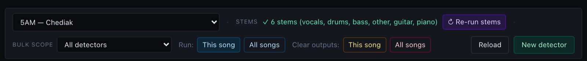

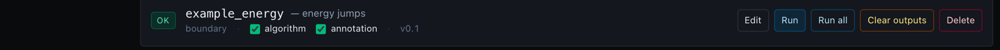

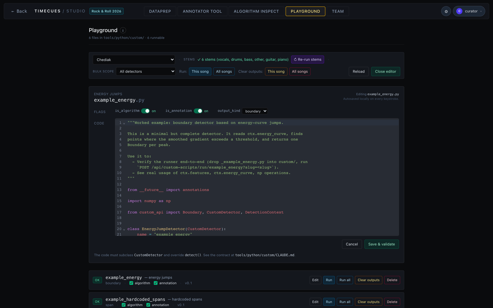

**Toolbar** — one combined strip. The page controls and the bulk Run / Clear actions share a single bar (and a single **Song ▾** picker), so there's no duplicate single-song row.

| Control | Action |
|--------|--------|
| **ⓘ** *(next to the **Playground** heading, not in the toolbar)* | Toggles the inline Markdown help panel |
| **Song ▾** | Selects the song the *This song* actions (and each per-row **Run**) act on |
| **Stems** | Read-out of the Demucs stems cached for the selected song — `✓ N stems (…)` in green, or `none cached` in amber — plus **▶ Run stems** / **↻ Re-run stems** to separate that song right here. While it runs the button shows **⏳ Stemming N%**. |
| **Bulk scope ▾** | `All detectors` (default) or a single detector — narrows the Run / Clear buttons. The detectors are grouped under **Custom** and then **Default**, like the list below. *(only shown once at least one detector exists)* |
| **Run · This song** / **Run · All songs** | Runs every runnable (`OK`) detector in scope on the selected song, or batches each over every song (reusing the per-detector *Run* / *Run all* paths). The all-songs sweep confirms first, since it can be `detectors × songs` runs. |
| **Clear outputs · This song** / **Clear outputs · All songs** | Wipes outputs for the in-scope detector(s) on just the selected song, or on every song. Same semantics as the per-row **Clear outputs** (algorithm cache + **your** annotation files; the `.py` source and other annotators' work are kept). A `confirm()` dialog spells out the exact scope. |
| **Reload** | `POST /api/custom-scripts/reload` — re-scans `tools/python/custom/` |
| **New detector** | Opens the editor with the starter template |

> ⚠️ **The bulk Clear is destructive and crosses every detector by default.** With Bulk scope = `All detectors`, **Clear outputs · All songs** removes your annotation edits for *every* detector on *every* song. Narrow the scope dropdown first if you only mean one detector. There is no undo.

**Per-detector row**

- **Status badge** — `OK` (emerald), `Validation error` (amber), `Load error` (rose)
- **Run** — execute on the selected song; the result card shows the song's title at the top, followed by accepted/rejected counts and a mini timeline. Each detector remembers the last result *per song*, so switching the Song dropdown swaps the card to that song's run (if any) instead of wiping the previous one. If a *Run all* table is on screen, the song's row in that table is also refreshed in place, so a successful re-run clears a stale `failed` badge from an earlier batch.
- **Run all** — batch over every song; live `current / total` progress; **Cancel** stops after current song. The table persists across single-song *Run* clicks so you can iterate on one song without losing the batch overview; per-song re-runs update their row.
- **Edit** — opens the code editor with the source pre-loaded. There is no separate "Name" field — the editor reads `name = "..."` and `label = "..."` directly from the class body and renders them as the editor's filename / human-readable title. To rename a detector, change the `name` line in the code and Save: the editor refuses to rename in place (it would orphan whatever depends on the old name) and instead offers to write a brand-new `<new_name>.py`, leaving the old file in the list for you to delete manually.
- **Clear outputs** — wipes only the detector's outputs: the algorithm cache (`data/algorithm-outputs/custom/<name>/`) and **your** annotation files for that detector (`data/annotations/custom/<name>/<your-annotator-id>/`) across every song. The `.py` source is kept and the detector keeps running normally on the next *Run*. Other annotators' annotations are untouched. `confirm()` dialog warns the action cannot be undone.
- **Delete** — soft-delete. A `confirm()` dialog explains that the **`.py` source is moved to the app trash** (`tools/python/custom/.trash/`) rather than erased, and the detector's **cached algorithm results are wiped**. On success the page shows an info banner naming the on-disk trash path. The detector disappears from the registry immediately, but the source is recoverable from disk — **delete it from `tools/python/custom/.trash/` by hand if you want it gone for good.** The trash folder is a dotfile, so it never reappears in the detector list, and it is git-ignored so trashed sources stay out of commits.
- **Show in inspector** / **Also surface as editable annotation tab** — checkboxes that mirror `is_algorithm` / `is_annotation`; saving rewrites the `.py` file (at least one must remain checked).

> ⚠️ **Clear outputs is destructive.** Your annotation edits for this detector are removed for every song. The algorithm cache is recomputable; annotation work is not. There is no undo.
>
> ℹ️ **Delete is a soft-delete with no automatic disk cleanup.** The `.py` lands in `tools/python/custom/.trash/`; if you delete a detector and re-create one with the same name later, the old source is still sitting in trash and you must remove it from disk yourself.

**Code editor** — CodeMirror (`@uiw/react-codemirror`), Python syntax highlighting, `oneDark` theme. The header shows the **label** (parsed from `label = "..."`) as a small uppercase subtitle and the **filename** (`<name>.py`, parsed from `name = "..."`) as the main title — both update live as you type, so renaming is just editing the relevant line in the code. **Save** writes to `tools/python/custom/<name>.py` (or, when editing an existing detector whose file stem differs from its class `name`, overwrites the existing file in place — e.g. a hand-created `blabla.py` whose class declares `name = "my_detector"` stays at `blabla.py`) and re-scans the registry. Validation errors render below the editor. Every keystroke is autosaved to your browser's `localStorage` under `customscripts.draft.<name>` (or `customscripts.draft.__new__` for a fresh detector), so an accidental tab close / refresh while mid-edit doesn't lose work — reopening the editor restores the draft, and a successful Save clears it.

**Missing-module panel** — When a fatal envelope reports a missing module, the UI renders:

```
⚠ Missing Python module: torch
Run this in a terminal on the host, then click Reload:
  $ pip install torch                    [Copy]
(the import name torch comes from pip package torch)
[↻ Reload registry]
```

### 7. Built-in examples

<a id="default-and-custom"></a>**Default and Custom.** Every list of detectors in the app — the Playground's cards and its **Bulk scope** menu, the **▶ Run…** picker's **Custom** chip, the **Detectors** sidebar, the **Detectors** dropdown, and the annotation **Source** picker — shows yours under a **Custom** title at the top and the shipped detectors under a **Default** title below. When only one kind exists (a fresh clone has only the defaults) the titles are left off and the list is flat, since a single title would label nothing. An example you edit and save becomes your copy in `tools/python/custom/`, so it moves under **Custom**; deleting that copy puts the original back under **Default**.

Worked examples covering every `output_kind` except `lyrics` ship in `tools/python/custom-default/` — the same split as `data/` and `data-default/`. They register like any detector, but the app never writes to that folder: saving an edited example writes your copy to `tools/python/custom/<file>.py`, which takes its place, and **Delete** refuses a shipped example (deleting your edited copy brings the original back).

| File | `output_kind` | Purpose |
|------|---------------|---------|
| `template.py` | `boundary` | Minimal starter — emits a boundary every 30 s |
| `example_energy.py` | `boundary` | Boundaries at peaks in the smoothed gradient of `ctx.energy_curve` |
| `example_random_cues.py` | `cue` | Demonstrates point-event output |
| `example_hardcoded_spans.py` | `span` | Two fixed spans (intro / outro) — useful for testing the round-trip |
| `example_random_loops.py` | `loop` *(experimental)* | One 4-bar loop on the first downbeat |

### 8. Example A — RMS-jump boundary detector

```python
import numpy as np
from custom_api import Boundary, CustomDetector, DetectionContext

class RmsJumpDetector(CustomDetector):
    name = "rms_jumps"
    label = "RMS Energy Jumps"
    output_kind = "boundary"
    is_algorithm = True

    WINDOW = 11        # frames (~250 ms)
    Z_THRESH = 2.0     # std above mean
    MIN_GAP_MS = 3000

    def detect(self, ctx: DetectionContext) -> list[Boundary]:
        rms = np.asarray(ctx.features.rms, dtype=np.float32)
        if rms.size < self.WINDOW + 1:
            return []
        hw = self.WINDOW // 2
        means = np.zeros_like(rms)
        stds  = np.zeros_like(rms)
        for i in range(rms.size):
            s, e = max(0, i-hw), min(rms.size, i+hw+1)
            means[i] = np.mean(rms[s:e])
            stds[i]  = np.std (rms[s:e])
        is_peak = rms > means + self.Z_THRESH * stds
        hop_ms = ctx.features.hop_length * 1000 / ctx.features.sr
        out, last = [], -self.MIN_GAP_MS
        for f in np.where(is_peak)[0]:
            t = int(round(f * hop_ms))
            if t - last < self.MIN_GAP_MS: continue
            if 0 <= t <= ctx.duration_ms:
                out.append(Boundary(time_ms=t, label="jump", importance="optional"))
                last = t
        return out
```

### 9. Example B — spectral-flux cue detector

```python
import numpy as np
from custom_api import Cue, CustomDetector, DetectionContext

class SpectralFluxCueDetector(CustomDetector):
    name = "spectral_flux_cues"
    label = "Spectral Flux Onsets"
    output_kind = "cue"
    is_algorithm = True
    is_annotation = True

    W = 7
    Z = 1.2
    MIN_INTENSITY = 0.1

    def detect(self, ctx: DetectionContext) -> list[Cue]:
        flux = np.asarray(ctx.features.spectral_flux, dtype=np.float32)
        if flux.size < self.W + 2: return []
        kernel = np.ones(self.W, dtype=np.float32) / self.W
        smooth = np.convolve(flux, kernel, mode='same')
        mu, sigma = float(np.mean(smooth)), float(np.std(smooth))
        if sigma < 1e-10: return []
        z = (smooth - mu) / sigma
        is_peak = (z[1:-1] >= self.Z) & (smooth[1:-1] >= smooth[:-2]) & (smooth[1:-1] >= smooth[2:])
        idx = np.where(is_peak)[0] + 1
        if idx.size == 0: return []
        intens = np.clip(z[idx] / (self.Z + 5), 0, 1)
        hop_ms = ctx.features.hop_length * 1000 / ctx.features.sr
        out = []
        for f, i in zip(idx, intens):
            if i < self.MIN_INTENSITY: continue
            t = int(round(f * hop_ms))
            if 0 <= t <= ctx.duration_ms:
                out.append(Cue(time_ms=t, label="onset", intensity=float(i)))
        return out
```

### 10. Common pitfalls

- Returning `Boundary(time_ms=30.5)` — must be `int`; cast with `int(round(...))`.
- Forgetting to handle `ctx.stems == {}` when Demucs has not been run.
- Confusing the **23.219 ms** STFT frame stride with the **100 ms** energy/tension curve stride.
- Mutating `ctx` — it's frozen.
- Returning a generator — the contract requires a `list`.

### 11. REST endpoints (custom server)

| Method | Endpoint | Body / Params | Purpose |
|--------|----------|--------------|---------|
| GET | `/api/custom-scripts` | — | List the registry |
| POST | `/api/custom-scripts/reload` | — | Re-scan disk |
| POST | `/api/custom-scripts/upload` | `{name, code}` | Write `<name>.py` |
| GET | `/api/custom-scripts/file/<name>` | — | Raw `.py` source |
| DELETE | `/api/custom-scripts/<name>` | — | Remove file + caches |
| DELETE | `/api/custom-scripts/<name>/outputs` | header `X-Annotator-Id` | Wipe algorithm cache + this annotator's annotations (keeps `.py`) |
| POST | `/api/custom-scripts/<name>/flags` | `{is_algorithm, is_annotation}` | Rewrites the surfacing flags in `<name>.py` |
| POST | `/api/custom-scripts/run/<name>` | `?slug=<slug>&force=0/1` | Execute + return envelope |
| GET | `/api/custom-scripts/result/<name>/<slug>` | — | Cached envelope or 404 |
| GET | `/api/custom-annotations/<name>/<slug>` | header `X-Annotator-Id` | Annotator's editable copy |
| POST | `/api/custom-annotations/<name>/<slug>` | header `X-Annotator-Id` | Save annotator's edits |
| DELETE | `/api/custom-annotations/<name>/<slug>` | header `X-Annotator-Id` | Delete editable copy |

---

## Team Dashboard


<!-- tc-videos:team-dashboard -->

**▶ Team dashboard**

<div style="position:relative;padding-bottom:56.25%;height:0;overflow:hidden;max-width:720px;margin:1rem 0;border-radius:8px;"><iframe style="position:absolute;top:0;left:0;width:100%;height:100%;" src="https://www.youtube.com/embed/2N_H6XMrcyU" title="Team dashboard" frameborder="0" loading="lazy" allow="accelerometer; autoplay; clipboard-write; encrypted-media; gyroscope; picture-in-picture" allowfullscreen></iframe></div>

<!-- /tc-videos:team-dashboard -->
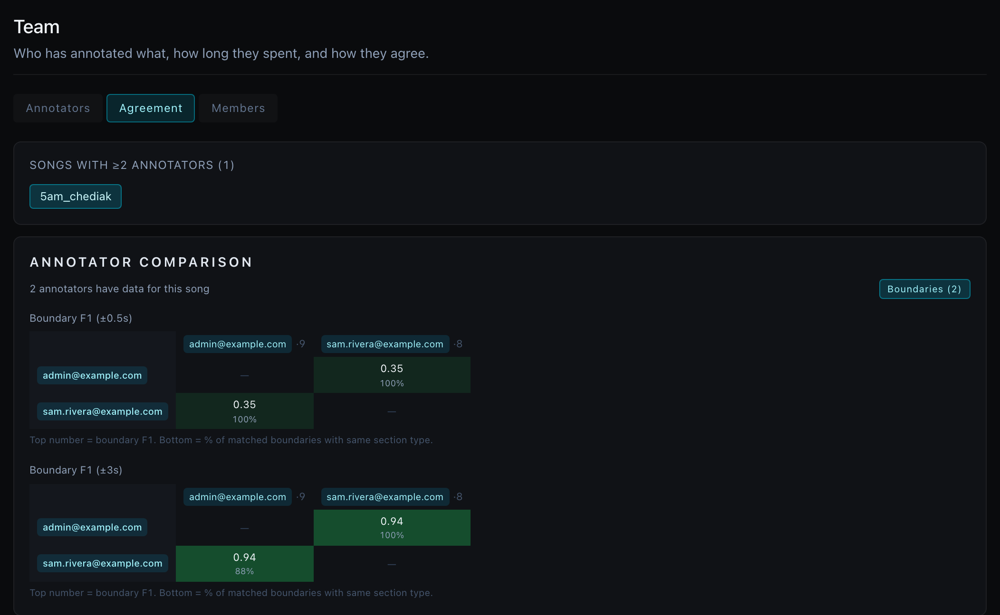

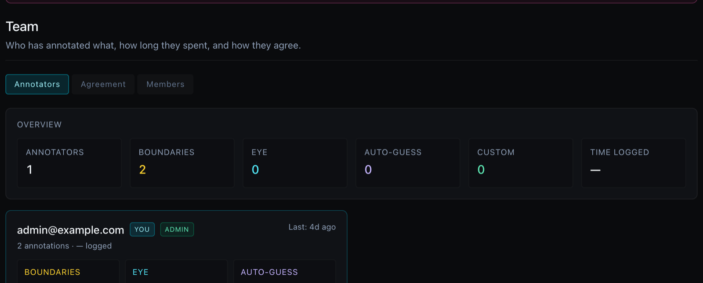

The Team Dashboard (the `/team` tab) is the place to see how the whole team is doing and to manage who's on it — it shows each annotator's progress side by side and, for admins, lets you add people and set their permission levels. It's restricted: only **admins and researchers** can open it, and anyone else who tries is sent back to the home page.

Each annotator card on the **Annotators** tab is tagged with:
- a cyan `YOU` chip on your own row,
- a tier chip — `ADMIN` (emerald), `RESEARCHER` (violet), or `TEAM` (cyan) — resolved from `peopleByEmail` in `data/dataset-config.json`. Public users have no chip.

### Members tab — assign tiers

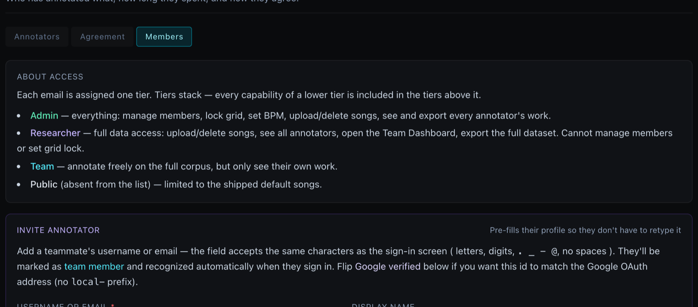

The Members tab shows **one People table** keyed by email. Each row has a tier dropdown — change someone's tier in place (Admin / Researcher / Team), or use **Remove** to drop them from the list and erase their data.

| Tier | Visual | What it grants |
|---|---|---|
| **Admin** | emerald | Everything — see the matrix in [Sign-In & Identity](#sign-in--identity) |
| **Researcher** | violet | Full data access, but no member management or BPM/grid editing |
| **Team** | cyan | Annotate the full corpus, but only see own work |

Filter chips above the table (`all` / `admin` / `researcher` / `team`) narrow the view.

> ⚠ **Remove is destructive — there is no undo.** Clicking Remove opens a confirmation dialog that requires you to type `DELETE_USER` before it activates. On confirm the server (a) drops the row from `peopleByEmail`, (b) wipes every annotation file the person has ever saved — manual, auto-guess, and per-script custom — and (c) deletes their saved profile under `data/annotators/<id>.json`. If you only want to revoke access without losing their work, change their tier dropdown instead.

> ⚠ **The last admin cannot be demoted or removed** — that would lock the dataset's config away. The tier dropdown and Remove button are disabled on that row, and the server returns `409` if the API is called anyway. If you demote or remove **yourself**, the page navigates back home immediately because once your tier drops below admin, `/api/admin-status` no longer reveals `peopleByEmail` to you and the editor on `/team` would just show empty lists. Researchers see the table read-only — only admins can change tiers.

### Invite annotator (admin)

Admins see an **Invite annotator** panel above the People table to pre-register a teammate in one step:

| Field | Notes |
|---|---|
| Username or email | Same field the sign-in screen uses — accepts letters, digits, `.`, `_`, `-`, and `@`. No spaces. A live preview shows the resulting id and surfaces an "already on file" warning if a profile already exists for that identity. |
| Local / Google verified | Toggle directly under the identity field. **Local** (default) stores the profile under `local-<sanitized>`; for email-shaped identities the server also pre-authorises the Google-form id so the invitee can sign in via either route. **Google verified** stores the profile under the bare email (no prefix) — matching what Google OAuth produces at sign-in — and only that id is added to the allowlist. The Google option is disabled until the identity field holds a valid email. |
| Display name | Optional — defaults to the typed identity (and to the existing profile's name when the identity is already on file). |
| Role / Affiliation | Optional metadata, persisted with the profile |
| Tier | `Team`, `Researcher`, or `Admin` — see the capability matrix above |

Clicking **Invite** atomically:

1. Writes the profile to `data/annotators/<id>.json` (the ID matches what the identity sign-in flow would generate for that input — `local-<sanitized>`),
2. Adds an entry to `peopleByEmail` in `data/dataset-config.json` with the chosen tier. When the identity is an email, the server also adds the **Google-form id** (no prefix) to the allowlist so the invitee can equivalently sign in via Google with the same address. On the first `peopleByEmail` write, any existing legacy `adminEmails`/`teamEmails` entries are seeded into the map so nobody gets silently demoted.

When that teammate later opens the app and signs in — whether by typing the same identity into the "Username or email" field or, if it's an email, via Google — they're recognized in one click, no need to retype name/role/affiliation. The `Saved profiles` disclosure below the form lists every annotator profile on disk, including invitees who haven't signed in yet.

> ⚠ The invite does **not** send an email. Share the URL with your teammate via your usual channel.

---

## Settings


<!-- tc-videos:settings -->

**▶ Role banner**

<div style="position:relative;padding-bottom:56.25%;height:0;overflow:hidden;max-width:720px;margin:1rem 0;border-radius:8px;"><iframe style="position:absolute;top:0;left:0;width:100%;height:100%;" src="https://www.youtube.com/embed/xtdRSrJPbMI" title="Role banner" frameborder="0" loading="lazy" allow="accelerometer; autoplay; clipboard-write; encrypted-media; gyroscope; picture-in-picture" allowfullscreen></iframe></div>

**▶ Annotator profile**

<div style="position:relative;padding-bottom:56.25%;height:0;overflow:hidden;max-width:720px;margin:1rem 0;border-radius:8px;"><iframe style="position:absolute;top:0;left:0;width:100%;height:100%;" src="https://www.youtube.com/embed/z0U4kWpTBWg" title="Annotator profile" frameborder="0" loading="lazy" allow="accelerometer; autoplay; clipboard-write; encrypted-media; gyroscope; picture-in-picture" allowfullscreen></iframe></div>

**▶ Theme**

<div style="position:relative;padding-bottom:56.25%;height:0;overflow:hidden;max-width:720px;margin:1rem 0;border-radius:8px;"><iframe style="position:absolute;top:0;left:0;width:100%;height:100%;" src="https://www.youtube.com/embed/PcOUGxsTFX4" title="Theme" frameborder="0" loading="lazy" allow="accelerometer; autoplay; clipboard-write; encrypted-media; gyroscope; picture-in-picture" allowfullscreen></iframe></div>

**▶ Display & playback defaults**

<div style="position:relative;padding-bottom:56.25%;height:0;overflow:hidden;max-width:720px;margin:1rem 0;border-radius:8px;"><iframe style="position:absolute;top:0;left:0;width:100%;height:100%;" src="https://www.youtube.com/embed/71g55iRTGqs" title="Display & playback defaults" frameborder="0" loading="lazy" allow="accelerometer; autoplay; clipboard-write; encrypted-media; gyroscope; picture-in-picture" allowfullscreen></iframe></div>

**▶ Default signals**

<div style="position:relative;padding-bottom:56.25%;height:0;overflow:hidden;max-width:720px;margin:1rem 0;border-radius:8px;"><iframe style="position:absolute;top:0;left:0;width:100%;height:100%;" src="https://www.youtube.com/embed/Q_XGQL0AEZ8" title="Default signals" frameborder="0" loading="lazy" allow="accelerometer; autoplay; clipboard-write; encrypted-media; gyroscope; picture-in-picture" allowfullscreen></iframe></div>

**▶ Annotations display defaults**

<div style="position:relative;padding-bottom:56.25%;height:0;overflow:hidden;max-width:720px;margin:1rem 0;border-radius:8px;"><iframe style="position:absolute;top:0;left:0;width:100%;height:100%;" src="https://www.youtube.com/embed/-6PJVFy_CLU" title="Annotations display defaults" frameborder="0" loading="lazy" allow="accelerometer; autoplay; clipboard-write; encrypted-media; gyroscope; picture-in-picture" allowfullscreen></iframe></div>

**▶ Section vocabulary**

<div style="position:relative;padding-bottom:56.25%;height:0;overflow:hidden;max-width:720px;margin:1rem 0;border-radius:8px;"><iframe style="position:absolute;top:0;left:0;width:100%;height:100%;" src="https://www.youtube.com/embed/SKXY5GUGdno" title="Section vocabulary" frameborder="0" loading="lazy" allow="accelerometer; autoplay; clipboard-write; encrypted-media; gyroscope; picture-in-picture" allowfullscreen></iframe></div>

**▶ Manual Fill default layout**

<div style="position:relative;padding-bottom:56.25%;height:0;overflow:hidden;max-width:720px;margin:1rem 0;border-radius:8px;"><iframe style="position:absolute;top:0;left:0;width:100%;height:100%;" src="https://www.youtube.com/embed/2hODXaKMOSk" title="Manual Fill default layout" frameborder="0" loading="lazy" allow="accelerometer; autoplay; clipboard-write; encrypted-media; gyroscope; picture-in-picture" allowfullscreen></iframe></div>

**▶ Cue & Span taxonomies**

<div style="position:relative;padding-bottom:56.25%;height:0;overflow:hidden;max-width:720px;margin:1rem 0;border-radius:8px;"><iframe style="position:absolute;top:0;left:0;width:100%;height:100%;" src="https://www.youtube.com/embed/Qw6fBgRSIqk" title="Cue & Span taxonomies" frameborder="0" loading="lazy" allow="accelerometer; autoplay; clipboard-write; encrypted-media; gyroscope; picture-in-picture" allowfullscreen></iframe></div>

**▶ Loops quick-add sizes**

<div style="position:relative;padding-bottom:56.25%;height:0;overflow:hidden;max-width:720px;margin:1rem 0;border-radius:8px;"><iframe style="position:absolute;top:0;left:0;width:100%;height:100%;" src="https://www.youtube.com/embed/qORbd47zPiQ" title="Loops quick-add sizes" frameborder="0" loading="lazy" allow="accelerometer; autoplay; clipboard-write; encrypted-media; gyroscope; picture-in-picture" allowfullscreen></iframe></div>

**▶ Experimental annotation types**

<div style="position:relative;padding-bottom:56.25%;height:0;overflow:hidden;max-width:720px;margin:1rem 0;border-radius:8px;"><iframe style="position:absolute;top:0;left:0;width:100%;height:100%;" src="https://www.youtube.com/embed/mDCCjarvyQ4" title="Experimental annotation types" frameborder="0" loading="lazy" allow="accelerometer; autoplay; clipboard-write; encrypted-media; gyroscope; picture-in-picture" allowfullscreen></iframe></div>

**▶ Default algorithms**

<div style="position:relative;padding-bottom:56.25%;height:0;overflow:hidden;max-width:720px;margin:1rem 0;border-radius:8px;"><iframe style="position:absolute;top:0;left:0;width:100%;height:100%;" src="https://www.youtube.com/embed/MVBjWja_nx8" title="Default algorithms" frameborder="0" loading="lazy" allow="accelerometer; autoplay; clipboard-write; encrypted-media; gyroscope; picture-in-picture" allowfullscreen></iframe></div>

**▶ BPM detection**

<div style="position:relative;padding-bottom:56.25%;height:0;overflow:hidden;max-width:720px;margin:1rem 0;border-radius:8px;"><iframe style="position:absolute;top:0;left:0;width:100%;height:100%;" src="https://www.youtube.com/embed/MykGTepcUYI" title="BPM detection" frameborder="0" loading="lazy" allow="accelerometer; autoplay; clipboard-write; encrypted-media; gyroscope; picture-in-picture" allowfullscreen></iframe></div>

**▶ Evaluation defaults**

<div style="position:relative;padding-bottom:56.25%;height:0;overflow:hidden;max-width:720px;margin:1rem 0;border-radius:8px;"><iframe style="position:absolute;top:0;left:0;width:100%;height:100%;" src="https://www.youtube.com/embed/AArK20a5xS8" title="Evaluation defaults" frameborder="0" loading="lazy" allow="accelerometer; autoplay; clipboard-write; encrypted-media; gyroscope; picture-in-picture" allowfullscreen></iframe></div>

**▶ Auto-guess defaults**

<div style="position:relative;padding-bottom:56.25%;height:0;overflow:hidden;max-width:720px;margin:1rem 0;border-radius:8px;"><iframe style="position:absolute;top:0;left:0;width:100%;height:100%;" src="https://www.youtube.com/embed/HVg2y4PKvSk" title="Auto-guess defaults" frameborder="0" loading="lazy" allow="accelerometer; autoplay; clipboard-write; encrypted-media; gyroscope; picture-in-picture" allowfullscreen></iframe></div>

**▶ Optional GPU tooling status**

<div style="position:relative;padding-bottom:56.25%;height:0;overflow:hidden;max-width:720px;margin:1rem 0;border-radius:8px;"><iframe style="position:absolute;top:0;left:0;width:100%;height:100%;" src="https://www.youtube.com/embed/0lWlZb22mTc" title="Optional GPU tooling status" frameborder="0" loading="lazy" allow="accelerometer; autoplay; clipboard-write; encrypted-media; gyroscope; picture-in-picture" allowfullscreen></iframe></div>

**▶ Reset all settings**

<div style="position:relative;padding-bottom:56.25%;height:0;overflow:hidden;max-width:720px;margin:1rem 0;border-radius:8px;"><iframe style="position:absolute;top:0;left:0;width:100%;height:100%;" src="https://www.youtube.com/embed/yE6yDAgVKmM" title="Reset all settings" frameborder="0" loading="lazy" allow="accelerometer; autoplay; clipboard-write; encrypted-media; gyroscope; picture-in-picture" allowfullscreen></iframe></div>

**▶ Reset local storage**

<div style="position:relative;padding-bottom:56.25%;height:0;overflow:hidden;max-width:720px;margin:1rem 0;border-radius:8px;"><iframe style="position:absolute;top:0;left:0;width:100%;height:100%;" src="https://www.youtube.com/embed/CroXWv1_u3g" title="Reset local storage" frameborder="0" loading="lazy" allow="accelerometer; autoplay; clipboard-write; encrypted-media; gyroscope; picture-in-picture" allowfullscreen></iframe></div>

**▶ Danger Zone**

<div style="position:relative;padding-bottom:56.25%;height:0;overflow:hidden;max-width:720px;margin:1rem 0;border-radius:8px;"><iframe style="position:absolute;top:0;left:0;width:100%;height:100%;" src="https://www.youtube.com/embed/pARcBBZfF9E" title="Danger Zone" frameborder="0" loading="lazy" allow="accelerometer; autoplay; clipboard-write; encrypted-media; gyroscope; picture-in-picture" allowfullscreen></iframe></div>

<!-- /tc-videos:settings -->
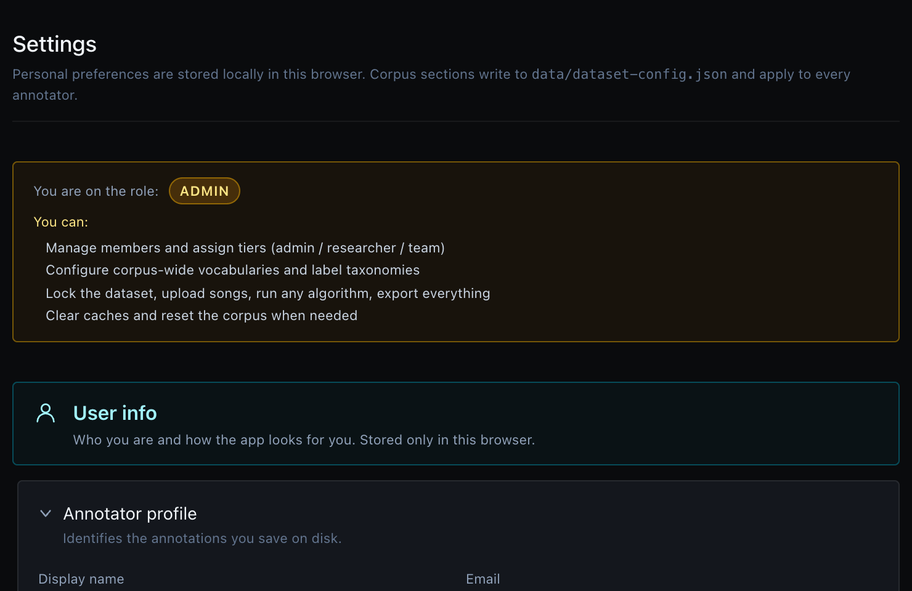

The Settings page is where you tune how the app looks and behaves for you, and (if you're an admin) configure defaults for the whole corpus. Most of what's here is *personal* — your choices are saved in your own browser and don't affect teammates. There's no Save button: every change is written immediately and a brief **Saved** pill flashes to confirm. The page's destructive actions are collected at the very bottom in a clearly-marked **Danger Zone**.

Technical note: your personal preferences are stored in your browser under a single key, `timecues.settings.v1` (one JSON object); the shipped defaults are defined in `DEFAULT_SETTINGS` in `src/context/SettingsContext.tsx`.

### Page layout — role banner + five categories

At the top of the page a **role banner** announces your current access tier and bullets out what you can do at that tier:

| Tier | Banner accent | "You can…" highlights |
|------|--------------|----------------------|
| **ADMIN** | amber | Manage members, configure corpus-wide vocabularies, upload/export, clear caches, factory-reset the corpus |
| **RESEARCHER** | violet | Full corpus access, run any algorithm, view all annotators' outputs, upload/export. **Cannot** manage members or edit dataset defaults |
| **TEAM** | cyan | Full corpus access for your own annotations. **Cannot** see other annotators' work or run admin actions |
| **PUBLIC** | slate | Annotate the shipped default songs only. Other corpus features unlock once an admin adds you to the team |

Below the banner the page is grouped into **five categories**, each with its own color-coded banner:

| Category | Accent | What lives here |
|----------|--------|-----------------|
| **👤 User info** | cyan | Annotator profile, Theme |
| **✎ Annotation** | indigo | Display & playback defaults, Default signals, Annotations — display, Vocabularies & taxonomies (section / cue / span; admin "Save as dataset default" inline per field), Loops, BPM & grid protection (personal), Experimental annotation types |
| **🔬 Research** | violet | Default algorithms, BPM detection, Evaluation (score region layers as multiple candidates), Auto-guess defaults, Optional GPU tooling. **Read-only for Team / Public** — visible but disabled with an "Admin only" badge |
| **🛡 Corpus management** | amber | Admin & access, Storage stats. **Read-only for non-admins** — visible but disabled with an "Admin only" badge. *(Corpus-wide vocabulary defaults now live inline in **Annotation → Vocabularies & taxonomies** — each field has a "Save as dataset default" button visible to admins.)* |
| **⚠ Danger Zone** | rose | Destructive actions, split into *Personal — this browser only* (always usable) and *Corpus-wide — affects every annotator* (admin only) |

> ℹ Out-of-tier categories follow the **read-only with lock badge** pattern: the section is still visible (so you know what's there) but interaction is suppressed and the title carries an "Admin only" pill.

> ℹ For the three corpus-wide vocabularies (section, cue, span), admins set a *dataset default* inline from the same control they use to edit their own — each field in **Annotation → Vocabularies & taxonomies** has a **Save as dataset default** / **Clear dataset default** button pair that's only rendered for admins. Annotators can still override locally; when a local value diverges from the admin default, a **Local override** pill appears next to that control with a one-click **reset** link that pulls the dataset default back in. If no admin default is set, no pill is shown.

> ℹ Every section in this page is **collapsible**. By default only **Annotator profile** is expanded — click any other section's header (chevron + title) to expand it. State is per-visit, so re-opening Settings starts from the same all-collapsed baseline.

### 👤 User info

#### Annotator profile

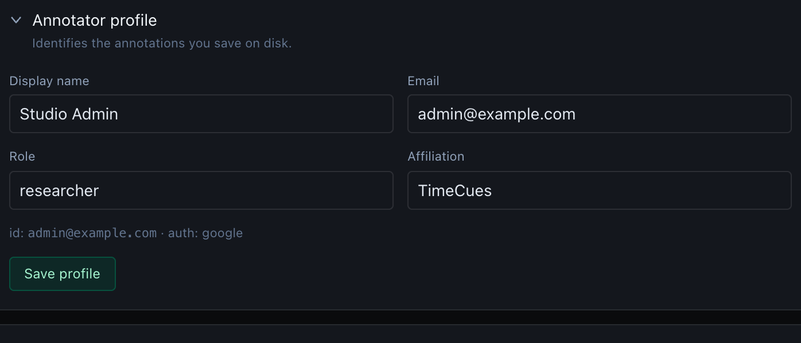

Fields are stored on `AnnotatorContext`, not in the settings object; they require clicking **Save profile**.

| Row | Type | Notes |
|-----|------|-------|
| Display name | text | Attached to every saved annotation |
| Email | text | Used for admin allowlist match (Google auth pre-fills) |
| Role | text (optional) | Free metadata, e.g. *Researcher* |
| Affiliation | text (optional) | e.g. *Tel Aviv University* |
| ID · auth | read-only | Your immutable annotator ID + sign-in method |

#### Theme

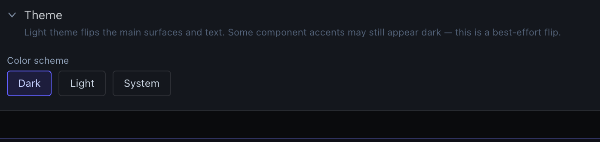

| Row | Control | Default | Key |
|-----|---------|---------|-----|
| Color scheme | radio: `dark` / `light` / `system` | `dark` | `theme` |

Light mode is best-effort — some component accents may stay dark. `system` follows the OS preference live (`prefers-color-scheme`).

### ✎ Annotation

Personal defaults for what the inspector shows and how annotation editors behave. Browser-local; nothing here is corpus-wide.

#### Display & Playback

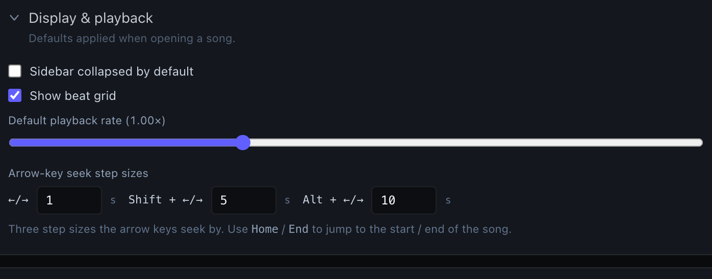

| Row | Control | Default | Key |
|-----|---------|---------|-----|
| Sidebar collapsed by default | toggle | `false` | `defaultSidebarCollapsed` |
| Show beat grid | toggle | `true` | `defaultShowBeatGrid` |
| Default playback rate | slider `0.5×–2.0×` step `0.05` | `1.00×` | `defaultPlaybackRate` |
| Small seek step (the `←` / `→` jump distance, in seconds) | number | `1 s` | `seekStepSmallSeconds` |
| Medium seek step (`Shift` + arrow) | number | `5 s` | `seekStepMediumSeconds` |
| Large seek step (`Alt` + arrow) | number | `10 s` | `seekStepLargeSeconds` |

#### Timing Export

Controls how times are written when you export a song's annotations to
standard timing files (Audacity label tracks + the JSON manifest — see
[Export & Import](#export--import)).

| Row | Control | Default | Key |
|-----|---------|---------|-----|
| Time precision (decimal places) | number `2–6` | `3` | `timePrecisionDecimals` |

`3` decimal places is millisecond precision; lower values make smaller files.
Only *exported* numbers are rounded — the times you edit and hear keep full
precision.

#### Default Signals

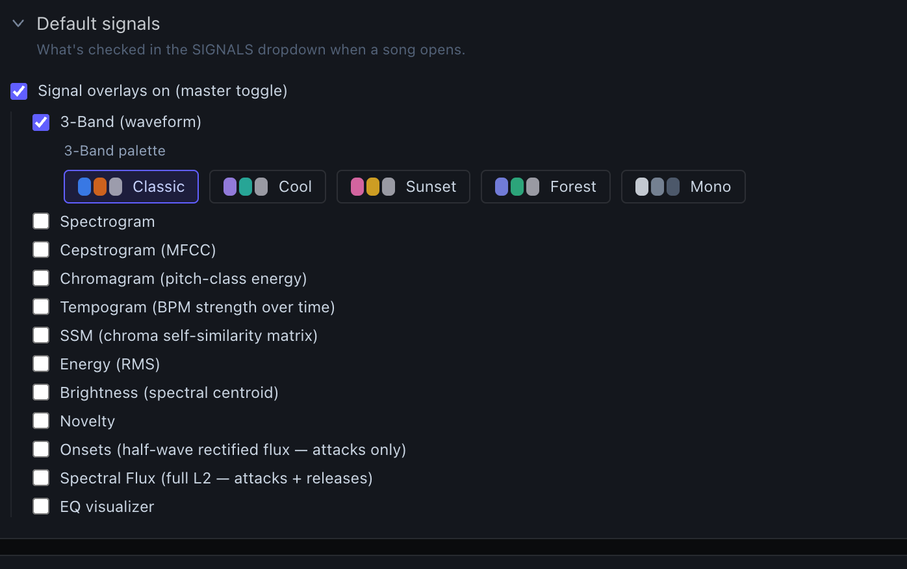

The "What's checked in the SIGNALS dropdown when a song opens" group — 12 toggles:

| Row | Default | Key |
|-----|---------|-----|
| 3-Band (waveform) | `true` | `defaultShowWaveform` |
| ↳ 3-Band palette (`Classic`, `Cool`, `Sunset`, `Forest`, `Mono`) | `Classic` | `bandPalette` |
| Spectrogram | `false` | `defaultShowSpectrogram` |
| Cepstrogram (MFCC) | `false` | `defaultShowCepstrogram` |
| Chromagram (pitch-class energy) | `false` | `defaultShowChroma` |
| Tempogram (BPM strength over time) | `false` | `defaultShowTempogram` |
| SSM (chroma self-similarity matrix) | `false` | `defaultShowSsm` |
| Energy (RMS) | `false` | `defaultShowEnergy` |
| Brightness (spectral centroid) | `false` | `defaultShowBrightness` |
| Novelty | `false` | `defaultShowNovelty` |
| Onsets (half-wave rectified flux) | `false` | `defaultShowOnsets` |
| Spectral Flux (full L2) | `false` | `defaultShowFlux` |
| EQ visualizer | `false` | `defaultShowEQ` |

**3-Band palette previews**:

| ID | Label | Hint |
|----|-------|------|
| `classic` | Classic | Blue · Orange · Gray (Rekordbox-style) |
| `cool` | Cool | Violet · Teal · Slate |
| `sunset` | Sunset | Rose · Amber · Slate |
| `forest` | Forest | Indigo · Emerald · Slate |
| `mono` | Mono | Grayscale, no hue |

#### Annotations — display

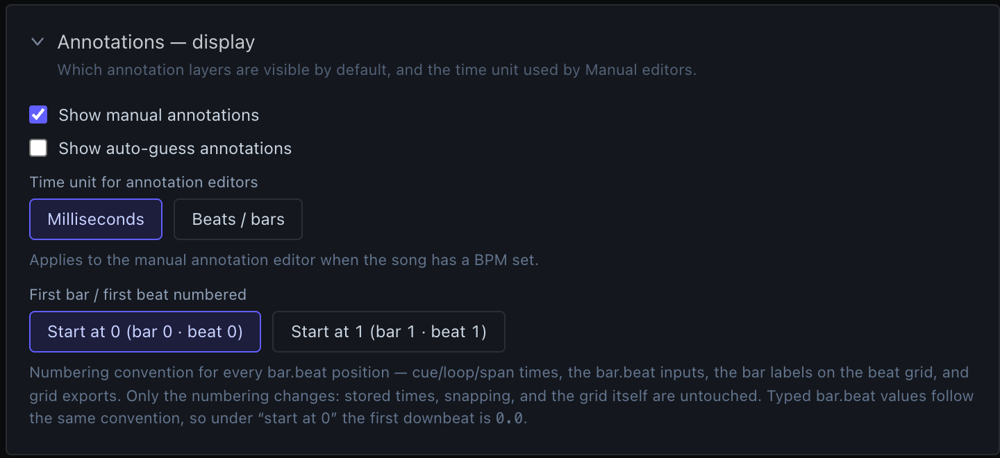

Which annotation layers are visible by default, plus the time unit and the bar/beat numbering used by the Manual editor. Vocabulary editing moved to its own subsection below in 2026-05-18.

| Row | Default | Key |
|-----|---------|-----|
| Show manual annotations | `true` | `defaultShowManual` |
| Show auto-guess annotations | `false` | `defaultShowAutoGuess` |
| Time unit for annotation editors (`Milliseconds` / `Beats & bars`) | `ms` | `annotationTimeUnit` |
| First bar / first beat numbered (`Start at 0` / `Start at 1`) | `0` | `barBeatOrigin` |

##### First bar / first beat numbered

Chooses the counting convention for **every** bar.beat position in the app: the
`Bar X · Beat Y` readout under the transport, the beat-relative times in the
cue / loop / span editors, the bar labels on the beat grid, the `bar.beat`
inputs, and the labels in a **grid export**.

- **Start at 0** (default) — zero-based counting, matching how DAWs and code
  index. The first downbeat is `bar 0 · beat 0`, and you type it as `0.0`.
- **Start at 1** — musician counting. The same downbeat is `bar 1 · beat 1`,
  typed as `1.1`.

Browsers that used the app before 2026-09-07 are switched to zero-based once,
on the next load; picking **Start at 1** after that sticks for good.

Only the *numbering* changes. Times on disk, snapping, the grid offset, and the
grid itself are untouched, so flipping this never edits an annotation. It does
change how typed `bar.beat` input is read — under **Start at 0**, `1.1` means
the second beat of the second bar, not the very first downbeat.

Because that is easy to misread as an off-by-one bug, the annotator says which
convention is live in two always-visible places:

- the **grid badge** in the control bar reads `107 BPM · 4/4 · bars from 0`
  (or `bars from 1`), and its tooltip points back at this setting;
- the **bar.beat column header** on every annotation card reads
  `bar.beat from 0` / `bar.beat from 1`, with a hover tooltip whose worked
  example counts the same way your grid does.

#### Vocabularies & taxonomies

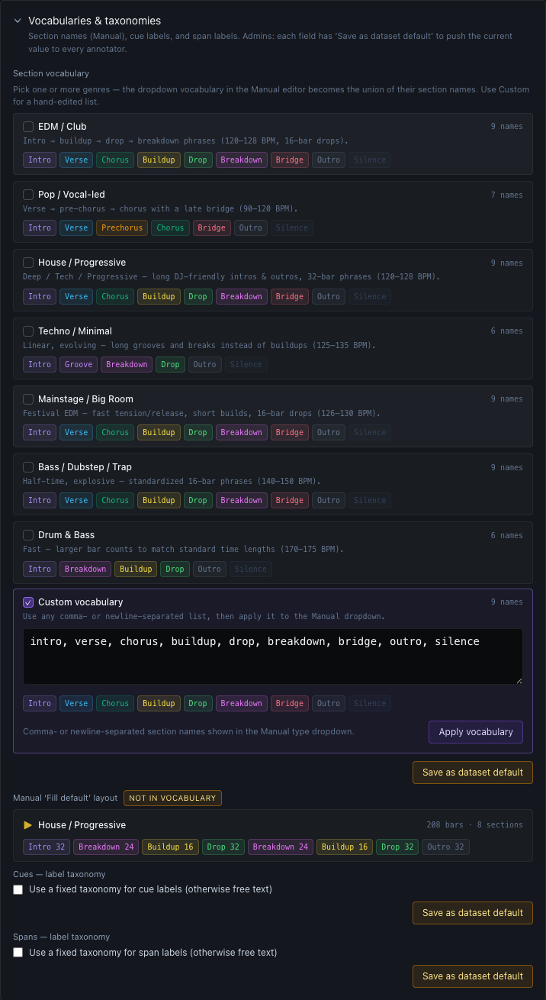

All label vocabularies in one place — the section names that drive Manual dropdowns, plus the optional cue/span taxonomies. Restructured 2026-05-18: every admin "Save as dataset default" / "Clear dataset default" button now lives **inline under the field it applies to** (visible only when you are admin); the old standalone *Dataset defaults — corpus-wide vocabularies* section under **Corpus management** was retired in the same change.

##### Section vocabulary (genre cards + custom)

Multi-select genre cards, plus a Custom card that drops you into a hand-edit textarea with an `Apply vocabulary` button. The dropdown shown in the Manual editor becomes the **union** of every selected genre's section names; duplicates are removed and case is normalized to lowercase.

**Adding your own names**: click the **Custom vocabulary** card, type any comma- or newline-separated list into the textarea — invented names are fine, not just the built-in types — and press `Apply vocabulary`. The names you enter are exactly what the Manual **Type** dropdown offers from then on, in the order you wrote them. A name with no built-in color gets the neutral fallback gray.

> ⚠️ **Removing a name asks first.** Adding names applies immediately, but any edit that *drops* a name — clearing it from the Custom textarea, or deselecting a genre card that supplied it — opens a **Remove section names?** dialog listing what's going and what happens next, and nothing changes until you approve it. Cancel leaves your vocabulary untouched.

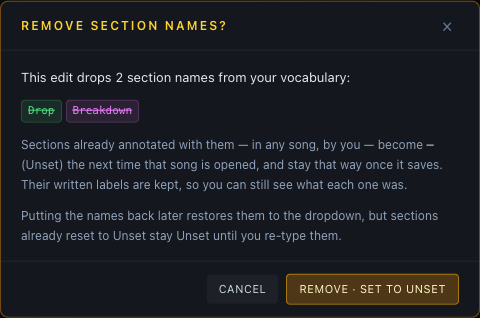

> Approving it matters because the change reaches annotations you aren't looking at: sections already marked with a dropped name are re-typed to **`—` (Unset)** the next time each song is opened, and that sticks once the song saves. Their **written labels survive** — a section that was `Drop / "Drop 2"` becomes `Unset / "Drop 2"` — so you can see what each orphaned section used to be and re-type it from the card. Orphans stay visible in the section-card list and on the Boundaries lane (drawn in the neutral Unset gray with their label), unlike the automatic `—` end-caps, which stay invisible. Putting the name back in the vocabulary restores it to the dropdown, but sections already reset to Unset stay Unset until you re-type them.

| Row | Default | Key |
|-----|---------|-----|
| Section vocabulary (multi-select genre cards + Custom card) | canonical 9 types | `sectionTypeVocabulary`, `sectionVocabularyGenres` |

> ℹ **Changed 2026-09-08** — `verse` and `chorus` joined the shipped default (and every four-on-the-floor genre card), since vocal-led club tracks have both. If you saved settings before that date and never edited the vocabulary yourself, the two types are added to your list once, automatically, on the next load. A vocabulary you hand-edited or built from other genre cards is left exactly as you set it.

> ℹ When the admin has set a corpus-wide section vocabulary (via the inline **Save as dataset default** button under this field) and your local list differs, a **Local override** pill appears next to the **Vocabularies & taxonomies** section header with a one-click `reset` link.

| Preset | Vocabulary |
|--------|-----------|
| EDM / Club | intro, verse, chorus, buildup, drop, breakdown, bridge, outro, silence |
| Pop / Vocal-led | intro, verse, prechorus, chorus, bridge, outro, silence |
| House / Progressive | intro, verse, chorus, buildup, drop, breakdown, bridge, outro, silence |
| Techno / Minimal | intro, groove, breakdown, drop, outro, silence |
| Mainstage / Big Room | intro, verse, chorus, buildup, drop, breakdown, bridge, outro, silence |
| Bass / Dubstep / Trap | intro, verse, chorus, buildup, drop, breakdown, bridge, outro, silence |
| Drum & Bass | intro, breakdown, buildup, drop, outro, silence |

**Default section types & colors**:

| Type | Color (hex) | Default description |
|------|-------------|--------------------|
| intro | `#a78bfa` | Opening section — gradual build-up of elements, typically minimal energy. |
| buildup | `#fde047` | Rising tension before the drop — drum rolls, filtering, rising synths; energy escalates. |
| drop | `#4ade80` | Main high-energy peak — full bassline, kick, lead synth; the defining moment of the track. |
| breakdown | `#e879f9` | Stripped-back section after the drop — tension release, often ambient or rhythmically sparse. |
| bridge | `#fb7185` | Transitional passage between major sections; often introduces a new melodic or harmonic idea. |
| outro | `#64748b` | Closing section — gradual element removal, mirror of the intro. |
| silence | `#334155` | Moment of near-silence — used for dramatic effect before a drop or at the track's end. |
| verse | `#38bdf8` | Song-form verse — narrative or melodic content between choruses. |
| prechorus | `#f59e0b` | Short rise that sets up the chorus — lifts energy and signals the hook. |
| chorus | `#10b981` | Main hook of the song — most memorable, highest-energy vocal/melodic section. |
| groove | `#c084fc` | Steady-state evolving loop — minimal techno/house section without a clear drop. |
| *(fallback)* | `#94a3b8` | Used when a custom type has no defined color. |

> ℹ **Types outside your vocabulary become Unset.** Any section whose type isn't in your current vocabulary — because you removed the name, or because the annotation was imported in someone else's vocabulary (a SALAMI `solo`, say) — is re-typed to `—` (Unset) on load rather than being coerced into the first name on your list. The section keeps its written label, so nothing about it is lost except a type name your vocabulary can't express.

##### Manual ‘Fill default’ layout (collapsible, vocabulary-filtered)

Bar-layout template that the **✨ Fill Default** button inserts in the Manual editor. Restructured 2026-05-18 into a **collapsible `<details>` summary** showing the current pick's name, bar count, and chip row at a glance — click to expand and switch presets.

| Row | Control | Default | Key |
|-----|---------|---------|-----|
| Manual ‘Fill default’ layout | collapsible preset list (filtered) + Custom — type:bars textarea | `house` | `manualBoundariesDefault`, `manualBoundariesCustomLayout` |

**Filtering by your section vocabulary**: the preset list inside the expanded picker shows **only layouts whose genre is currently in your Section vocabulary selection above**, plus your current selection if it falls outside (badged **not in vocab** so it's obvious). If your current selection isn't in your vocabulary, a **Not in vocabulary** pill is also shown in the field label so you can see it without expanding.

**Setting the default**: click any row inside the expanded picker to make it the default — the amber border + tinted background mark the current one. The Custom — type:bars row at the bottom works the same way.

**Show all presets**: a checkbox at the top of the expanded picker bypasses the vocabulary filter and lists every genre preset (`edm`, `pop`, `house`, `techno`, `mainstage`, `bass`, `dnb`), each badged **not in vocab** when relevant. Use it to switch your default to a preset whose genre isn't currently in your Section vocabulary — including while you're in Custom vocabulary mode.

Edge cases:

| State | What you see |
|-------|--------------|
| You picked **Custom** for Section vocabulary, **Show all presets** off | Preset list is empty. The Custom — type:bars editor below stays available; a hint reads *"You're on a Custom vocabulary — only the Custom layout is shown. Toggle Show all presets above to pick a genre preset as the default anyway."* |
| Selected genres don't intersect any layout preset, **Show all presets** off | Empty list with the hint *"No layouts match your current vocabulary genres — toggle Show all presets above to pick from the full list, switch to Custom below, or select a genre in the Section vocabulary above."* |
| Selected layout's genre is no longer in your vocabulary | Layout still works; both the field label and the entry inside the picker carry an amber **not in vocab** / **Not in vocabulary** badge. |
| **Show all presets** on | Every genre preset is listed regardless of vocabulary. Out-of-vocab rows keep the amber **not in vocab** badge so you don't lose track. |

Bars convert to seconds using BPM + time signature when applied.

| Preset | Tempo range | Total bars | Sections | Layout |
|--------|------------|------------|----------|--------|
| **edm** | 120–128 BPM | 96 | 7 | intro:16, buildup:8, drop:16, breakdown:16, buildup:8, drop:16, outro:16 |
| **pop** | 90–120 BPM | 112 | 10 | intro:4, verse:16, prechorus:8, chorus:16, verse:16, prechorus:8, chorus:16, bridge:8, chorus:16, outro:4 |
| **house** *(default)* | 120–128 BPM | 208 | 8 | intro:32, breakdown:24, buildup:16, drop:32, breakdown:24, buildup:16, drop:32, outro:32 |
| **techno** | 125–135 BPM | 256 | 8 | intro:32, groove:32, breakdown:24, drop:48, groove:32, breakdown:24, drop:48, outro:32 |
| **mainstage** | 126–130 BPM | 120 | 8 | intro:16, breakdown:16, buildup:8, drop:16, breakdown:16, buildup:8, drop:24, outro:16 |
| **bass** | 140–150 BPM | 112 | 8 | intro:16, breakdown:16, buildup:8, drop:16, breakdown:16, buildup:8, drop:16, outro:16 |
| **dnb** | 170–175 BPM | 240 | 8 | intro:32, breakdown:24, buildup:16, drop:48, breakdown:24, buildup:16, drop:48, outro:32 |
| **custom** | — | — | — | Your `type:bars` list, e.g. `intro:16, buildup:8, drop:32, outro:16` — any section type (including `verse`, `prechorus`, `chorus`, `groove`) is allowed |

##### Cue & Span label taxonomies

| Row | Control | Default | Key |
|-----|---------|---------|-----|
| Cues — label taxonomy | toggle + textarea | `false`, `[kick, snare, hat, fx, vox]` | `cueTaxonomyEnabled`, `cueTaxonomy` |
| Spans — label taxonomy | toggle + textarea | `false`, `[vocals, pad, bass, lead, fx]` | `spanTaxonomyEnabled`, `spanTaxonomy` |

> ℹ The **Cues** and **Spans** taxonomies each show a **Local override** pill next to the field label when the admin has set a corpus-wide default (via the inline **Save as dataset default** button under that field) and your local toggle/list differs. Click `reset` on the pill to pull the dataset default back in.

> ℹ **Admin "Save as dataset default" buttons** appear at the bottom of each of the three fields (section / cues / spans) when you're signed in as admin. Each writes the current local value to `data/dataset-config.json` — see `sectionTypeVocabularyDefault`, `cueTaxonomyEnabledDefault` + `cueTaxonomyDefault`, and `spanTaxonomyEnabledDefault` + `spanTaxonomyDefault`. A **Clear dataset default** sibling button appears whenever a default is currently set. Saving a default does NOT overwrite anyone's local settings; existing annotators keep their lists and just see the new override badge until they click `reset`.

#### Loops

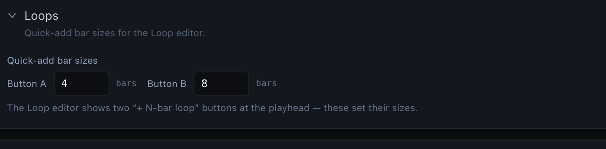

| Row | Control | Default | Key |
|-----|---------|---------|-----|
| Loops — quick-add bar sizes | two number inputs `1–64` | `[4, 8]` | `loopQuickAddBars` |

Sets the two **+ N-bar loop** buttons that the Loop editor shows at the playhead. Split into its own section in 2026-05-18; previously sat inside *Annotation defaults*.

#### Experimental Annotation Types

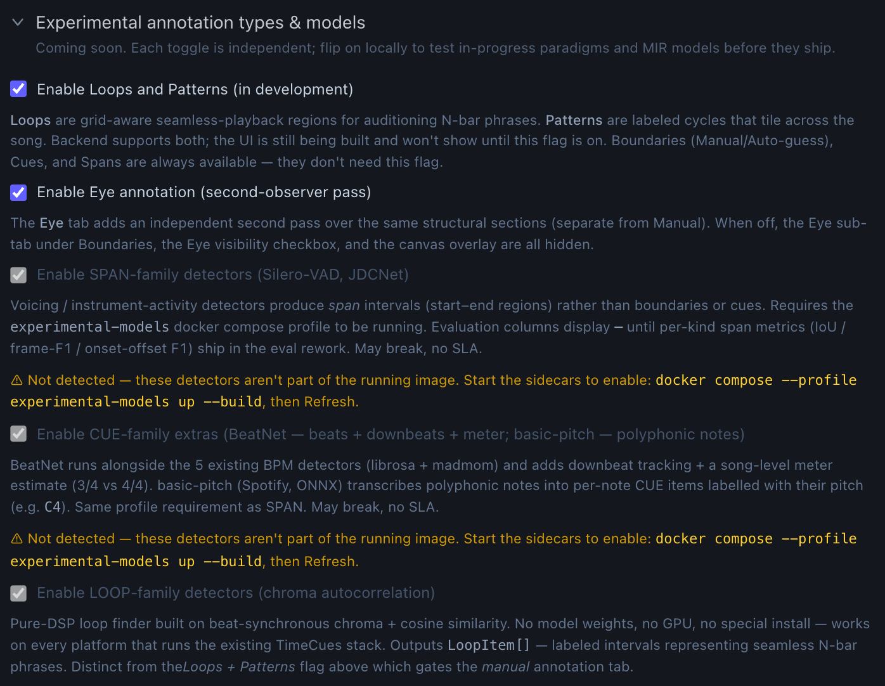

| Row | Control | Default | Key |
|-----|---------|---------|-----|
| Enable Loops and Riff Patterns (in development) | toggle | `false` | `experimentalLoopsAndPatterns` |

Boundaries (Manual + Auto-guess), Cues, and Spans are always available. **Loops** and **Riff Patterns** share one toggle.

### 🔬 Research

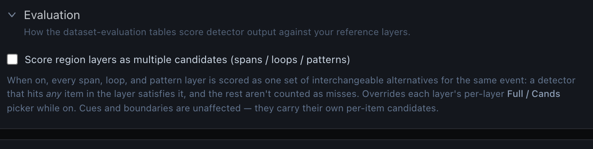

Algorithmic decisions: which detectors run, how their outputs cluster, and how auto-guess picks centroids. Browser-local but conceptually corpus-shared — the whole research team should be on the same defaults for results to compare cleanly. **Read-only for Team / Public tiers.**

#### Default Algorithms

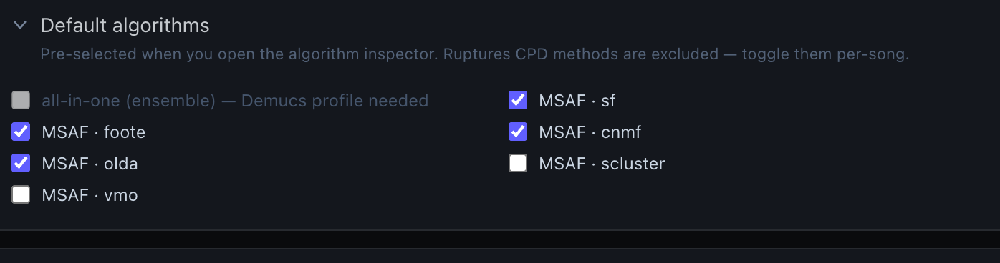

Checkbox grid. Seeds the run selection Dataset Prep's batch runner starts from. Ruptures CPD methods are excluded by default — toggle them per-song. (Algorithm Inspect's **▶ Run…** picker does not use this default: it mirrors whatever is ticked in its own Algorithms sidebar.)

| Algorithm ID | Default | Notes |
|--------------|--------|-------|
| `allin1` | ✓ | Disabled with "Demucs profile needed" if neither `demucs-cpu` nor `demucs-gpu` is running |
| `msaf-sf` | ✓ | |
| `msaf-foote` | ✓ | |
| `msaf-cnmf` | ✓ | |
| `msaf-olda` | ✓ | |
| `msaf-scluster` | ☐ | Optional MSAF method |
| `msaf-vmo` | ☐ | Optional MSAF method |

Key: `defaultAlgorithms`.

#### BPM Detection

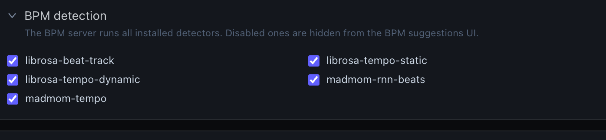

Checkbox grid. An empty array means *show all*.

| Detector | Default |
|----------|--------|
| `librosa-beat-track` | ✓ |
| `librosa-tempo-static` | ✓ |
| `librosa-tempo-dynamic` | ✓ |
| `madmom-rnn-beats` | ✓ |
| `madmom-tempo` | ✓ |

Key: `enabledBpmDetectors`.

#### Stem Separation

| Row | Control | Default | Key |
|-----|---------|---------|-----|
| Separate stems automatically after upload | toggle | on | `autoStemOnUpload` |
| Stems per song | button radio: `6 stems` / `4 stems` | `6s` | `defaultStemModel` |

With the toggle on, every song you upload is queued for Demucs in the
background — one job at a time, while you carry on working. Songs that already
have stems on disk are skipped, and nothing is queued at all when the Demucs
tooling isn't installed (or in Demo Mode). See
[Per-song stem separation](#per-song-stem-separation) for the queue readout and
the per-song controls.

**Stems per song** picks the model those runs use: **6 stems** (`htdemucs_6s`)
puts guitar and piano on their own tracks; **4 stems** (`htdemucs`) folds both
into *other* and finishes noticeably sooner. It seeds the automatic runs and the
Dataset Prep re-stem control, where you can still switch per song.

#### Auto-Guess Defaults

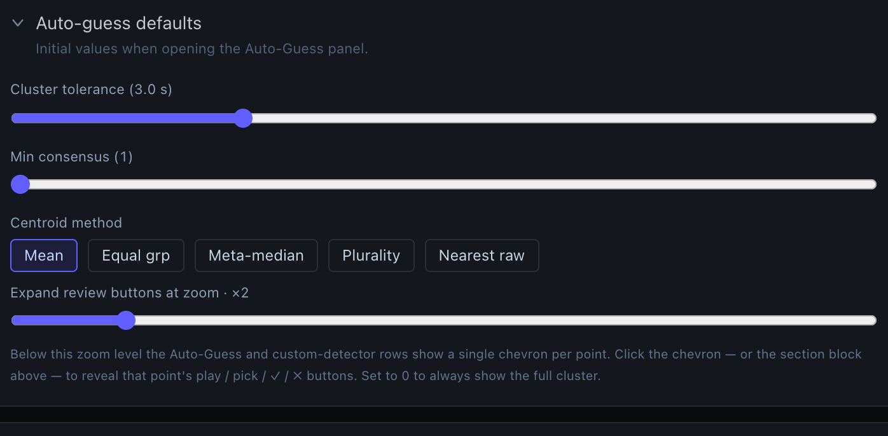

| Row | Control | Default | Key |
|-----|---------|---------|-----|
| Cluster tolerance | slider `0.5–10 s` step `0.5` | `3 s` | `autoGuessClusterTolerance` |
| Min consensus | slider `1–10` step `1` | `1` | `autoGuessMinConsensus` |
| Centroid method | button radio: `Mean` / `Equal grp` / `Meta-median` / `Plurality` / `Nearest raw` | `mean` | `autoGuessCentroidMethod` |
| Expand review buttons at zoom | slider `0–16` step `1` | `2×` | `autoGuessExpandZoomThreshold` |

Set the threshold to `0` for legacy *always-show* behavior.

#### Optional GPU Tooling

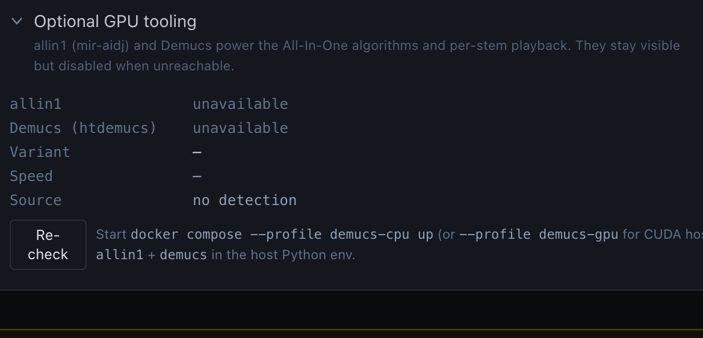

A status panel only — no editable settings.

- **Status chip**: `detected · fast`, `detected · slow`, or `not detected`
- **Re-check** button — refreshes from `/api/capabilities`
- Detail table: `allin1` availability, Demucs availability, variant (`cuda` / `cpu` / `host` / `unknown`), speed (fast ~30–60 s / slow ~3–5 min), source (Docker marker / host Python probe).

### 🛡 Corpus management

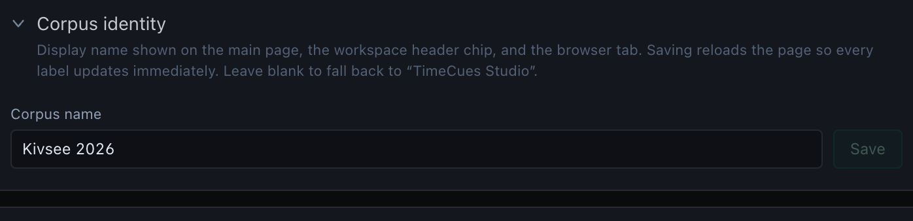

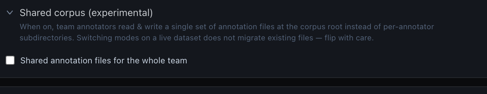

Every control in this category writes to `data/dataset-config.json`. **Read-only for non-admins** — visible (so the team knows what defaults are configured) but disabled with an "Admin only" pill on the category title. Non-admins also see read-only previews of the current dataset defaults so they know whether their local Annotation settings diverge.

#### Admin & Access

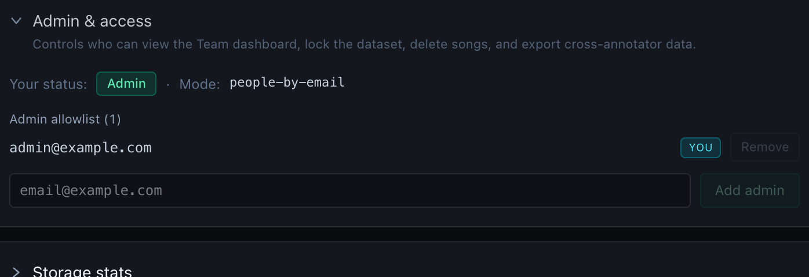

| Row | Type | Notes |
|-----|------|-------|
| Your status | badge | `Admin` or `Annotator (no admin)`; computed from `/api/admin-status` |
| Mode | label | `bootstrap` (anyone can claim) / `allowlist` (explicit emails) / `people-by-email` (canonical) |
| Admin allowlist | list with `Remove` per row | Visible to admins; `You` badge marks your row; can't remove yourself if you're the only admin |
| Add admin | email input + `Add admin` button | Admins only |
| Claim admin | button | Bootstrap mode only; locks admin to your email |

#### Dataset defaults — corpus-wide vocabularies *(retired 2026-05-18)*

The standalone admin section that lived here was removed when admin **Save as dataset default** / **Clear dataset default** buttons were inlined under each vocabulary field in **Annotation → Vocabularies & taxonomies**. The on-disk format (`sectionTypeVocabularyDefault`, `cueTaxonomyEnabledDefault` + `cueTaxonomyDefault`, `spanTaxonomyEnabledDefault` + `spanTaxonomyDefault` in `data/dataset-config.json`) and override semantics are unchanged — only the location of the controls moved.

#### Storage stats

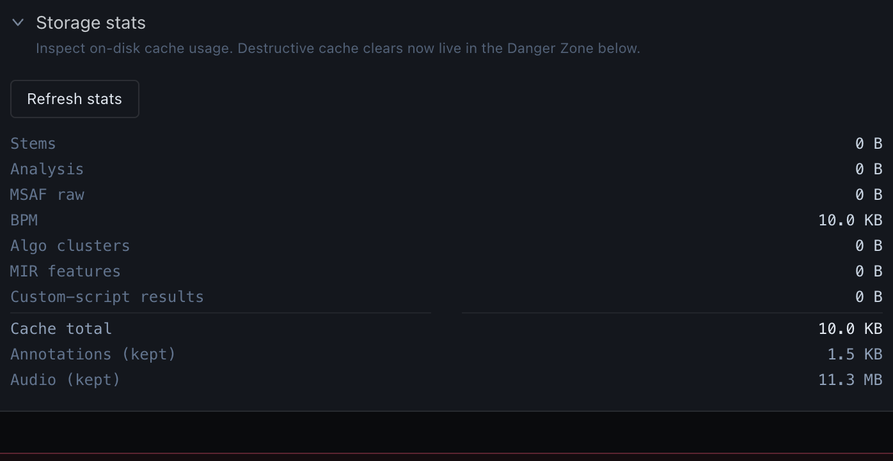

| Button | Action |
|--------|--------|
| Refresh stats | re-fetch storage breakdown |

The breakdown table shows: Stems, Analysis, MSAF raw, BPM, Algo clusters, MIR features, Custom-script results, Cache total, Annotations (kept), Audio (kept).

> ℹ Destructive cache and local-storage actions moved out of this section in 2026-05 — they now live in the **Danger Zone** below.

### ⚠ Danger Zone

The bottom category gathers every destructive action on the page in one place, so nothing irreversible is buried inside a "configuration" panel. Split into two sub-sections:

#### Personal — this browser only

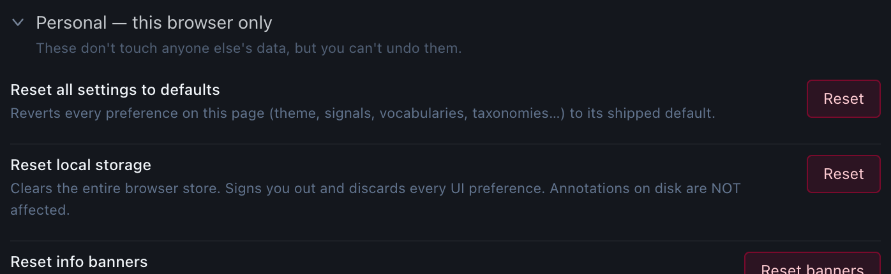

Always usable, regardless of tier. None of these touch anyone else's data, but they have no undo.

| Action | Effect | Confirmation |
|--------|--------|--------------|
| **Reset all settings to defaults** | Reverts every preference on this page to its shipped default | "Reset all settings to defaults?" |
| **Reset local storage** | Clears the entire browser store; signs you out and discards every UI preference. Annotations on disk are NOT affected | "Reset all local browser state? You will be signed out and all UI preferences cleared." |

#### Corpus-wide — affects every annotator

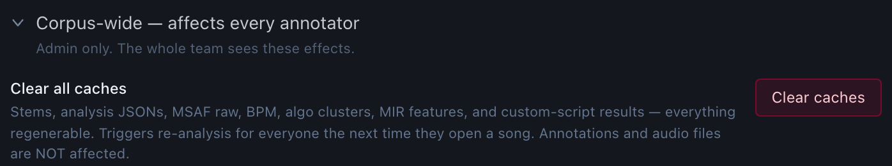

**Admin only.** The whole sub-section carries an "Admin only" pill in its header and every button is disabled for non-admin tiers. All four actions share the same typed-confirmation dialog — the button stays disabled until you type the exact confirmation word.

| Action | Effect | Confirmation word |
|--------|--------|-------------------|
| **Clear all caches** | Wipes stems / analysis / MSAF raw / BPM / algo clusters / MIR features / custom-script results; triggers re-analysis on next open for every annotator. Annotations and audio files are NOT affected. | (browser `confirm()`) |
| **Delete all songs** | Removes every song from the dataset: audio, regenerable caches, AND every annotator's annotations for those songs. The member list, admin list, and dataset settings stay intact. | `DELETE_ALL_SONGS` |
| **Delete workspace** | Wipes the entire dataset for this workspace — every song (audio + caches + annotations), every annotator's saved sign-up profile, and `dataset-config.json` (members + admin list). You lose admin and are bounced to the landing page; the next sign-in re-bootstraps the workspace and the first signer becomes the new admin. | `DELETE_WORKSPACE` |
| **Factory reset** | Full reset. Wipes everything Delete workspace does, and is wired through its own endpoint so future multi-dataset support can extend it to clear cross-dataset state too. Today (single dataset) the scope matches Delete workspace. | `FACTORY_RESET` |

> ⚠ **No undo.** Delete all songs / Delete workspace / Factory reset all permanently destroy on-disk data the moment you click confirm. The dialog enforces a typed confirmation, but past that there is no recovery.
>
> ⚠ **Clear all caches** triggers re-analysis for every annotator who opens any song afterwards. Use sparingly.

### Settings storage object

The full `UserSettings` schema lives in `src/context/SettingsContext.tsx`. The current shape (defaults shown):

```ts
{
  theme: 'dark',
  defaultSidebarCollapsed: false,
  defaultPlaybackRate: 1,
  seekStepSmallSeconds: 1,
  seekStepMediumSeconds: 5,
  seekStepLargeSeconds: 10,
  defaultShowWaveform: true,
  bandPalette: 'classic',
  defaultShowSpectrogram: false,
  defaultShowEQ: false,
  defaultShowCepstrogram: false,
  defaultShowChroma: false,
  defaultShowTempogram: false,
  defaultShowSsm: false,
  defaultShowBeatGrid: true,
  defaultShowEnergy: false,
  defaultShowBrightness: false,
  defaultShowNovelty: false,
  defaultShowOnsets: false,
  defaultShowFlux: false,
  defaultShowManual: true,
  defaultShowAutoGuess: false,
  annotationTimeUnit: 'ms',
  sectionTypeVocabulary: ['intro','buildup','drop','breakdown','bridge','outro','silence'],
  sectionVocabularyGenres: null,
  defaultAlgorithms: ['msaf-sf','msaf-foote','msaf-cnmf','msaf-olda','allin1'],
  enabledBpmDetectors: [],
  autoStemOnUpload: true,
  defaultStemModel: '6s',
  evalRegionLayersAsCandidates: false,
  autoGuessClusterTolerance: 3,
  autoGuessCentroidMethod: 'mean',
  autoGuessMinConsensus: 1,
  autoGuessExpandZoomThreshold: 2,
  experimentalLoopsAndPatterns: false,
  experimentalSpanFamily: false,
  experimentalCueExtras: false,
  experimentalLoopFamily: false,
  experimentalLyricsFamily: false,
  experimentalPatternFamily: false,
  experimentalSetlist: false,
  manualBoundariesDefault: 'house',
  manualBoundariesCustomLayout: 'intro:16, buildup:8, drop:32, breakdown:16, buildup:8, drop:32, outro:16',
  loopQuickAddBars: [4, 8],
  cueTaxonomyEnabled: false,
  cueTaxonomy: ['kick','snare','hat','fx','vox'],
  spanTaxonomyEnabled: false,
  spanTaxonomy: ['vocals','pad','bass','lead','fx'],
}
```

---

## Keyboard Shortcuts


<!-- tc-videos:keyboard-shortcuts -->

**▶ Shortcuts drawer**

<div style="position:relative;padding-bottom:56.25%;height:0;overflow:hidden;max-width:720px;margin:1rem 0;border-radius:8px;"><iframe style="position:absolute;top:0;left:0;width:100%;height:100%;" src="https://www.youtube.com/embed/x3zEHTr1Fm0" title="Shortcuts drawer" frameborder="0" loading="lazy" allow="accelerometer; autoplay; clipboard-write; encrypted-media; gyroscope; picture-in-picture" allowfullscreen></iframe></div>

**▶ Mark at playhead (M)**

<div style="position:relative;padding-bottom:56.25%;height:0;overflow:hidden;max-width:720px;margin:1rem 0;border-radius:8px;"><iframe style="position:absolute;top:0;left:0;width:100%;height:100%;" src="https://www.youtube.com/embed/cQ7NtkJPoBQ" title="Mark at playhead (M)" frameborder="0" loading="lazy" allow="accelerometer; autoplay; clipboard-write; encrypted-media; gyroscope; picture-in-picture" allowfullscreen></iframe></div>

**▶ Step between items ([ and ])**

<div style="position:relative;padding-bottom:56.25%;height:0;overflow:hidden;max-width:720px;margin:1rem 0;border-radius:8px;"><iframe style="position:absolute;top:0;left:0;width:100%;height:100%;" src="https://www.youtube.com/embed/uFeSjV7qfqA" title="Step between items ([ and ])" frameborder="0" loading="lazy" allow="accelerometer; autoplay; clipboard-write; encrypted-media; gyroscope; picture-in-picture" allowfullscreen></iframe></div>

<!-- /tc-videos:keyboard-shortcuts -->
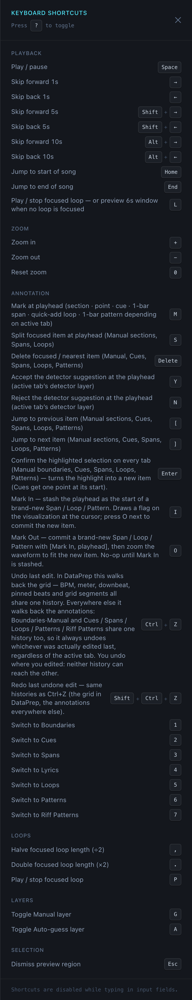

This is the full list of keyboard shortcuts (you can also pop up a quick reference any time by pressing **?**). To stop them firing while you're typing, shortcuts are ignored whenever your cursor is in a text field, dropdown, or other editable element — with two exceptions that always work: **?** (to open the help drawer) and **Esc** (to close it).

| Group | Key | Action |
|-------|-----|--------|
| **Playback** | `Space` | Play / pause |
|  | `→` | Skip forward by the **small** seek step (default `1 s`; configurable in Settings → Display & playback as `seekStepSmallSeconds`). Also the `▶▶` button on the player toolbar. |
|  | `←` | Skip back by the **small** seek step (default `1 s`). |
|  | `Shift + →` / `Shift + ←` | Skip by the **medium** seek step (default `5 s`; `seekStepMediumSeconds`). |
|  | `Alt + →` / `Alt + ←` | Skip by the **large** seek step (default `10 s`; `seekStepLargeSeconds`). |
|  | `Home` | Jump to start of song (also the `\|◀` button on the player toolbar). |
|  | `End` | Jump to end of song (also the `▶\|` button on the player toolbar). |
|  | `L` | Play / stop focused loop when a loop is focused (clicked on the canvas or selected in the Loops editor); otherwise opens the 6 s preview window around the cursor |
| **Zoom** | `+` | Zoom in |
|  | `−` | Zoom out |
|  | `0` | Reset zoom |
| **Annotation** | `M` | Mark at playhead, timed to the keypress itself (see *The mark lands where the cursor is*) — context-aware to the active tab: **Manual** inserts a section boundary, **Cues** a cue in the focused/first cue layer, **Loops** a quick-add loop sized by *Settings → Loop quick-add bars* (default 4), **Spans** a 1-bar span (or 2 s when no grid). Auto-guess ignores M (algorithm-driven). |
|  | `S` | Split focused item at playhead. Works in **Manual** (split section), **Spans** (split span), **Loops** (split loop). Disabled in Cues (single-point, nothing to split), Riff Patterns (cycle/repeat semantics would break), and Auto-guess. |
|  | `Delete` / `Backspace` | Delete focused / nearest item. **Manual:** nearest section boundary within 5 s. **Cues:** focused cue first, otherwise the nearest visible cue within 5 s. **Spans / Loops:** the focused item (no nearest fallback because intervals don't have a single "anchor time"). **Auto-guess:** no-op — review with ✓/✗/@ on each point instead of deleting. |
|  | `[` | Jump to previous item. **Manual** walks sections, **Auto-guess** walks the algorithm's points, **Cues / Spans / Loops** walk the deduplicated start times across every *visible* layer of that type. |
|  | `]` | Jump to next item (same per-type list as `[`). |
|  | `Enter` | Confirm pending region — turns a drag-selection on the visualization into a new item via the active panel's `confirmPending`. Wired for **Manual** (section), **Spans / Loops** (regierns** (interval). Only fires when a *region* is pending (drag, not a single click); no-op otherwise. |
|  | `I` | **Mark In** — first half of the two-step ADD for **Spans / Loops**. Stashes the current playhead as the start of a brand-new region. Fires only on Spans / Loops tabs. Same as the **▶\| Mark In** toolbar button. |
|  | `O` | **Mark Out** — second half of the two-step ADD. Commits a brand-new span / loop with `[stashed Mark In, current playhead]` as its range, then zoom-to-fits the new item so you can see what was just created. No-op until Mark In has been stashed. Mirror of the **\|◀ Mark Out** toolbar button. Use the inline **⌐ / ¬** chips on a specific row to snap an *existing* item's boundary instead. |
|  | `Y` | **Accept** the detector suggestion under the playhead — the keyboard equivalent of the inline **✓** on a detector row. Acts on whichever **detector layer the active tab is pointed at** (click its lane label on the canvas to aim the tab at it); **Spans / Loops** match the item the playhead is *inside*, **Cues** the nearest point within `0.5 s`. No-op when the active tab is showing a user layer or the playhead isn't in a suggestion, so the key falls through instead of silently reviewing something off-screen. Pressing `Y` again on an already-accepted item clears the decision back to pending, same as clicking ✓ twice. |
|  | `N` | **Reject** the detector suggestion under the playhead — the keyboard equivalent of the inline **✗**. Same targeting and same toggle-to-clear behaviour as `Y`. |
|  | `Ctrl + Z` (or `Cmd + Z`) | Undo last edit, context-aware. In **Dataset Prep** it walks the **grid** history — BPM, meter, downbeat, tempo mode, pinned beats and grid segments share one 50-step ring (see *Undoing a grid edit*). In every other workspace it walks the annotations: **Manual** uses a 50-step panel-level `useUndoableState` ring, and **Cues / Spans / Loops / Riff Patterns** share one page-level 50-step ring over the layers document (so ⌘Z reverses whichever of the four you last touched). **Auto-guess** has no undo stack (Ctrl+Z is a no-op there). The grid and annotation rings are separate: you undo where you edited. |
|  | `Shift + Ctrl + Z` (or `Shift + Cmd + Z`) | Redo. Same scope as Undo: the grid ring in Dataset Prep, per-panel for Manual, shared layers-doc stack for Cues / Spans / Loops / Riff Patterns. Layer visibility toggles, status flips and the Grid Lock preference don't enter any stack. |
| **Loops** | `,` | Halve focused loop length (÷2 — DJ-style). Only fires when the Loops tab is active. |
|  | `.` | Double focused loop length (×2). Only fires when the Loops tab is active. |
|  | `P` | Play / stop the focused loop (seamless looping playback via `useLoopPlayback`). Only fires when the Loops tab is active. |
| **Layers / Grid** | `G` | *Annotate / Inspect* → toggle Manual layer · *Prep* → **Align grid to playhead (set bar 1 here)** |
|  | `Shift + G` | Align grid to playhead (any mode) |
|  | `A` | Toggle Auto-guess layer |
| **Selection** | `Esc` | Dismiss preview region. Equivalent to clicking empty space on the visualization, which uniformly clears any highlighted drag-region (and any `t1 → t2` pending pill) and seeks the playhead to the click — same behavior across **Boundaries / Cues / Spans / Loops / Riff Patterns**. |
| **Metronome** *(Dataset Prep only)* | `T` | Tap tempo — each press records one tap into the rolling window and, from the second tap onward, sets the metronome's own tempo (rounded BPM, 60–240). Does **not** change the song's grid. `event.repeat` is suppressed, so holding the key down does not flood the buffer. |
| **Help** | `?` | Open / close keyboard shortcuts drawer |

---

## Export & Import


<!-- tc-videos:export-import -->

**▶ Advanced export dialog**

<div style="position:relative;padding-bottom:56.25%;height:0;overflow:hidden;max-width:720px;margin:1rem 0;border-radius:8px;"><iframe style="position:absolute;top:0;left:0;width:100%;height:100%;" src="https://www.youtube.com/embed/FFeWt3v15uI" title="Advanced export dialog" frameborder="0" loading="lazy" allow="accelerometer; autoplay; clipboard-write; encrypted-media; gyroscope; picture-in-picture" allowfullscreen></iframe></div>

<!-- /tc-videos:export-import -->
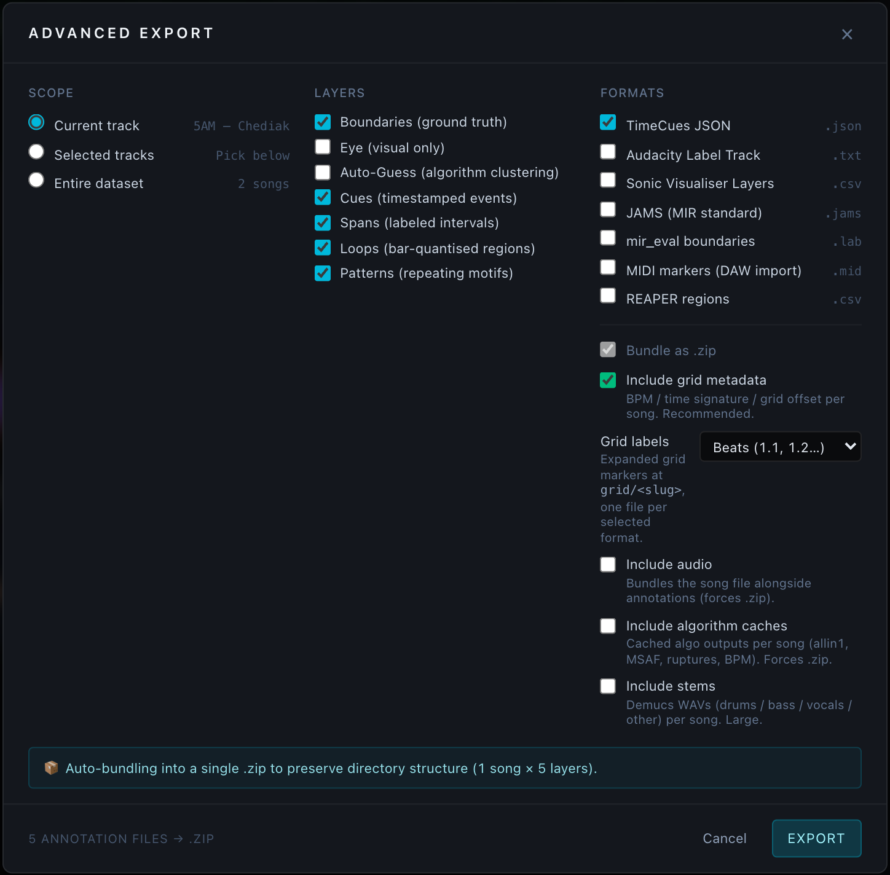

Export lives in **two places** with different scopes:

- **Per-song Export** — the `Export` button next to `Delete` in the **Annotator**
  workspace's annotation panel. Always exports the **current track only** —
  there is no song picker. Use this when you want everything you authored on
  the open song.
- **Full annotation export** — the `⤓ Full annotation export` button at the
  top of the **Dataset Prep** sidebar (next to `+ Upload songs`). Opens the
  same modal but with the scope picker and per-bucket toggles enabled —
  current track / selected tracks / entire dataset, plus optional audio,
  algorithm caches, and stems.

Both entry points open the same Export Manager (`ExportManagerModal.tsx`).

### Scopes (Full annotation export only)

| Scope | Source |
|-------|--------|
| **Current song** | Active slug only |
| **Multi-select songs** | Checkbox list — saved per session |
| **Entire dataset** | Server bulk-fetch via `/api/bulk-annotation-layers` + `/api/bulk-annotations/auto-guess` |

The per-song Export button hides this column — its scope is always the
current track.

### Layers

Any combination of:

- **Manual** (structural sections / boundaries)
- **Auto-Guess** (algorithm clustering; only points marked correct/partial are exported in flat formats)
- **Cues** (timestamped events — one file per cue layer per song)
- **Spans** (labeled intervals)
- **Loops** (bar-quantised regions — experimental, gated by Settings)

User-created layer types (Cues / Spans / Loops) ship one file per
layer per song at `<slug>/<type>/<layer-name>.<ext>` — so "Kick hits" and
"FX triggers" stay as separate Cues files. Loops are hidden
unless `experimentalLoopsAndPatterns` is enabled in Settings.

### Formats

The Formats column is a **multi-select** — tick any combination of the formats
below and each (song, layer) pair is emitted once per format you pick (for
example: ticking `TimeCues JSON` + `Audacity` + `JAMS` writes three files per
layer). Picking more than one format always forces a `.zip` so the parallel
copies stay side-by-side without clobbering filenames.

| Format | Extension | Notes |
|--------|-----------|-------|
| **TimeCues JSON** | `.json` | Full annotation object with metadata; round-trips verbatim |
| **Audacity label track** | `.txt` | Tab-separated `start \t end \t label`. |
| **Sonic Visualiser CSV** | `.csv` | Header + one row per boundary |
| **JAMS** | `.jams` | JSON Annotated Music Specification, validates against `jams.load(validate=True, strict=True)`; each layer exports as a `segment_open` annotation |
| **mir_eval boundaries** | `.lab` | Bare `time \t label` lines — read with `mir_eval.io.load_labeled_events`, then pair with `mir_eval.util.boundaries_to_intervals` for `mir_eval.segment.detection` |
| **MIDI markers** | `.mid` | Standard MIDI File (format 0, 480 PPQ) with one marker meta-event per section; drag-drop into Ableton / Logic / Reaper / FL Studio / Pro Tools. Tempo set from song BPM when available |
| **REAPER regions** | `.csv` | REAPER's own Region/Marker Manager round-trip format (`#,Name,Start,End,Length,Color`) |

**Grid labels sidecar.** Alongside the annotation layers, the export expands the
song's grid (Steady / Mapped / Hand-placed) into an individual labels file at
`<slug>/grid/<slug>.<ext>`. This is written **once per selected format** (not
just Audacity), so the same grid lands as `.txt`, `.csv`, `.lab`, `.jams`,
`.mid`, or as a re-importable cue list in `.json`, matching whichever formats
you ticked above. It complements the grid params in `song-info.json` (which
store the BPM / time signature / grid segments the grid is *derived* from) by
giving you the fully expanded markers. Emitted only for songs that have a BPM
and a reachable audio file (needed to probe the song's duration); skipped
silently otherwise.

The **Grid labels** dropdown (next to *Include grid metadata*) picks the
resolution — one marker per:

| Choice | Label scheme | Density |
|--------|--------------|---------|
| **Bars** | `1`, `2`, `3`, … (downbeats) | one per bar |
| **Beats** *(default)* | `1.1`, `1.2`, … (bar.beat) | one per beat |
| **Sub-beats · 8th** | adds `1.1.5` offbeats | 2× beats |
| **Sub-beats · 16th** | adds `1.1.25`, `1.1.5`, `1.1.75` | 4× beats |
| **Phrases** | `P1`, `P2`, … (every 4 bars) | one per phrase |
| **Off** | — | sidecar not written |

Labels are 1-indexed and match the Rekordbox-style strings shown on the grid in
the editor. Hand-placed per-beat overrides and Mapped grid segments are
honored automatically, so the exported marker times line up with what you see.

Single-file selections (one song, one layer, one format, no extra buckets)
download directly; everything else — including any time more than one format
is selected — is bundled as a ZIP. Each song gets its own top-level folder so you can drag one song's full state (annotations + audio + caches) into another workspace without untangling parallel directory trees:

```
<zip>/
└── <slug>/
    ├── boundaries/<layer-name>.<ext>              # one file per boundary layer
    ├── auto-guess/<slug>.<ext>
    ├── cues/<layer-name>.<ext>                    # every other multi-layer type
    ├── spans/<layer-name>.<ext>
    ├── loops/<layer-name>.<ext>                   # experimental
    ├── grid/<slug>.<ext>                          # one bar.beat label per beat, once per selected format
    ├── song-info.json                             # if "Include grid metadata" is on
    ├── audio.<ext>                                # if "Include audio" is on
    ├── algos/<file>.json                          # if "Include algorithm caches" is on (multi-export only)
    └── stems/<stem>.wav                           # if "Include stems" is on (multi-export only)
```

**Multi-annotator corpus exports** (Entire dataset scope, researcher / admin
tier) add an `<annotator-id>/` level inside each type directory whenever more
than one annotator contributed for that (song, type). Per-type means: if Alice
and Bob both did Manual for `whole-lotta-love`, you get
`whole-lotta-love/boundaries/alice@…/structure.json` and a
sibling for Bob. Non-researcher callers always see
the flat single-annotator layout regardless of scope.

### Bucket toggles (Full annotation export only)

The Full annotation export modal exposes these extra controls alongside
"Bundle as .zip":

- **Include grid metadata** (default on) — per-song BPM / time signature /
  grid offset / lock state at `<slug>/song-info.json`. Without these the
  annotation timings can't be reproduced; leave on unless you know you only
  want the annotations.
- **Grid labels** (dropdown, default *Beats*) — resolution of the expanded
  grid-labels sidecar described above (Bars / Beats / Sub-beats 8th / Sub-beats
  16th / Phrases, or *Off* to skip it). Written once per selected format.
- **Include audio** — original song file at `<slug>/audio.<ext>`. The modal
  shows a pre-zip size estimate via HEAD requests.
- **Include algorithm caches** — cached algorithm outputs (allin1 folds,
  MSAF, ruptures, foote, BPM detector results, algo-clusters) under
  `<slug>/algos/`. Server source is the union of `data/algorithm-outputs/analysis/<slug>/*`
  + `data/algorithm-outputs/{bpm-detections,algo-clusters}/<slug>.json`. MSAF
  raw intermediate outputs are deliberately excluded.
- **Include stems** — Demucs-separated stems (drums / bass / vocals / other)
  + manifest under `<slug>/stems/`. Often the largest contributor —
  hundreds of MB per song.

> ⚠ The per-song Export hides the algo-cache and stems toggles — those only
> make sense when bundling whole-dataset state for hand-off.

### Import

Each editor's **Import menu** (in the Marker config panel), and the top-bar **Import** button, can ingest:
- TimeCues JSON (any layer)
- Audacity `.txt` (Manual)
- Sonic Visualiser `.csv` (Manual)
- JAMS `.jams` — first `segment_*` annotation is read; `file_metadata` is dropped
- mir_eval `.lab` — bare `time \t label` rows (SALAMI / Isophonics convention)
- REAPER `.csv` — auto-detected from the `#,Name,Start,…` header, so both REAPER and Sonic Visualiser can share the `.csv` menu item
- `AnnotationLayersDocument` (Cue / Span / Loop)

Section `type` (intro / drop / breakdown / …) is inferred from the imported label using the same case-insensitive matcher used by the Audacity and Sonic Visualiser importers — unrecognized labels default to `drop`.

To bring in a colleague's work, have them export the Full Dataset, then unzip into your `data/annotations/` folder; switch annotator from the badge in the top bar to view theirs side-by-side.

### Standard timing files (label tracks)

Beyond the in-app Export Manager, a song's annotations can be written as
**tool-agnostic timing files** — Audacity-style label tracks (`.txt`) plus a
structured JSON manifest — so the work opens directly in DAWs, Audacity,
visualizers, or any script without a TimeCues-specific reader. Run:

```bash
node tools/export-timing-files.mjs <slug> --annotator <id> [--all] [--out <dir>] [--precision <n>]
```

Into `<out>/<slug>/` (default `exports/timing/<slug>/`) it writes, all times
rounded to the [Timing Export precision setting](#timing-export) (`--precision`,
2–6, default 3):

| File | Kind | Contents |
|------|------|----------|
| `<slug>_beats.txt` | label track | detected beat times (`b0`, `b1`, …) |
| `<slug>_bars.txt` | label track | downbeats — every Nth beat (`bar 0`, `bar 1`, …) |
| `<slug>_key_points.txt` | label track | Cues + Spans + Loops layers, merged |
| `<slug>_pattern.txt` | label track | Riff-pattern instances (`Instance 1 ×4`) |
| `<slug>_lyrics.txt` | label track | Lyrics layers — words as points, lines with their end |
| `<slug>_sections_labels.txt` | label track | section boundaries |
| `<slug>_sections.json` | JSON | structured sections (`time`, `type`, `label`) |
| `bpm.txt` | number | single BPM value |
| `<slug>_info.txt` | text | human-readable title / artist / bpm / grid summary, and what each layer holds |
| `<slug>_annotations.json` | JSON | self-describing per-layer manifest — **everything** the annotation carries |

Label tracks are TAB-separated, one record per line, sorted by start time —
Audacity's "Export Labels" convention. Re-exporting the same song is
deterministic apart from the manifest's `generated_at` timestamp.

Pass `--annotator shared` for a song the team annotates collaboratively: that
reads the shared team document rather than one person's private copy, which on
a collaborative song is a stale seed.

#### What the manifest carries

A label track has three columns and can never say more than *start, end,
label*. The JSON manifest has no such limit, and it carries every field an
annotation carries — so a consumer sees what the annotator actually said, not
a bare interval with a name on it:

- **Pulse** — as a rate (`"rate": "16th"`, the annotation) plus its resolved
  `interval_ms` and `per_bar` (this export's reading of that rate).
- **Prominence** — every breakpoint, with both its item-relative `t` and its
  absolute `at`, plus a one-phrase `prominence_summary` (*lead → backing*).
- **⚡ Energy** — the whole measurement in its own `energy` key: trend, start
  and end levels, brightness, the A/D/S/R envelope, the curve. (On disk it
  lives inside the span's `description`; the export lifts it out, so the
  description field stays prose.)
- **Descriptions, importance, candidates**, and the **beat stamps**
  (`start_beat` / `end_beat` / `beat`) beside the seconds.
- **Every layer type** — including Lyrics and Riff Patterns, with a riff lane's
  motif library (`nodes`, `combos`) so a sequence entry names what it plays
  instead of pointing at an id.
- **Layer identity** — colour, group, evaluation mode, and whether the lane is
  read-only detector output (and from which detector / stem).

Fields are **omitted when absent**, never written as `null`: no `pulse` key
means nobody annotated a pulse, which is a different statement from "the pulse
is nothing".

#### The grid stamp, and when an export goes stale

The manifest opens with the grid every derived number was resolved against:

```json
"grid": { "bpm": 124, "bpm_source": "song-info", "detected_bpm": 125,
          "time_signature": "4/4", "beats_per_bar": 4, "grid_offset": 0.07,
          "grid_mode": "mapped", "signature": "bpm=124;off=0.07;…" }
```

An export is a snapshot, not a subscription. If you re-fit the grid afterwards
— change the BPM, move the offset, split a tempo segment — the file on disk
does not follow, and two things in it are now the *old* grid's reading: a
pulse's `interval_ms`, and (if you answered **keep the bar.beat** to the grid
edit) the item times themselves. Compare `grid.signature` against the song's
current grid to see it, and re-export. The parts that survive a re-fit are the
ones stored musically: the pulse *rate*, and the beat stamps.

`bpm_source` exists for the same reason. A pulse is a statement about a grid,
so `interval_ms` is derived only from a tempo the annotator set or fitted —
never from a beat detector's guess, which is reported separately as
`detected_bpm` and used only for `bpm.txt`. A song with no grid exports its
pulse rates with no milliseconds attached, exactly as the app draws no ticks
for them.

---

## File Format & Directory Layout

This section is for anyone who wants to look at — or back up, or script against — TimeCues' files directly on disk. Everything the app saves lives under a `data/` folder: your annotations, the algorithm result caches, and each song's tempo/grid settings. (A sibling `data-default/` folder holds the read-only CC0 demo dataset, and `public/` holds browser-served caches and stems.) Each song is identified by its **slug** — the lowercase filename stem — which is reused as the key throughout. The tree below shows where each kind of file lands, and the schemas that follow show what's inside the main JSON files.

```
data/
├── annotations/
│   ├── layers/<annotator>/<slug>.json               # every layer type, one file per song
│   ├── auto-guess/<annotator>/<slug>.json
│   ├── custom/<detector>/<annotator>/<slug>.json   # only if is_annotation=True
│   └── timing/<annotator>/<slug>.json
├── algorithm-outputs/
│   ├── bpm-detections/<slug>.json
│   ├── msaf/<slug>/<method>.json
│   ├── allin1/<slug>/<variant>.json
│   ├── ruptures/<slug>/<method-cost>.json
│   ├── algo-clusters/<slug>.json
│   └── custom/<name>/<slug>.json
└── song-info/<slug>.json
data-default/                                       # CC0 release dataset
public/
├── analysis/<slug>/                                # browser-readable cache
└── stems/<slug>/                                   # Demucs outputs
```

### Boundary layer schema

Boundaries live in the song's annotation-layers document alongside every other
layer type. A song may hold several boundary layers — a second reading of the
structure is a second layer, exactly like a second Cues layer.

Boundary items **tile**: each one runs until the next item's `time`, so no end
is stored, and a trailing item typed `unset` is the end-cap that stops the last
real section from swallowing the rest of the track. `beat` is the musical
position stamped from `time`; seconds stay canonical (see Grid Lock).

`data/annotations/layers/<annotator>/<slug>.json`:

```json
{
  "song": "dj-dali-baglami-edit",
  "annotated_at": "2026-05-10T16:45:30Z",
  "statusByType": { "boundaries": "in_progress", "cues": "reviewed" },
  "groups": [
    { "id": "g7f1", "name": "Chorus study", "color": "#a78bfa",
      "collapsed": false, "display": "stacked" }
  ],
  "layers": [
    {
      "id": "a3a708463cdd",
      "name": "Boundaries 1",
      "type": "boundaries",
      "visible": true,
      "color": "#a78bfa",
      "snap": "bar",
      "groupId": "g7f1",
      "items": [
        { "id": "b1", "time": 0,   "beat": 0,  "type": "intro",   "label": "Intro" },
        { "id": "b2", "time": 4.0, "beat": 8,  "type": "buildup", "label": "Build 1",
          "importance": "optional",
          "candidates": [4.0, 4.2],
          "description": "Bass enters at 4.2s or filter opens at 4s — ambiguous" },
        { "id": "b3", "time": 12.0, "type": "unset", "label": "" }
      ]
    }
  ]
}
```

`groups` and `groupId` are what [lane groups](#group-lanes-into-a-band) are made of: the group record holds the band's own name, colour and collapsed state, and each member layer points at it by id. Both are optional — a document written before groups existed simply has neither, and a `groupId` pointing at a group that no longer exists is dropped on load. Member **order** has no field of its own: `layers` is already in canvas order, and a group's members are kept next to each other in it.

### Auto-guess schema

```json
{
  "auto_guess_status": "wip",
  "clusterTolerance": 3.0,
  "centroidMethod": "mean",
  "minAgreement": 2,
  "points": [
    {
      "clusterId": "c_001",
      "time": 30000,
      "originalTime": 29994,
      "clusterSize": 4,
      "sources": [
        { "algorithmId": "allin1", "originalTime": 29800 },
        { "algorithmId": "msaf-foote", "originalTime": 30100 },
        { "algorithmId": "cpd-pelt", "originalTime": 29950 },
        { "algorithmId": "ruptures-dynp-rbf", "originalTime": 30000 }
      ],
      "status": "correct",
      "correctionSource": "player",
      "sourceStatuses": { "msaf-foote": "rejected" }
    }
  ]
}
```

### Song info schema

```json
{
  "slug": "dj-dali-baglami-edit",
  "bpm": 124.05,
  "timeSignature": "4/4",
  "gridOffset": 0.412,
  "genre": "Progressive House",
  "title": "Baglami",
  "artist": "DJ Dali",
  "updated_at": "2026-05-12T08:00:00Z"
}
```

### Annotation layers document (Cue/Span/Loop)

```json
{
  "version": 1,
  "layers": [
    {
      "type": "cue",
      "id": "<uuid>",
      "name": "Kicks",
      "color": "#22d3ee",
      "items": [
        { "id": "<uuid>", "time": 12345, "label": "kick" }
      ]
    }
  ]
}
```

---

## REST API Reference

You don't need any of this to use TimeCues through its interface — the app calls these web addresses for you. This section is for developers who want to talk to the server directly: to script bulk operations, integrate another tool, or debug. Every address lives under `http://localhost:5173/api/` (during development the web server forwards these to the underlying Python services behind the scenes).

### Annotations

| Method | Endpoint | Purpose |
|--------|----------|---------|
| GET | `/api/annotation-layers/<slug>` | Fetch the song's layers document (boundaries, cues, spans, …) |
| POST | `/api/annotation-layers/<slug>` | Save the whole document (body: JSON) |
| DELETE | `/api/annotation-layers/<slug>` | Delete it |
| GET | `/api/annotation-layers` | Per-song, per-type item counts + status |
| GET | `/api/auto-guess-annotations/<slug>` | Fetch the auto-guess review document |
| POST | `/api/auto-guess-annotations/<slug>` | Save it |
| GET | `/api/bulk-annotation-layers?scope=all` | Every annotator's layers (researcher / admin) |

### Song info

| Method | Endpoint | Purpose |
|--------|----------|---------|
| GET | `/api/song-info/<slug>` | Fetch BPM / time-sig / grid offset |
| POST | `/api/song-info/<slug>` | Save |

### BPM detection

```bash
curl -X POST -F "file=@song.mp3" http://localhost:5173/api/bpm-detect
```

Response:

```json
{
  "librosa-beat-track": 124.0,
  "librosa-tempo-static": 124.5,
  "madmom-rnn-beats": 123.95
}
```

### Algorithm execution

```bash
curl -X POST -d '{"slug": "dj-dali-baglami-edit", "algoId": "cpd-pelt"}' \
  -H "Content-Type: application/json" \
  http://localhost:5173/api/run-algorithm
```

### Evaluation

```bash
curl -X POST -d '{
  "slug": "dj-dali-baglami-edit",
  "algoId": "cpd-pelt",
  "referenceLayer": "manual",
  "tolerance": 0.5
}' -H "Content-Type: application/json" \
  http://localhost:5173/api/evaluate
```

Response:

```json
{ "precision": 0.625, "recall": 0.5, "f_measure": 0.56, "tp": 5, "fp": 3, "fn": 5, "mnbd_s": 0.42, "csr": 0.8 }
```

### Capabilities & admin

| Method | Endpoint | Purpose |
|--------|----------|---------|
| GET | `/api/capabilities` | GPU tooling state (allin1, Demucs, variant, speed) |
| GET | `/api/admin-status` | Returns `{mode, isAdmin, allowlist}` |
| POST | `/api/admin/allowlist/add` | Body: `{email}` |
| DELETE | `/api/admin/allowlist/<email>` | Remove an admin |
| POST | `/api/admin/claim` | Bootstrap mode only |

### Custom detectors

See the [Custom Detectors chapter](#custom-detectors) for the full table.

---

## Auto-Guess Internals

This section explains *how* Auto-guess turns a pile of detector predictions into the candidate boundaries you review — the clustering it does, and the five different ways it can pick a single representative time for each cluster. You don't need to read it to use Auto-guess, but it helps if you're tuning the settings (in [Inspect All](#inspect-all)) or want to understand why a cluster landed where it did.

### Why temporal clustering, not voting

Different detectors agree on the *event* but disagree on the *time*, often by 0.5–3 s. Discrete majority voting cannot handle this: five detectors firing within two seconds split their votes across discrete bins and reinforce each other only by accident. Auto-Guess instead clusters predictions in continuous time and lets the user filter on cluster size.

### The clustering loop

Let `P = {(a_i, t_i)}` be the union of all selected algorithms' predictions, sorted by `t_i`. Auto-Guess walks `P` left-to-right, maintaining each open cluster's running sum `S_k` and member count `N_k` (so its centroid is `μ_k = S_k / N_k`):

1. For point `(a_i, t_i)`, find `k* = argmin_k |t_i − μ_k|` among open clusters.
2. If `|t_i − μ_k*| ≤ τ`, append the point to `C_k*` and update `S_k* += t_i`, `N_k* += 1`.
3. Otherwise, open a new cluster containing only `(a_i, t_i)`.

The running-mean update is what distinguishes this from single-linkage: a chain `A→B→C` in single-linkage can span `2τ`, whereas here the centroid is dragged along by every new member, capping cluster width near `τ`.

After the walk, every cluster `C_k` stores both its member list and the immutable arithmetic mean `μ_k`, which is preserved as an anchor so any centroid-method change can be undone with one click.

### Five centroid methods

| Method | Definition | When to use |
|--------|------------|-------------|
| **Mean** | Plain `μ_k = S_k / N_k`. Default, fast, symmetric. | Default. |
| **EqGrp** | One representative per algorithm (mean of that algorithm's predictions in the cluster), then average those representatives. Each algorithm gets one vote regardless of how many predictions it contributed. | When prolific detectors over-vote. |
| **MetaMed** | Compute four internal candidates — median, trimmed mean (drop farthest), tightest-span midpoint (centre of smallest window covering ⌈N/2⌉ members), and EqGrp — then return the candidate closest to the mutual median of the four. Always a real method's output; never a synthetic blend. | When you want robustness *and* a real underlying summary. |
| **Plural** | Score each of the four MetaMed candidates by how many others fall within 0.5 s; return the highest-scoring candidate (ties broken by proximity to μ_k). | Maximises agreement among reasonable summaries. |
| **NearRaw** | Return the raw `t_i` that minimises `Σ_j |t_i − t_j|` over the cluster — the L₁ medoid. Always an actual prediction. | When downstream tooling must map the chosen time back to a detector that produced it. |

Switching the method recomputes only the representative time, never the cluster membership. Manually corrected times are sticky and unaffected by a method change.

### Min-agreement filter

`min-agreement ∈ {1, …, N_sel}` hides clusters backed by fewer than that many **distinct algorithms**. The canvas badge (`×N`) counts the same thing:

| Badge color | Algorithms agreeing |
|-------------|---------------------|
| Green       | ≥ 4 algorithms |
| Blue        | = 3 |
| Amber       | = 2 |
| Gray        | = 1 (solo prediction) |

Tightening the slider to 3 trims the canvas to tri-algorithm boundaries — the highest-precision configuration.

**Algorithms, not predictions.** A detector that fires twice inside τ lands two
predictions in one cluster, but it is still one voice — so it cannot clear a
"≥2 algorithms" bar on its own, and the `×N` badge does not count it twice.
(Hover the badge and it says so: `3 algorithms agreed within ±3s (4 predictions
— one or more fired twice)`.) This is the rule Consensus Inspect and the Merge
row have always used — *agreement counts lanes, not votes* — so a threshold set
in one surface means the same thing in the others, and a configuration handed
between them keeps the same boundaries.

---

## Troubleshooting & FAQ

### Setup

**Q: Docker won't start. "Port 5173 already in use."**

```bash
docker compose up -e WEB_PORT=5174       # use a different port
# Or kill what's holding it:
lsof -i :5173
kill -9 <PID>
```

**Q: Songs not loading; audio files not found.**

- Files must live at `songs/<slug>/<slug>.mp3` (slug = filename stem).
- Or set `SONGS_DIR` in `.env` to point at an external folder.
- Restart with `docker compose down && docker compose up`.

**Q: BPM detection not working.**

- Ensure ffmpeg is installed: `ffmpeg -version`.
- Check `docker compose logs bpm`.

### Annotation

**Q: My edits aren't saving. Status shows "Save failed".**

- Browser console (F12) usually shows the cause.
- `docker compose ps` to verify all services are up.
- `docker compose logs web`.

**Q: I want to undo more than 50 edits.**

The undo ring is fixed at 50 per layer. Workaround: export before major changes, re-import if needed.

**Q: Grid is misaligned.**

1. Go to `/prep`.
2. Re-align bar 1 to the kick (`G` at the first beat).

**Q: "BPM gates annotation entirely" but I can't set BPM.**

You're in the Annotate workspace; BPM is read-only there. Switch to `/prep` (admin only) and set it in the Song Info Bar.

### Algorithms

**Q: Custom detector won't load. "Validation error".**

- Check that your class extends `CustomDetector` and overrides `detect` (returns a list of `Boundary` / `Cue`).
- Read the error block under the Code Editor.
- Common causes: missing import, indentation, `name` doesn't match `^[a-z][a-z0-9_-]{0,30}$`, both `is_algorithm` and `is_annotation` set to `False`.

**Q: Algorithm not running on a particular song.**

- Verify audio cached: `songs/<slug>/<slug>.mp3`.
- Re-run by clicking the algorithm row.
- Browser console for errors.

**Q: Why is my algorithm slow on the first run?**

First run includes Demucs stem separation (≈ 2–5 min with the `demucs-cpu` profile; ≈ 30–60 s with `demucs-gpu`; the Stem button is hidden entirely if no Demucs profile is running). Subsequent runs use cached stems (seconds).

### Custom-detector troubleshooting

**Q: "Missing Python module: torch".**

Copy the `pip install torch` command from the UI panel and run it on the host where `custom_server.py` is running. Click **Reload registry**.

**Q: "no CustomDetector subclass defined in this file".**

Add `class MyDetector(CustomDetector): …`.

**Q: "more than one CustomDetector subclass".**

Put each detector in its own `.py` file.

**Q: "`time_ms` must be an int, got float".**

Cast: `Boundary(time_ms=int(round(t * 1000)))`.

### Export

**Q: How do I export annotations to share?**

1. Click **Export** in the top bar.
2. Select scope (current / multi / dataset).
3. Select layers (Manual / Auto-guess / Cue / Span / Loop).
4. Choose format (TimeCues JSON / Audacity / Sonic Visualiser / JAMS / mir_eval boundaries).
5. Multi-file exports are bundled as a ZIP.

**Q: How do I import a colleague's annotations?**

Two ways:
- **In the app** — unzip their export, then use **⤒ Import dataset** in the Dataset Prep sidebar and pick the unzipped folder. The scanner reads the export-bundle layout directly (see [Importing a dataset](#importing-a-dataset)); review the per-song chips and click **OK · Import**. Everything lands under your own annotator.
- **On disk** — have them export the Full Dataset (Export → entire dataset → ZIP), unzip into your `data/annotations/`, then switch annotator from the badge in the top bar to view theirs side-by-side.

---

## Additional Resources

- **GitHub Repository**: [timecues/timecues-studio](https://github.com/timecues/timecues-studio)
- **Dataset**: 34-track EDM corpus with Manual, Auto-guess annotations
- **Issues & Feedback**: [GitHub Issues](https://github.com/timecues/timecues-studio/issues)

---

**Last updated:** 2026-05-16
**Version:** 2.0 (comprehensive rewrite)
**License:** MIT
